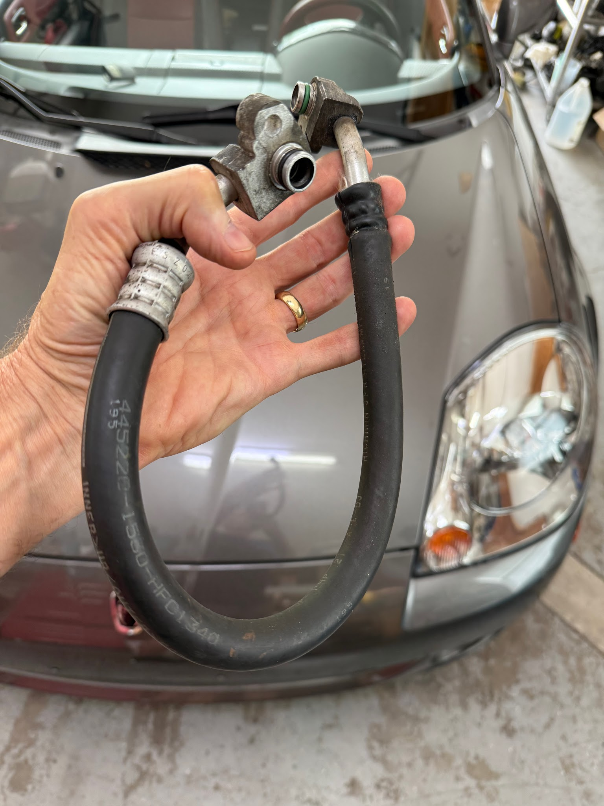
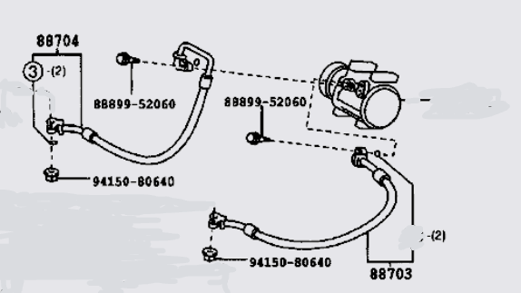
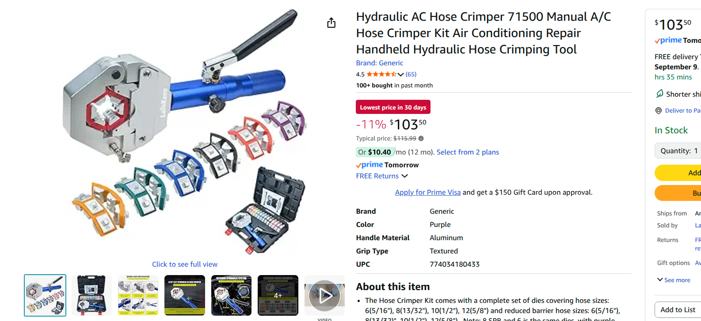
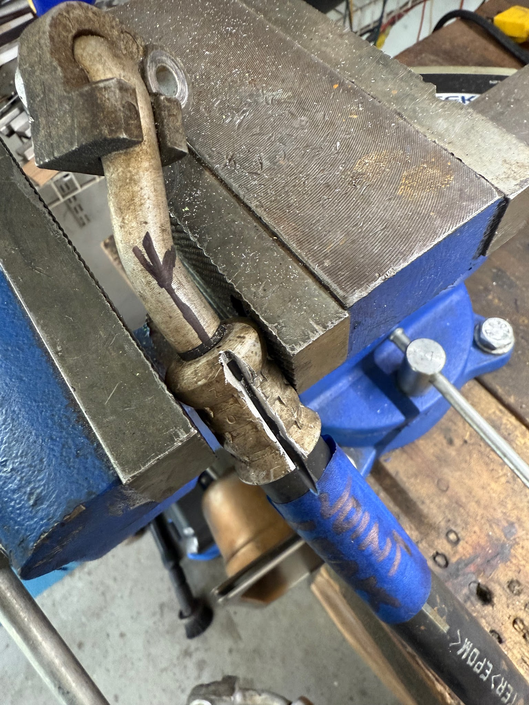
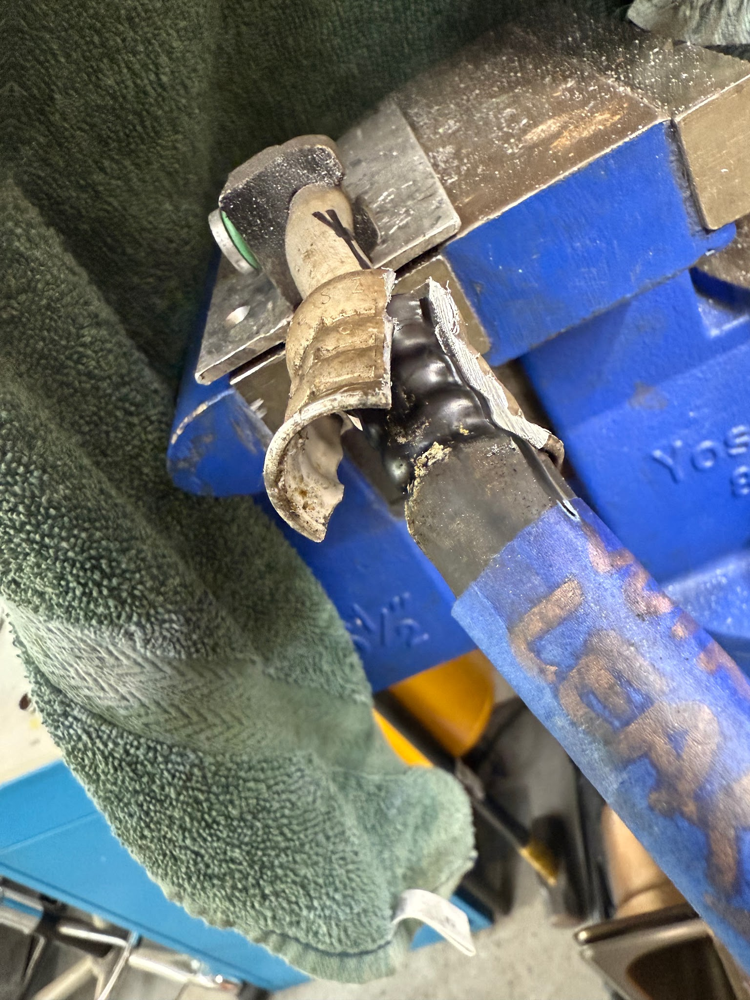
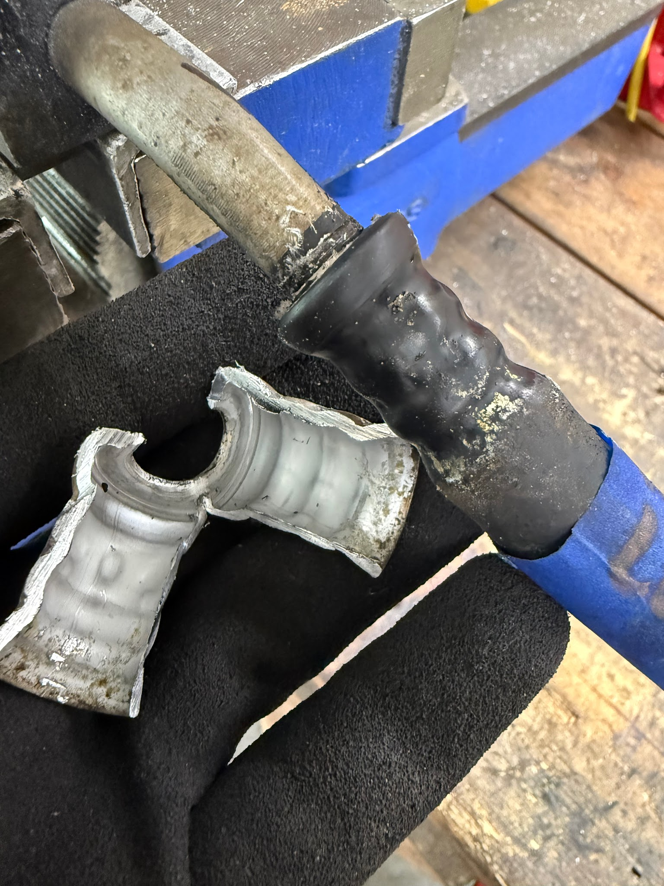
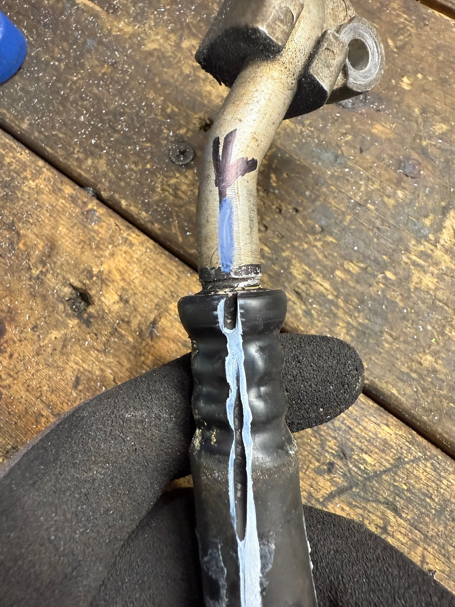
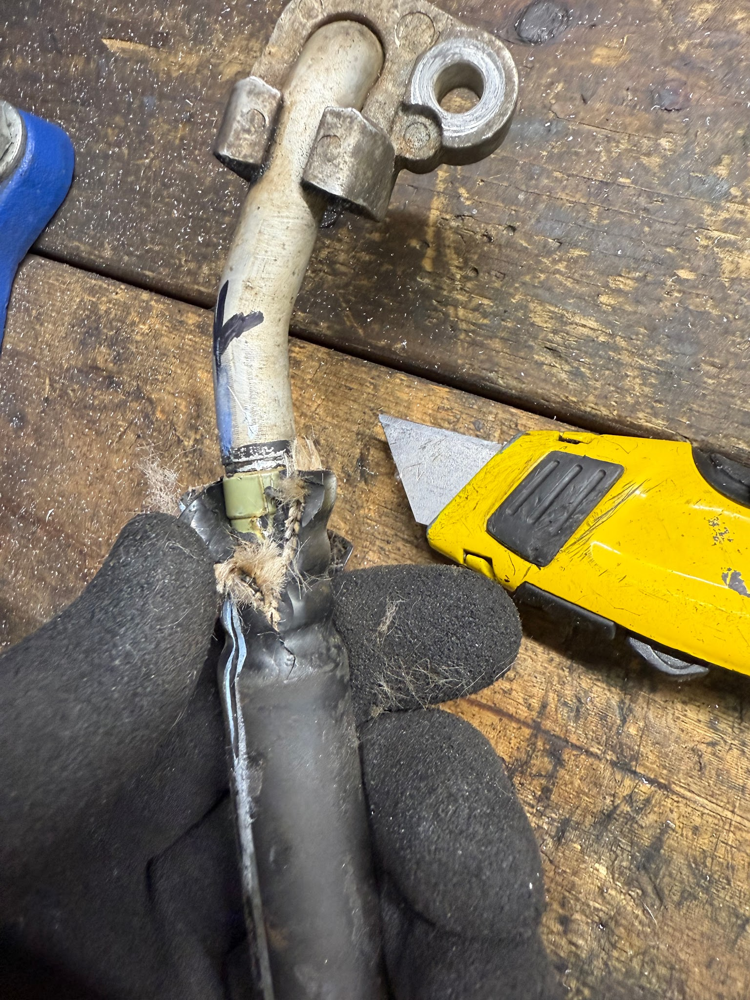
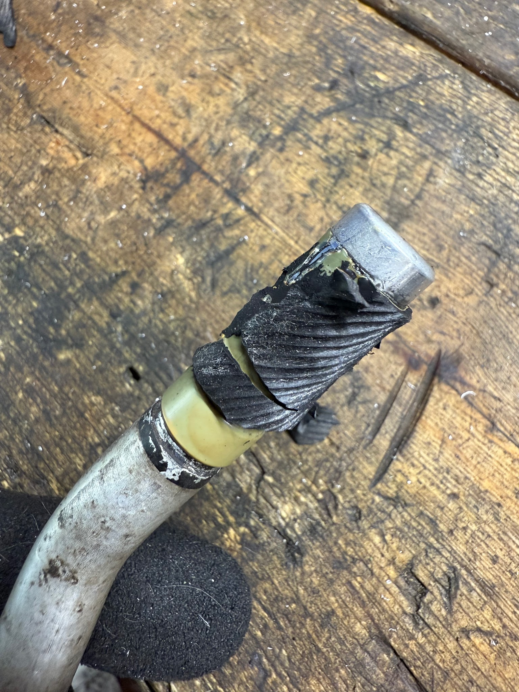
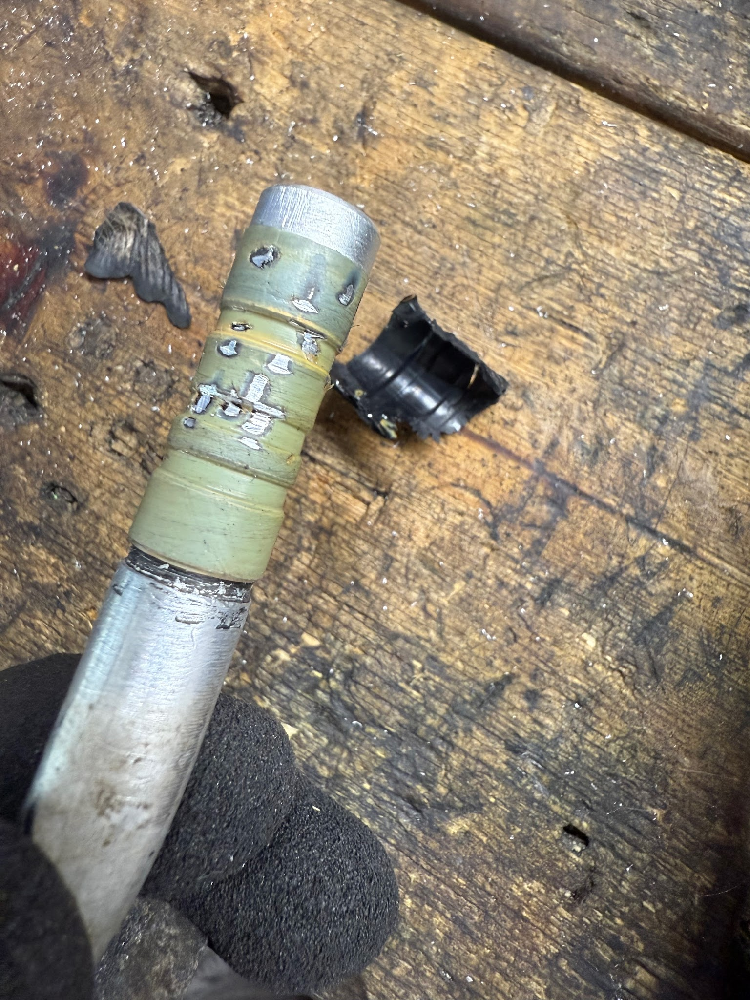

[Back to chapter index](../README.md)

# AC Compressor Flexible Lines

Composed by Cyclehead21@gmail.com

Created Sept 2025

Feel free to copy and share, just give me a little credit!

The two flex lines at the AC compressor are no longer available.

Toyota PN 88704-17060 and 88703-17060.

Any competent hose shop or auto repair shop should be able to cut the old ferrules and hoses off the end fittings, and replace the hoses.

Since competent shops don’t exist, I did it myself.

You can buy a chinese hand crimp tool for about \$100 on Amazon.

New hose and ferrules should be readily available. I haven’t searched out sources yet.

## Procedure

MARK the fitting and the hose so you can get the fitting clocked correctly when you reassemble.

Cut the crimp ferrules off using a 20k cutoff wheel. Be careful not to cut through the rubber into the fitting. Make two cuts on opposite sides. Pry the old ferrule off.

Clean up the barbs on the fitting. A heat gun helped soften the rubber and allowed me to peel the old stuck rubber away from the barbs.

This guy shows the whole process, but fails to mark the orientation of the fittings. He appears to align them by memory. Not very smart with a short, stiff hose! You need to be more accurate. Just mute the horrid music. [https://youtu.be/osZ8QL5f5dc?si=P3BMHiTD0ed-G60v](https://youtu.be/osZ8QL5f5dc?si=P3BMHiTD0ed-G60v)

Don’t cut too deep. You don’t want to cut into the barbs on the fitting.

Cut the old ferrule in two places and split it open.

Make alignment marks on the tube and the fitting before you pull it all apart.

Rubber was stuck all over the barbs. A heat gun helped peel it away without sticking.

Try to do a better job than I did. Gouges in the barbs are not helpful, but this one should be fine.

NOTICE my alignment marks are almost completely scrubbed off. Not a good idea! Those alignment marks are important.

[Back to chapter index](../README.md)
