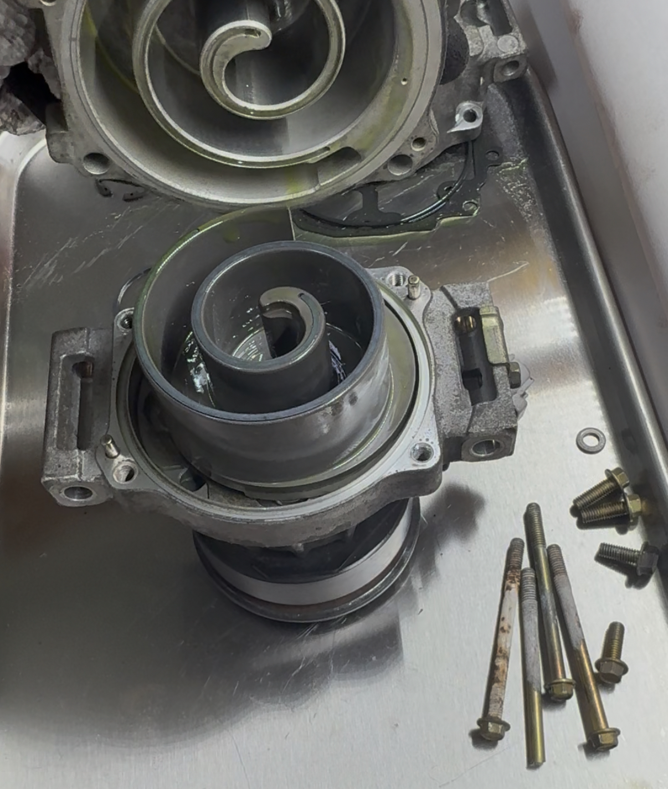
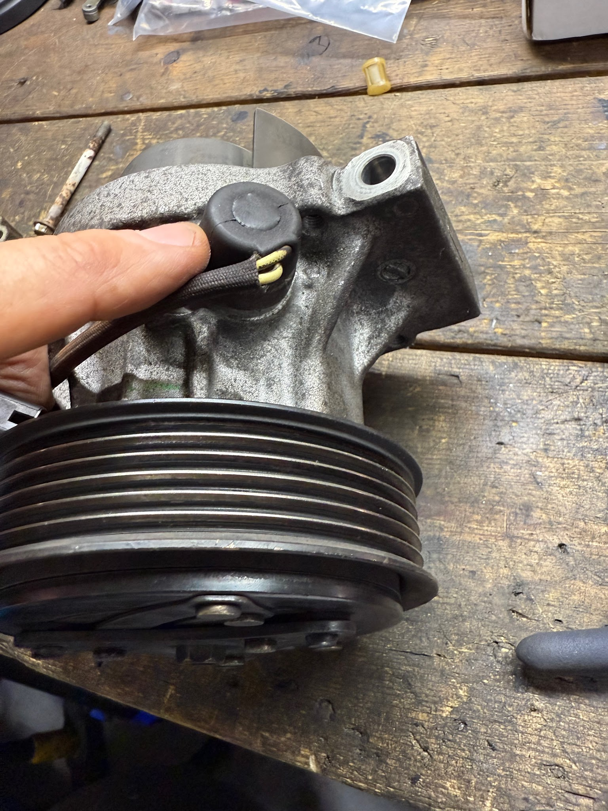
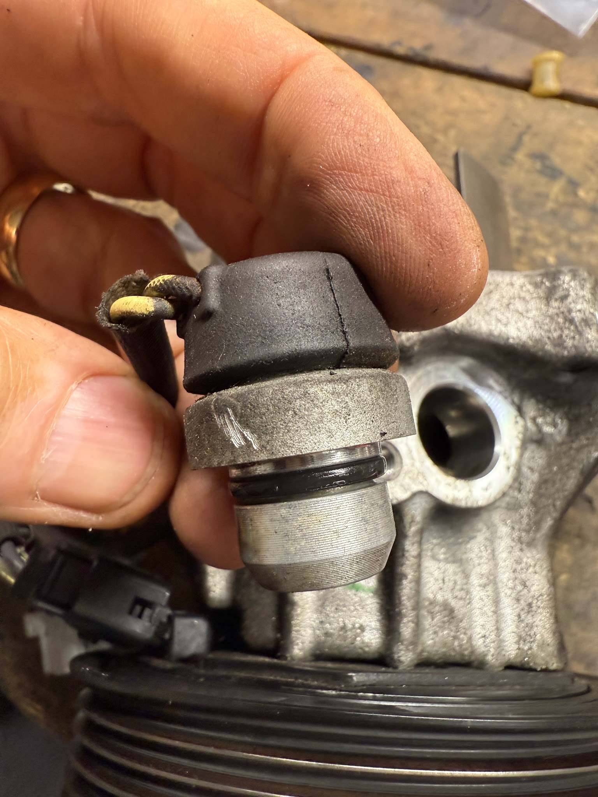
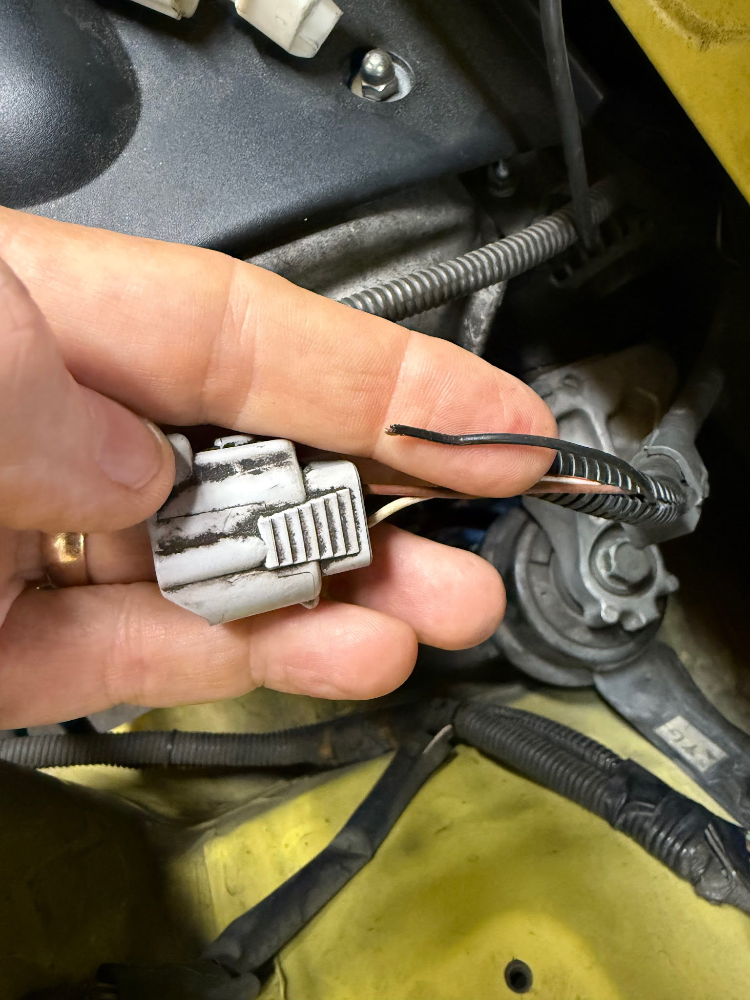
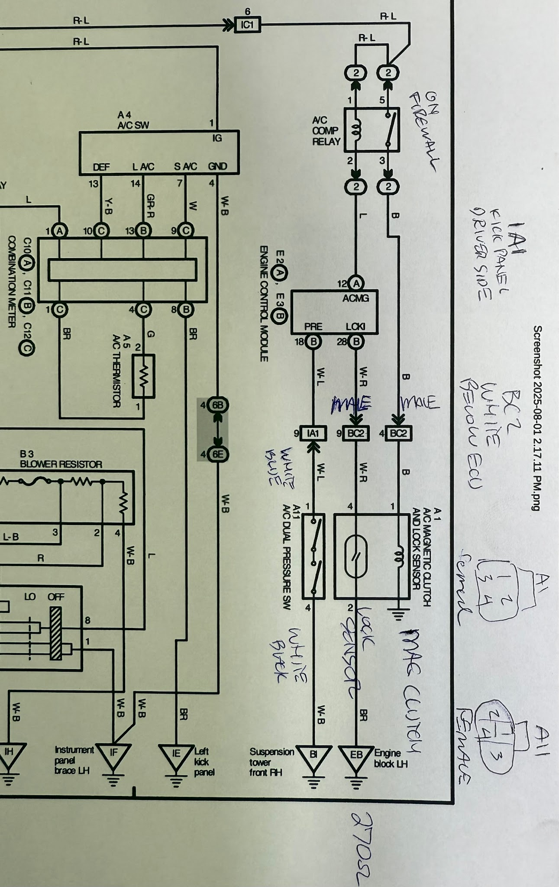

[Back to chapter index](../README.md)

# AC Compressor Notes

Composed by Cyclehead21@gmail.com

## Background

The AC compressor for 1ZZ is a “scroll” type compressor. It runs when commanded by the ECU. The ECU will stop the compressor if it senses that the compressor RPM is not appropriate.

It has one black wire that energizes the electromagnet, to engage the compressor.

It has two wires that go to a “lock up sensor” also called the “compressor speed sensor”. This is a hall-effect sensor that is bolted to the side of the compressor. I believe the sensor holds AC system pressure. It senses motion of the compressor scroll. If the ECU has sent power to the electromagnet, and the lockup sensor does not report the correct RPM of the compressor, the TCU will kill power to the electromagnet, and make the dashboard AC switch light start flashing. This is a safety measure to prevent a locked up compressor from destroying your serpentine belt.

The light will also flash if you ever lose your serpentine belt.

The electrical connector at the compressor is the same connector used by the GSA solenoids. So they’re handy to make pigtails for testing the AC compressor wiring, if you have some old GSAs lying around.

## Removal

Discharge or evacuate all the refrigerant from the system. High pressure refrigerant can blind you if it squirts in your eye.

Disconnect the electrical connector on the top/forward side of the compressor.

The connector is on top of the compressor and hard to reach, so you have to do it by feel. You can reach it more easily from above the engine.

Remove the serpentine belt. 19MM socket to relieve the belt tensioner.

Disconnect both ends of the rubber flexible AC lines that connect to the compressor. (I don’t like leaving one end connected, because I have seen the hoses start leaking at the swaged collars, if you twist and bend them too much. If you remove them completely, they won’t get twisted and mangled as you snake the compressor out of the car.)

From below the car - the compressor is bolted to the front of the engine block with three, long skinny 12mm bolts. (two on bottom, and one on top)

When it’s unbolted, you can lower and rotate the compressor to get it out. It’s a tight fit, but it will come free if you slide it towards the center of the car a little, and rotate it.

You’re supposed to replace the dryer (dessicant bag) in the condenser, when you replace the compressor. It’s a moderate pain to do that. Remove the top half of the front bumper cover and pry it away from the car. Remove the triangular radiator mounts on top. (three 12mm bolts each) Lift the radiator up and push it backwards, to make room to access the AC condenser. It’s not necessary to disturb the radiator coolant, you can bend and fold the large radiator hoses temporarily to make room.

Two 10mm bolts hold the top of the AC condenser. They are inconspicuous on the front of the radiator support crossbeam (horizontal beam). Disconnect the two AC hard line fittings on the passenger side (10mm nuts), and remove the condenser by tipping it aft, and sliding it out in front of the radiator. The dryer has a 10mm hex cap on the bottom of the driver’s side. Remove the cap, remove the plastic filter and desiccant bag and replace them both. I’d use an impact gun to remove the cap, since it will twist the cap without hurting the thin condenser frame. Don’t go crazy tightening the dryer cap, or any AC fittings. They seal via o-rings. Torque on the screws or nuts does nothing to prevent leaks.

## Wiring problem

My problem was - AC light would flash, and compressor would not run. The AC switch light would be solid for a few seconds when first pressed - but quickly resort to flashing. I had yanked the AC wiring harness when I removed the compressor (by mistake) and pulled the black electromagnet wire loose. The AC system would send power to the magnet, but the lockup sensor reported that the compressor was not turning. So it showed me the flashing light.

I chased wire continuity from the ECU to the compressor (notes below), and discovered that I had pulled the electromagnet wire loose inside the AC connector. That cost me a full day of troubleshooting. Oops.

## Testing

The electromagnet should grab the clutch disc when you apply 12V to the black wire.

The center hub should spin easily when the clutch is not engaged.

The “lockup sensor” is supposed to show 165-205 ohms at 68F. Mine showed 240 ohms on the bench (old compressor), and 270 ohms on my hot engine (new compressor). (Both compressor’s lockup sensors worked fine.) I found a way to confirm that the sensor is sensing motion. If you spin the compressor with your fingers, the resistance will fluctuate roughly +/- 2 ohms while it’s moving. Then stay steady when it’s stopped.

If needed, you can check continuity of the compressor wire harness from the ECU to the compressor pretty easily. Plug “BC2” is the white 10-pin connector adjacent to ECU (behind driver’s seat). The connector at the compressor is 4-pin connector “A1” (it only used three pins).

Electromagnet power (black) runs from BC2 pin \#4 to A1 pin \#1. Lock Sensor wire (white-red) runs from BC2 pin \#9 to A1 pin \#4.

## Installation

Slide the skinny 12mm bolts into the compressor before you lift it into position. There is not enough room to install the bolts after the compressor is in position.

Replace the o-rings on the compressor (usually included with new compressor), and replace the o-rings on the lower flexible hose joints. (not included with a new compressor). I picked out some HNBR o-rings from one of those assortment boxes of SAE sized o-rings. Smear some PAG oil or silicone grease on the o-rings so that they will slide into position.

Replace the o-rings on the hard line connections to the condenser, lube them before reassembling.

Photos are below: . . . .

[Back to chapter index](../README.md)
