# MR2 Spyder - Body Fairings

[Back to chapter index](../README.md)

Made by Ivan Tushkans, Irkutsk, Russia

---

Cyclehead’s Note: I compiled this collection of photos for Ivan, after I bought a set of side skirts from him. For background, Ivan has been making these parts since maybe 2020 (or before). A guy in the USA was marketing these parts for him (Schwifty), but he disappeared after a few years (maybe 2024 or so). Ivan has continued to keep making the parts and shipping them to USA.

He ships the parts in a lightweight wooden frame box, with cardboard sides. Typically they arrive in perfect shape - though I don’t doubt a carrier could smash the box if they’re careless enough.

His payment method (when I bought mine) was pretty squirrely but it worked. He has to deal with local restrictions and tracking. I sent payment to an unrelated service of some kind (like business consultant), sorry I can’t recall the details. But it worked for Ivan.

The side skirts I got were a little thin, but they fit perfectly!

---

All parts are fabricated in my shop.

All parts are made from fiberglass, except where noted.

Contact me on Facebook Messenger to order parts and coordinate payment.

## Price List:

- Eye Lid $x.xx

- Third Brake Light Cover $x.xx

- Front Lip - Facelift $x.xx

- Front Lip - Pre Facelift $x.xx

- Rear Lip - Left exhaust $x.xx

- Rear Lip - No exhaust $x.xx

- Rear Lip - Center Exhaust $x.xx

## MR2 Spyder / MR-S (all)

### Third Brake-light cover

[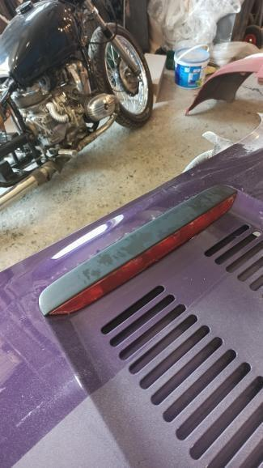](../images/body-fairings-from-ivan-tushkans/01-third-brake-light-cover.jpg)

### Eye lids

[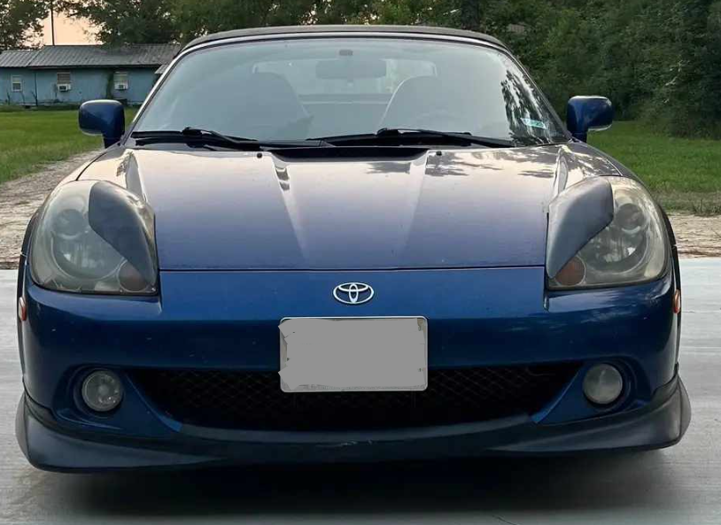](../images/body-fairings-from-ivan-tushkans/02-eyelids-blue-spyder.png)

## Pre-facelift MR2 Spyder / MR-S

**2000-2002 year model**

### Front Lip

[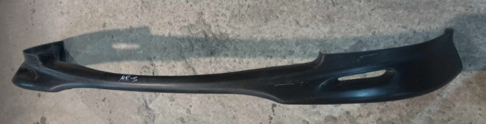](../images/body-fairings-from-ivan-tushkans/03-prefacelift-front-lip.png)

[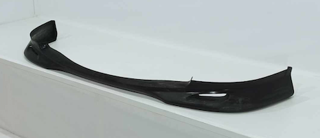](../images/body-fairings-from-ivan-tushkans/04-prefacelift-front-lip-rear-view.png)

[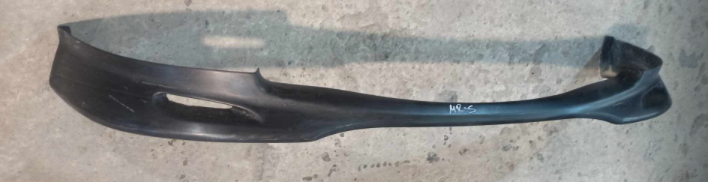](../images/body-fairings-from-ivan-tushkans/05-prefacelift-front-lip-detail.png)

[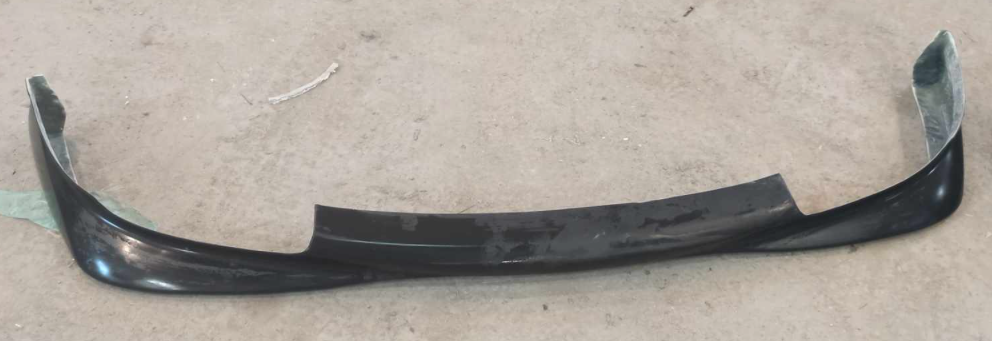](../images/body-fairings-from-ivan-tushkans/06-prefacelift-front-lip-overhead.png)

[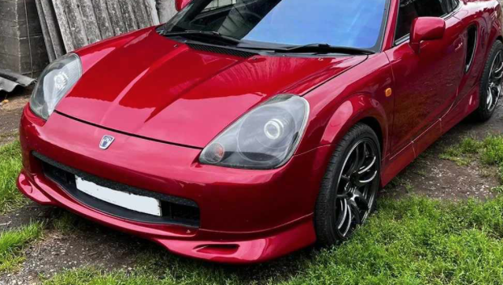](../images/body-fairings-from-ivan-tushkans/07-front-lip-red-spyder.png)

[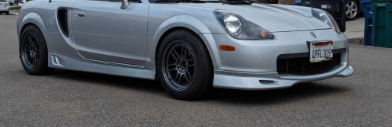](../images/body-fairings-from-ivan-tushkans/08-front-lip-silver-spyder.png)

[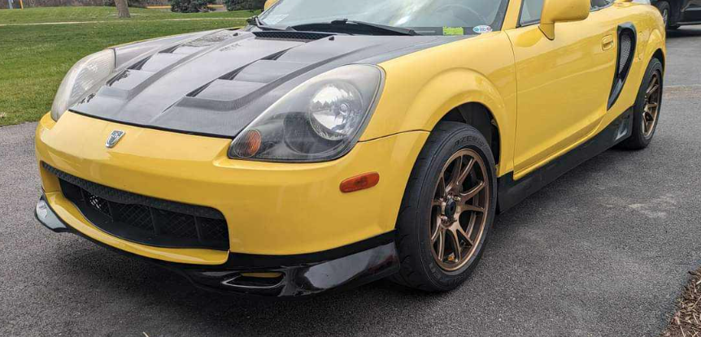](../images/body-fairings-from-ivan-tushkans/09-front-lip-yellow-spyder.png)

### Rear Lip

- Top - Single Exhaust (LH)

- Middle - No Exhaust

- Bottom - Center Exhaust

[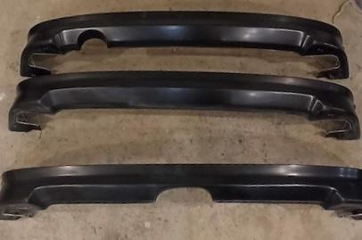](../images/body-fairings-from-ivan-tushkans/10-rear-lip-exhaust-variants.jpg)

## Facelift MR2 Spyder / MR-S

**2002-2005 year model**

### Front Lip

[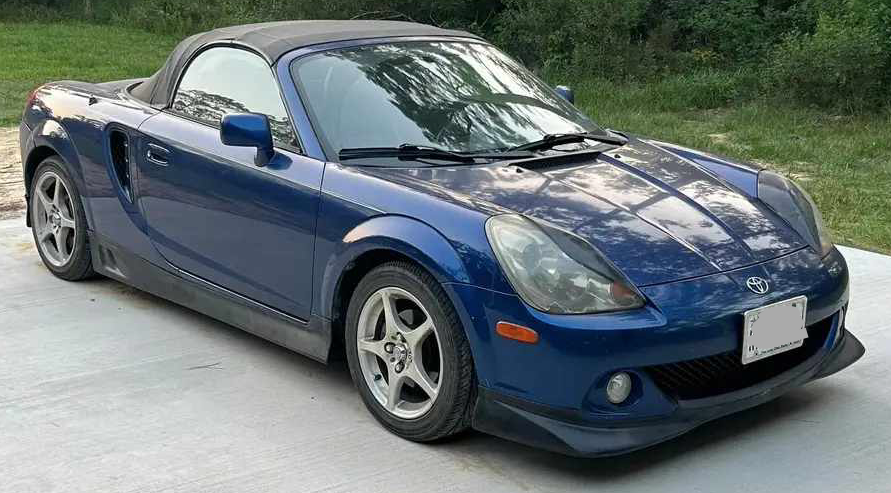](../images/body-fairings-from-ivan-tushkans/11-facelift-front-lip-blue-spyder.png)

---

*Initial conversion 0.1 — September 18, 2026. Detailed technical review pending.*

[Back to chapter index](../README.md)
