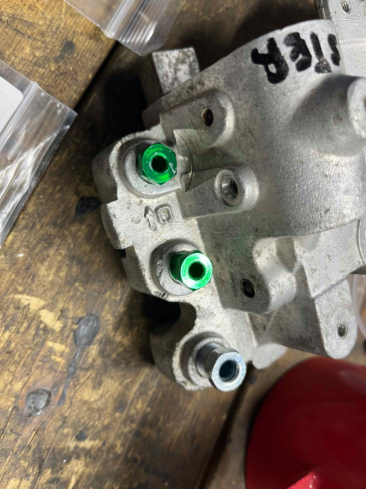
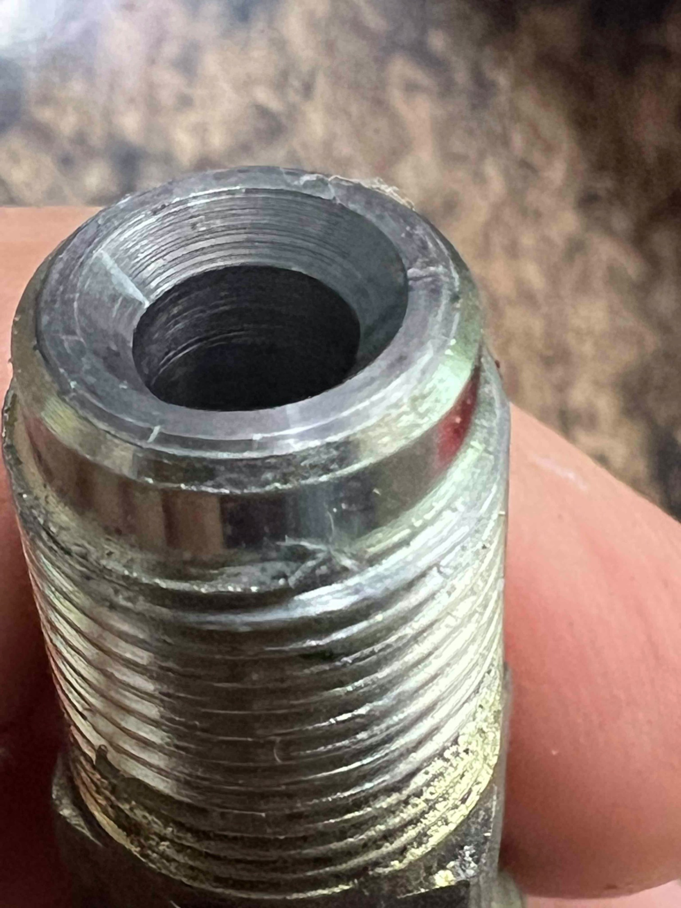
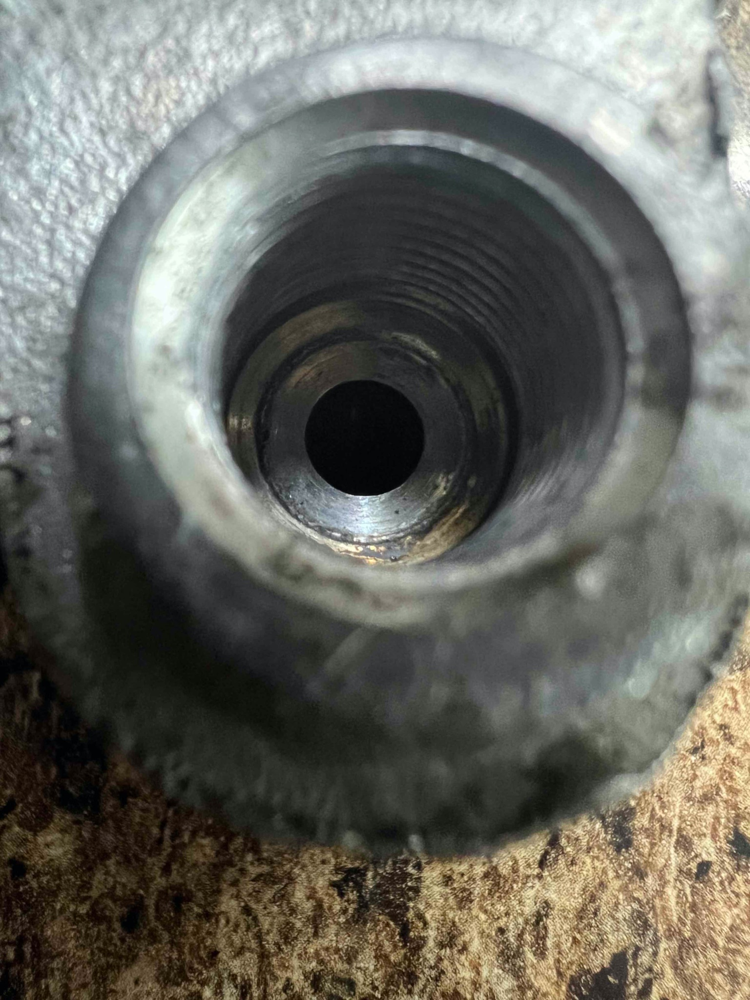
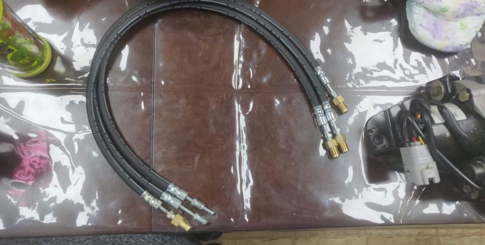
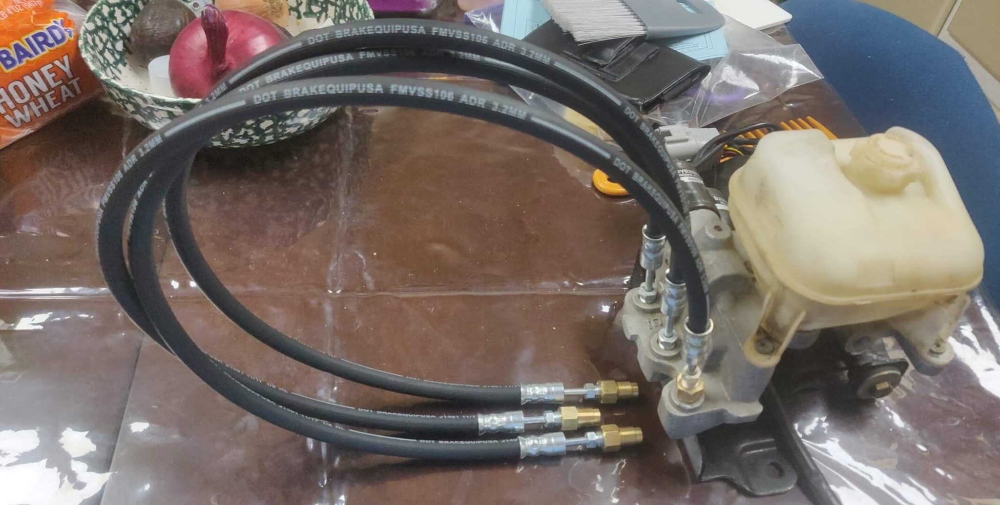
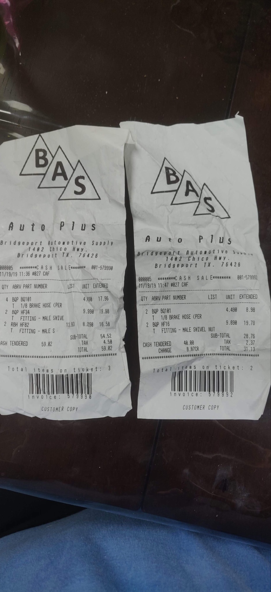
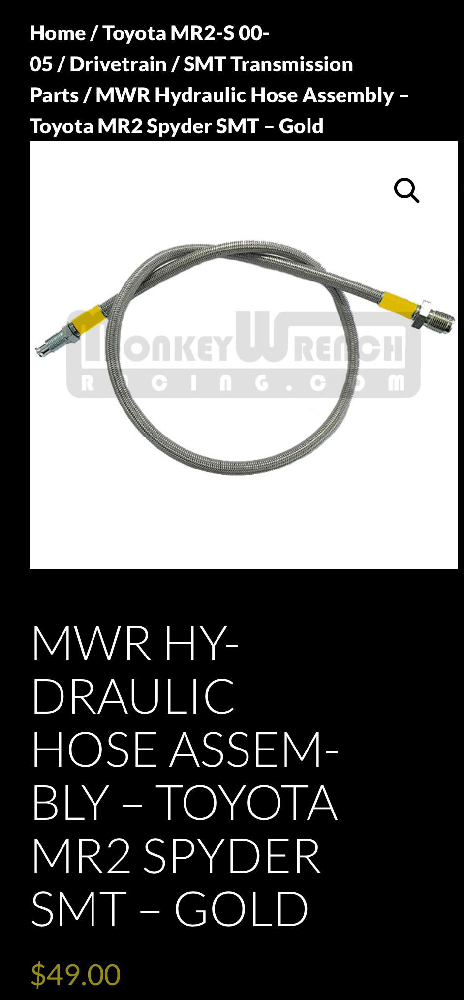

# Brake line substitute for SMT hoses

**Written by Cyclehead**

**Feel free to share, copy, and duplicate, just give me a little credit.**

**Please let me know if you find any errors.**

Updated May 2024

Email: cyclehead21@gmail.com

## HPU

Clutch and Master fittings are M10x1.0 (green in photo below).

Return fitting is M12x1.0 (Silver in photo below).

## GSA

All three fittings are M12x1.0

SMT system runs at 800 psi max, so automotive brake line hoses should have ample capacity to handle the pressure. Use “EPDM” or DOT brake-line material for the hoses.

Note: The HPU and GSA housings are all countersunk and appear they would accept bubble flare ends. However the standard Toyota SMT hoses use a chamfered tip. Conclusion: You can make your substitute SMT hoses using either a chamfered tip fitting (like Toyota does), or brake lines with bubble flares.

Toyota fittings have a chamfered tip, and straight metric threads. I guess the chamfer seals on the surface of the countersinks in the housing.

The GSA and HPU housings have a countersink at the bottom of the holes. I have made bubble flare lines when I was making bench test tools, and they seemed to seal well.

In the photos of new hoses below:

Four brass fittings are shown, so the brass fittings must be M12x1.0.

The two silver end-fittings are M10x1.0 brake line fittings, and appear to show reverse flare on the two silver fittings. I think bubble flare ends will seal better.

Another option is to buy all the pieces online from Summit Racing. All the parts are defined at the end of this post

On Spyderchat:

[https://www.spyderchat.com/posts/658119/](<https://www.spyderchat.com/posts/658119/>)

Another option is to buy these hoses from Monkeywrenchracing.com for $50 each. They use Teflon lines with steel braid covering. An SMT system designer indicated that the SMT system relies on the pressure compliance of the original rubber hose for proper system operation. I have tried these Teflon hoses and never noticed any problems.

[https://www.monkeywrenchracing.com/product/mwr-hydraulic-hose-assembly-toyota-mr2-spyder-smt-gold/](<https://www.monkeywrenchracing.com/product/mwr-hydraulic-hose-assembly-toyota-mr2-spyder-smt-gold/>)

