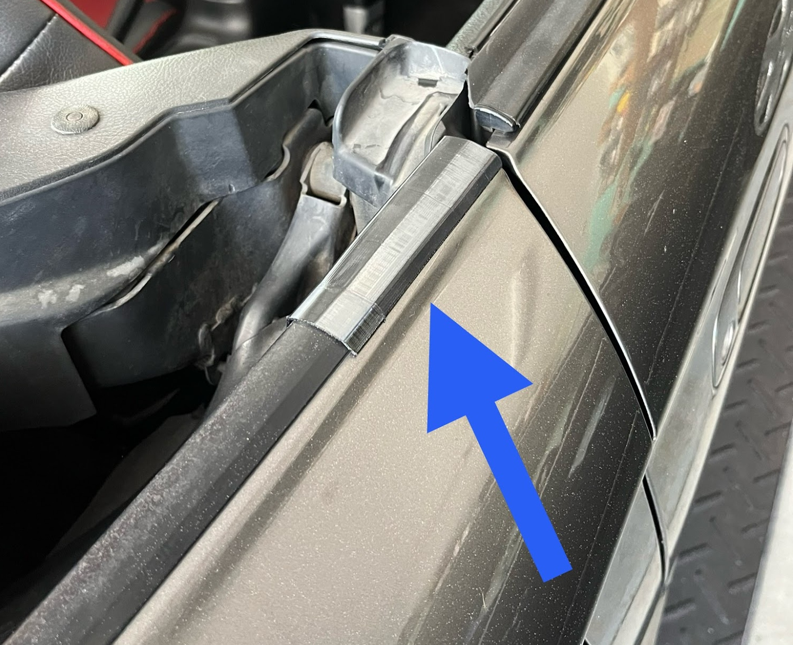
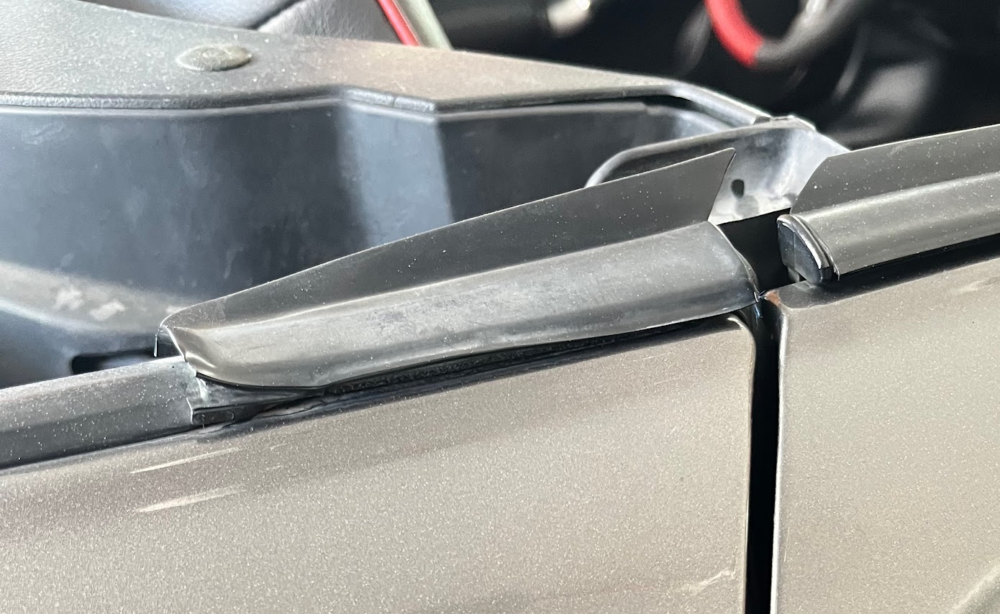
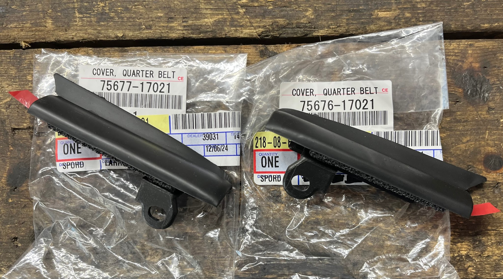
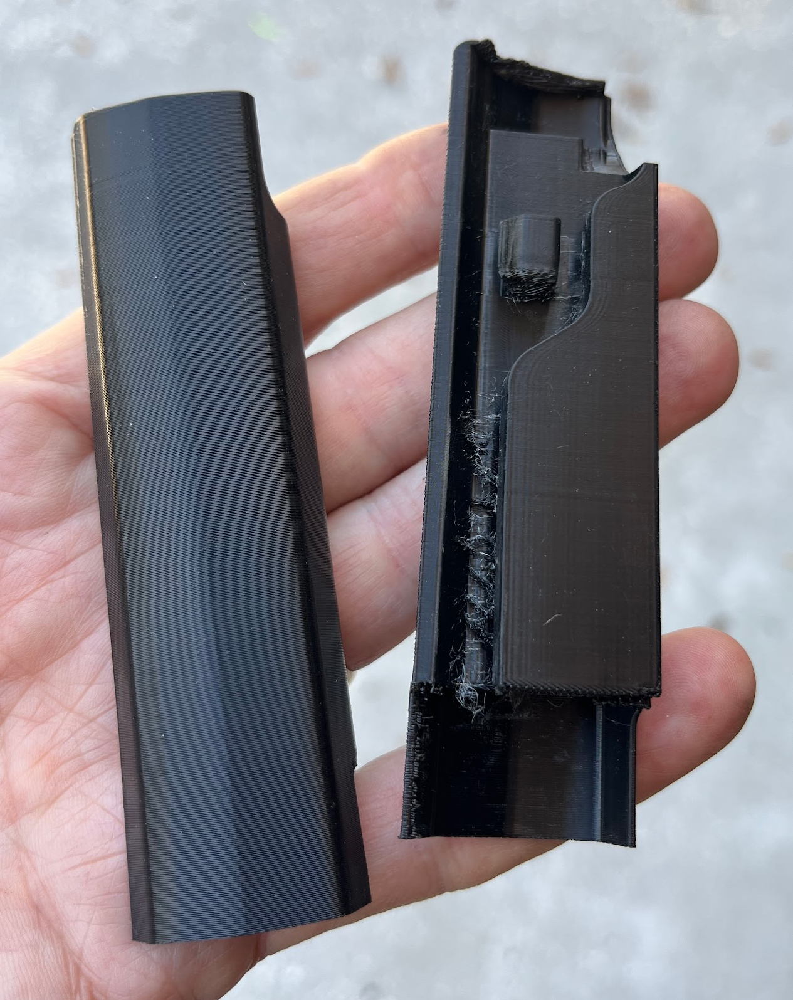

# Cabin Belt Molding

## For Sale

3D Printed Cabin Belt Molding parts, $24/pair including shipping in US and AU.\*

## Background

This piece of molding fits on the front edge of the cabin belt trim, just behind the doors.

The factory part is made from a mix of hard plastic and a thin piece of soft vinyl. The thin vinyl cover shrinks and warps as it ages.

New molding pieces are still available from Toyota:

RH 75676-17020

LH 75677-17020

New parts currently cost about $80-$90/pair from US suppliers, and about $70/pair from [Amayama.com](<https://www.amayama.com/en/part/toyota/7567617020>) in Japan.

In my experience, the new parts will get distorted fairly quickly - depending on whether your spyder sees extreme heat and sunlight, or not.

## 3D Printed Replacements

I designed these replacement parts using my rusty/novice/new 3D modelling skills. Fellow spyder owners have volunteered to print and ship these parts. I have donated the development time (and 22 prototypes) to the project - I am not earning any money from selling these.

### To buy in USA

Contact david.labfisica@gmail.com to arrange payment and shipping.

### To buy in Australia

Contact [poh.brian@gmail.com](<mailto:poh.brian@gmail.com>) to arrange payment and shipping.

## Installation

Lower the convertible top. Remove one 10 mm bolt. Remove the old trim piece. Install the new trim piece and reinstall the bolt.

[Installation Video](<https://youtube.com/shorts/1Ermc_K4acM?feature=share>)

My photos above show prototype parts made using TPU filament. The parts for sale are made with ASA material for more heat resistance.

More details and photos here: [LINK](<https://www.facebook.com/share/p/1EKJPohUSf/?>)
