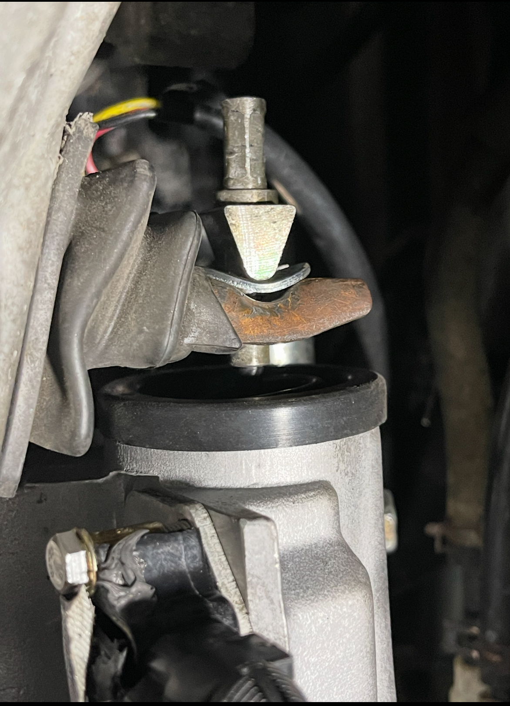
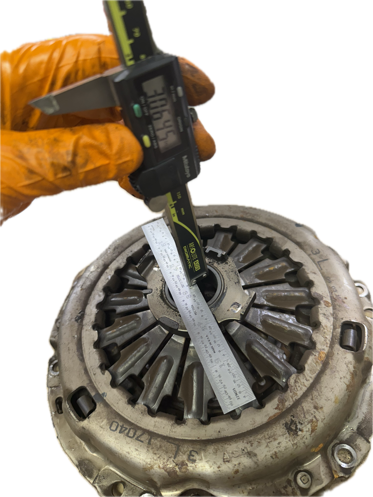
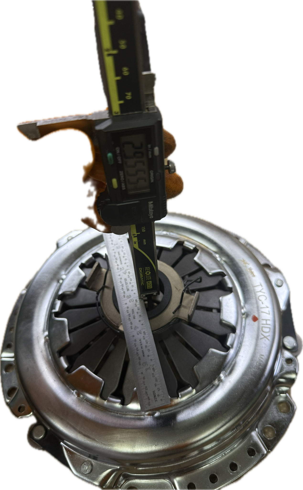
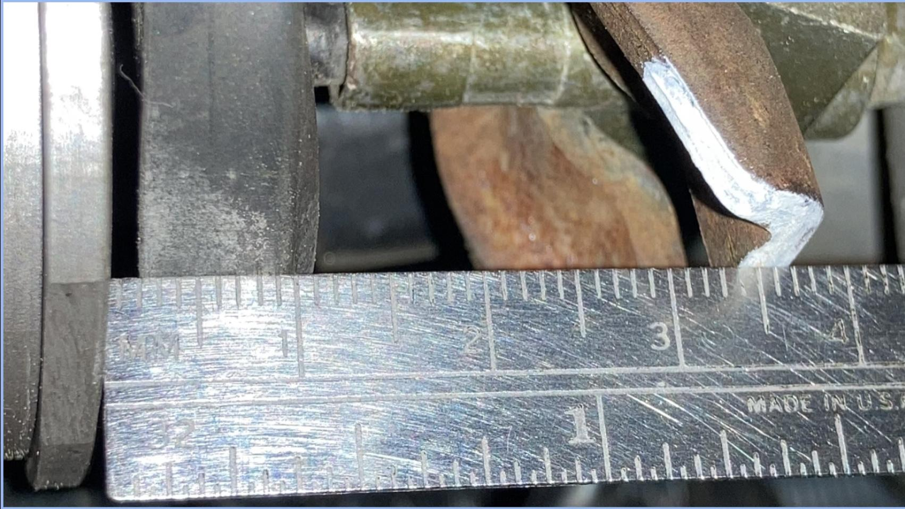
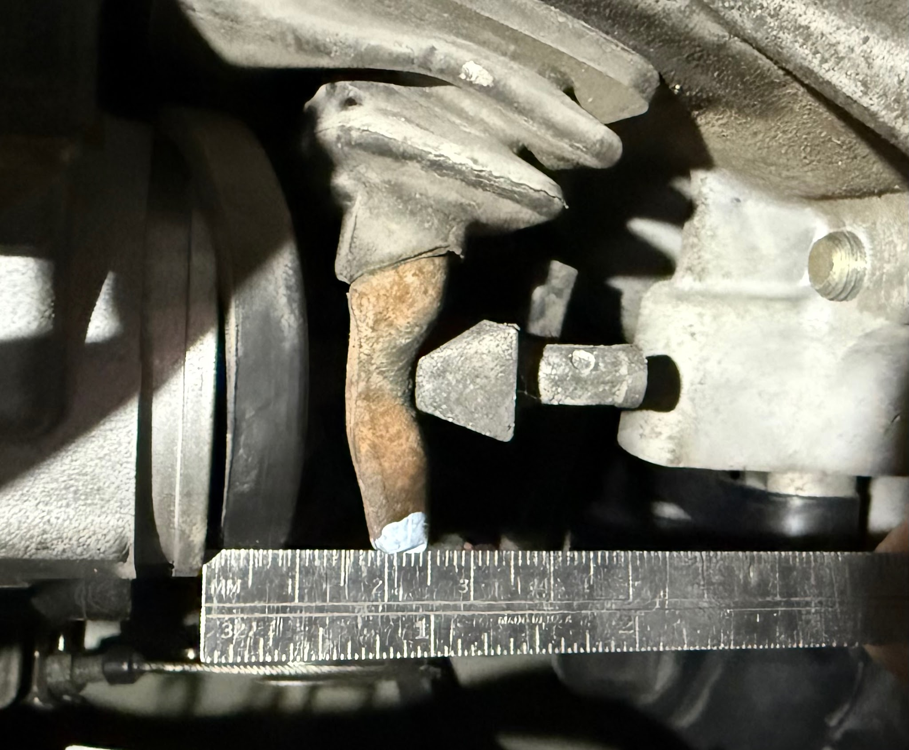
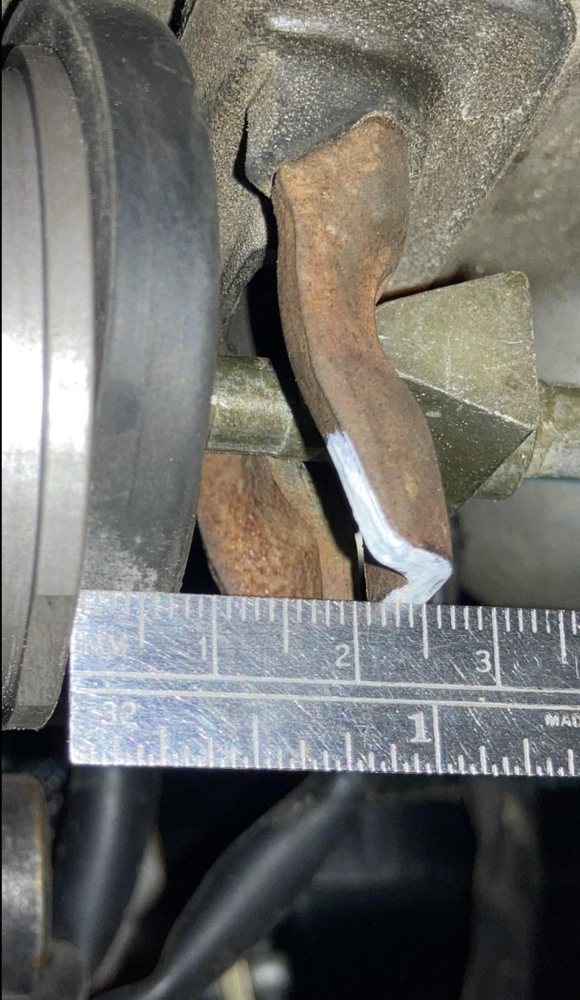
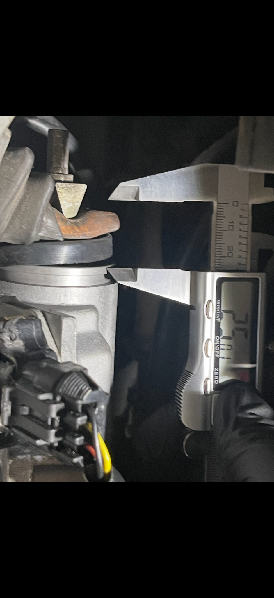
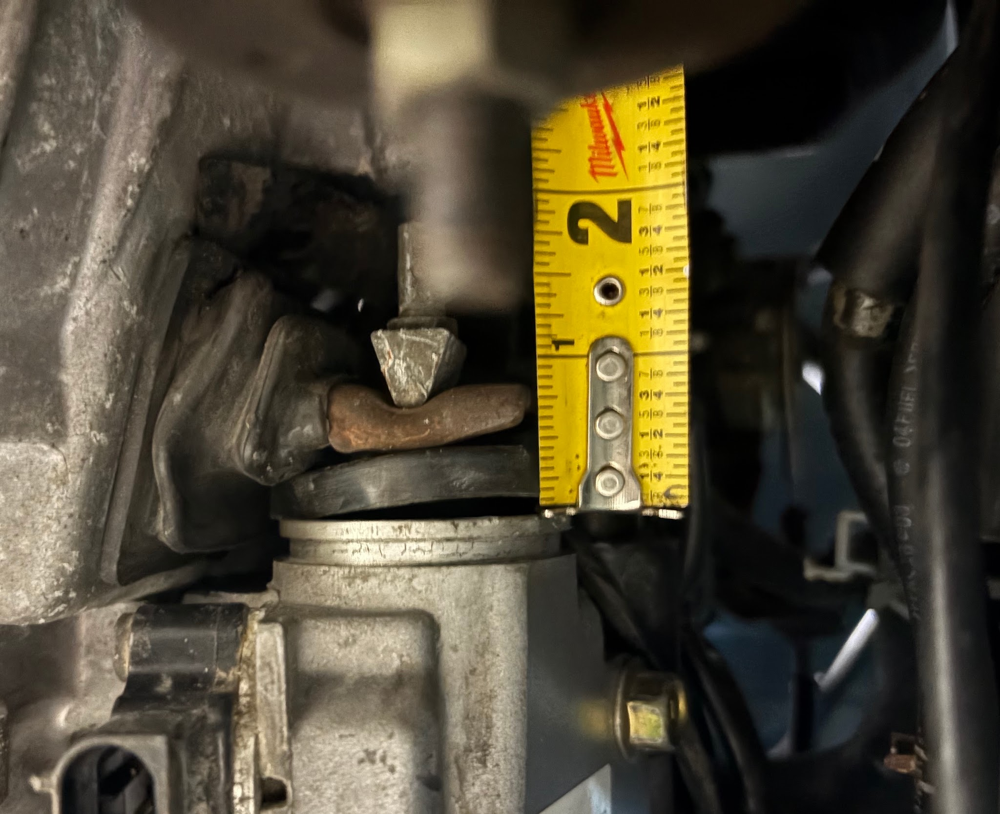

[Back to chapter index](../README.md)

# Clutch Choices for SMT

Composed by Cyclehead21@gmail.com

Most Clutches specify “Not for SMT”. The Toyota factory shows a different part number for the SMT throwout bearing and Pressure Plate but supposedly there are no differences in the parts.

I have installed this “not for SMT” clutch and throwout bearing kit on two SMT spyders with no problems:

Valeo \#62125203 stage II clutch assy.

These clutch kits have also been confirmed to work with SMT:

**XTD STAGE 2 Clutch & Flywheel kit**

Item no. 383388192630

XTD model no. **FRX8924R411.**

Exedy “KTY03” …. ??

Aisin CKT-034 clutch kit

These clutch kits will only work with a modification:

“Brute Power” Kit \#90147 is too thick and places the clutch fork too close to the GSA. It will ONLY work if you add a bent washer under the pyramid fitting.

Sachs Part no. K70079-03

“Stock replacement clutch kit.”

Clutch fork is about 18mm (should be 25mm). This may be repairable by adding a washer under the pyramid fitting.

When the clutch fork position is too close to the GSA, the TCU will not complete relearn. It may cycle the clutch forever, or it may simply fail to complete the relearn and won’t show any error codes.

## Stackup Height

The total stackup height must be in-range, before the SMT system will accept the clutch fork position.

I measured the combined stackup height of an old Toyota and the new Valeo - clutch, pressure plate and throwout bearing. I measured the “uncompressed” height of the pressure plate, resting on the clutch disc hub, with the throwout bearing resting on the pressure plate fingers.

Toyota parts stackup height = 3.02 inches (photo below)

Valeo parts stackup height = 2.91 inches (photo below)

I have no idea what the limit is on variation from stock stackup height.

I have heard of other Spyder owners installing a clutch, and finding that the SMT system could not accommodate an excessively high stackup height.

One resolved the problem by adding a washer under the clutch fork pivot inside the bell housing. (This requires removing the transmission a second time!)

Another resolved the problem by adding a bent washer between the clutch cable fitting and the clutch fork. An easy modification of the clutch fork is too close to the GSA)

## Toyota Part Numbers

### 6 Speed SMT

Disc 31250-12360

Pressure Plate 31210-17040

Throwout Bearing 31230-17010

### 5 Speed Manual shift

Disc 31250-12360 (same as SMT) Pressure Plate 31210-12221

Throwout Bearing 31230-12170

## Clutch Fork resting position

Another place to measure is at the clutch fork. This requires that the entire clutch be assembled, and the transmission bolted into position.

Clutch engaged (not depressed)

Showing 37mm??? I’m not sure about this photo. I can’t recall if it was taken with a new clutch. I ASSUME it’s a good clutch - not depressed. I need some more data points.

Showing 25mm with clutch engaged (not depressed). I’m certain this one works, it’s one of my daily drivers.

Another one of my daily drivers. Also showing 25mm.

These two below would NOT complete the TCU self-check as the clutch fork is too low (clutch stackup is too tall). It was repaired by adding a bent washer - photo above.

[Back to chapter index](../README.md)
