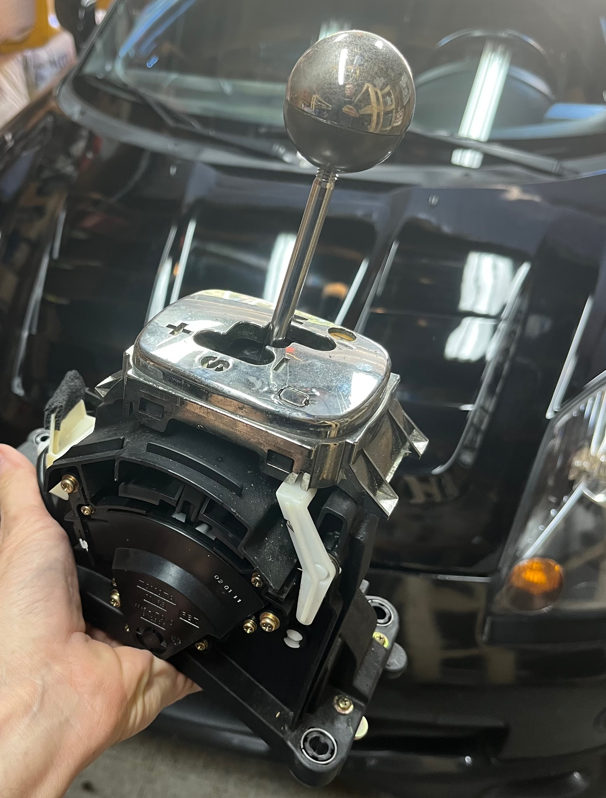
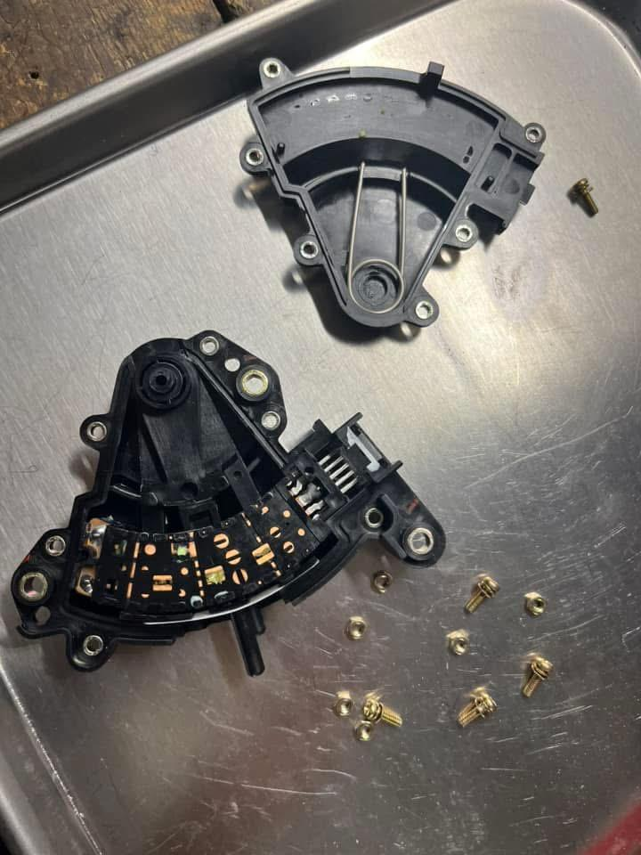
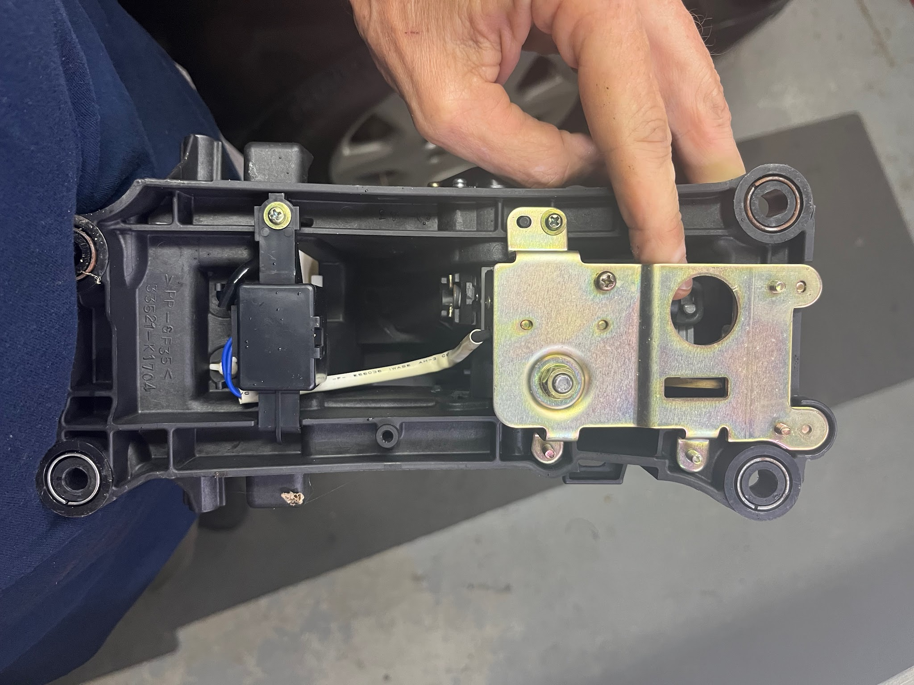
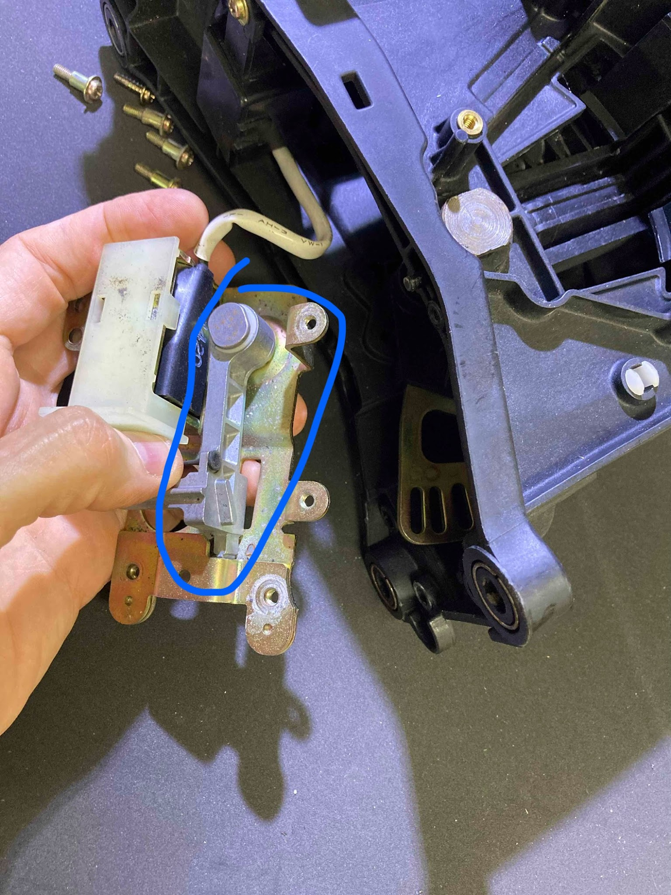
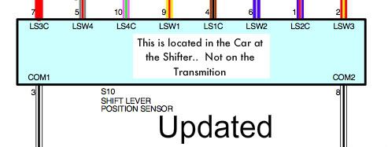
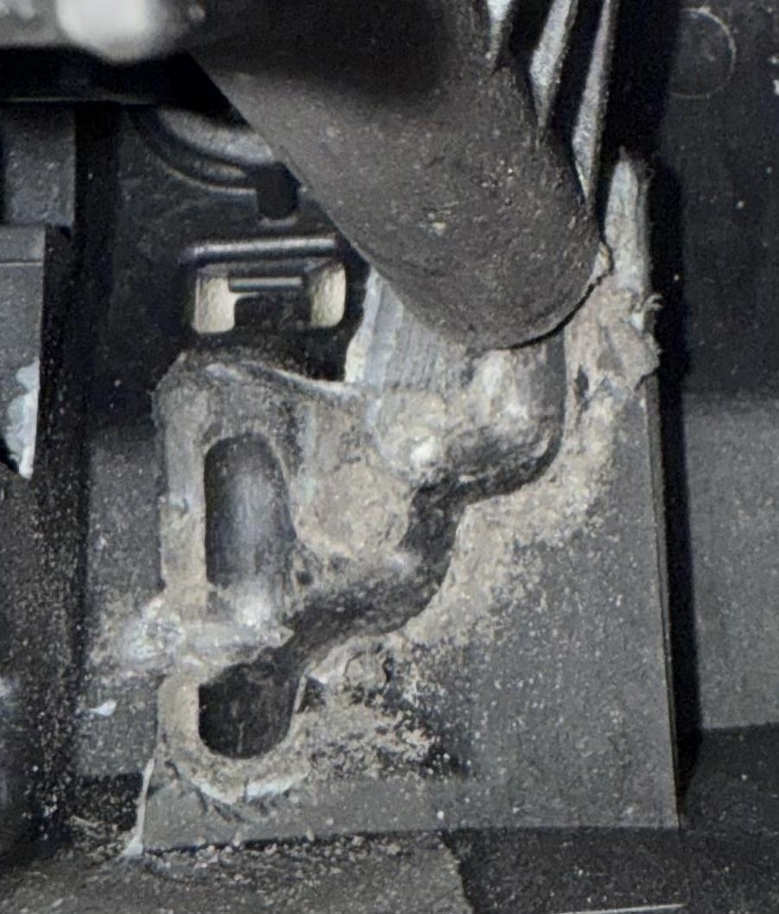
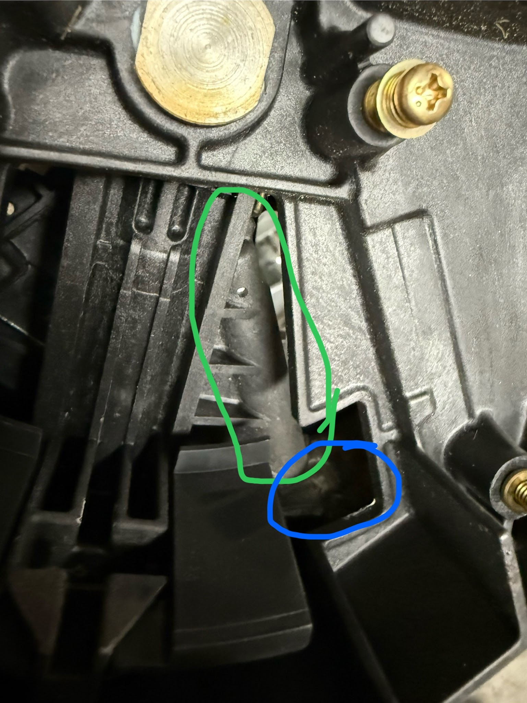

[Back to chapter index](../README.md)

# Console Shifter for SMT

Composed by [Cyclehead21@gmail.com](mailto:Cyclehead21@gmail.com)

Updated Dec 2024

Feel free to copy and share, just give me a little credit!

## Contents

- [Background](#background)
- [Removal](#removal)
- [Disassembly](#disassembly)

## Background

The console shifter is a collection of plastic parts that contains one electrical switch, and a lockout solenoid.

There are no mechanical connections to the transmission via the shifter.

The lockout mechanism uses some thin plastic parts that can fail and cause the shifter to permanently lock. New plastic pieces for the lockout system are currently still available from Toyota (December 2024). Alternatively, you can permanently remove the lockout linkage and the car will work fine. Just don’t shift gears when the engine is not running.

The switch box can fail via corrosion or spilled drinks damaging the copper contacts. It can be removed and disassembled for cleaning.

## Removal

To work on the console shifter it’s best to unbolt both seats (four 14mm bolts for each one). No need to remove the seats from the car - you just need some access. There are two philips head screws on the side of the plastic center console, partially hidden by the seat cushions. There are two more behind the seats that are easily accessible.

After you get the four philips head screws out, you can pull the console upwards. Remove the small plastic door below the parking brake handle. Lift up the console and reach underneath to separate the two window switch connectors. They are not the same - one connector latch is on the side, the other is on the bottom.

Unbolt the center console (four 12mm bolts), and unclip the electrical connector.

## Disassembly

The electrical switch (Shift lever position sensor 89451-17010) is mounted on the right side of the shifter. You can remove it and disassemble to see the guts. If yours has quit working, it is likely due to corrosion or sticky goo from a spilled drink. Remove the small philips head screws and see if you can clean the contacts. Watch for tiny springs.

The lockout mechanism is under the gold metal plate on the bottom of the shifter. If you are disabling the mechanism, I usually leave the electrical solenoid in the car, but remove and discard the plastic plunger and latch pieces.

My finger is pointing to the small plastic piece in the lockout mechanism that usually breaks.

Toyota part number is 33589-16030.

The roll pin that holds the plastic piece is Toyota part number 90254-02043.

If you want to disable the lockout mechanism, remove the silver latch piece and discard it. The shifter will never lock again. Avoid shifting when the engine is not running, as it will confuse the SMT system and likely throw some error codes.

The self-centering mechanism for the shift knob is comprised of a spring loaded steel ball that rides in a PLASTIC racetrack. The plastic track will wear and decompose over time. I’ve seen some very worn tracks that are completely worn through. You can make the shifter feel a little better by scraping the loose plastic away from the track, and lubricating the track with some spray silicone.

Here is a picture of the plastic racetrack. This one has plenty of crud and decomposed plastic.

The spring and steel ball are circled in green. The racetrack is circled in blue.

[Back to chapter index](../README.md)
