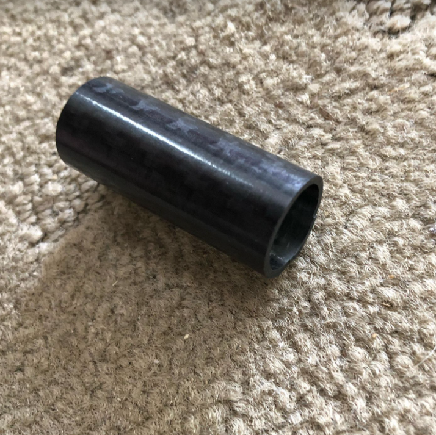
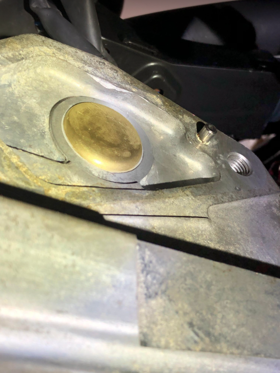
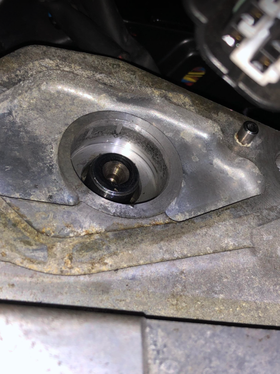
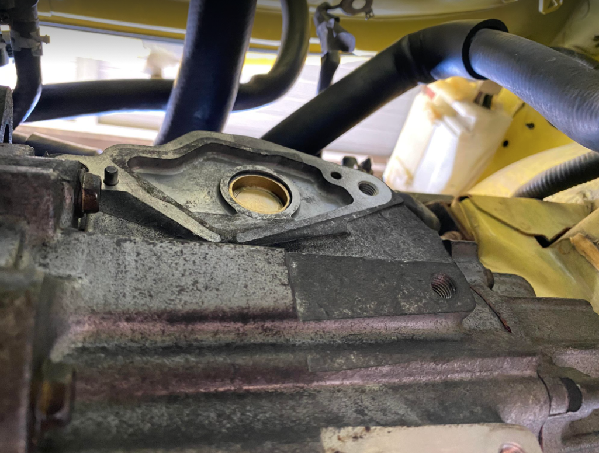

# SMT - Convert SMT transmission

Buy a 28mm freeze plug

Install freeze plug normal direction for a 5spd transmission

For 5spd you must knock out the end bushing, and make an extended bushing 18x15mm by 43m long. I just use a piece of carbon fiber tubing 15mm ID x 18mm OD.

Unfortunately knocking in the smt shaft bush mod only works for the late model 6spd manual shifter shaft……you will need to get one made for the 5spd 15mm id x 18mm od by 43mm long and blank the old seal hole with a 28mm core plug. (per Joel Faas)

Install freeze plug inverted for a 6spd transmission

For 6spd push the freeze plug inwards 1/2 inch

Swap over all the shifter mechanism to the SMT transmission

Leave 1 reverse switch installed.

Leave the SMT speed sensor installed, or block off the extraneous hole.

Bushing / spacer for 5 speed transmission

6 Speed transmission with inverted freeze plug.

5 Speed (and 6 speed?) transmission existing end bushing (rubber seal?) must be pulled out

5 Speed transmission with “normal” installed freeze plug

