# Convertible Top Buyer’s Guide

Written by [Cyclehead21@gmail.com](<mailto:Cyclehead21@gmail.com>)

Feel free to share, copy, and duplicate, just give me a little credit

Updated July 2026

I compiled this guide to aid in selection of a replacement convertible top. Convertible top ads are very poorly written, mixing up the materials and manufacturer’s names (on purpose?). I wrote this guide to help you sort through the ads and make the best choice.

Reference: [Convertible top installation](<https://docs.google.com/document/d/12mrIHJkr_tIQCsVpJbF1DKuRbeFR4VgeIt1wDa4zsTk/edit>)

## Contents

- [Background](#background)
  - [Material](#material)
  - [Function](#function)
  - [Design](#design)
  - [Maintenance](#maintenance)
  - [Definitions](#definitions)
  - [Warranties](#warranties)
- [Manufacturer List](#manufacturers)
- [Retailer List](#retailers)
- [Failures](#failures)
- [Example of canvas top wear](#example-canvas-top-wear)
- [Photos](#photos)

## Background

### Material

Material choices are 1) Canvas/rubber laminate, or 2) PVC/vinyl.

1. Canvas tops are primarily made using fabric from [The Haartz Corporation](<https://www.haartz.com/products/stayfast>). Some of the product names for Haartz fabrics used in “canvas” tops are: Sonnenland, Stayfast and Twillfast. “Stayfast” is a coarse weave sort of like a canvas material. “Twillfast” and “Sonnenland” fabrics have a much finer weave that looks more like a cloth shirt (very tight weave).

Sample photos:

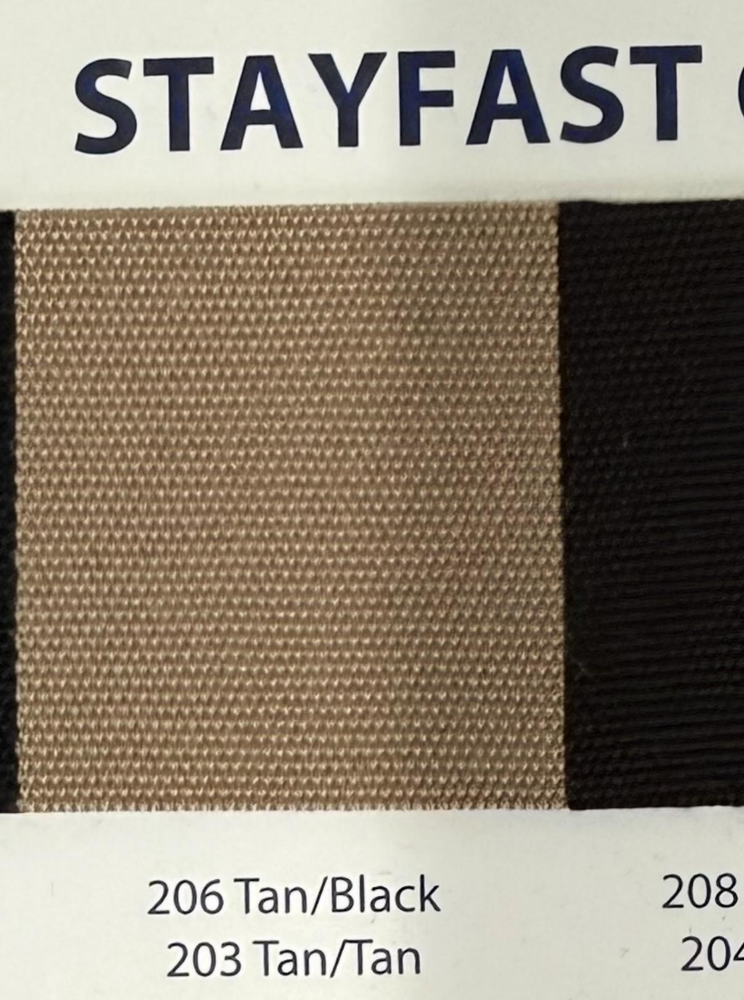

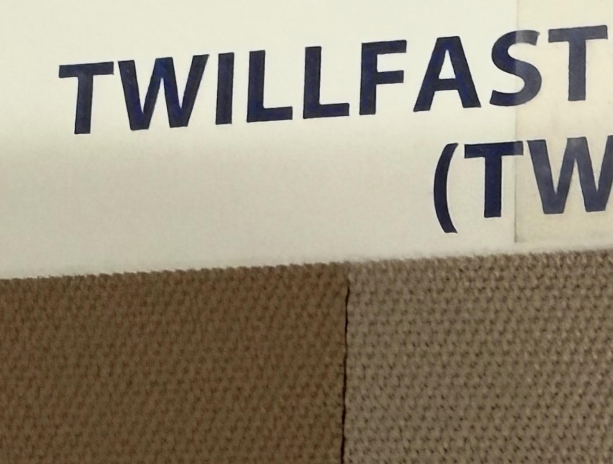

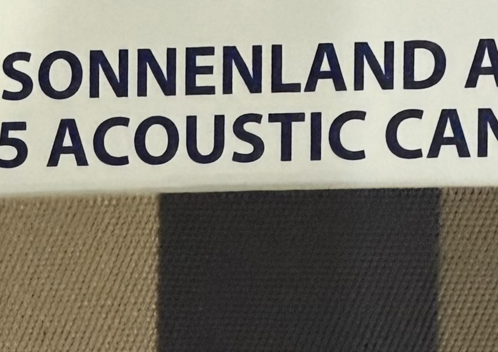

2. Vinyl material is also made by Haartz, and many others I imagine. Vinyl materials can have a wide range of surface textures molded into the exterior - from fake leather to tiny pyramids arranged in a grid. They use names such as Pinpoint, Bison, Twill Weave, Cabrio and Sailcloth. “Pinpoint” is the tiny pyramid texture, and “bison” is an imitation leather texture. Many Haartz vinyls have a black interior surface. Many Chinese vinyls seem to have lighter tan or white interior surface fabrics. The one Chinese top I bought was made with inferior material, very thin and lightweight. I would not invest the labor to install a Chinese top.

Haartz “twill grain” vinyl

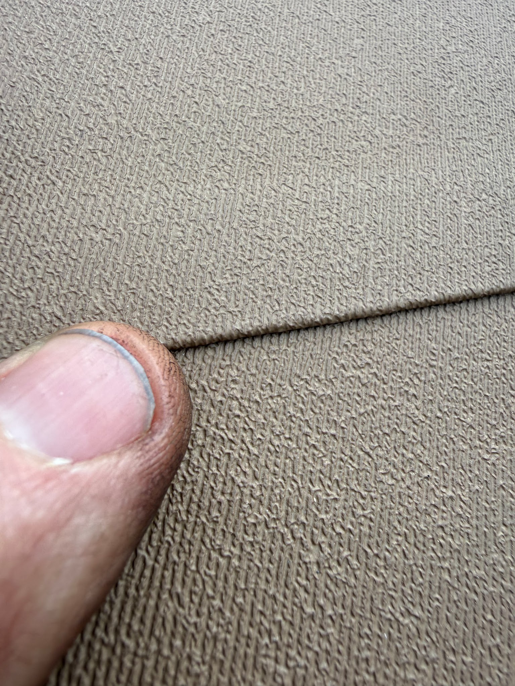

“Pinpoint” grain pattern vinyl

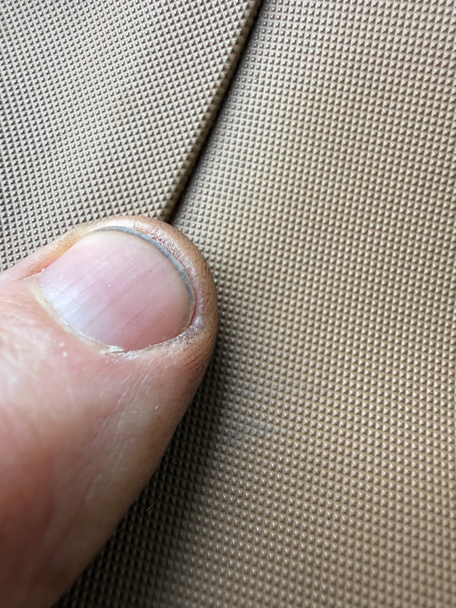

### Design

#### Stitching

There may be some differences in construction (i.e., heat bonded/melted vs stitched seams). All of the tops I’ve seen limit exposed stitching to the rear glass area. All the other seams are heat bonded. I have confirmed that the Chinese tops (some? all?) have exposed stitched seams throughout the top. This is not as durable and is never done by American manufacturers - as far as I know.

#### Rear Glass Manufacture

Rear glass is manufactured by various companies. Toyota glass is made by Nippon Sheet Glass in Osaka, Japan. Robbins glass appears to be “Fuyao” manufactured by Fujian Yahnua Glass in Honglu, China. EZ-On seems to use different manufacturers, or perhaps changed suppliers in the past. I have one EZ-On top with glass made by Auto Temp in Batavia, Ohio - and another made by Fuyao in China. The cheap Chinese top I got failed to have any Department of Transportation (DOT) identification at all on the glass. Every single top made in America has this identification. I expect the Chinese glass has not passed DOT standards for shattering etc.

#### Rear Glass Design

Variations in rear glass include the heater strip styles, and the black “masking” paint applied to the interior surface. Robbins has the black masking strip, fading to black dots. EZ-On seems to use glass without any edge strip painted on the interior. Heater strips and their header bars are visible on factory glass and EZ-On tops. Robbins tops have the header bars hidden behind the black masking paint.

#### Rear Glass Installation

The rear glass installation seems to be the major design detail that varies between manufacturers. Robbins, Sierra, Diamondmall, and GAHH all use the same “Robbins perma-lok” rear window design, that has a unique appearance from the outside - the glass is completely flush with the surface of the fabric. The Robbins Permalok style installation has a smaller glass viewing area than EZ-On (for example). The “perma-lok” has a unique plastic ring on the interior surface. The top sold by MR2Heaven appears to be a cheap style of installation, with a glued ring of vinyl securing the glass.

#### Window sizes

Robbins exposed glass is 11.5 inches high x 31 inches wide, with 1.5 inch corner radii. The actual viewing area is smaller, due to the black masking that they apply all around the inner surface of the glass.

EZ-On and some others have a plastic or rubber trim ring around the exterior perimeter of the glass. The trim ring is about ¼ inch thick. EZ-On glass is 13.25 inches high x 33 inches wide with 3 inch corner radii. The viewing area is the same as the measurement noted, since there is no masking applied to the inner surface.

#### Window edge finishing

Sierra appears to glue their glass to a folded edge of material, resulting in a transition from fabric to glass that doesn’t have any plastic trim piece. The glass is recessed below the surface of the fabric by the thickness of the folded fabric. (2026 update: I’ve learned that Sierra, Diamondmall and GAHH are now ALL using the “perma-lok” system). I don’t have a measurement of the Sierra exposed glass. (Help me out here, somebody). Kee Auto Tops has a raw cut edge on the material where it transitions from vinyl to glass (edge is not folded).

#### Color choices

Some of the manufacturers will gladly make a top for you, using any color material in the Haartz fabric catalog. (Assuming you’re getting a top normally made with Haartz fabric) Call the manufacturer and ask.

### Function

Vinyl tops are overall more durable in my opinion. They are less susceptible to wear from chafing. However they are “stiffer” in cold weather and you must not raise or lower them when temperatures approach freezing or the PVC surface will crack. As they age, vinyl tops seem to wear from the inside. The bonded inner layer of cloth fabric will chafe away, leaving the thin layer of PVC plastic. The PVC layer will eventually tear and split. However, worn spots can be easily repaired by gluing a patch on the interior surface.

Canvas tops are made from heavy woven canvas with an internal layer of butyl rubber, so the whole sandwich is more flexible. They are more pliable in cool weather. However in my experience, the cloth exterior surface will wear through at various chafe points as the top ages. They will wear from both the interior and exterior surfaces. Most people agree that the canvas surface is prettier. I’ve added some photos of a 10 year old well-used canvas top at the bottom of this file.

### Maintenance

Both top materials require some regular maintenance. Vinyl tops should get some plasticizer applied at intervals (like 303 Aerospace Protectant). Vinyl tops can fade in the sunlight, but there are lots of “dressing” paints and dyes that can be applied to restore the color. Reportedly, the Chinese vinyls don’t have the proper UV inhibitors in the PVC layer, so they will fade and degrade more quickly.

Canvas tops should be waterproofed at intervals to minimize the canvas absorbing water and rotting. Bird poop is easily cleaned off a vinyl top, but can be very difficult to clean off a canvas top! I’ve never tried to re-dye my canvas top. You must be careful with treatments on a canvas top. I used a marine waterproofing product made for raw canvas (not convertible top material), and the solvents in the product melted the butyl rubber and destroyed my cloth ragtop!

### Definitions

Manufacturers make the tops by sewing/bonding the fabric together into a convertible top at their factories. Some manufacturers will only sell their products through retailers, and they refuse to sell their products directly to the public. However other manufacturers sell both directly, and via retailers.

Retailers don’t manufacture anything, they just sell tops. (Sorry this is sort of obvious, but it gets confusing when shopping for a new top.)

### Warranties

Robbins will not honor ANY warranty if you install yourself. Robbins demand to see receipts where you paid a “professional” to install the top. I expect they will require that “professional” to be a shop certified by them before they will honor their own warranty. Robbins used to offer a lifetime warranty for their tops. However in April 2020 they quit the lifetime warranty, and now it’s limited to 5 years.

“[Himmelinc](<https://himmelinc.com/shop/ols/products/toyota-mr2-spyder-spider-convertible-soft-top-and-glass-window-bordeaux-twill-weave-vinyl>)” offers 3 year warranty, and insist they WILL honor their warranty for user-installed tops.

[Gahh](<https://gahh.com/warranty>) has a 5 year warranty. It does not say anything about excluding DIY installers.

[Kee](<https://keeautotop.com/pages/warranty>) offers an 8 year written warranty that includes DIY installation.

Sierra only has a one year warranty, serviced by [Autotopsdirect](<https://www.autotopsdirect.com/warranty-policies/?_gl=1*1munyxe*_up*MQ..*_ga*MTIxMTU3NzU2OS4xNzU0NjU0MDc3*_ga_9NKJMRJE74*czE3NTQ2NTQwNzYkbzEkZzAkdDE3NTQ2NTQwNzYkajYwJGwwJGgxOTEyMTUxMjUw>). Yet AutoTopsDirect has a “lifetime warranty on their glass bonding, IF YOU KEEP A COPY ( screenshot) from their website. UPDATE Aug 2025: Today their website says only 1 year warranty for glass bonding, for original owner. I would KEEP a dated copy of the warranty statement from their website. They have been very flaky in the past about denying warranty claims. Currently their warranty page has dead links to a “Sierra Tops Warranty” page.

[EZ-On](<https://ezonauto.com/warranty>) says their warranty requires professional installation.

[Diamondmall](<https://www.ebay.com/sch/i.html?_ssn=diamondmall&store_name=diamondmall&_oac=1&_trksid=p4429486.m3561.l161211>) (on ebay) says they have a one-year manufacturer’s warranty.

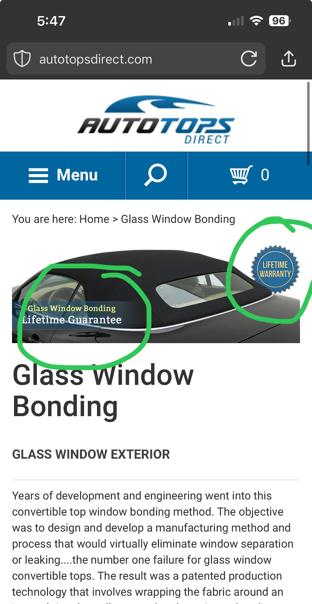

Note: My friend bought a new Sierra top that was defective (rear glass seal came loose after one week), and AutoTopsDirect ghosted him once they found he installed the top himself. He got NO warranty support whatsoever.

The best protection (if you install yourself) may be to purchase the top from Amazon or another Retailer with a GOOD RETURN POLICY. Inspect it promptly, if there are any quality problems, return it immediately.

## Manufacturers

A-Premium

Appears to be Chinese. I need more info. They are sold from a PO Box in Irvine California. Photos on their website are an odd mix of AI rendered spyder pictures, the wrong convertible top (ribs in the wrong place), plastic window shown - yet they advertise “OEM quality window”. Complete lack of any detail about glass retention method, just fuzzy photos. Now selling on Amazon.

[Autoberry](<https://www.autoberry.com/product-category/toyota/mr2-2000-2007/>)  
Sells Direct to public  
Has plastic trim around glass.

Note: AutoBerry has some bad Better-Business reviews. Their street address in Chatsworth California appears to be a rented office space in a strip mall.

[EZ-ON](<https://ezonauto.com>)  
Must buy from a retailer  
Registered in Jupiter Florida

Germanex  
Sold thru “Morethantops.com”

[Gahh](<https://gahh.com/convertible-tops/car-tops/toyota-mr2-convertible-top-2000-2007>)  
Sells Direct to public.  
Colors: Black, Bisque, Saddle

(“Cabrio Bisque” is the best color match for spyder)

Registered in North Hollywood, California

M & T Manufacturing  
Sells thru "[Convertible top guys](<https://www.convertibletopguys.com/static/aboutus>)"

[MoreThanTops](<http://www.morethantops.com/osc/>) Inc ([Germanex](<http://www.germanexinc.com/toyota-2000-2007-c-51_116.html?osCsid=22132a096ec95d4d27b13c05244f7a5d>))  
Sells on ebay. I need more info on them.

[Himmel Inc.](<http://himmelinc.com>)  
Sells on [Etsy](<https://www.etsy.com/listing/1223976161/handmade-toyota-mr2-spyder-spider?ga_order=most_relevant&ga_search_type=all&ga_view_type=gallery&ga_search_query=himmelinc+toyota+mr2+spyder&ref=sr_gallery-1-1&pro=1&frs=1&cns=1&content_source=e5f721f712d4b78eaecb2a45deb59c8de9bb3d7b%253A1223976161&organic_search_click=1>)  
$420 and up (2024 price)

Registered in Northridge, California

[Kee Auto Top](<https://keeautotop.com/pages/catalog>) Sells on Carparts or Direct from Factory  
Mfd in North Carolina.

Also sold by Mitch’s Auto Parts (Brandon Korfel)

OEM Plus. I have very little information about this company

[Robbins](<https://robbinsautotop.com/convertible-tops-416/toyota-mr2-2000-07-top-complete>) (owned by Valesco)

Must buy from a retailer  
Colors: Black, "Mazda Tan"

“Robbins Auto Top” is registered in Oxnard, California

Sierra (owned by Valesco)

Must buy from a retailer  
Colors: Black, Beige

No plastic trim around the glass

Xtreme  
Must buy from a retailer

Note: This company name does not show up on any searches. They claim to be made in USA, but that company name is not registered anywhere I can find it.

Comment: I personally bought one Sierra top and one Robbins top at the same time. Both used Haartz canvas material. Both companies were owned by GAHH (at the time). I compared them side-by-side on my workbench. The two tops were absolutely identical down to the last stitch - except, the rear glass retention method was different. [VIDEO](<https://youtu.be/JR5osJ8Fh0E>) Sierra used a simple glued joint. Robbins has a [“permalok”](<https://robbinsautotop.com/permalok/>) seal that they claim is superior. It has a heavy plastic trim ring visible on the INSIDE of the top. Recent Sierra tops purchased from Amazon, were made with the permalok style glass installation, same as Robbins!

DiamondMall - Sept 2024 (NOT a manufacturer, I need to fix this)

I just received [this $400 vinyl top from Diamondmall](<https://www.ebay.com/itm/285389374814?itmmeta=01KV95EB45EH1T7RCWHGAH9CKA&hash=item427288455e:g:LYgAAOSwcYtjUv52>). Except for the vinyl material, it is identical stitch for stitch, and hole for hole with both the Robbins and Sierra tops I bought years ago. Including the “Perma Lok” window installation! It has the same white plastic tag for a serial number sewn into the same seam on the LH side, but the tag is blank. It has the same stainless steel fittings and springs. It is packaged identically with the same bubble wrap and tissue paper. The shipping box is identical except missing any logo markings. Even the “click” rivets included in a bag are the same!

### Comment on Manufacturers

One manufacturer reported to me that almost ALL of the convertible top manufacturing companies are owned by one consortium (GAHH sold to “TopDown”, sold to “River Industries”, sold to “Valesco” in 2022.) Only a few companies are independent. It would be great if somebody could confirm this!

Companies owned by the consortiums “TopDown”, “River Associates”, and finally “Valesco Industries” in 2022:

- Autoberry
- Diamond Mall
- GAHH (Robbins, Sierra)
- EZ-On
- Auto Tops Direct
- Xtreme

#### Independent

- M&T Manufacturing (only a Retailer according to Kee)
- Kee Auto Tops
- Himmelinc (sells on Etsy)
- Germanex
- Chinese tops for $200-$300

## Retailers

| Retailer name | Manufacturer’s Name | Price with Stayfast Material |
| --- | --- | --- |
| Gahh.com | Gahh | $996 (2019 price) |
| ConvertibleTop.com (CheapTopsDirect) | Robbins brand (only) | $977.00 (2019 price) |
| Amazon | Sierra | $709 (2022 price) |
| Amazon | Autoberry | $595 (2019 price) |
| [Amazon](<https://www.amazon.com/Premium-Convertible-Compatible-Toyota-2000-2006/dp/B0BLH5MJ5K/ref=sr_1_5?crid=3I4USI1TBBCJC&dib=eyJ2IjoiMSJ9.XurG6zUW-3yUrF91Sj7hkRCGyRqfp-23KwaeC2_e3SNcHR6cbgVHdckIwotFQHACPd2P8TBJHqvh93A_sVY0IsPehmMv_UxHHfvz0n753Ew7_giLC-PeuepXggpfkaIJIvyC_XMHetDaciiU_8W8T9OuZhlq8p1V8K4kqahDd2JqMNE3jXLezrQGUT6UdREf7cq9S0vV99at4V3ANtQCXve1XZIJPJyu2mSEyitFY7A.eVcZHaPnJe16TehBPl8Jh8zyKBmI3_Rn2fBcIq75jgc&dib_tag=se&keywords=convertible+top+toyota+mr2+spyder&qid=1722541720&sprefix=converrible+top+toyota+mr2+spyder%2Caps%2C95&sr=8-5>) | A-Premium | $400 (2024 price) |
| [AutoBerry.com](<https://www.autoberry.com/shop/toyota-mr2-spyder-convertible-soft-top-replacement-ez-on-brand-1999-2007/>) | Autoberry | $589 (2019 price) |
| [AutoTopsDirect.com](<http://autotopsdirect.com>) | Sierra brand | $585 (2019 price) |
| D D Auto Accessories | Appears to be yet another outlet for Autoberry tops. |  |
| [DiamondMall (ebay)](<https://www.ebay.com/sch/i.html?_ssn=diamondmall&store_name=diamondmall&_oac=1&_trksid=p4429486.m3561.l161211>) | Appears to be manufactured in the same factory as Robbins and Sierra |  |
| E-Bay | Chinese, MorethanTops, DiamondMall |  |
| [Etsy.com](<https://www.etsy.com/listing/1223976161/handmade-toyota-mr2-spyder-spider?ga_order=most_relevant&ga_search_type=all&ga_view_type=gallery&ga_search_query=mr2+spyder+convertible+top&ref=sc_gallery-1-1&pro=1&cns=1&ret=1&search_preloaded_img=1&plkey=59f0ceb1df945bef83af9e4cd87c14f5e32c8fe8%3A1223976161>) | Himmelinc | $429 (2024 price) |
| [MR2 Heaven.](<https://mr2heaven.com/collections/mr2-zzw30-spyder-99-2007/products/mr-s-zzw30-soft-top-cover#mz-expanded-view-156067401804>) | Likely Chinese manufacturer. |  |
| [TopsOnLine.com](<https://www.topsonline.com/Convertible-Tops-Accessories/Toyota/1999-thru-2007-Toyota-MR-2-MR-S-Spyder/convertible-top-with-defroster-heated-glass-window>) | GAHH, Robbins, Sierra | $980 (2024 price) |
| EZSoftTops.com | Robbins | only vinyl (no canvas) |
| EZSoftTops.com | Xtreme | only vinyl (no canvas) |
| ConvertibleTopGuys.com | M&T Manufacturing | $839 (2019 price) |
| ConvertibleTopGuys.com | EZ-On | $882 (2022 price) |

## FAILURES

### Glass retention

The bane of any ragtop is the rear glass retention method. Manufacturers all tout the durability of their glass installation processes because that’s the most common thing to fail.

Typically, the rear glass will fall out (into the car) on a hot summer day, as the adhesive gets soft with elevated temperatures, and combined with the sustained stress of a tightly stretched top - the bond lets loose.

Usually the glass can simply be re-glued using “3M Window Weld”. It is a very sloppy job, the glue gets smeared on everything you touch. Watch some YouTube videos before you attempt your own repair. Buy some suction-cup clamps and mask off the surface of your top with masking tape.

Robbins and Sierra tops crow about their “permalok” glass installation method. It appears to be poppycock. Especially when Robbins/Sierra offers zero warranty for a DIY installation. Photos below show a lightly used, and 100% garaged Robbins top that came apart after 6 years.

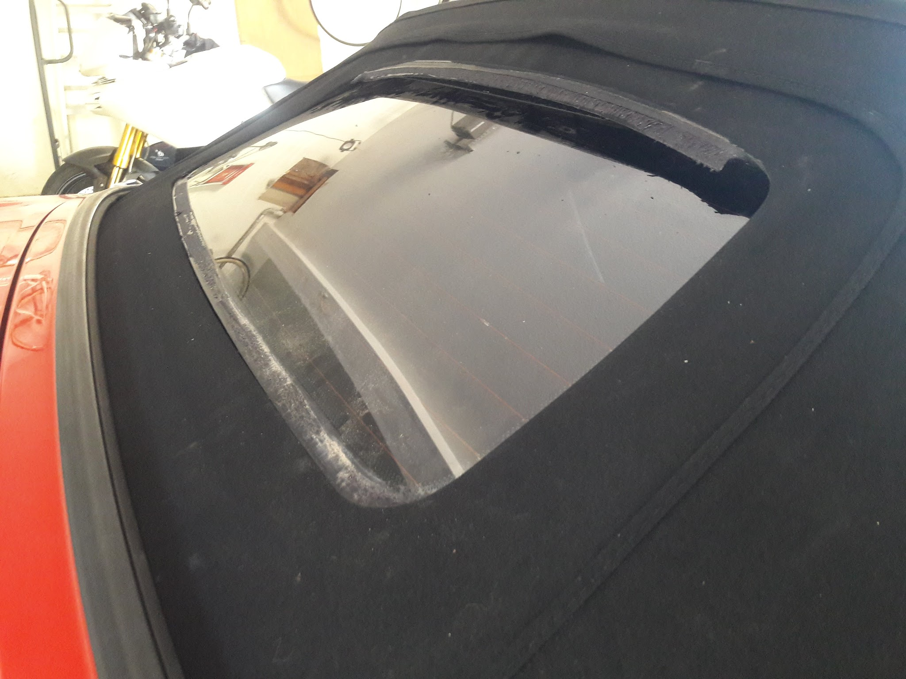

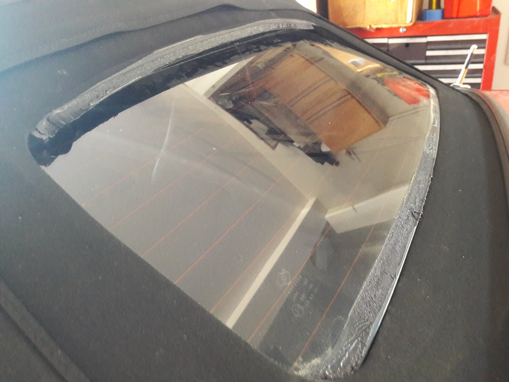

### Material wear

I have seen very few ragtops fail due to a torn seam, or split material. They can get wear spots where the material jiggles against hard metal frames when the top is folded. They can also wear very thin where the interior frames scrub against the interior surface during raising and lowering. I’ve seen this happen on factory vinyl tops, where the interior cloth covering is completely scrubbed away, and the very thin vinyl (PVC) outer skin will get many small “cuts” in the surface as the stretched material starts to fail.

## Example Canvas top wear

I had a canvas top on my spyder for 10 years. I’m guessing it was a Robbins brand. I parked the car outdoors while at work (daily driver) for the whole time. It was used heavily - I raised and lowered the top with reckless abandon, depending on sunshine, rain, temperature and mood. I regularly raise the top at highway speeds (especially when it starts to rain unexpectedly). (This is another discussion that gets everyone excited - but it involves a little steering with your knees, while engaging the latches. And it can be accomplished up to 70 mph. Note the top CANNOT be lowered at any speed above 40 mph.)

I finally decided to replace it when it developed about four spots where the canvas threads were worn away (chafed). All of the exterior worn spots appeared to be the result of chafing as the top was folded (stowed).

The worst spots resulted from the metal frame resting on the exterior (aft) surface of the glass. One spot had worn away both the interior and exterior surface of the material, so that the only remaining material appeared to be soft butyl rubber! In hindsight, I suppose one could minimize this kind of wear by placing a thin sheet of stiff foam on “top” of the glass as you stow the top to cushion the hard points created by the metal frame. This would be a cumbersome exercise.

Minor wear spots on the interior surface resulted from repeated folding and chafing. This resulted in the interior surface and butyl rubber layer being completely worn away, leaving only the canvas material. I wasn’t aware of this damage until I removed the top during replacement - since it wasn’t visible from the outside.

This particular top went to a needy spyder owner, so I added some patches to the interior surface to extend its life a little longer.

Wear spots resulting from chafing contact while the top was folded (stowed):

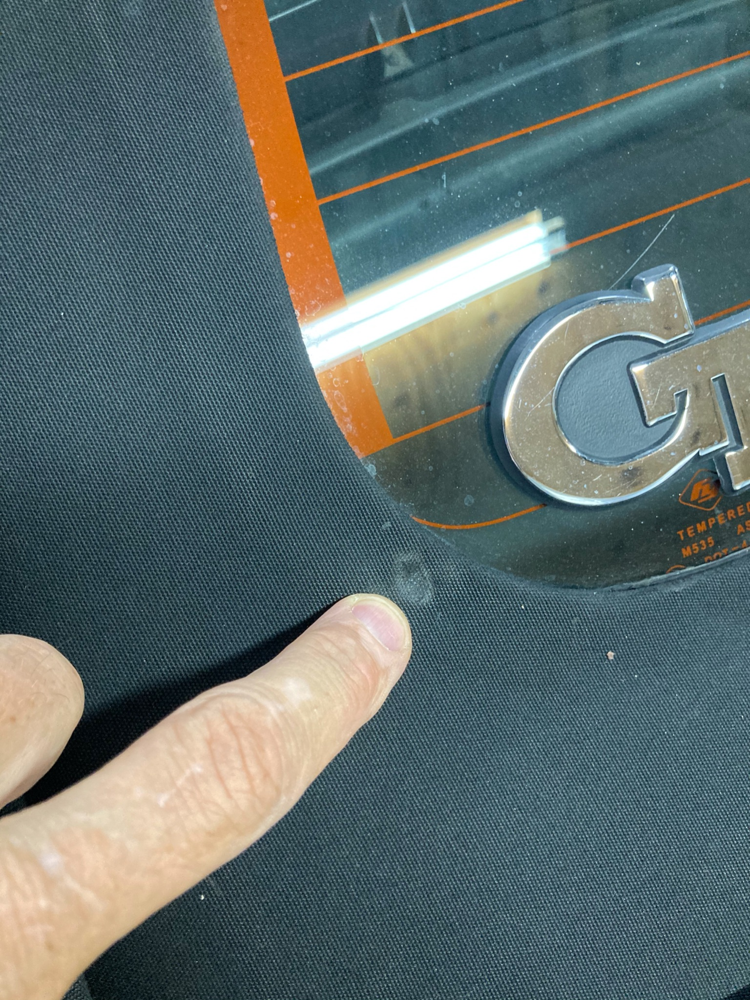

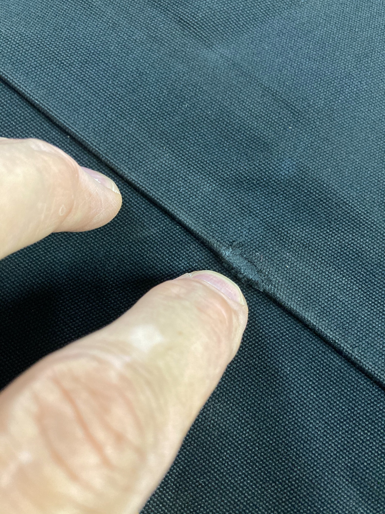

This was the worst spot, both the interior and exterior material were worn away, leaving only this soft spot that appeared to be butyl rubber (only).

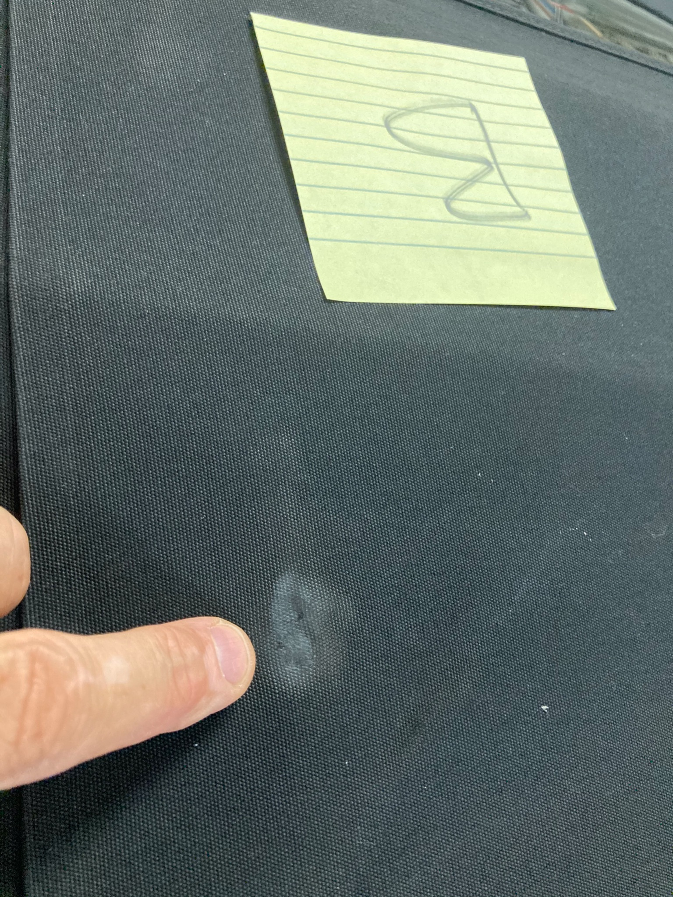

Interior wear - these spots were not visible from the outside. Only discovered after I had removed the top. I added some patches so the top could be reinstalled on another car.

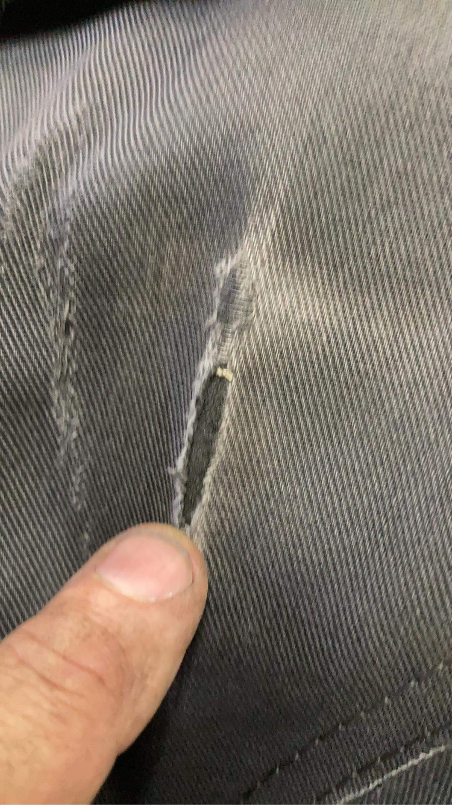

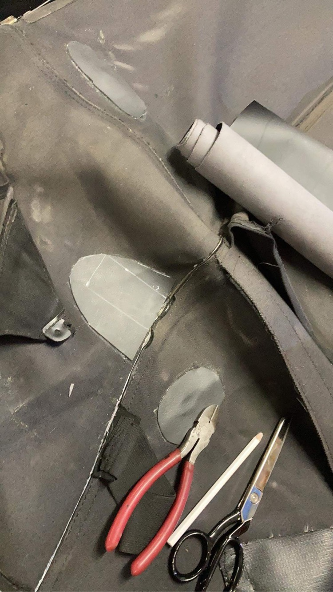

## Photos

Comparison: I need some more photos of different brands’ glass. Help me out please. Send me some photos!

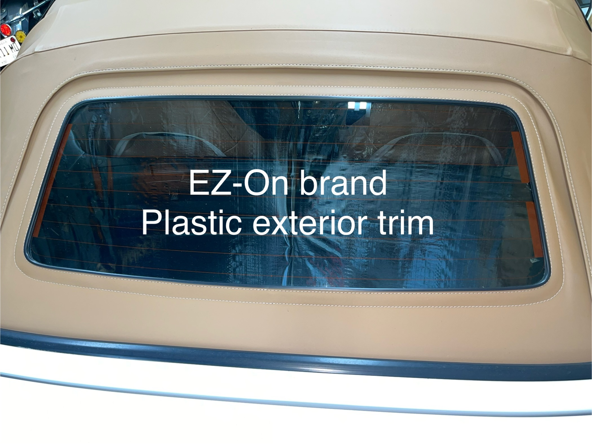

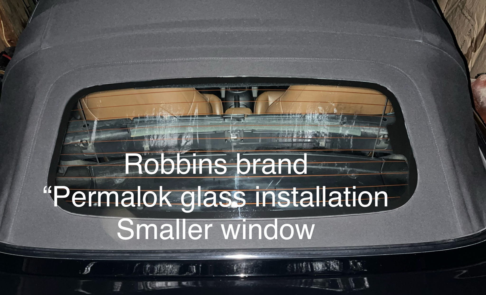

HimmelInc

Plastic external trim ring

Note: Recent photos of a HimmelInc top confirm that it no longer has the plastic trim piece. (March 2025).

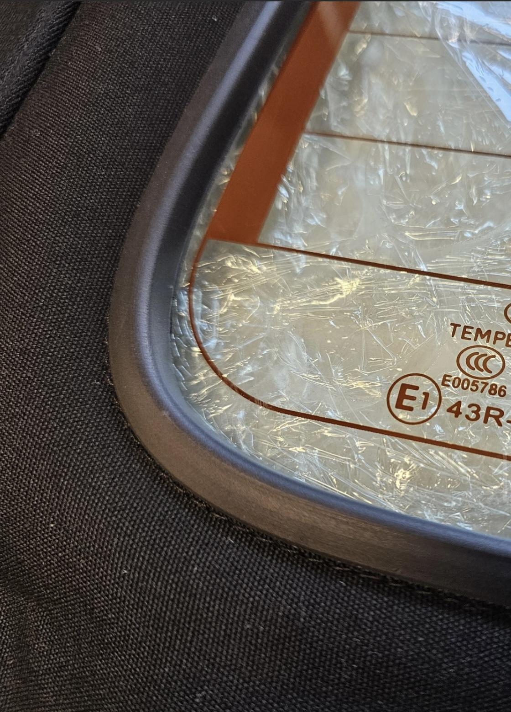

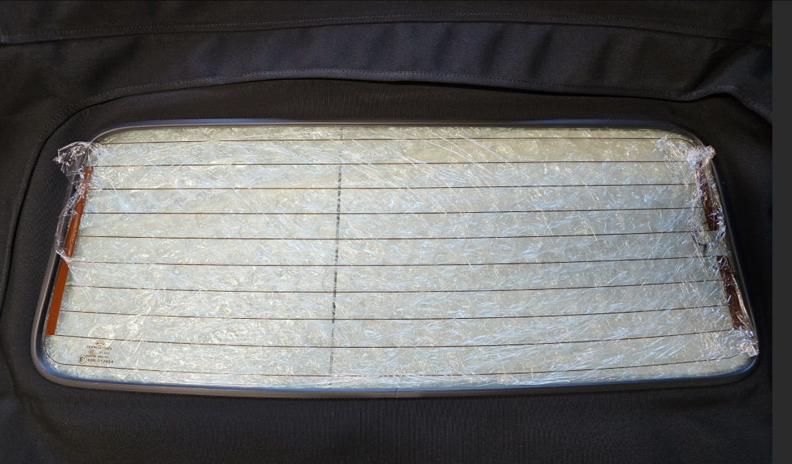

Himmelinc:

March 2025

Folded edge on the material

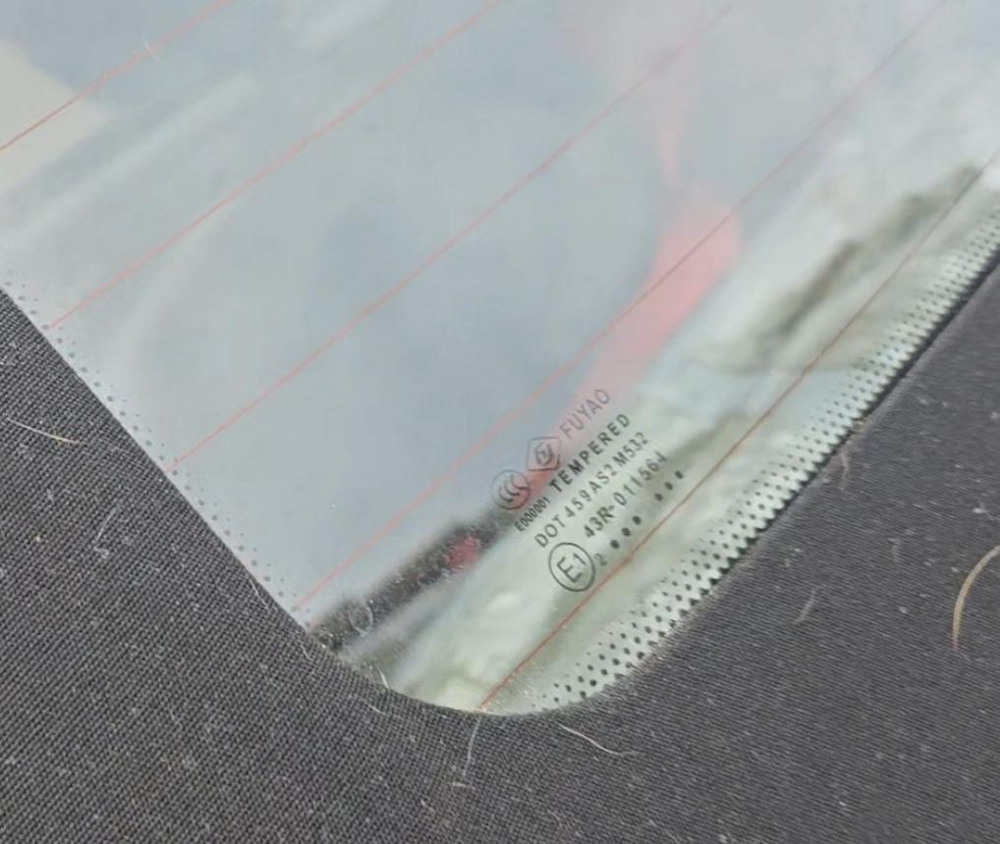

Germanex: (Apr 2025)

Plastic trim ring

Glass made by BSG Auto Glass Co. Ltd. in Dafeng City, Jiangsu, China

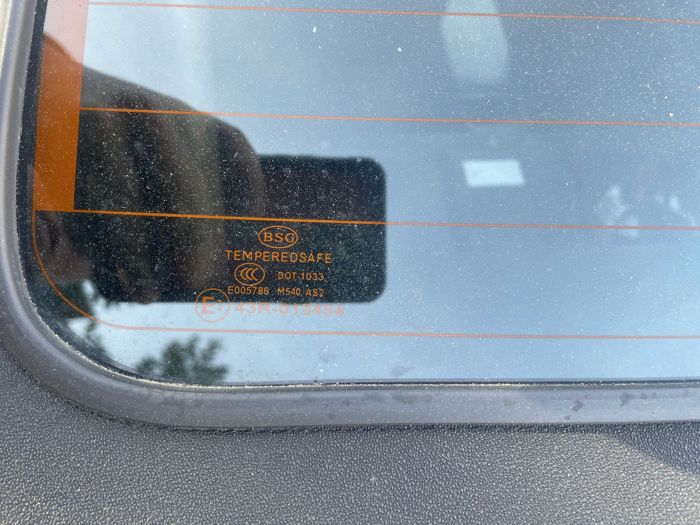

Kee Auto Top:

Unfinished cut-edge where the material meets the glass

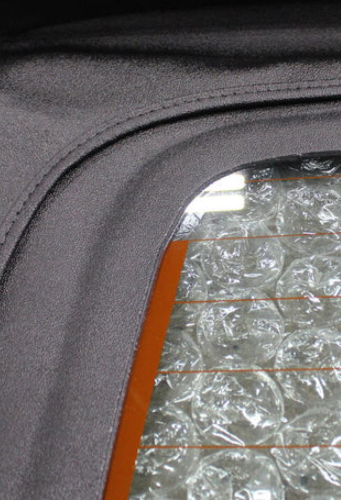

MR2 Heaven

This is not a high quality method for glass installation. I would guess it’s a Chinese manufacturer.

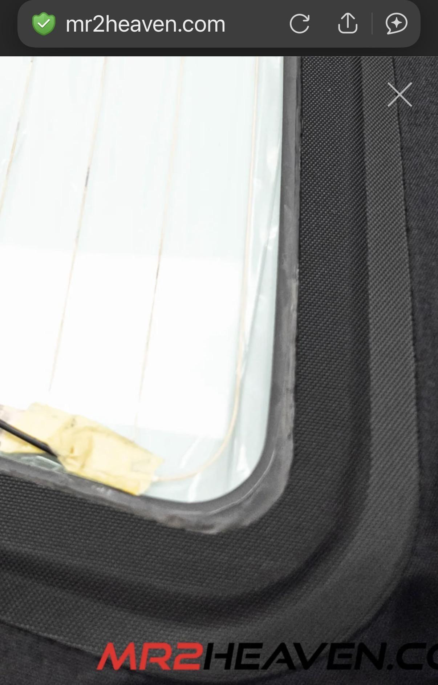
