[← Chapter index](../README.md)

# MR2 Spyder — Convertible Top Strap Installation

## Contents

- Background
- Purchase
- Shipping
- Design
- Installation
- Pictures

## Background

Our convertible tops incorporate a side cable that will bow upwards when the top is stowed. It creates an “ear” that sticks above the surface of the rear deck on each side of the car.

When spyders were delivered new, Toyota included a nylon strap that tugs the “ears” toward the center of the car as the top is folded. When completely stowed, the “ears” are tucked out of sight. The strap threads through a pocket in the convertible top. It snaps to a short strap on each side of the car, just above the side windows and even with the folding hinge.

Based on stories from the spyder forums, the strap may have been shipped in the glovebox when the spyder was new. Many people reported finding the strap tucked away in the glovebox, storage compartment or the frunk - and not properly installed in the top.

### Philosophy

I am convinced that the ear strap is pretty hard on the top, yanking the material and forcing it to fold abruptly. On my older tops I have seen the portion of strap sewn to the top tear away. I think it’s least destructive to just let the ears stick out in the wind. Next least destructive is to fold them in by hand. And most destructive is to use the strap as designed. HOWEVER - the strap is pretty cool. It keeps the top looking tidy without any effort. So you can choose - err on the side of longevity, or use the strap as it was designed and just let it wear. Or even split the difference and use the strap until they tear loose from the top, and then cut off the torn pieces and let them stick out from that time onwards. Your choice!

## Purchase

I make replacement straps at home. (Similar to the factory straps, but better!). I’m selling them for \$35 each. Send me an email or Facebook message if you’d like one.

Email: Cyclehead21 at gmail dot com

## Shipping

\$35 price includes (cheap) shipping in USA. I ship them in a first-class letter (large brown envelope using three stamps - no tracking info, and no insurance).

If you’d prefer tracking info and insurance - or to ship outside of USA I will need to check shipping costs before I can send you a total price.

## Design

Factory Toyota convertible tops have a 1.5” wide nylon strap, with a small piece of velcro surrounding a standard snap. Aftermarket convertible tops typically have a 1” wide nylon strap with no velcro (based on my two spyders).

The straps I make have velcro flaps on the ends that cover the metal snap. The purpose is to help prevent the snap from coming apart, and to prevent the snap from snagging on the pocket or the frame as the top is folded and raised.

The factory strap is 37 ¼ inches center-to-center between the snaps. When I tried that length on my aftermarket ragtop (EZ-On brand), it was about ¼ inch too short (too tight). It pulled the side cables away from the gutters, and created a pucker or buckle in the surface of the vinyl that was visible when the top was up and latched. I suspect there are minor differences between factory tops and most aftermarket tops.

To address this problem - I designed a detail that adds a velcro lap-joint in the middle of the strap. It allows you to peel it apart and reposition to make the strap the exact length needed to work properly with your ragtop. Note: I adjust the overall length of my straps to match the “factory” strap length, before I ship them to you. So my straps are adjusted to a good starting point.

## Installation

### Video

**[https://youtu.be/G92ogJ70GyE .](https://youtu.be/G92ogJ70GyE)**

Many thanks to “Zip Tie Ninja” for taking the time to post this thorough installation video!

Baseline - Before you install this strap you need to get a “baseline” (to see how your top looks without any strap installed). Close your ragtop and look carefully at the upper surface, adjacent to the hinge in the rain gutter. Note where the side cable lies in relation to the gutter. Is there a gap? Is the surface of the top smooth near the hinge? (pictures below)

Find the short straps that are sewn to your top - Unlatch the top and open it partially. Hold the top open about 1 foot from the latched position. Use a helper if necessary. Feel around near the gutter hinge on both sides of your car, and find the short nylon straps that are sewn to the top. They may be tangled up around the folding frame, or lying tucked up inside. They should each have a female button snap. Note: If one of both of the sewn straps are torn off or missing, you can’t use my strap. It cannot be installed. Just tuck your ears in manually.

Route the short straps below the ragtop frame so they loop around the bar. Pics below.

There is a pocket attached to the inner surface of your convertible top. The picture below shows my finger in the same location as the pocket. The pocket may be very hard to see. (And impossible to photograph!). It is partially hidden above a fabric “headliner”. It lies flat on the inner surface of the top, so all you may see is the edge of some material. Try sticking your finger inside to make sure it’s the correct “pocket”. It should be continuous across the entire width of the top.

Find a stiff wire to help feed the strap through the pocket. I bent a wire into a “J” shape on the end, and hooked it through the center of the snap on the strap. Press the velcro flaps over the end of your “J” hook. Watch for sharp edges, you don’t want to slice your ragtop!

Before you feed the strap into the pocket - pay attention to which way the male snap is facing on the new strap. It must face downwards.

Feed the end of the strap into the flat pocket attached to the inner surface of your ragtop. Push the strap clear across the car to the other side and unhook your stiff wire. This works best if you hold the top partially open.

When the strap is threaded into position, peel the velcro flaps open, and snap the strap to the short pieces on the ragtop. Make sure the short pieces are threaded UNDER (below) the frame. I agree it looks like it shouldn’t go that way! Press the velcro flaps together to trap the snaps inside.

Note: If you still have a toyota original ragtop, the 2” wide velcro flaps I provide won’t help. You can cut the velcro flaps off the new strap, if they cause trouble.

Latch the convertible top shut and look again at the outside (where you did your “baseline” check). Is the gap between the side cable and gutter larger than before? Is the surface of the top buckled? If so, the strap is too tight. Fish it out, reposition the center velcro strip lap joint to make the strap a little longer and try it all again.

When you get the length dialed in, try lowering the top and see how it performs folding the ears out of sight. It’s best to do this on a warm day when your convertible top will be soft and flexible. The “ears” may not fold perfectly at first. The material will “learn” with repeated folding and will fold more readily after more use.

Verify that the ears fold nicely with the top down. Raise the top and verify the upper surface doesn’t have a new buckle, and the cable gap hasn’t become larger at the gutter. You may need to “help” get the ears folded into position when the strap is new. They should fold by themselves as the material gets accustomed to the folded position.

Enjoy the sleek new appearance. Your friends will all be so jealous.

## Pictures

Aftermarket convertible tops seem to provide 1 inch wide straps attached to the top.

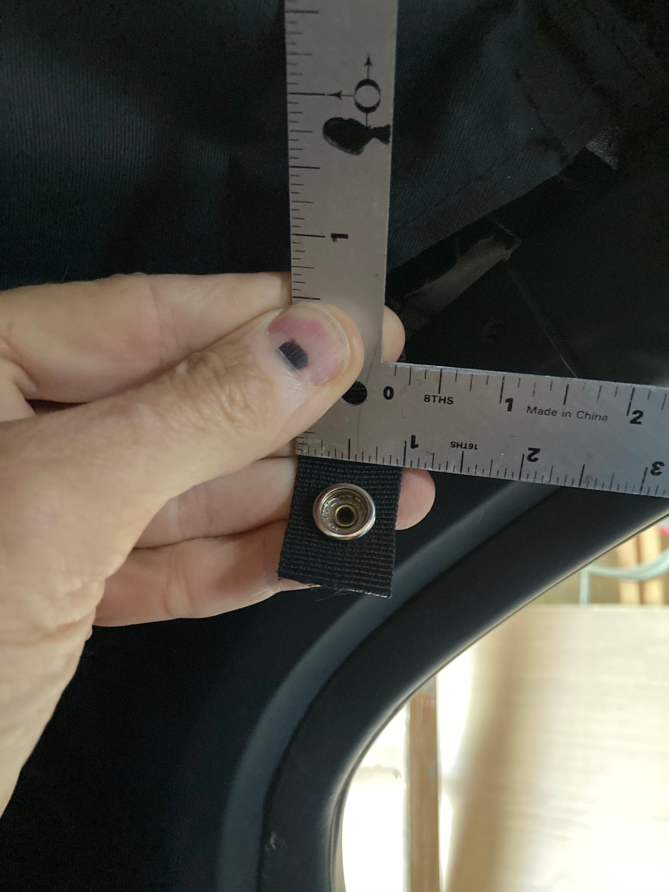

Toyota original ragtops have a 1.5 inch wide strap attached to the top. (Mine was torn off)

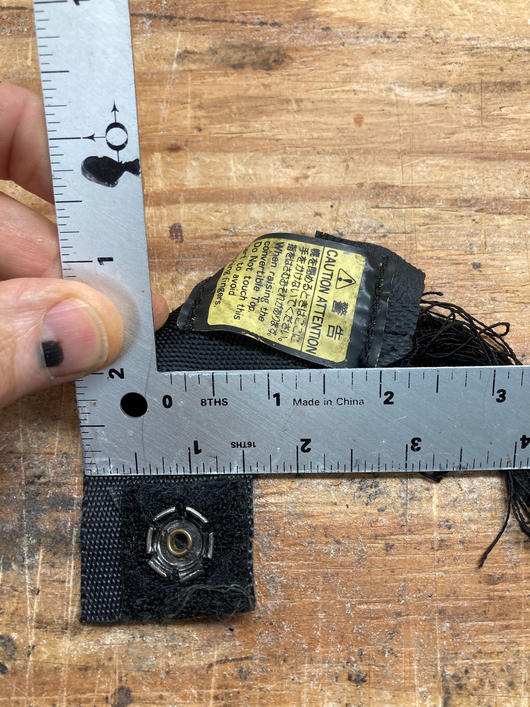

Baseline. My finger shows where the strap pocket lies inside, in relation to the gutter hinge.

Notice the small gap between the side cable and the gutter (even with my knuckle), and the top of the material is lying flat (no buckles by my finger tip)

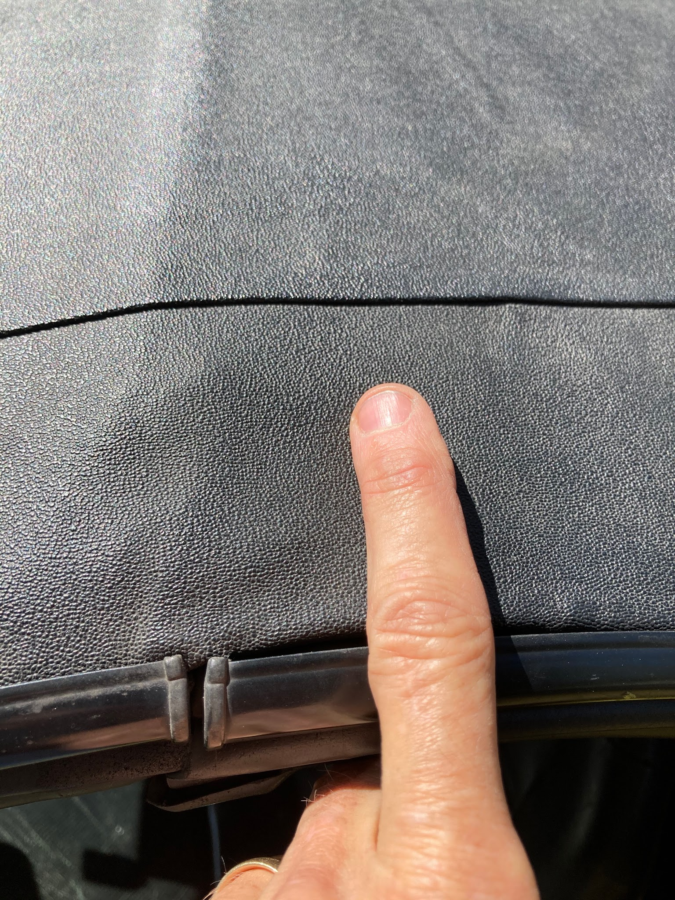

Here is a big gap between the side cable, and the rain gutter. Also the top surface is buckled. Strap is too tight!

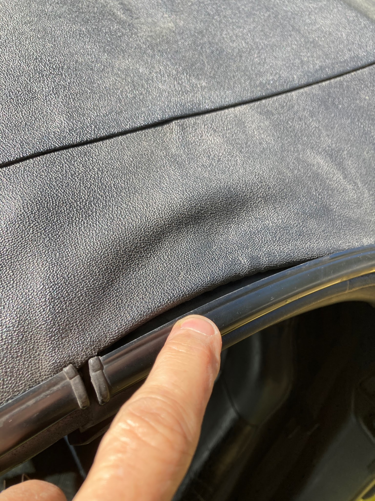

Another picture of the buckled surface of the top. Strap is too tight.

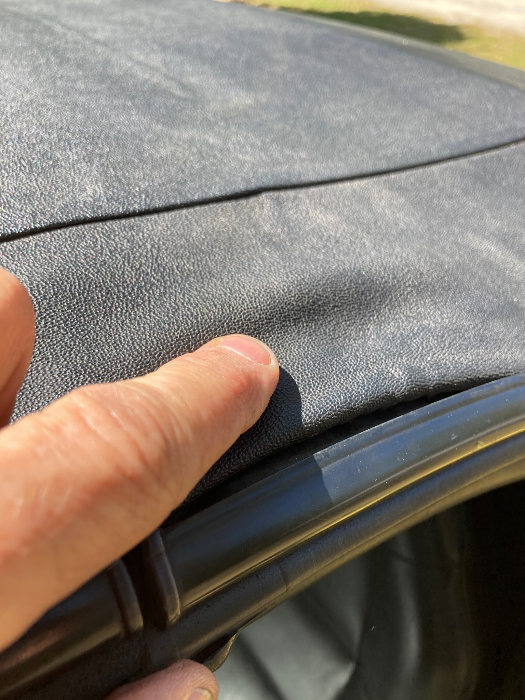

I used a piece of stiff welding wire to fashion a hook so I could feed the end through the pocket.. Something like a coat hanger would also work. Nothing sharp though, so you don’t puncture or slice your top!

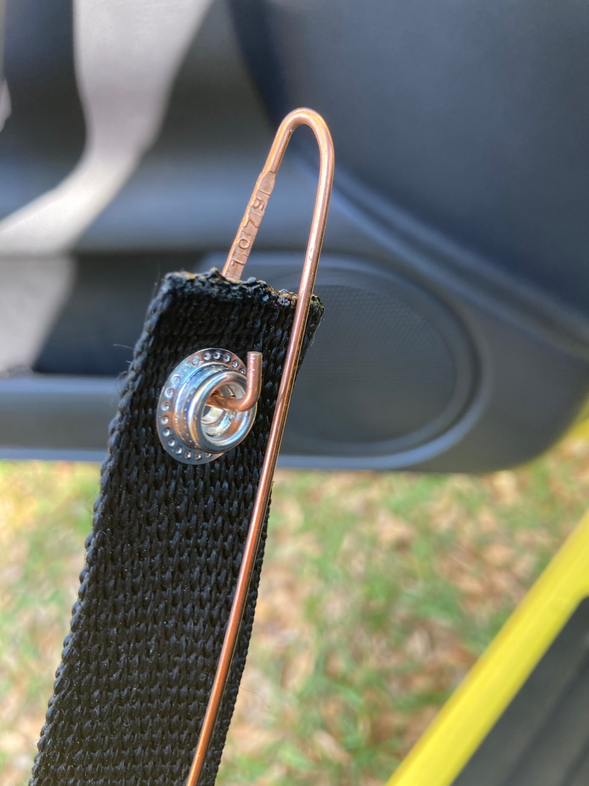

The straps sewn to the car must loop AROUND the frame as shown. My top is partially open in this picture (Left side of the car). That’s the hinge in the rain gutter at the top of the photo.

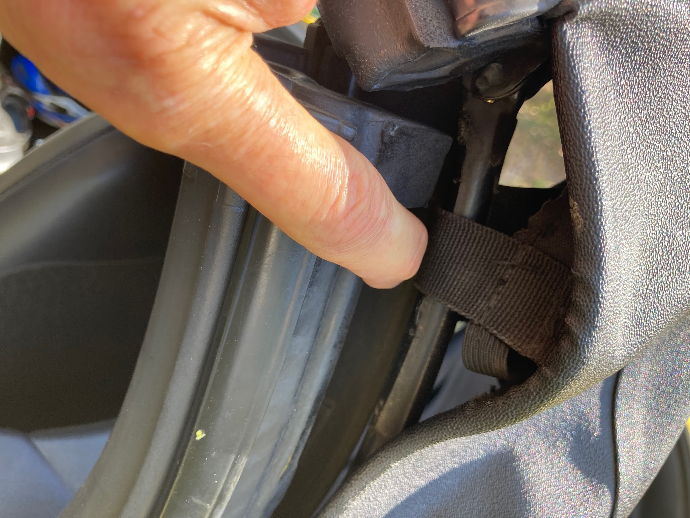

I provide 2” wide Velcro flaps that hide the snap to help keep it from snagging, and help prevent it from coming un-snapped.

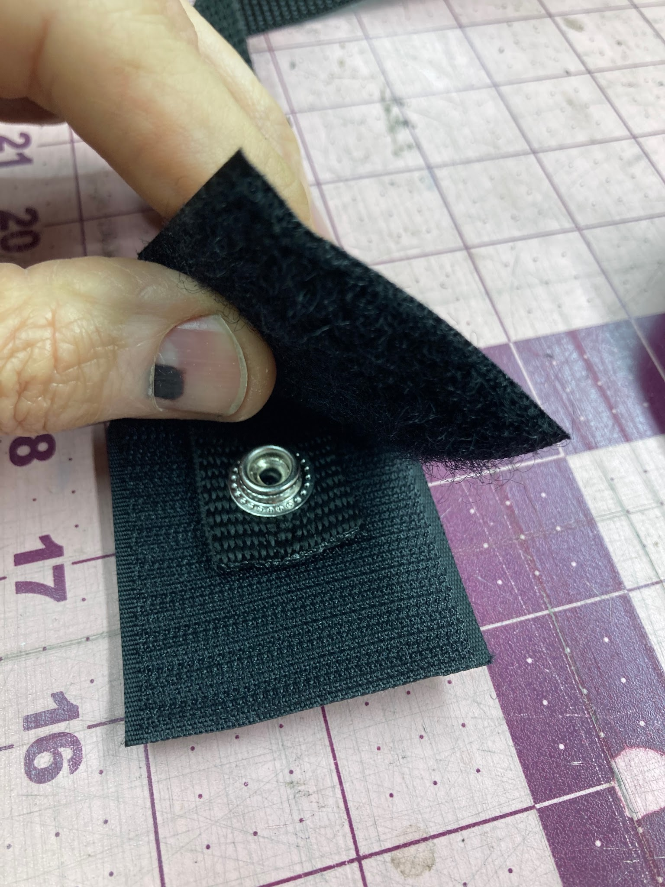

Peel the velcro lap joint apart to adjust the length of the strap. When I ship the straps, I stick them together with approximately 37 ¼ inch center-to-center spacing between snaps. (the factory strap length). My top needed the strap to be adjusted about ¼ inch longer to function properly.

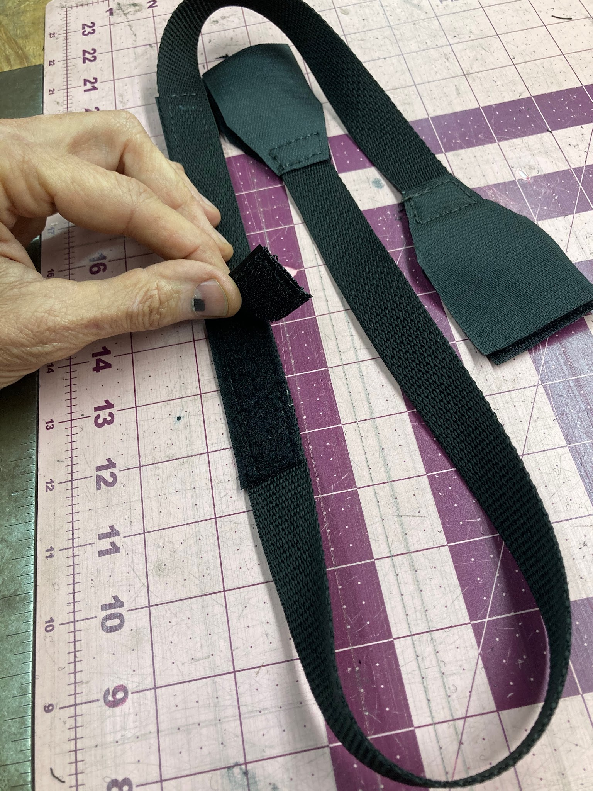

The ear is folded away properly.

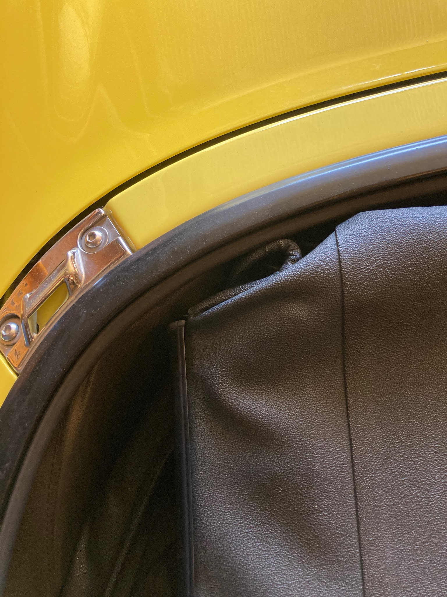

Ears are tucked out of sight. Your friends will be so jealous!

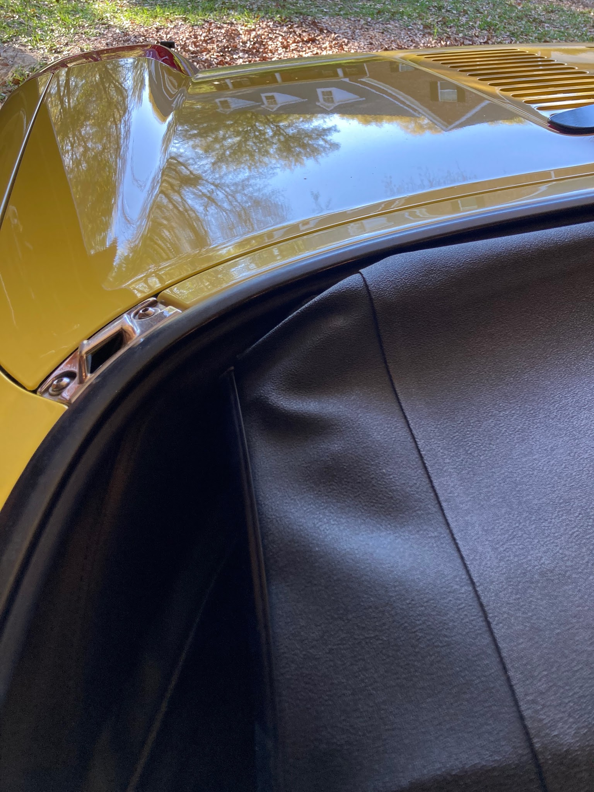

This is where the strap is sewn to the top. On an old top, this stitching can pull loose.

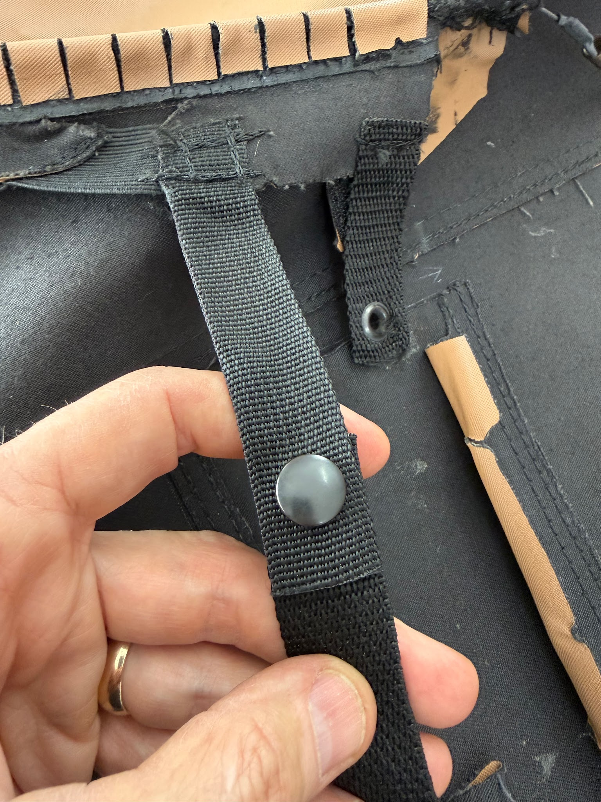

This elastic gives up pretty quickly I think. Next the stitching will pull loose as the top ages. All this stuff can be cut away and discarded if it becomes worn.

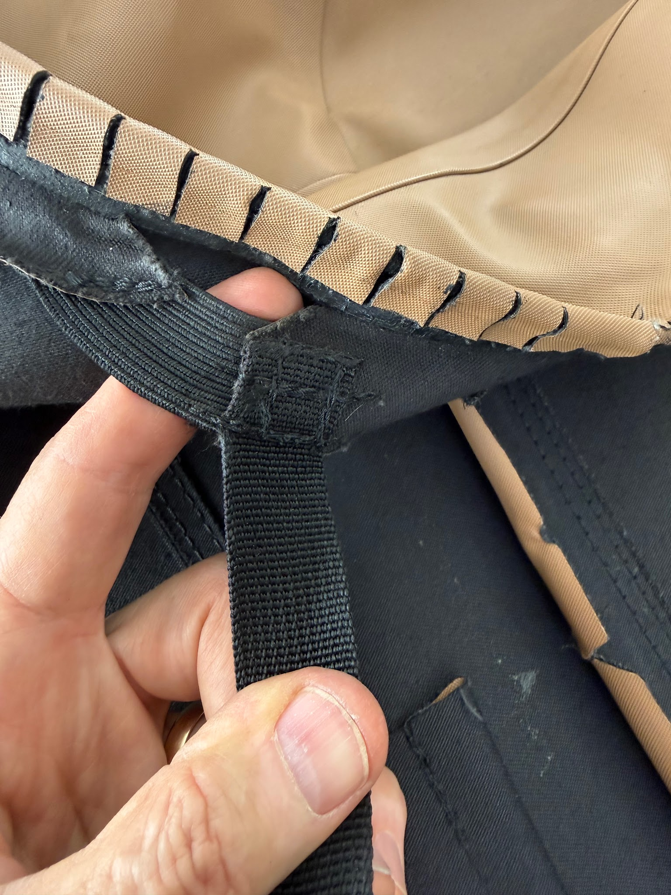

---

*Publication status: Initial conversion 0.1. Formatting and cursory editorial check only; detailed technical review is pending.*
