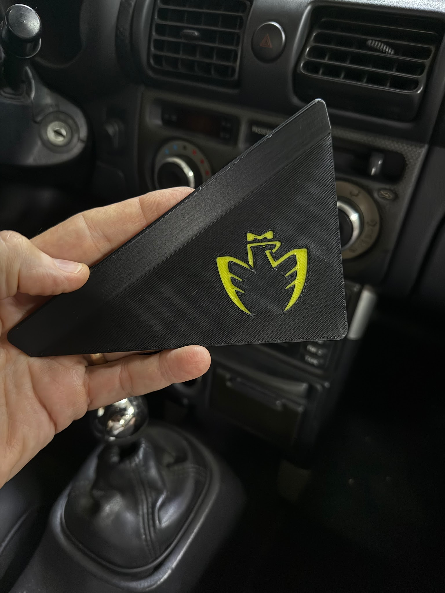
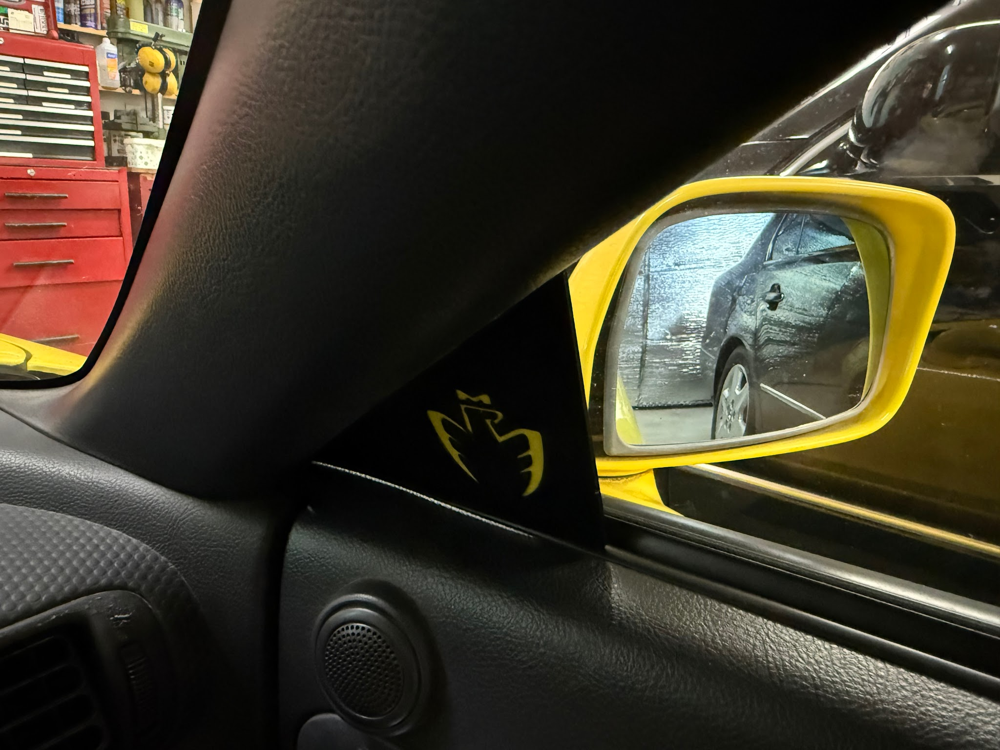
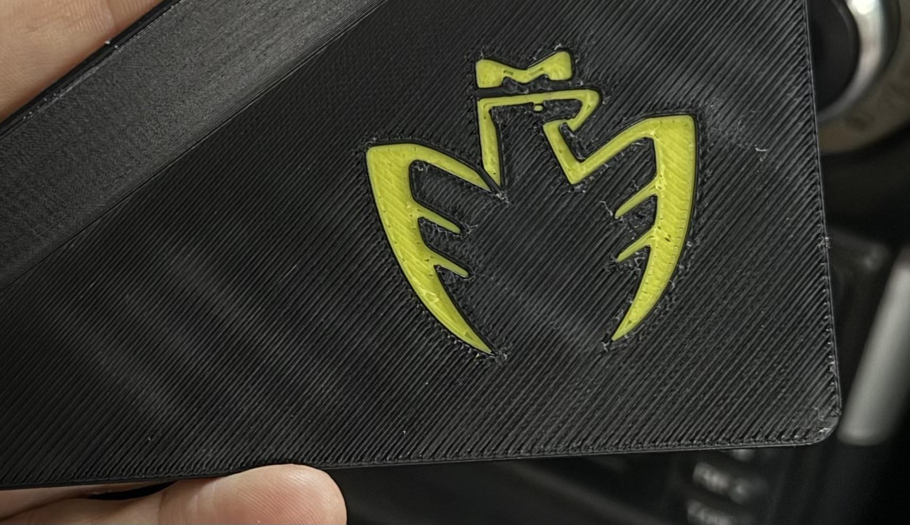
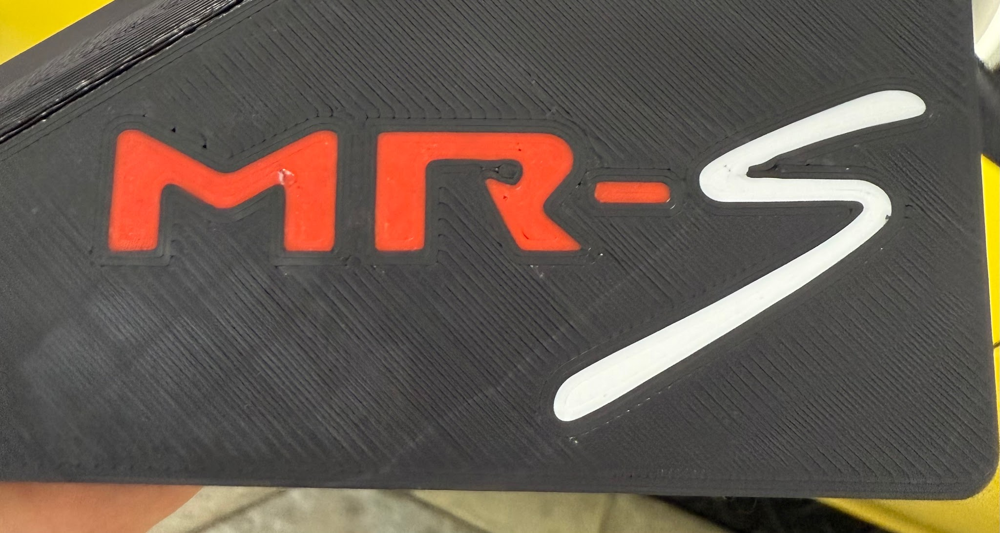
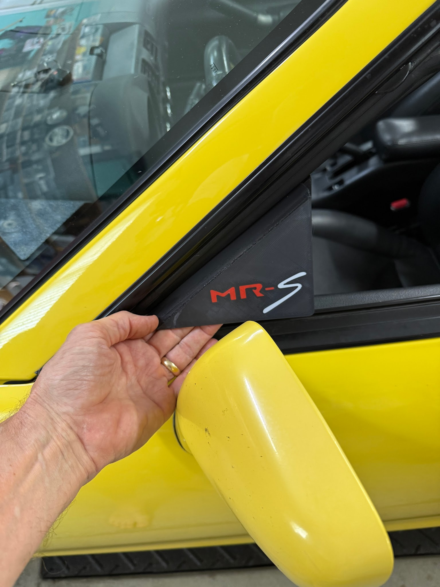
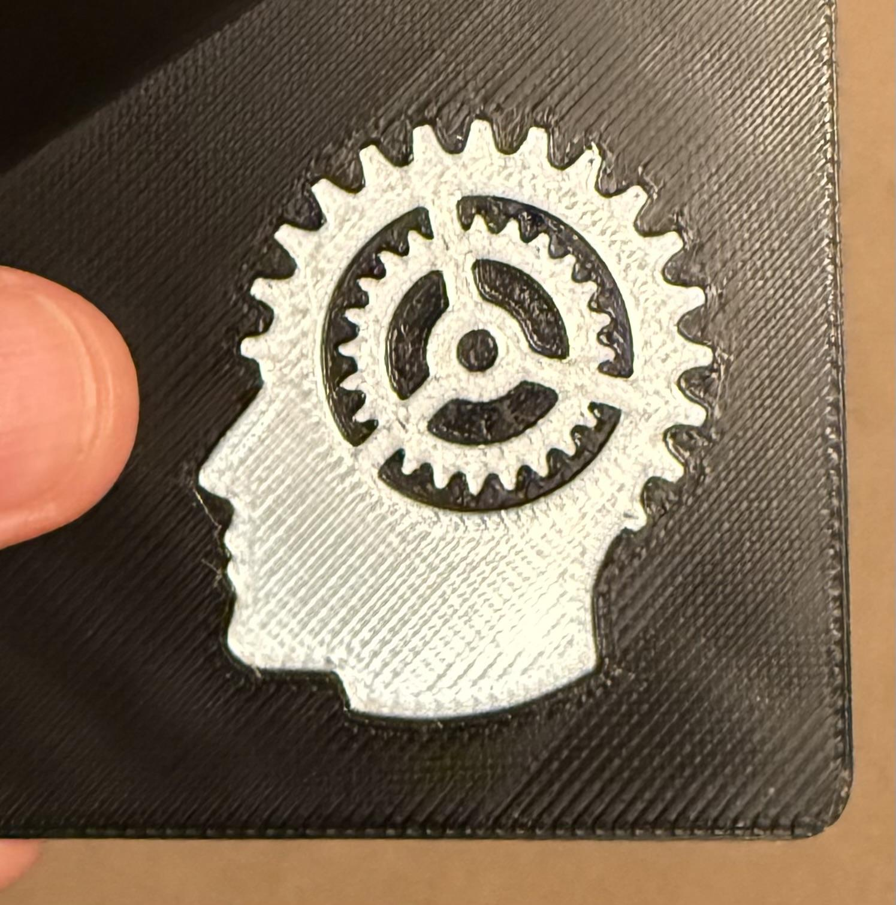
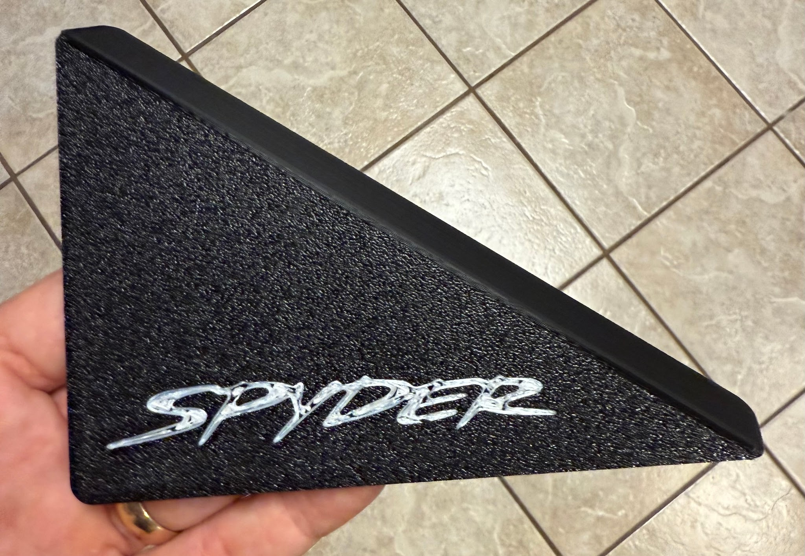
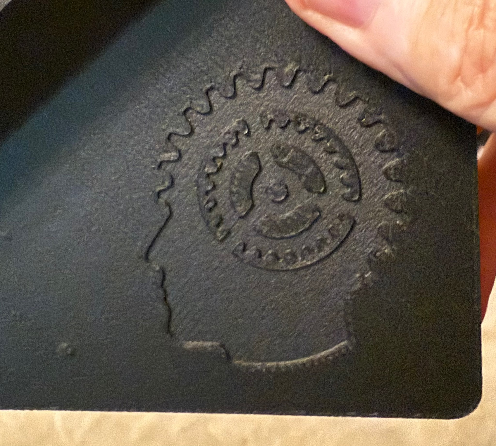
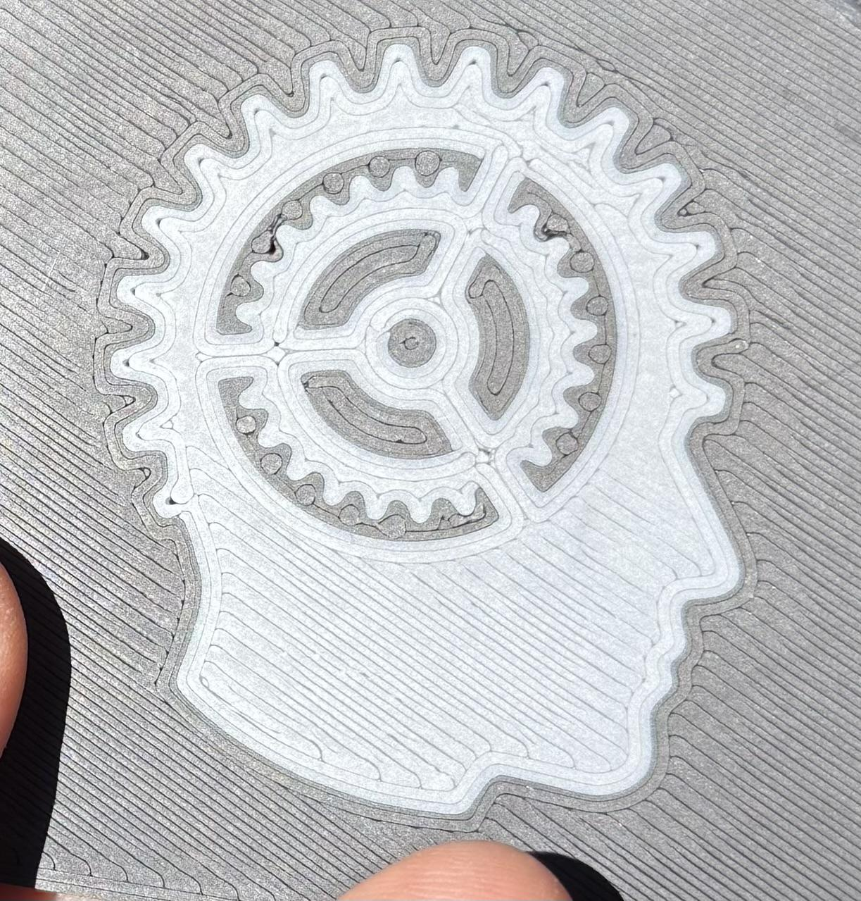
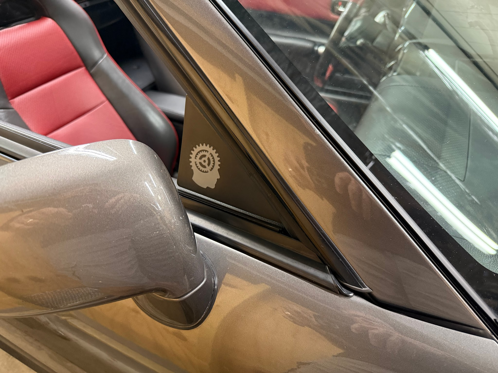

# Cyclehead’s Window Wedgies

## Price:

Plain $25/pair

Select a logo $30/pair

Custom logo $35/pair

All prices include shipping within country

## Options:

Color choices are Black / White / Red / Gray.

Choose any combination of colors you like.

Choose to have the logo/text on the interior surface, or the exterior surface.

(See sample photos below.)

## To order, contact:

USA: [david.labfisica@gmail.com](<mailto:david.labfisica@gmail.com>)

Australia: [poh.brian@gmail.com](<mailto:poh.brian@gmail.com>)

Europe: [gasper.grubar@gmail.com](<mailto:gasper.grubar@gmail.com>)

Specify if you want plain, select logo or custom logo.

Specify color(s)

## Background:

20 years ago Mongo made some clear plexiglass wind deflectors and offered them on Spyderchat, called Mongos. Later Chrioboy began selling similar deflectors as Chumongos. As far as I can tell, they have both quit making them. So I drew some up and sent them to the printer!

## Function:

Air hits the external rear view mirrors and deflects a jet of air into the cabin. These window wedgies block the jet of air. They deflect the wind blast that would otherwise hit your ear and the side of your head.

## Installation:

Window wedgies are easy to install and completely removable. They fit in-between the plastic trim and rubber seal on the windshield “A” pillar, on both the driver and passenger sides.

Installation [Video Link](<https://youtube.com/shorts/wyMtkX_YQN0?si=NC4RvxTOmChcDPif>):

## “Select a Logo” options:

### MR2 Chicken

### MR-S (smooth plate)

### Cyclehead

(my personal favorite!)

### Spyder:

### Mono color:

### Smooth surface

