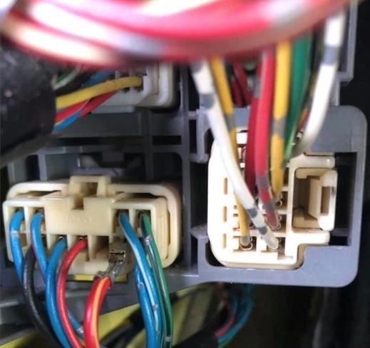
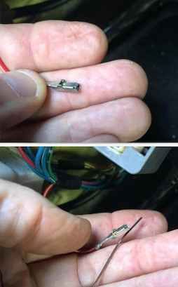
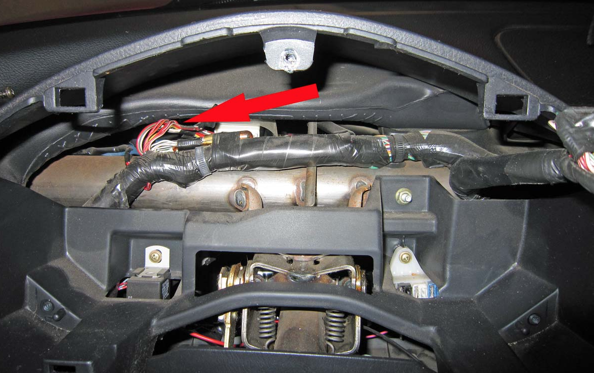
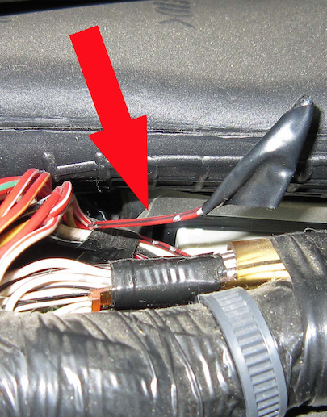
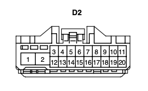
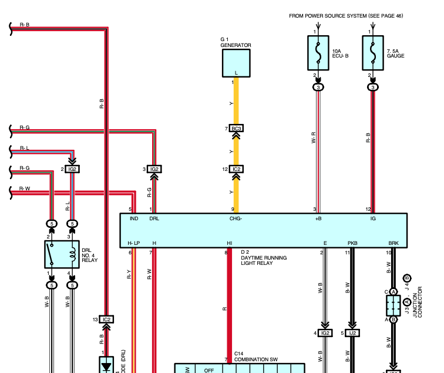

# Daytime Running Light Disable

Compiled by [cyclehead21@gmail.com](mailto:cyclehead21@gmail.com)

Updated Oct 2024

Some photos borrowed from Spyderchat forum.

My thanks to the originators!

All Spyders have a Daytime Running Light (DRL) feature. It illuminates a headlight filament at lower voltage to run the headlights at reduced output - for increased visibility in daytime.

This feature is aggravating for owners that need to be able to drive their cars without any lights showing. (IE: military bases require you to extinguish all headlights as you approach the security gate.)

The system is wired to illuminate the DRLs whenever the engine is running. The feature is designed to turn off when pulling up the parking brake handle.

The permanent fix involves cutting or de-pinning the wire that tells the DRL system that the engine is running - so the lights will function only via the headlight/parking light switch on the turn signal stalk. You can install a switch instead of cutting the wire if you prefer. That will allow you to restore the normal DRL function with a switch.

## Pre-facelift Spyders

De-Pin or cut the red/yellow stripe wire in the kick panel by the driver’s door. Photo shows the red/yellow wire on the bottom left, partially de-pinned from the connector.

It can appear in different pin locations. So go by the wire color.

I used a bobby pin as a tool to release the socket.

If you look closely at one of the empty sockets, you can see the latch that needs to be pried out of the way.

## Facelift Spyders

The main “DRL Relay” control box is mounted under the dashboard, just forward of the speedometer.

I reached it from below, but apparently it’s easier to reach by removing the instrument cluster and accessing from the top.

De-pin or cut the red/black stripe wire in the 20-pin connector at the “DRL Relay” black box located behind the instrument cluster. Alternatively, you can lie on your back and reach under the dashboard. Remove one 10 mm nut to loosen the DRL relay.

(Pin #12 in connector D2)

For info: Facelift Spyders have an extra fuse box that holds two fuses and two DRL relays, mounted in the frunk on the passenger side.

