# Dip-stick mod

Composed by cyclehead21@gmail.com

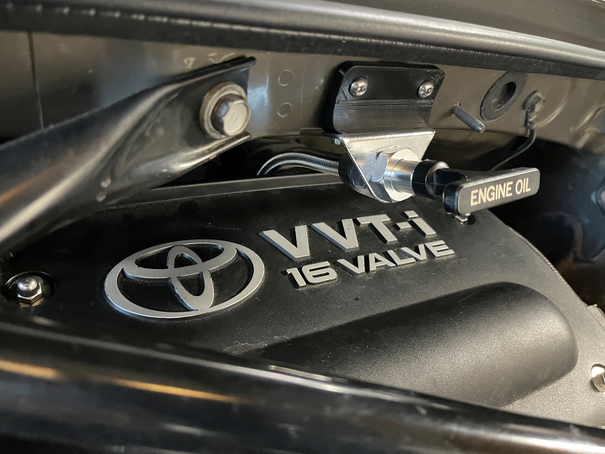

The Spyder dipstick is notoriously hard to read. The dipstick cable goes in a steel tube that snakes around the side of the engine through two 90 degree turns and two offset joggles. The result is that by the time you’ve withdrawn the cable, the oil is smeared all over the scale and it’s impossible to read.

I wanted a simpler path to the oil pan. I chose a route through the first two runners of the intake manifold. After the mod, the dipstick cable makes one sweeping 90 degree turn and drops straight down to the oil pan. Strangely (or not) the original Spyder dipstick was STILL hard to read, even with a straight shot to the oil pan. So I modified a cheap Amazon dipstick which is made from a flat piece of stainless steel. The flat-bladed dipstick is much easier to read.

## Tube mod

I modified a Chinese stainless steel braid dipstick made for a transmission. It is easy to disassemble and adjust the tube length. $25 on Amazon [https://www.amazon.com/dp/B0CY88TX3K?ref=ppx_yo2ov_dt_b_fed_asin_title](https://www.amazon.com/dp/B0CY88TX3K?ref=ppx_yo2ov_dt_b_fed_asin_title)

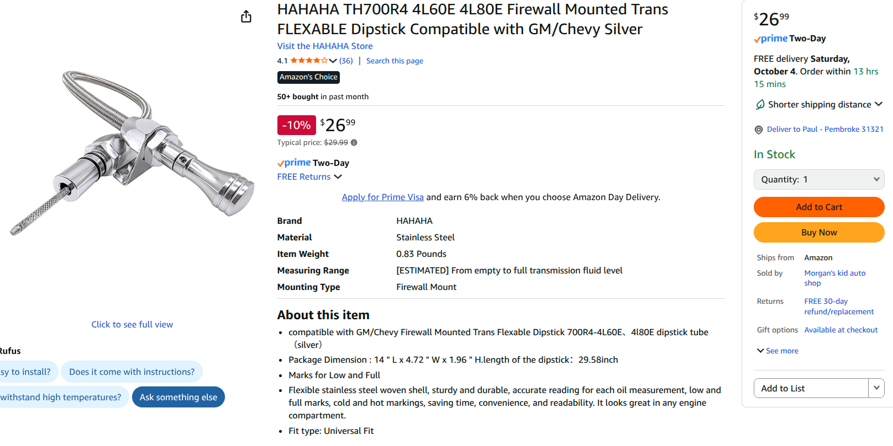

Cut the factory guide tube (PN 11452-22040 $33) just above the mounting tab, leaving a ½ inch straight section of tube.

Drill the end of the Amazon “transmission” dipstick end to 13/32 (.4062 inch) diameter to accept the end of the original steel tube.

Drill and tap a setscrew from the side if you like.

(I checked a Corolla dipstick tube PN 11452-37011 $20 - It doesn’t look the same.)

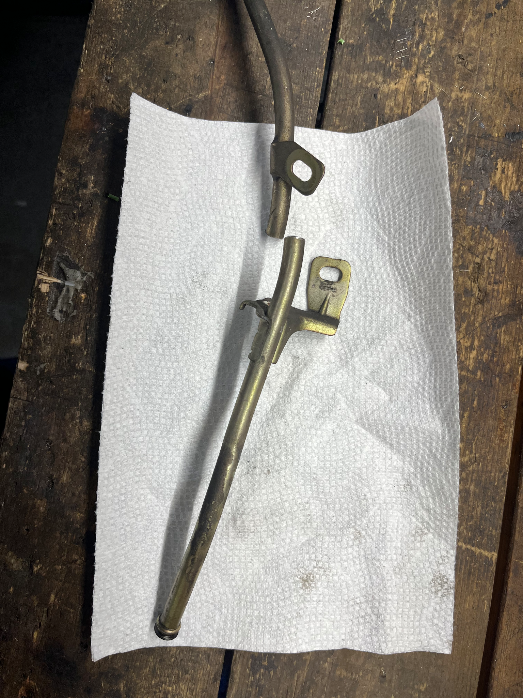

Remove the Spyder’s starter (two 14 mm bolts). Remove one 10 mm bolt holding the old dipstick tube. Unclip two electrical connectors attached to the tube. Remove the old dipstick guide tube: Pull the old dipstick tube upwards, above the engine mount and towards the driver’s side, then rotate the tube and you will be able to remove it from below.

Thread in the new stainless steel tube from above, and temporarily install the old guide tube portion, and position the new dipstick parts above. Mark where to cut the excess stainless steel braid line on top by the valve cover (roughly 11 inches long).

Remove the stainless steel braid and reattach the upper threaded fittings, along with the mounting bracket.

## Dipstick Fabrication

Assemble everything on the bench and measure the dipstick cable protrusion. The factory protrusion from the end of the guide tube is 5.22 inches to the “full” mark, and 6.28 inches to the “low” mark. Attach the dipstick handle to the cable. Verify you have the correct cable protrusion.

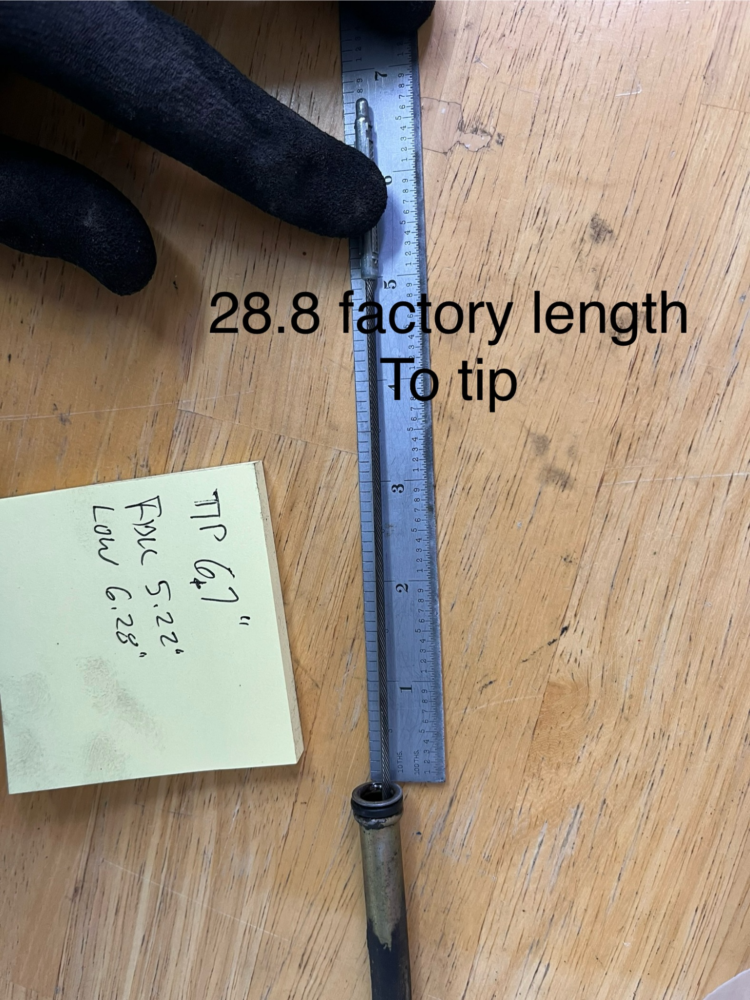

Drill and mount the dipstick bracket to the crossbeam above the valve cover.

## Reference

Factory Steel dipstick tube is:

.3135 inches ID

.3965 inches OD

Factory dipstick cable/handle is PN 15301-22040.

## Dipstick blade mod

The Amazon dipsticks with bright yellow plastic handles are not the correct overall length, but they’re easy to modify.

I pulled the yellow handle off the stainless steel blade using brute force and a bench vice. Clamp the blade in the bench vice. Hold a heavy pair of pliers above the plastic handle and smack it downward with a big hammer. It will shear the plastic nubs inside and knock the handle off of the stainless steel blade.

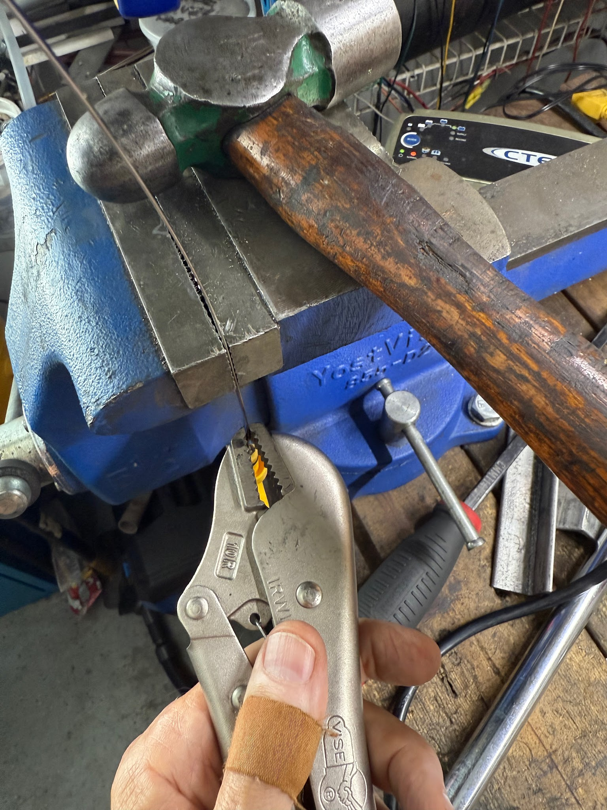

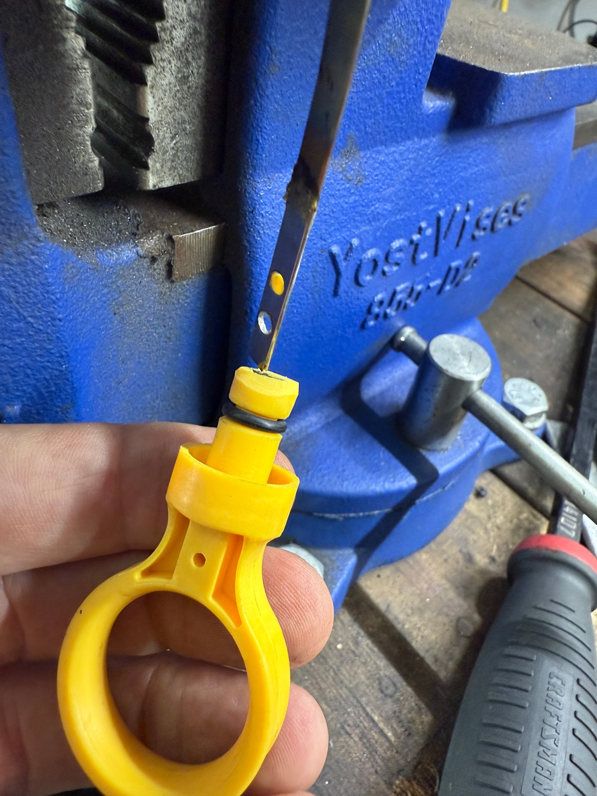

Cut the end of the blade (by the handle) to the correct length. **ALLOW .97 INCH EXTRA MATERIAL TO GO INSIDE THE PLASTIC HANDLE.** (more photos below) Cut the sharp corners off and sand off any burrs so the blade will slide into the handle smoothly when heated. Heat it with a butane torch until it starts to turn red. Then press it back into the yellow plastic handle. It follows the old path into the plastic, and is held very securely when everything cools off.

Amazon flat blade dipstick with holes:

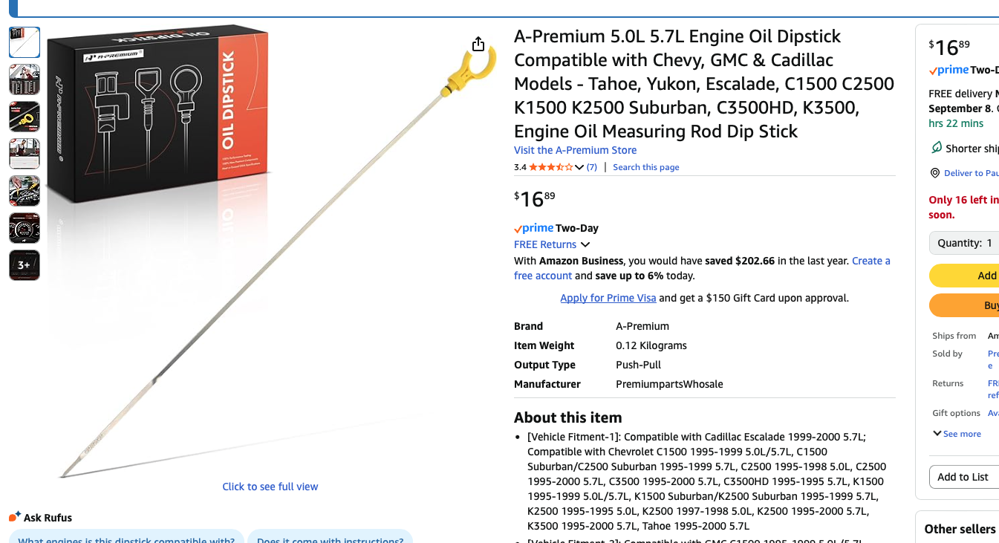

If you want an even longer flat dipstick, you can order Dorman 921-034 for GMC Savana Van - it is 49” long!

Videos compare the original dipstick to an “Amazon” flat metal dipstick.

1. Flat smooth blade

   [https://youtube.com/shorts/kfu_siTj95Q?si=H81PbRmZLQRk2jIu](https://youtube.com/shorts/kfu_siTj95Q?si=H81PbRmZLQRk2jIu)

2. Flat blade with holes

   [https://youtube.com/shorts/GGenb9cWhyw?si=l0ZPnYLkDS-9ZrjP](https://youtube.com/shorts/GGenb9cWhyw?si=l0ZPnYLkDS-9ZrjP)

## New dipstick assembly

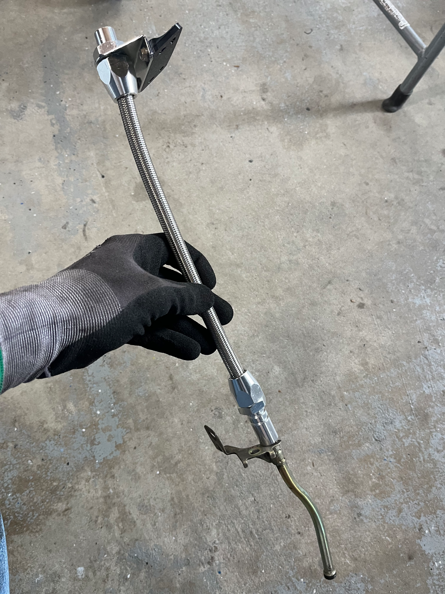

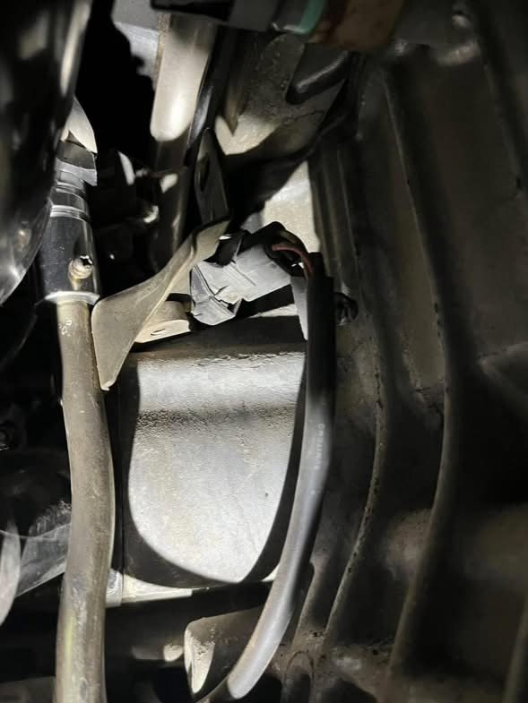

Corners cut off to make it easier to insert the heated blade into the plastic handle.

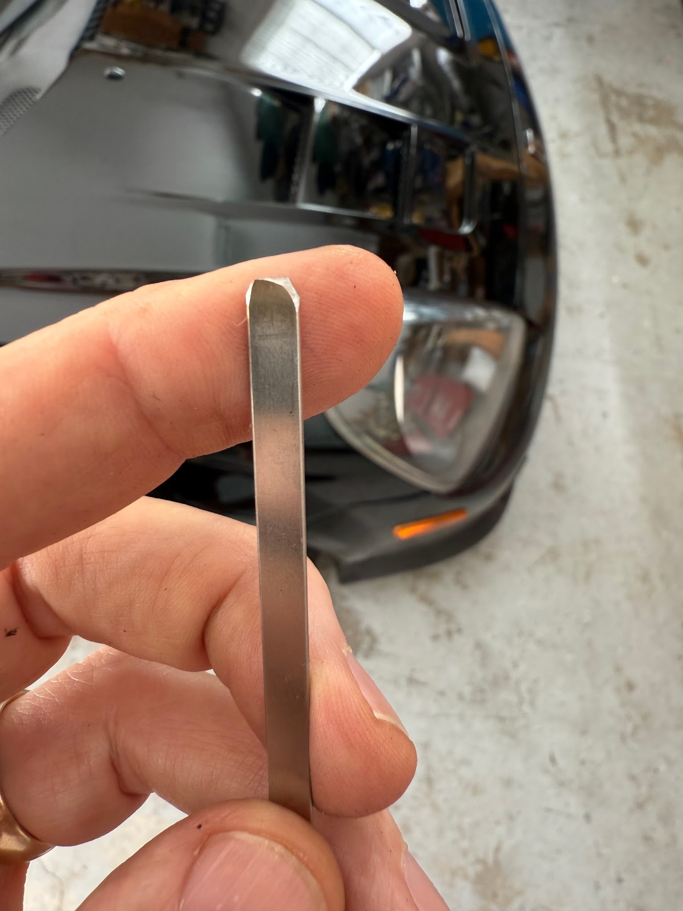

The blade will go just under 1 inch into the plastic handle:

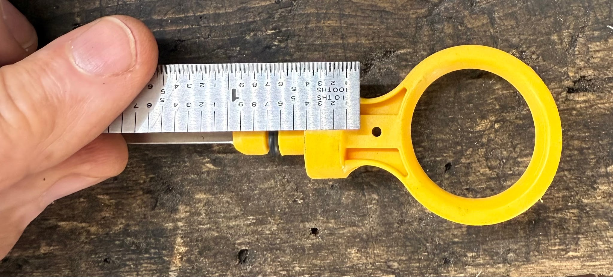

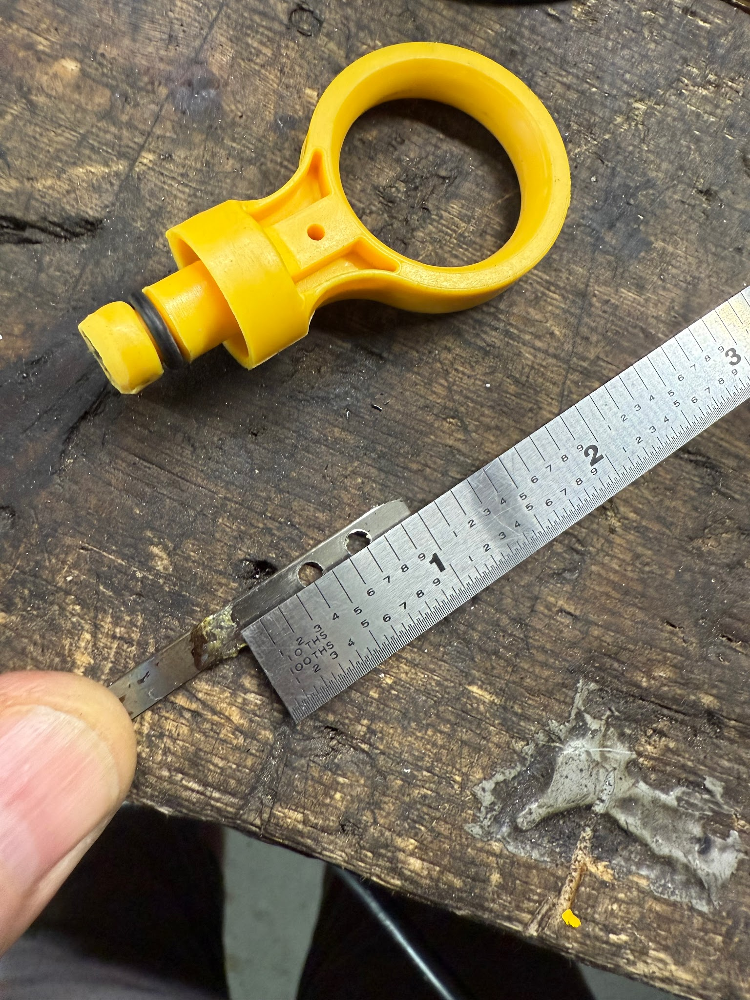
