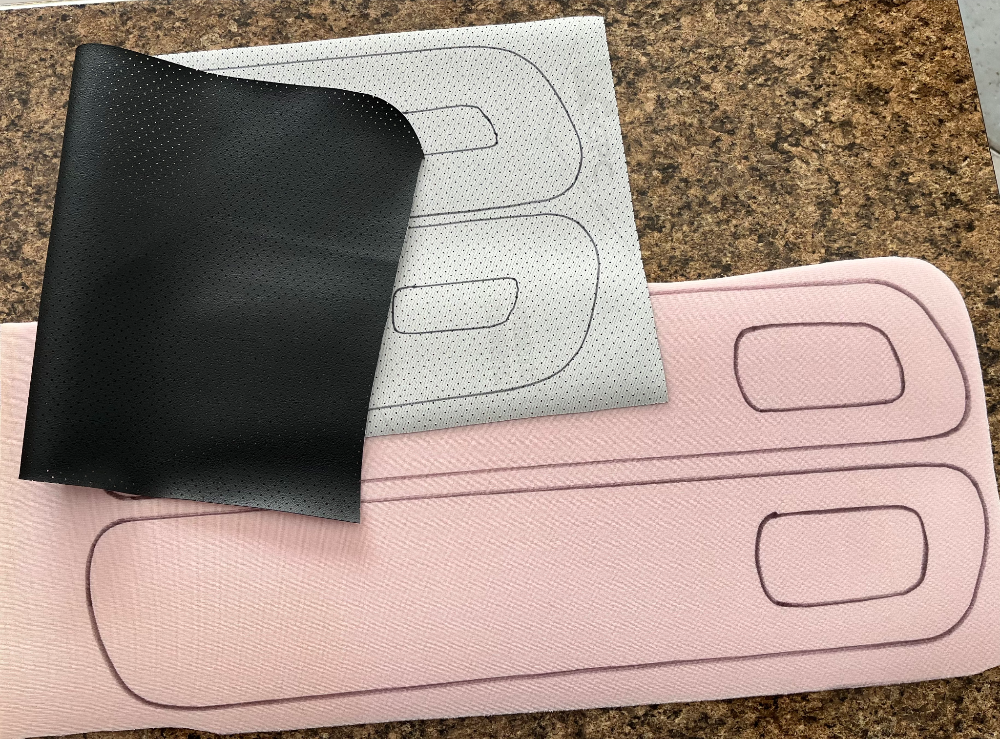
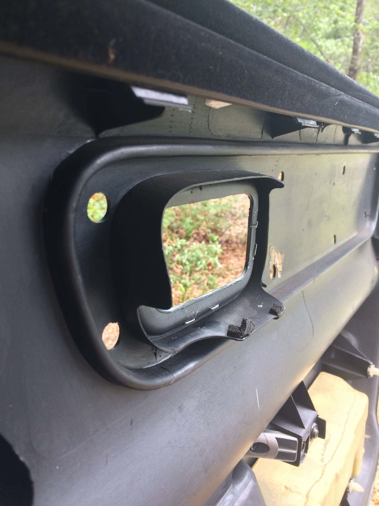
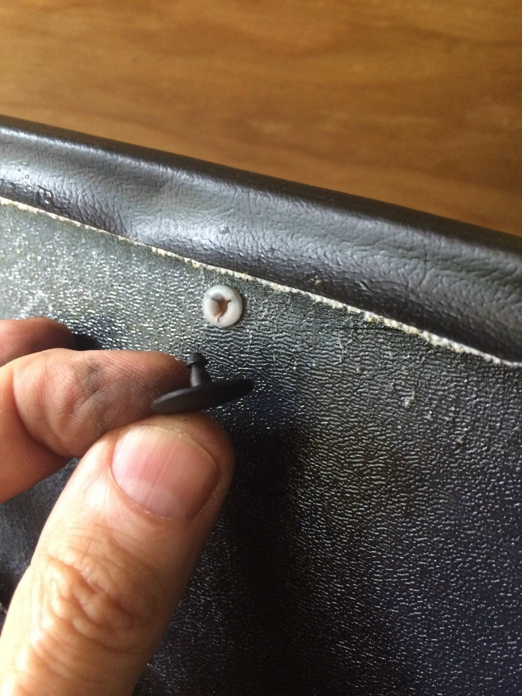
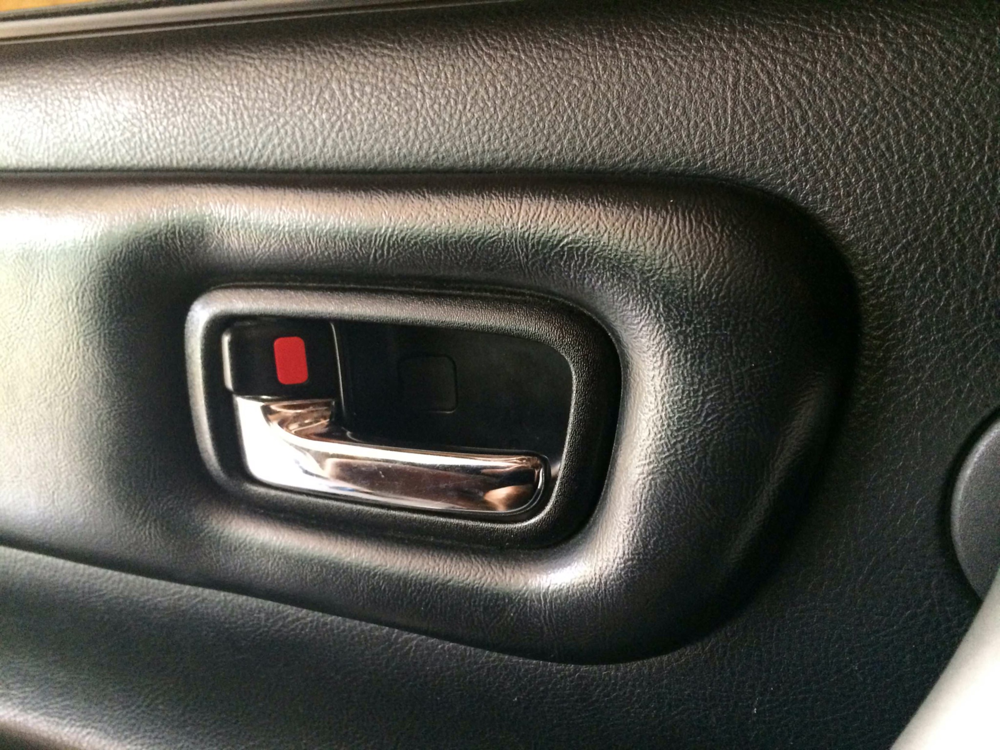
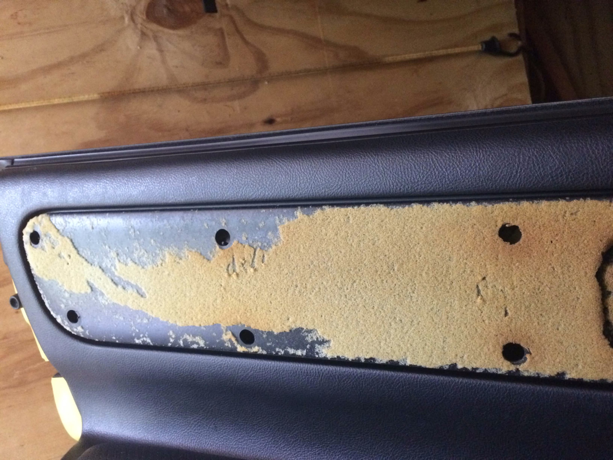

# Door Card Insert installation

The Spyder has a fabric or leather panel at the top of each door, above the door armrest. As the leather ages, it typically shrinks and pulls away exposing the edges. It is fairly simple to replace with new material.

## Replacement steps

1. Peel off the old material.
2. Scrape off the old foam, no need to get it perfectly smooth.
3. Attach a new piece of foam and covering.

## Materials

The foam cut-lines are purposely marked smaller than the top material. You want the foam to have a smooth profile (rough edges will show through the vinyl) and the edge should stop a little distance away from the edge of the top material. Leave yourself a little extra material and trial fit to be certain.

You’ll have to experiment to see what (if any) edging you need to tuck the material into the groove. I used black electrical wire on my last installation.

For glue - any spray contact adhesive will work. No need for anything particularly aggressive. Be sure to read instructions. Most contact adhesives require you to spray both surfaces and let them dry before assembling. You press the dry, glue-coated surfaces together and they stick. If you try to assemble while the glue is wet, it will not stick.

## Installation details

The door card has a deep groove around the perimeter of the insert. I have installed new material without gluing anything to the surface. And I’ve installed a few by gluing the foam in place and installing the fabric “floating” over the foam. There’s no reason you can’t glue both - glue the foam to the door, and glue the new material to the foam.

I have installed some inserts by simply tucking the edges into the groove, and others by pressing black electrical wire into the groove to trap the edge. (Like you do with a screen door) It depends on the thickness of the material, whether a piece of wire or cord is needed to retain the edge of the material.

Thicker materials like leather-from-a-cow can be troublesome to tuck into the corners without bunching up. It helps to cut some small “v” notches to remove the excess material.

I’ve made some custom inserts with diamond stitching - where the fabric is stitched to the backing foam. This makes a thick sandwich that will be tricky to tuck in neatly. Even “v” notches are tough with the custom diamond stitching, since you can’t cut into the perimeter row of stitches or things will start to unravel. Diamond stitching on Ultra suede or Ultra leather is the best, since the ultra fabrics are very thin. Diamond stitching on regular vinyl or leather-from-a-cow will be troublesome due to the thick stackup.

**Note!:** Some spyders have the fabric mounted to a separate plastic tray, that is attached to the surface of the door card with plastic connectors. My patterns for foam and material are sized to install directly to the door card, and omit the plastic tray. You can experiment with changing the material on the plastic tray if you like. I just haven’t tried one yet. Photos below show more details of the “Tray” style door panel.

Andy’s Autosport has a page [HERE](<https://www.andysautosport.com/learning_center/how_to_articles/door_panels/door_panel_removal_pictorial_and_leather_door_panels/>) showing how to remove the door latch, and how to remove the entire door panel if you wish. (Not necessary when replacing the door material).

Spyderchat article I wrote a few years ago, [HERE](<https://www.spyderchat.com/threads/door-panel-inserts.46594/post-1220761>). has some helpful photos.

I finally made a video showing how I install vinyl material on a door card insert. There are many ways, but this one works for me. [VIDEO](<https://youtu.be/rUPbbmYmyfM>)

## Photos

“Tray” style door panel insert is shown below. This style is not used on all spyders. I think most commonly the inset material is attached directly to the door card itself.

This photo shows the inside of the door card for information only. You can see the molded groove. (**You DON’T need to remove the door card to install new material**)

The “tray” style insert appears thicker and appears to have more padding:

The “tray” style has holes drilled in the door card.

