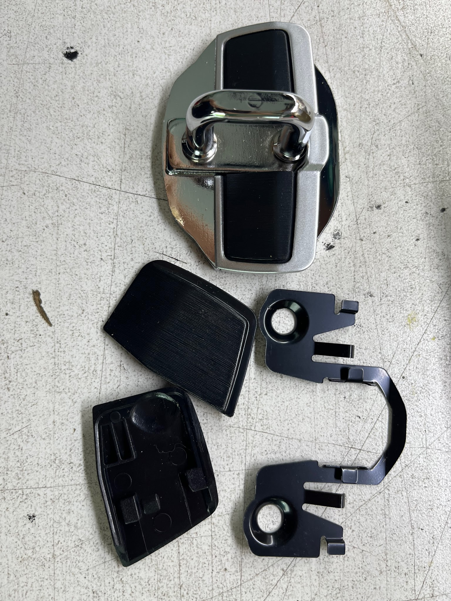
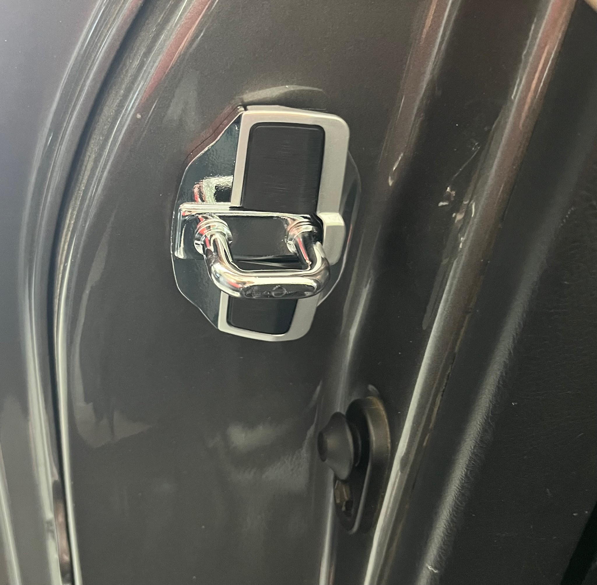
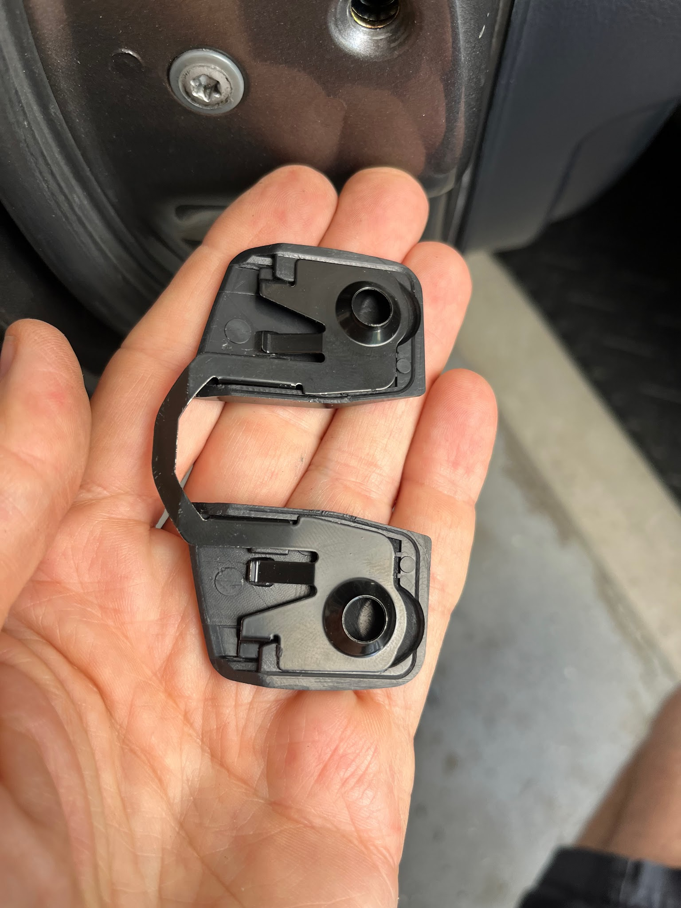
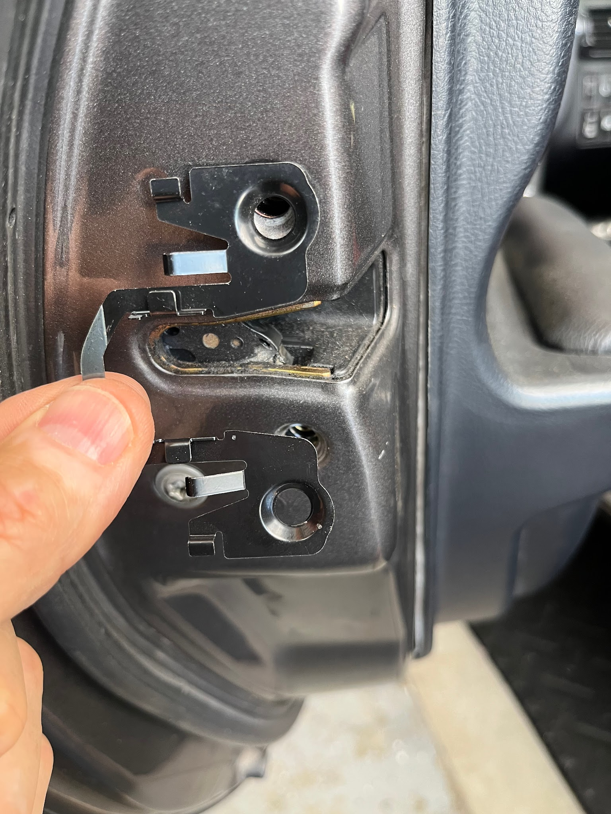

# Door Wedges

Compiled by [Cyclehead21@gmail.com](<mailto:Cyclehead21@gmail.com>)

## Contents

- [Background](#background)
- [Function](#function)
- [Installation](#installation)
- [Sources](#sources)
- [Photos](#photos)

## Background

“Door wedges” are designed to transfer load from the door opening, into the door. The intent is to reduce the body flexing at the door opening, by making the door act as part of the body structure.

## Function

In use, I feel more small road vibrations in the steering wheel. I can’t detect any differences in body flexing but I don’t drive track or autocross. They do eliminate rattles at the door striker.

Don’t expect the doors to feel any different when closing. That’s not how they work. These have a pair of spring-loaded wedges on the door striker [VIDEO](<https://youtube.com/shorts/bRQzuSq1unA?feature=share>), and another pair of fixed plastic wedges on the door. The two wedges….”wedge” together under spring pressure to fill the gap between door and body structure.

### Example

Before wedges - the door latch rattles (I discovered it would quit when I opened the door). [VIDEO](<https://youtube.com/shorts/DIEJHhXenWM?feature=share>)

After wedges - noise is gone! [VIDEO](<https://youtube.com/shorts/c7uXbVcdwAY?feature=share>)

(Wife says noise is still there, but quieter. But I’m half deaf, so I call it fixed!)

## Installation

The biggest complaint is that the plastic wedge bits on the door can fall off (when you open the door) and get lost. They are retained by the thin steel bracket on the door. I made slight adjustments to the steel brackets with some pliers to make sure the plastic bits are secure. I had trouble with one falling off, and simply put a glob of silicone sealer under the wedge to secure it more permanently.

## Sources

I’ve only bought cheap Chinese knockoffs of the original Toyota parts. The cheap ones I bought have been working fine for 5 years now.

$22 from Aliexpress: “TRD Door Stabilizer Door Lock Protector Latches Stopper Covers for Toyota Land Cruiser Alphard Vellfire” [LINK](<https://www.aliexpress.us/item/3256803863792006.html?spm=a2g0o.order_detail.order_detail_item.3.6952f19cDelHGS&gatewayAdapt=glo2usa>). Yes, they fit the MR2 Spyder just fine.

$140 from Amazon: “TRD Door Stabilizer (Common Type) 2 Pieces MS304-00001 (MS304-00001)“ [LINK](<https://www.amazon.com/TRD-Stabilizer-Common-Pieces-MS304-00001/dp/B00DSLSJS8?source=ps-sl-shoppingads-lpcontext&ref_=fplfs&psc=1&smid=A1WGX569TM9TND&gQT=2>)

$223 from Ebay (shipped from Japan) “Toyota MR2 MR-S Roadster Spyder ZZW30 TRD Door Stabilizer TRD Genuine OEM Parts” [LINK](<https://www.ebay.com/itm/181352629492?chn=ps&mkevt=1&mkcid=28&google_free_listing_action=view_item&srsltid=AfmBOorin_pdXDl4iY1zNEZFKaDlvRHY9RV8QhaIzuIdM9xX6KyZbr3Zf4o&com_cvv=8fb3d522dc163aeadb66e08cd7450cbbdddc64c6cf2e8891f6d48747c6d56d2c>)

$200 amayama.com in Japan “Genuine Toyota MS304-00001”.

<https://www.amayama.com/en/part/toyota/ms30400001>

## Photos

