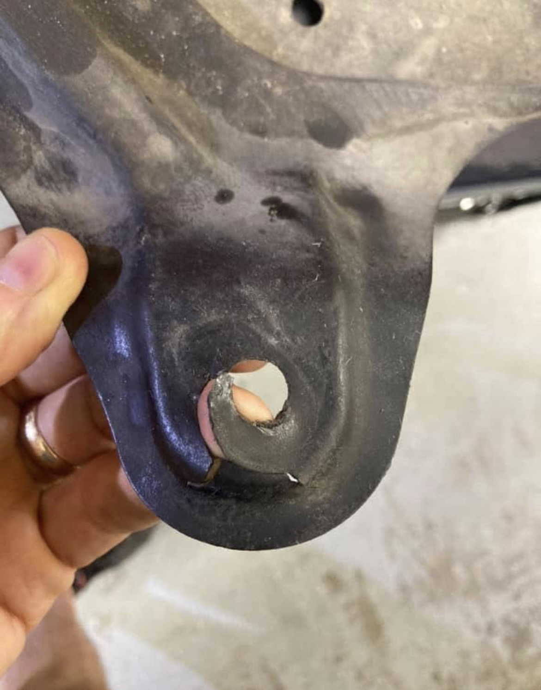
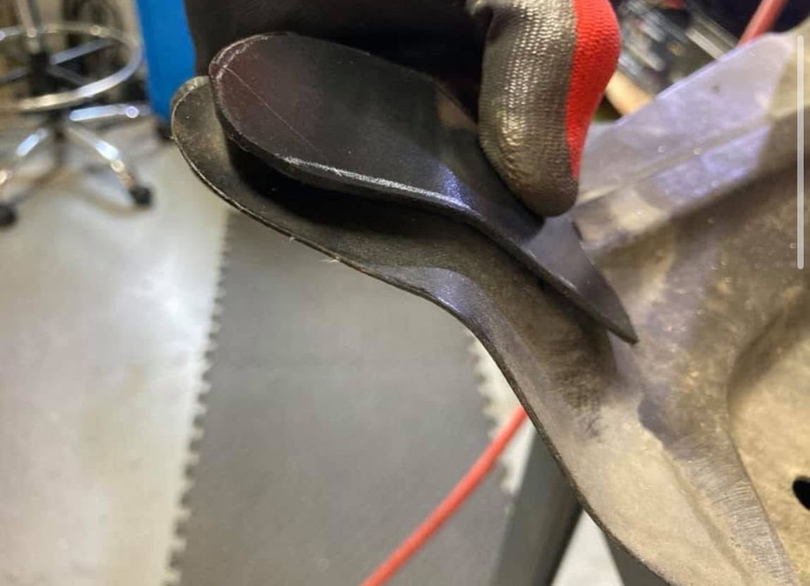
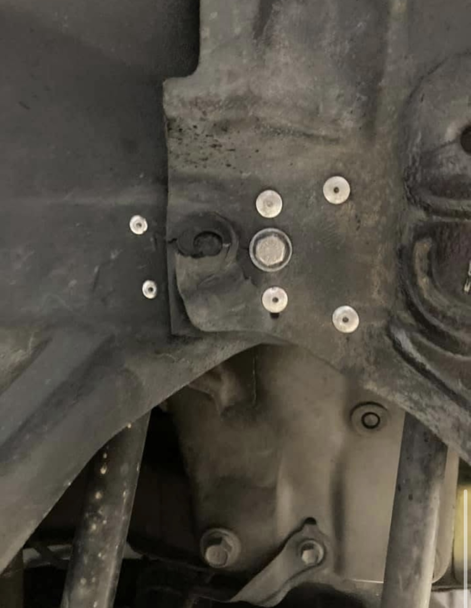
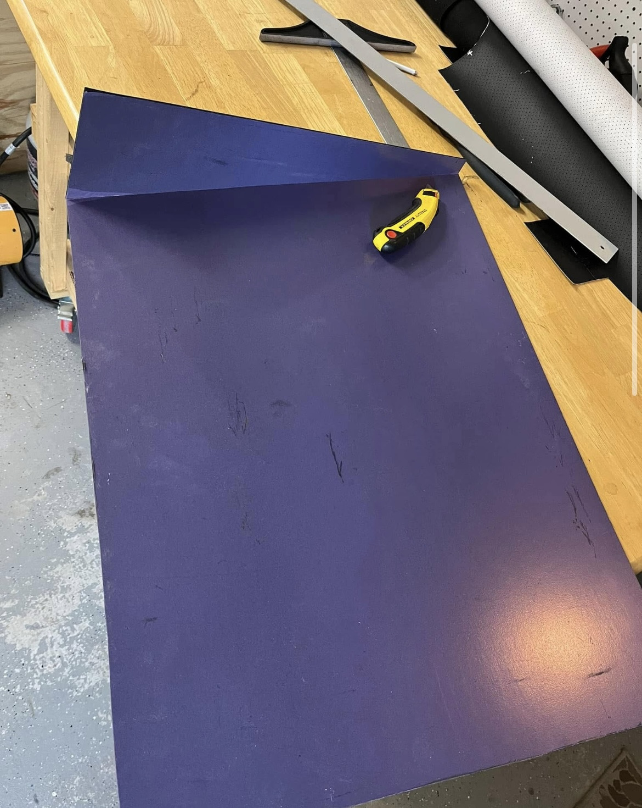
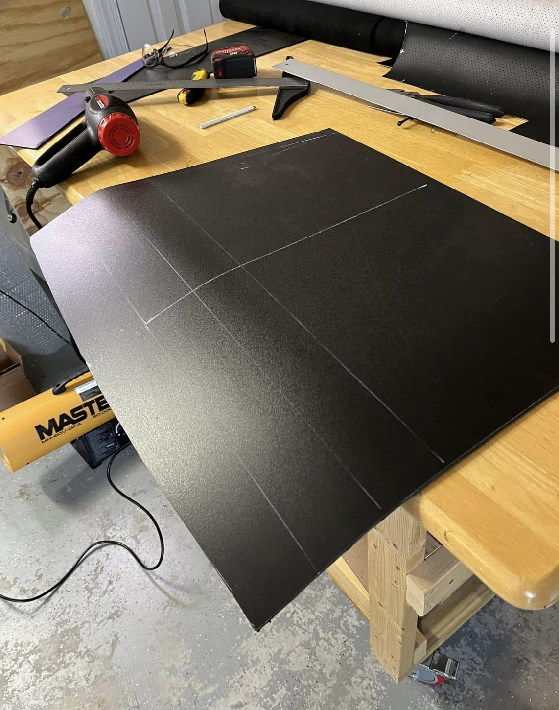
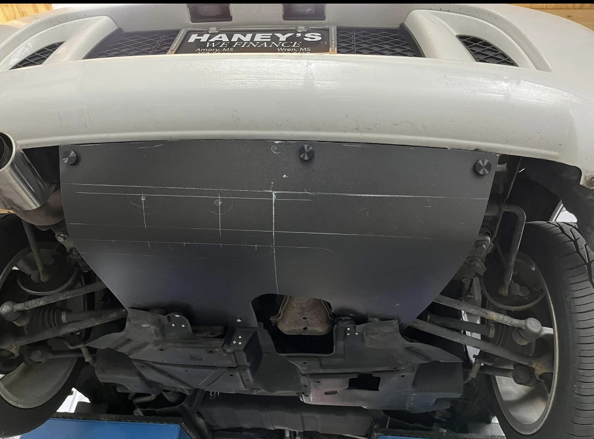
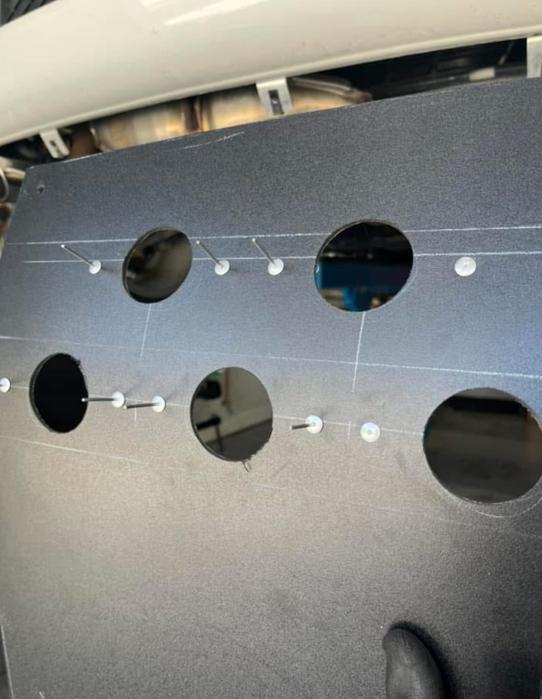
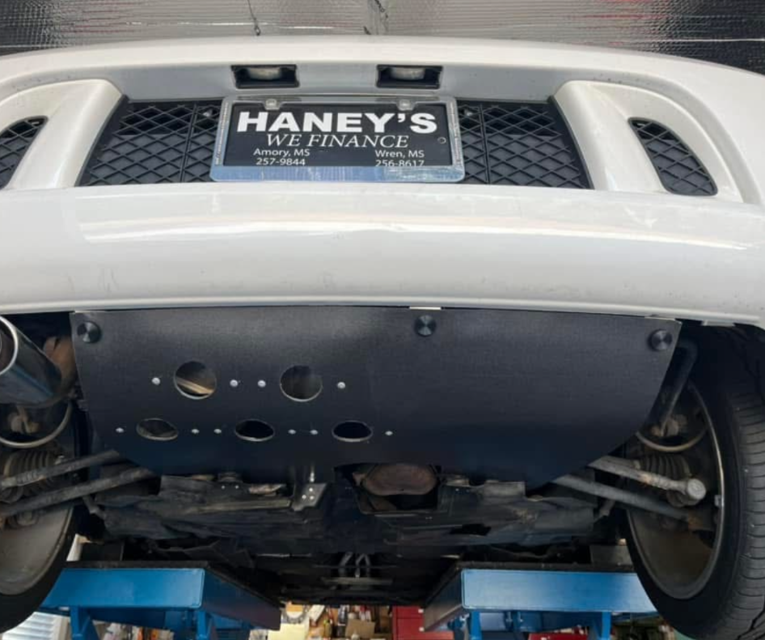

# Engine diaper covers

I’m not sure why some folks purposely remove the lower covers. They were designed for a purpose. The rear bumper cover can catch some air at high speed if the diapers are missing.

And I’m certain that Ferrari owners at the shop would be pretty upset if we removed their underbody panels and threw them away for easier access to the oil filter, or “just because”.

I repair the attach points on the Spyder diapers using scraps of aluminum sheet and plastic with some 1/8 inch rivets to preclude them coming loose on the highway.

I use thin aluminum sheet, and ⅛ inch thick PVC sheet to make the repair parts.

On one rescue Spyder I made a replacement diaper from scratch (rear diaper only) using some 1/4 inch thick “expanded PVC” sheet.

## Repairs

## Homemade diaper

