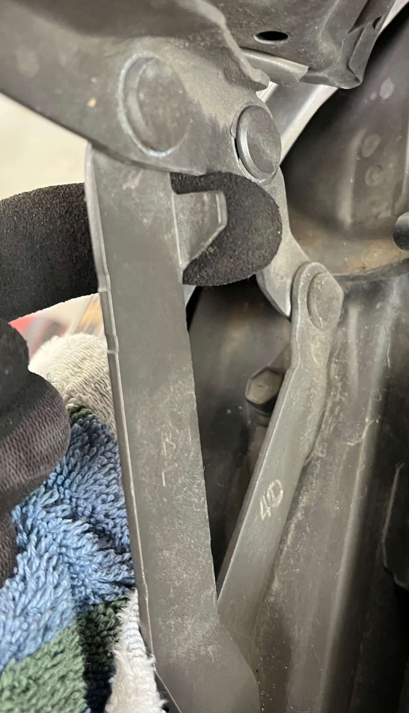
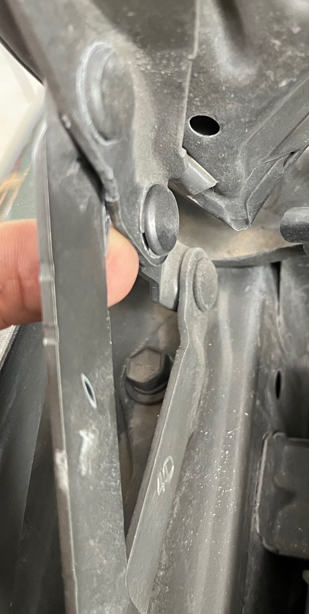
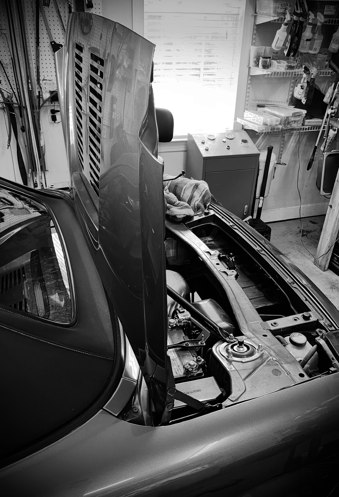

# Engine lid mod

Composed by Cyclehead21@gmail.com

Feel free to copy and share, just give me a little credit!

This modification allows the engine lid to open fully vertically. After the mod, you don’t need to use the prop rod, because the lid will stay up (unless a gust of wind slams it shut). Alternatively, you can add a gas strut to hold it open.

Many high end cars have a movable latch that can be flipped to allow the same thing. The spyder equivalent is a fixed metal tab on each hinge.

Cut off the tab shown. I used a 20k rpm cutoff wheel. Be very careful so you don’t cut anything nearby. I draped a cloth over the fender so the metal spray wouldn’t hurt the paint. Touch up the bare metal with some paint.

Be aware that the loads on the hinge are much greater while the engine lid is in the vertical position. If something were to push the lid even further open, it could easily bend and damage the hinge links or the fender where the hinges attach.

## Before mod

## After cutting off the tab

## Lid opens vertically!

This 17” strut is used on pickup truck bed-cap doors. It will work with optional brackets (buy or fabricate) and 10mm ball studs.

Vepagoo C16-06874 17 inch... <https://www.amazon.com/dp/B088K3W2JB?ref=ppx_pop_mob_ap_share>

Video summary:

<https://youtube.com/shorts/W68Op_0VwRA?si=RDvrD-n57FGzf8Px>

[Back to chapter list](../README.md)
