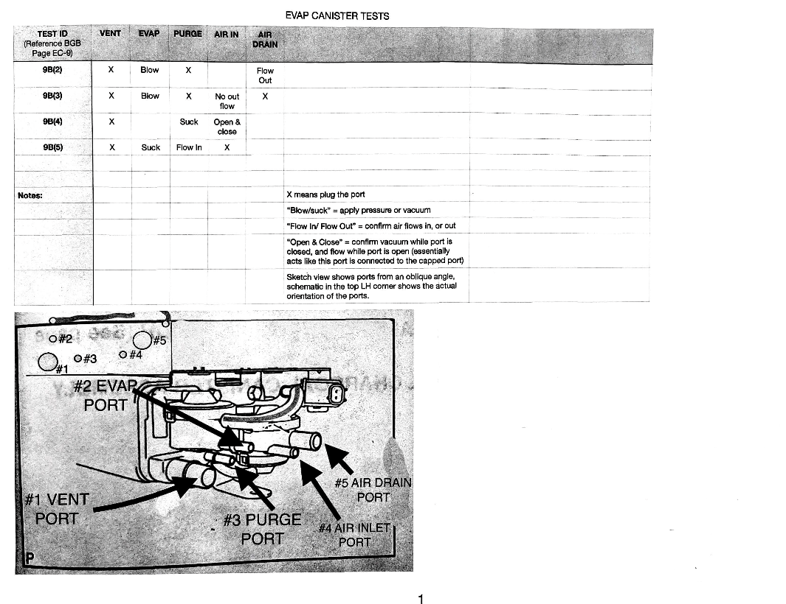
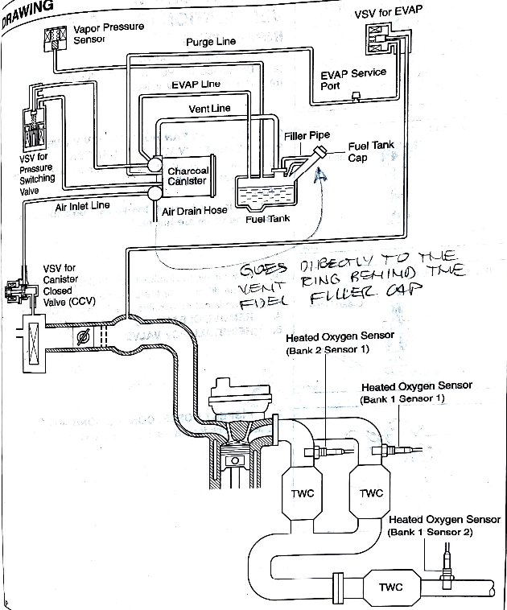
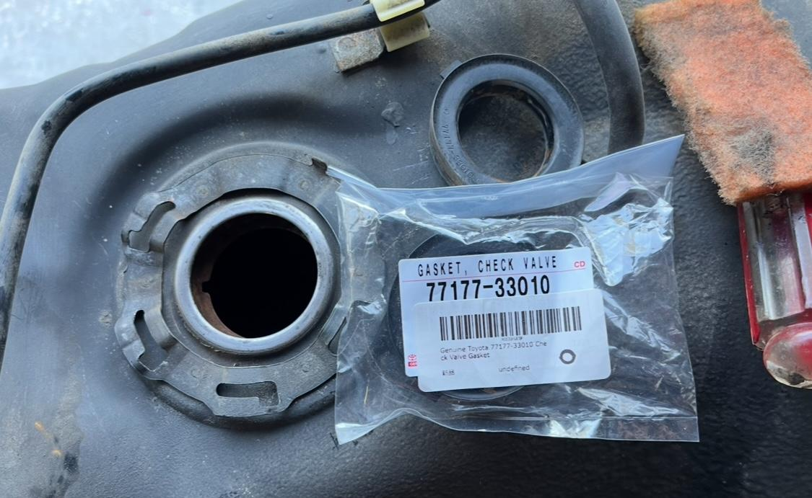
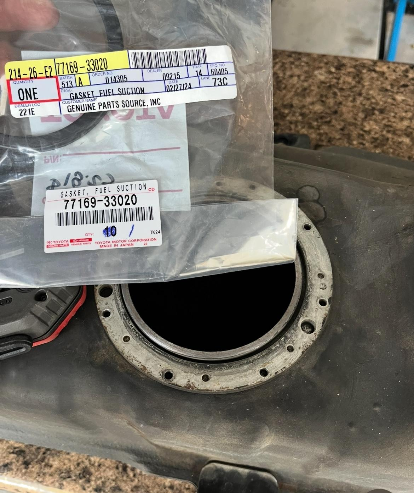
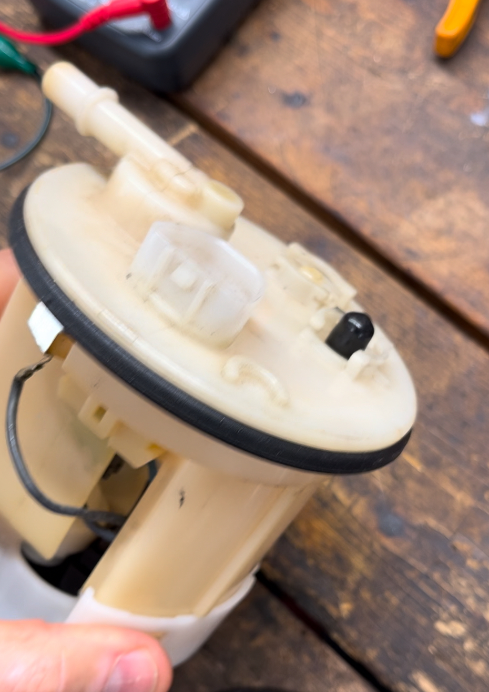
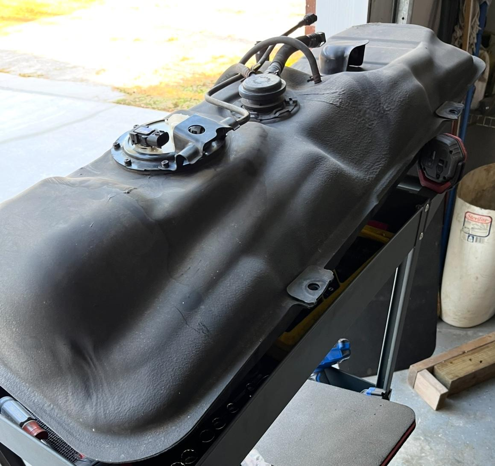

# Evap System troubleshooting notes

Written by cyclehead21@gmail.com

Feel free to copy or share.

Let me know if you see any errors.

> **Initial conversion 0.1** — Cursory review only; detailed technical review pending.

The evap system has three Vacuum Selector Valves (VSV).

All run on 12V

Two are normally open, and one is normally closed

One at the air filter box

One hangs on the side of the air intake tube in a rubber hanger.

One is bolted to the charcoal canister.

Apply 12v to the pins and see if the valve opens/closes as you blow air through it (lung pressure). Polarity doesn’t matter, it’s just an electromagnetic coil.

VSV function: The valve at the airfilter box is the CCV (canister closed valve) or vent valve, it vents the canister to atmosphere as part of the leak check and opens to bring fresh air into the charcoal canister sometimes when the purge valve is open.

The VSV which connects to a vac line just after the Throttle Body is the evap valve or purge valve, it opens to allow engine vacuum to pull the tank pressure down for a leak check and opens to pull hydrocarbon vapour from the tank to burn in the engine.

The VSV on top of the tank is the pressure switching valve and it closes to isolate the tank from the canister as part of the leak-check; otherwise it's open all the time.

Functionally the purge valve is the only one you really need. But the CCV helps bring in fresh air to purge the canister more effectively. (Credit Funkycheese on Spyderchat)

Charcoal canister has two air control valves.

They have a rubber diaphragm and spring. When air pressure below the diaphragm is sufficient to overcome the spring, it lifts the diaphragm off of a plastic tube (that’s normally blocked by the rubber diaphragm) and allows air flow.

One air valve is a single diaphragm valve, and the other a dual diaphragm valve.

Two of my charcoal canisters failed one specific cap/blow air test, on the single diaphragm valve. Both were due to the rubber diaphragm sticking to the tube, and wouldn’t lift under lung pressure. So I blew the chamber using an air hose and they popped loose. Thereafter they opened properly with lung pressure only. Video: <https://www.youtube.com/playlist?list=PLmyK-d4KYeZ7okYyVmN5n0d_xmoGfF-XD>

I haven’t cut open a dual valve yet. But none of them have failed a test for me either.

There are two rubber seals on top of the gas tank. One large rubber ring at the fuel pump case, and another fat rubber seal at the fuel tank vent valve. The vent valve and seal are only accessible by dropping the fuel tank. I think these two seals are the second most common source of evap problems ( gas filler cap leaks is the most common). Slow leaks from the evap system seem to almost always be around the rubber seals. Either the seals are old and cracked, or the fuel tank has rusted so much that the rubber seals can’t hold pressure any longer.

Charcoal canister (mounted behind the driver’s seat) has two plastic tubes connected to it. One large and one small. The small one seems to release easily with finger pressure on the pinch-tabs. The large one is troublesome - and never releases when you “pinch” it. I had to pry the latches open using a small screwdriver.

Fuel filler cap is probably the most common leak point. Buy a new cap and seal. Note, I bought a cheap aftermarket cap and the attaching lanyard was too short, and too small diameter push rivet. Very frustrating when you want to put gas into the car.

The evap system self-test seems to run when it good-and-well wants to, commanded by the ECU. Some guys say it takes 100 miles of varying trip lengths before it will run. They also say it likes to run when the tank is ¾ empty. Who knows. Techstream “live test” functions stink. They will only activate the VSV for you. None of the test functions will cycle the vacuum test that the car performs by itself - when it’s good-and-well ready.

## Parts:

Fuel pump large seal 77169-33020

Fuel tank vent valve 77390-20070

[MR2 Spyder - Fuel tank vent valve](https://youtu.be/KHvlrv-P4Wg?si=v80Rlw7W7x0rPYO3)

Vent valve seal 77177-33010

This sketch shows which ports to blow/suck during canister testing.

See the “key” in the top left corner of the sketch.

Pic below: The shiny metal sealing surface at the vent valve will get rusty and create a leak path under the rubber seal. This one has been scrubbed and sanded in preparation for the new seal. This seal cannot be reached with the fuel tank installed. I saw one guy took a cutting wheel and cut an access door to reach it. Not sure that’s wise so close to the fuel tank.

The fuel pump gasket sealing surface (below) will get rusty and create a leak path under the rubber fuel pump seal.

This rubber seal is usually squished and brittle when it’s old and leaking.

Here you can see the multiple tubes that must be disconnected from the evap canister. The large fuel filler hose on the back of the tank must be disconnected (not visible in this picture)

[Back to chapter list](../README.md)
