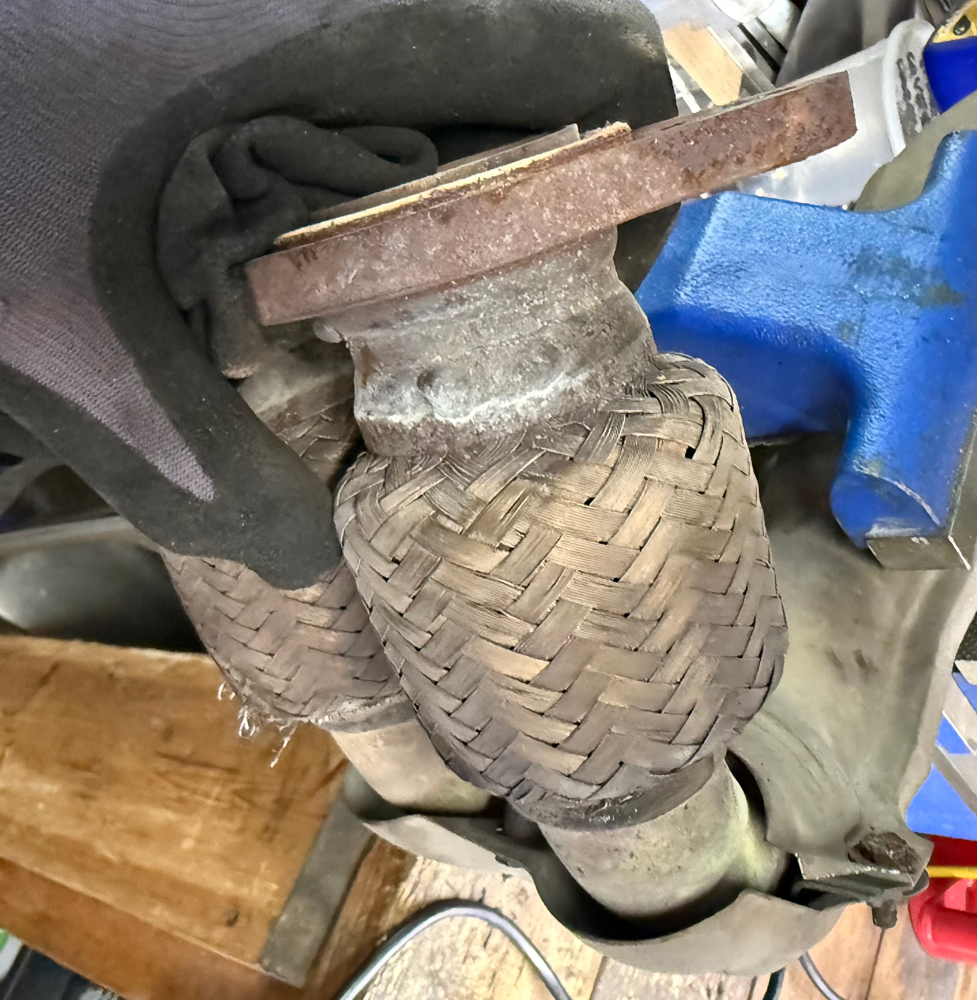
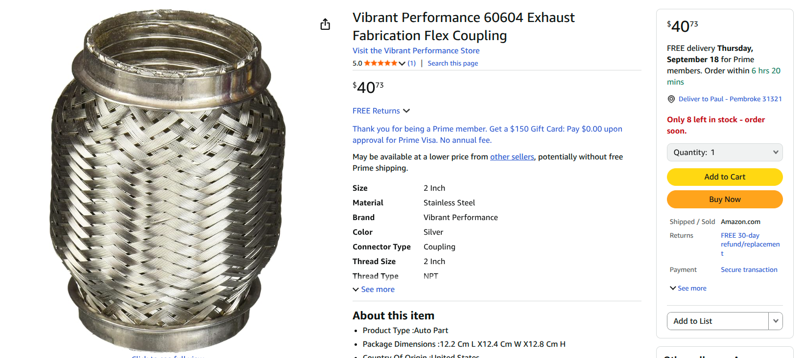
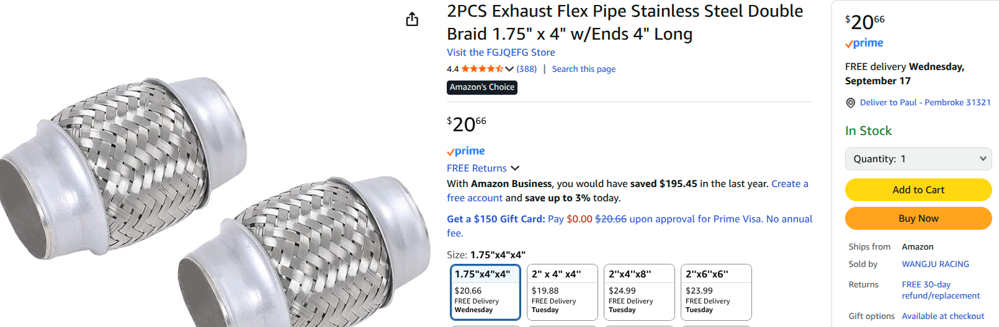
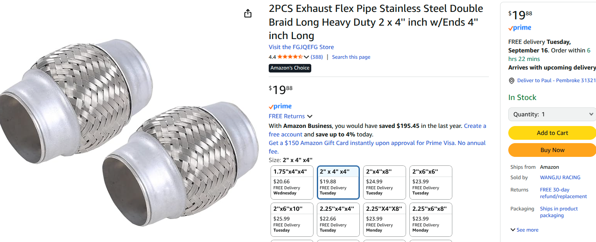
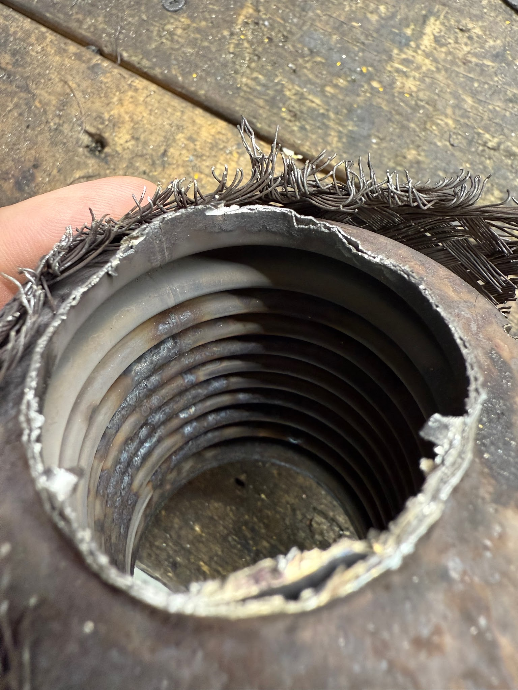
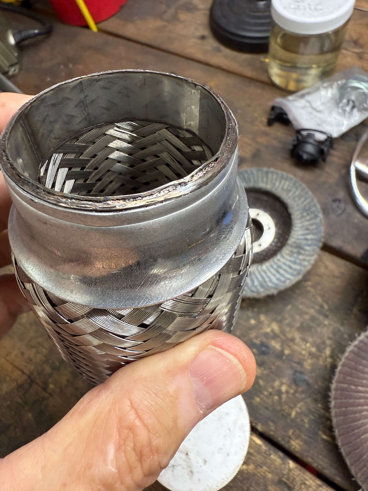
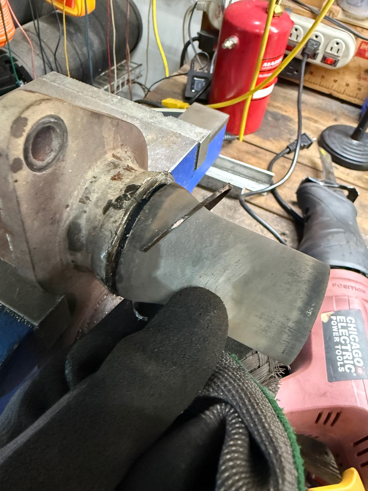
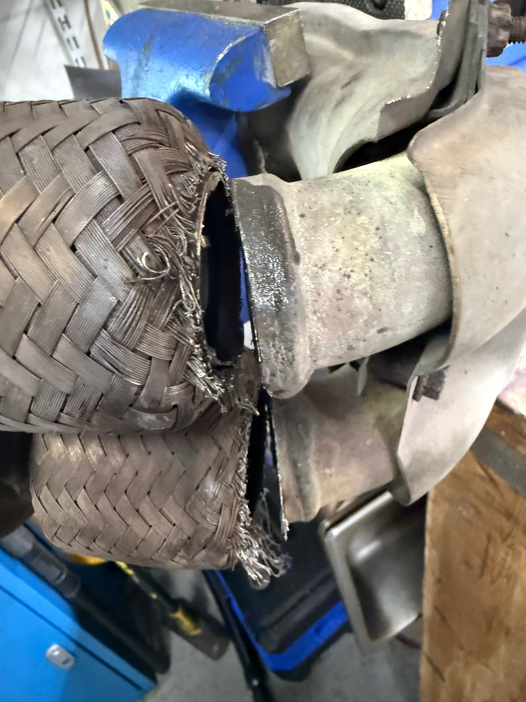
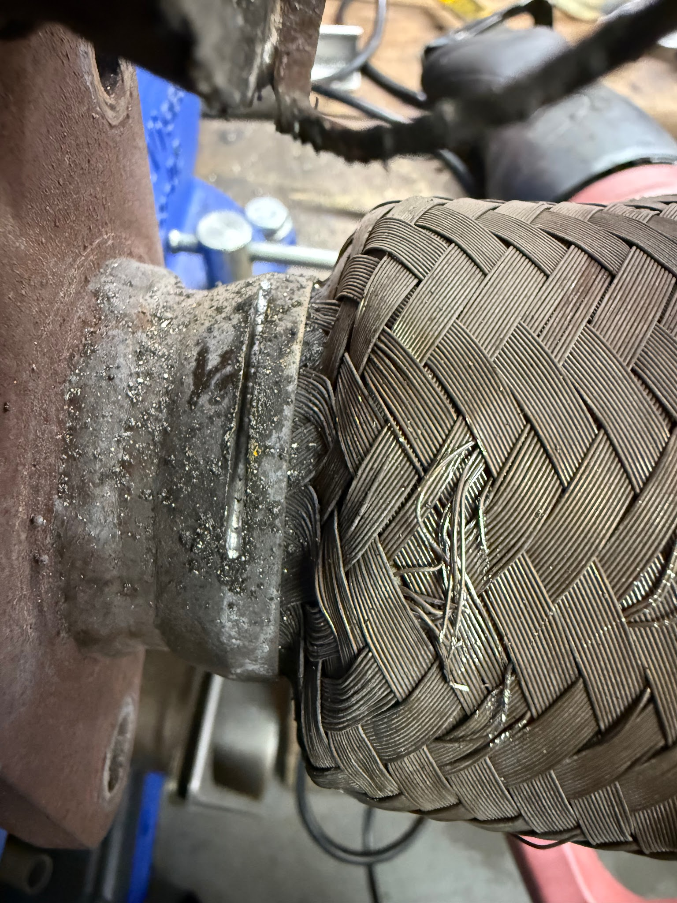

# Exhaust Flex Joints

Written by Cyclehead21@Gmail.com

Feel free to share, copy, and duplicate

Just give me a little credit

Created Sept 2025

> **Initial conversion 0.1** — Cursory review only; detailed technical review pending.

## Parts:

Good quality “Vibrant” flex pipe:

Chinese (Amazon) flex pipe options:

### Toyota parts:

90080-17187 Lock Nut - for three amigos, supersedes 90179-10070. (3 each)

90116-10146 Stud - Three Amigo Studs (3 each)

90080-43036 Exhaust Gasket - flat donut - supersedes 90917-06065 (2 each)

## Discussion:

The Spyder midpipe has two “flex joints”. They isolate movement of the engine, and help prevent cracking in the exhaust system.

The factory flex joints are made with corrugated stainless steel inner pipe, and covered with stainless steel woven mesh. Over time, the corrugated inner piece will crack and start leaking.

The original flex sections are 1.75 inch ID. However, cutting and grinding through all the old welds is pretty time consuming. I think it’s easier to buy 2.0 inch ID flex pipe sections to use for repair. The 2.0 ID flex pipes will fit over the outside of the existing welds with minimal grinding.

Amazon flex pipe sections are made with layers of woven stainless steel mesh ( no corrugated inner piece of pipe). I assume this is a cheaper way to manufacture them.

I believe that “Vibrant” brand flex pipe sections are made the same as the original Toyota parts.

## Repair:

Unscrew the lower oxygen sensor - in the driver’s side rear fender

Push the rubber hanger off the midpipe hanger stud. Silicone spray, and giant channel lock pliers make this easier.

Remove two 14mm spring loaded bolts connecting the midpipe to the muffler

Remove three 14mm nuts from the exhaust manifold plate (three amigos)

Watch for the two donut gaskets in the exhaust manifold plate. If they’re not all broken and missing pieces, they can be reused.

Don’t drop the midpipe - it has the main catalytic converter inside, and the catalyst matrix is fairly brittle ceramic. It can get cracked and ruined if you drop the midpipe.

Cut off the damaged flex pipe sections. I cut below the flex sections fairly close to the mesh. You want to leave yourself plenty of pipe.

Be careful cutting the top of the flex sections adjacent to the exhaust manifold mounting plate. There is a separate reducer pipe inside each flex section. The reducer is welded at the top, adjacent to the plate. You can choose to cut only the flex pipe, and leave the reducer intact - or you can cut through both the flex and reducer at the same time.

Video shows inner reducer:

<https://youtube.com/shorts/Syc8OeC7-0M?si=EvunJCexAoFqKGxA>

I cut them both - then welded the reducers BACK in place. (extra work)

The reducer section is peculiar - it is welded to the top, but loose (not welded) at the bottom with a small gap. The only explanation I’ve heard is that the reducer somehow protects the flex pipe. Maybe limits sonic fatigue? You can choose to cut it off and throw it away - or work a little harder and leave it installed (or weld it back in place like I did).

Video shows flex pipe fitting over the welded reducer

<https://youtube.com/shorts/HXAfRMG1Ozg?si=BdoU_kTOJmzZuzoB>

First I welded the new flex sections to the flat plate (on the bench). I eyeballed to get the flex pipes parallel to the plate, and centered on the reducers. Then I temporarily reinstalled everything in the car to make sure I had the flex sections aligned with the midpipe. The 2.0 ID flex pipes allow you to adjust the angles with the midpipe.

I tacked the flex sections to the midpipe, while everything was in the car. Then dropped the whole midpipe and finished welding the lower joints on the bench.

I re-used the three “amigo” nuts, even though you’re not supposed to. I also reused both flat-donut gaskets on the flat plate

Original Toyota flex pipe sections have “corrugated steel” inside, and mesh outside:

Cheap Chinese (Amazon) flex pipes have steel mesh inside and outside

The inner reducer pipe is welded on one end only. The other end is “open” inside the flex pipe.

Here’s where I cut the old flex pipe free from the mid pipe

Here’s where I cut the flex pipes away from the manifold plate

[Back to chapter list](../README.md)
