# Floor Mats

[Back to chapter index](../README.md)

Compiled by [Cyclehead21@gmail.com](<mailto:Cyclehead21@gmail.com>)

I borrowed some photos from spyderchat - credit goes to the authors of the photos!

[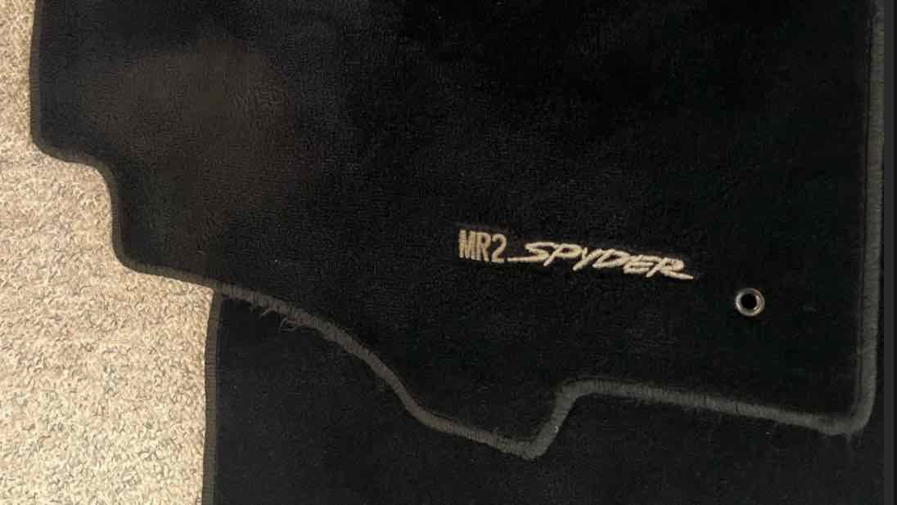](../images/floor-mats/01-factory-floor-mat.png)

## Contents:

- [Factory floor mats](#factory-floor-mats)

- [Aftermarket floor mats](#aftermarket-floor-mats)

- [Carpet details](#carpet-details)

- [Logos](#logos)

- [Floor Mat purchase options](#floor-mat-purchase-options)

## Factory Floor Mats:

Factory floor mats for the spyder have all but disappeared. A few owners have a pair saved in their basements. The factory floor mats were very thick, with a heavy rubber back that has sharp rubber nubs to grip the cabin carpeting. They also had two styles of embroidered logos. Early floor mats had the embroidery stitched directly to the carpet - in Red/White, Tan/white, Yellow/white, White/white and other colors (?)

[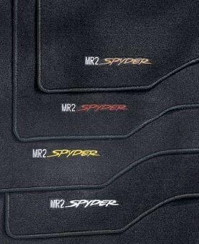](../images/floor-mats/02-factory-embroidered-logos.jpg)

Later floor mats had an ugly rectangular patch sewn/glued onto the surface of the carpet pile. The patch had the “MR2 Spyder” logo embroidered on it.

## Aftermarket Floor Mats:

Aftermarket floor mats are all over the map. Some are very thin and cheap looking. Others approach the same thickness as the factory floor mats, but none I have found are as thick or heavy as the factory floor mats. But I haven’t bought samples from all the possible aftermarket manufacturers.

## Carpet details:

Carpet generally has the pile either “cut” or “looped”. Factory toyota floor mats have cut pile.

Carpet edging is done via “serging” or “binding”. Serging looks like some heavy yarn has been looped over and over to create an edge. Binding looks like a strip of fabric or vinyl has been sewn to hide the rough carpet edges, and the stitching is visible.

[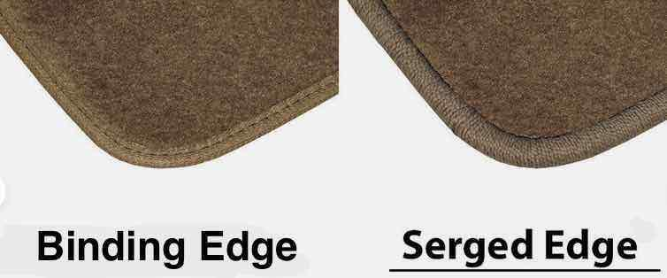](../images/floor-mats/03-binding-and-serging.jpg)

## Logos:

Very few aftermarket floor mats have the “MR2 Spyder” logo. The Toyota lawyers (like most manufacturers) are very aggressive. You cannot duplicate their logos without risking legal repercussions. The only exception I’ve seen so far is “MR2Heaven’s” floor mats (below) which I assume are manufactured outside USA/Japan where lawyers can’t reach.

## Floor Mat Purchase Options:

### [MR2Heaven](<https://mr2heaven.com/collections/mr2-zzw30-spyder-99-2007/products/mr2heaven-1999-2007-mr2-spyder-mr-s-roadster-reproduction-floor-mats>)

[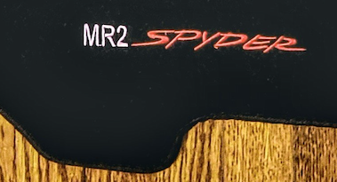](../images/floor-mats/04-mr2heaven-logo.png)

These mats have a beautiful embroidered logo that appears almost identical to the early factory embroidery. However - they are painfully thin. They are made with “cut pile”, with edge finished via binding (not serging like the factory mats). There are no grommets to accommodate the anti-slip hooks that keep the mats from crawling underneath your brake pedal. Most disappointing though is the thickness. They are very thin. I measured .190 inches total thickness. For comparison I measured the total thickness of an old Toyota factory spyder mat at .280 inches thick. So these mats are barely over half thickness! The carpet pile is very thin, and the backing is likewise thin and lightweight. They are shipped in a tiny box and rolled up like a magazine.

I’ve read that these are the same floor mats that Monkeywrenchracing is selling.

MR2 Heaven mat is .189 inches thick (left). Toyota factory floor mat is .282 inches thick (right).

<table>
<tr>
<td width="50%"><a href="../images/floor-mats/05-mr2heaven-thickness.jpg">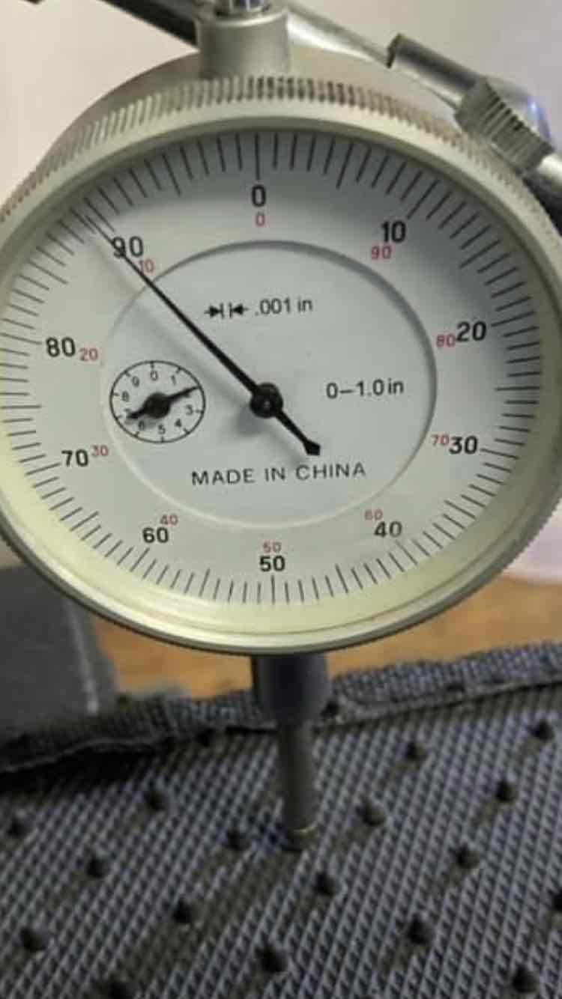</a></td>
<td width="50%"><a href="../images/floor-mats/06-factory-mat-thickness.jpg">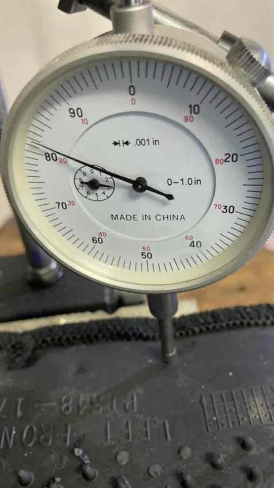</a></td>
</tr>
</table>

[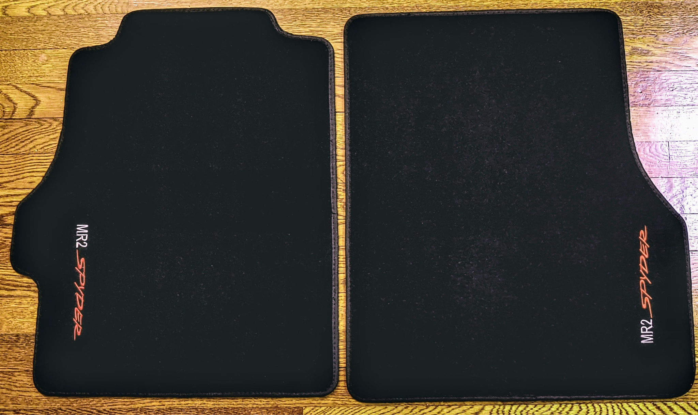](../images/floor-mats/07-mr2heaven-mat-pair.png)

### [Frog Factory](<https://shop.telarana.online/products/frog-factory-mr2-spyder-floor-mats-lhd-only>)

These mats are made with “serged” edges, same as the factory mats. That is very unusual for aftermarket floor mats. From photos - they also appear to use loop pile, instead of cut pile for the carpeting. It gives a different appearance that probably isn’t as “plush” cosmetically, but may be more durable. From a comment on facebook, Thomas Van appears to be the guy manufacturing these. Maybe contact him directly.

[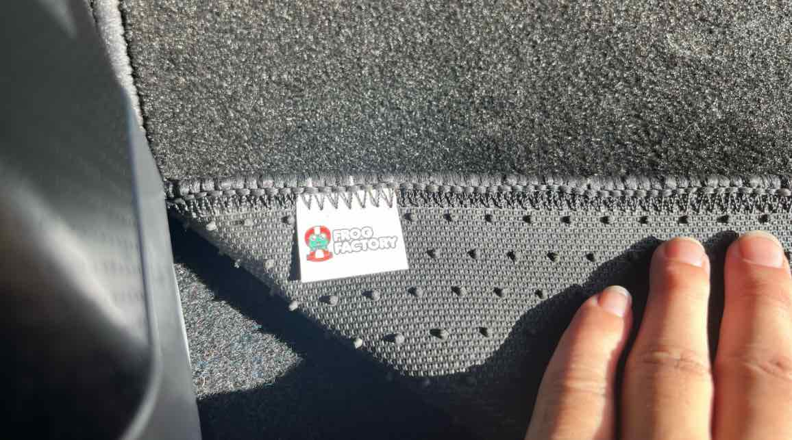](../images/floor-mats/08-frog-factory-edge-detail.png)

[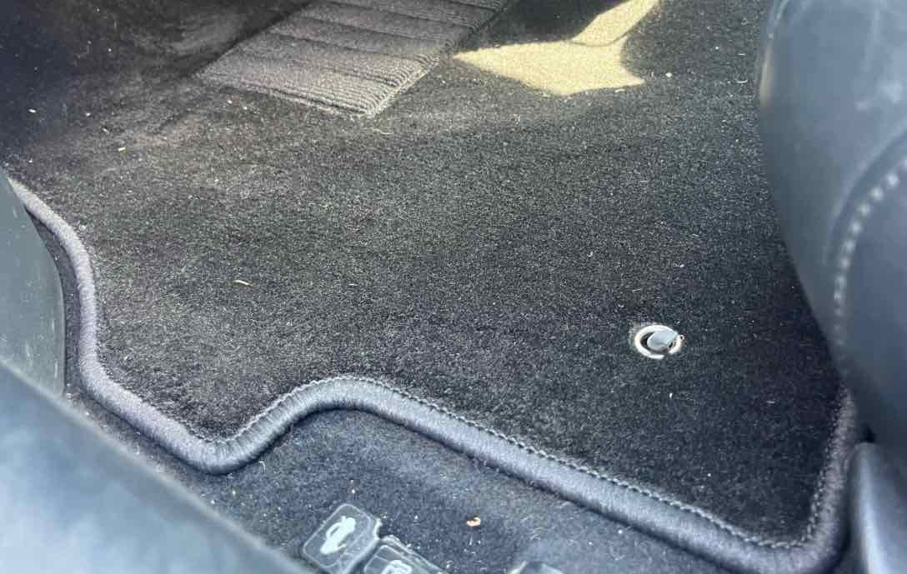](../images/floor-mats/09-frog-factory-installed.png)

### [FitMyCar](<https://www.fitmycar.com/toyota/mr2/convertible-1999-2007/lh1007-2-rt>)

I bought a set of MR2 Spyder floor mats from this company in Australia in July 2022. They advertised floor mats for the MR2 Spyder, then sent me floor mats for a Mk II MR2. (A completely different shape!). When I complained, they asked me to trace and fully dimension my factory floor mats, so they could copy them. Having taken drafting classes about 40 years ago, I did it. They manufactured and shipped me a set of floor mats to my dimensions, and they fit perfectly! Sadly, THEY STILL HAVE THE WRONG PHOTOS of floor mats in their ad for the MR2 Spyder. Before you send them any money, I would require them to send you a photo of the actual floor mats they intend to send you.

[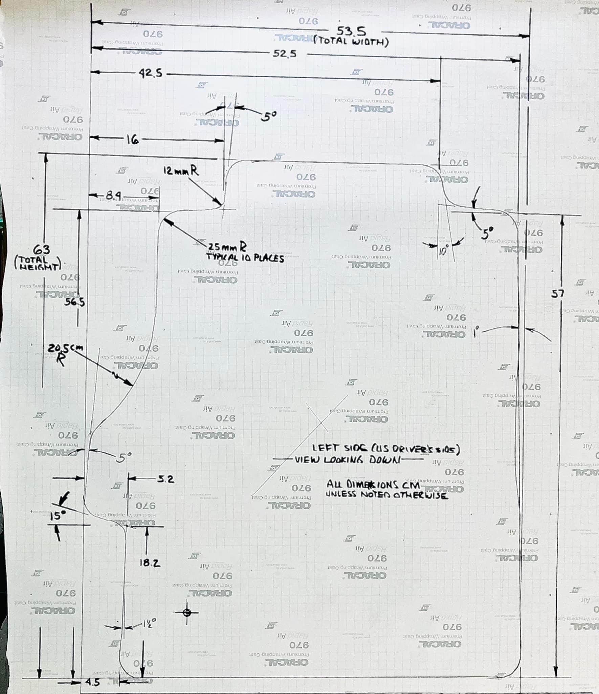](../images/floor-mats/10-fitmycar-dimensioned-drawing.jpg)

[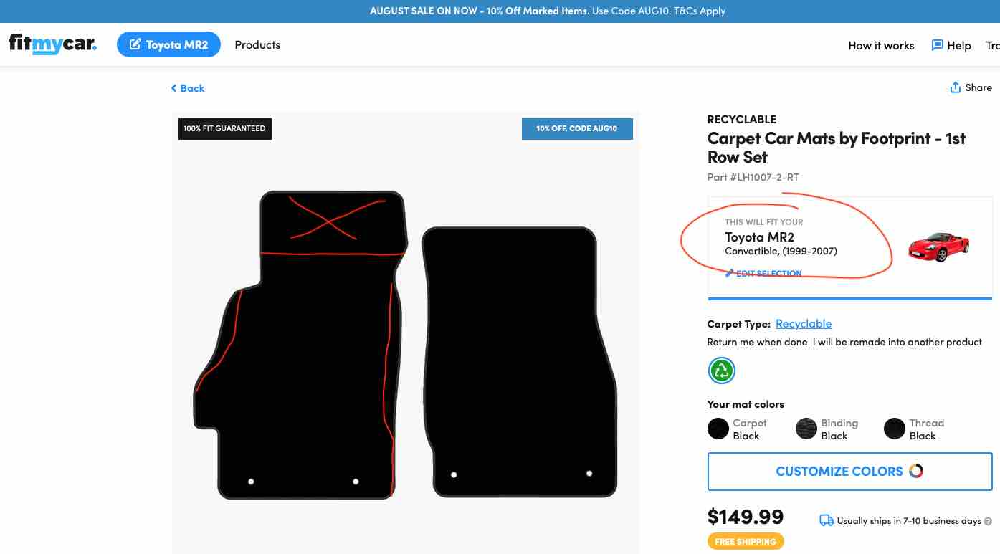](../images/floor-mats/11-fitmycar-source-listing.png)

### [Lloyd “Luxe”](<https://www.lloydmatsstore.com/luxe-floor-mats>)

I’ve read that these are very thick. They only offer binding (not serging).

MR2 Spyder logo is not available. Comments from “Secondo Logo” on Spyderchat: I bought mine through eBay but you can cross shop prices with Amazon or directly through the manufacturer site.

### [AutoMatStore](<https://www.ebay.com/itm/Custom-Fit-Carpet-Floor-Mats-For-2000-2005-Toyota-MR2-Spyder/273067379973?fits=Model:MR2+Spyder&hash=item3f94158d05:m:m4D8t0pTQvYqUhncbjawNEg&var=572317377790&mkevt=1&mkcid=1&mkrid=711-53200-19255-0&campid=5338778229&toolid=10001&customid=130832X1597637X5b32d53872597a1b461a48df4c122a81>)

These seem to be sold on ebay. They offer your choice of Binding or Serging for the carpet edges.

### Auto Custom Carpets (ACC)

Sold thru RockAuto.

Company website is Accmats.com.

These are nice thick carpets with a heavy rubber back that has nubs like the factory mats. Edges are nicely serged, also like factory mats. Cut pile carpet, with grommets installed. The “extra thick” option was $30 extra. Probably a wise option.

[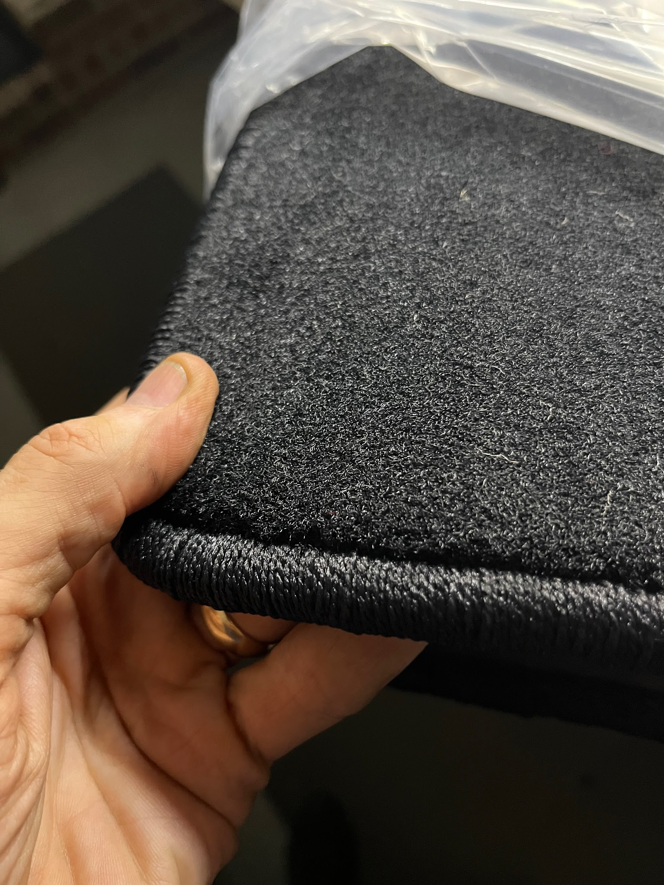](../images/floor-mats/12-acc-carpet-and-edge.jpg)

---

[Back to chapter index](../README.md)
