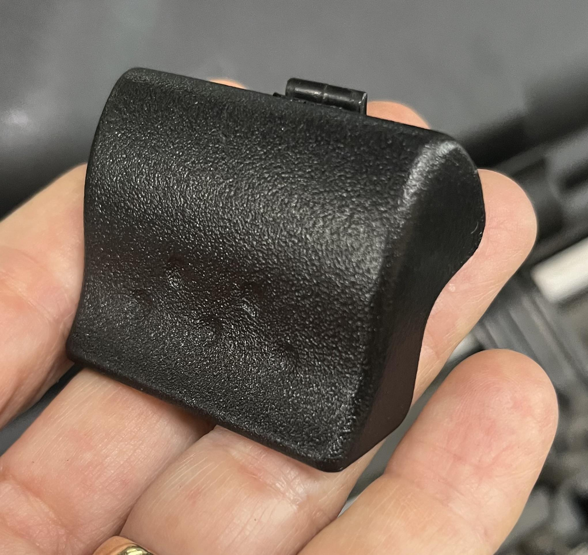
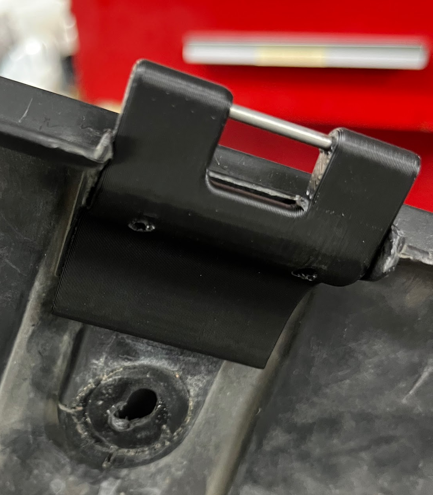
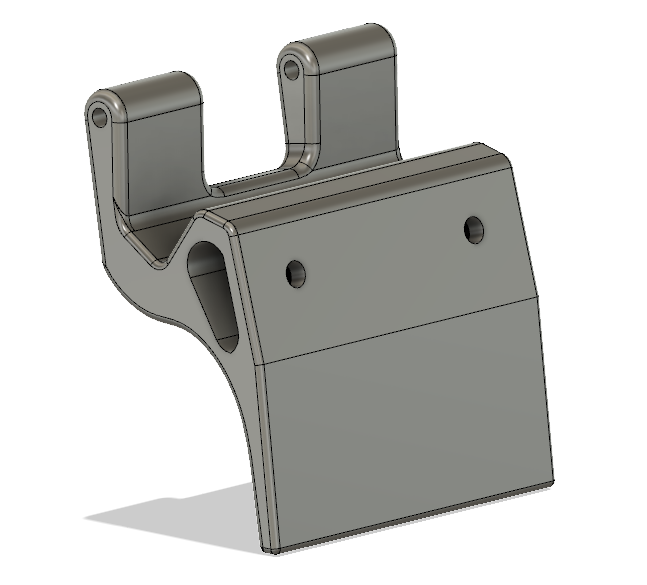
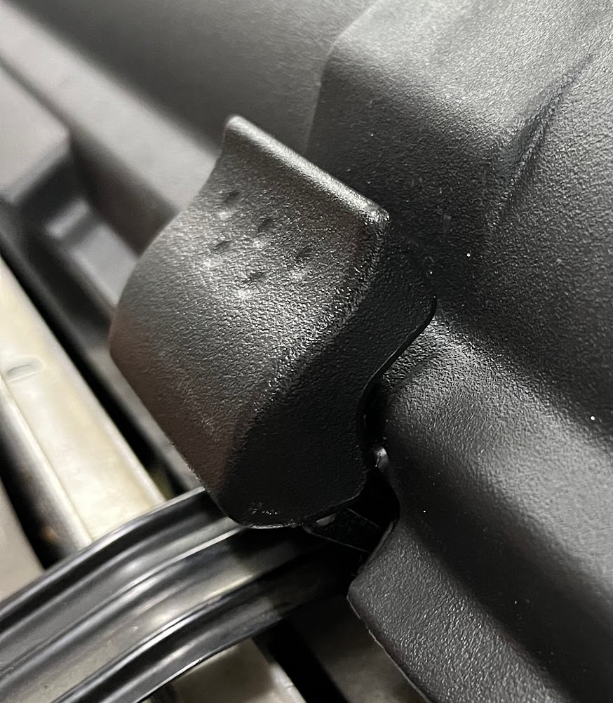
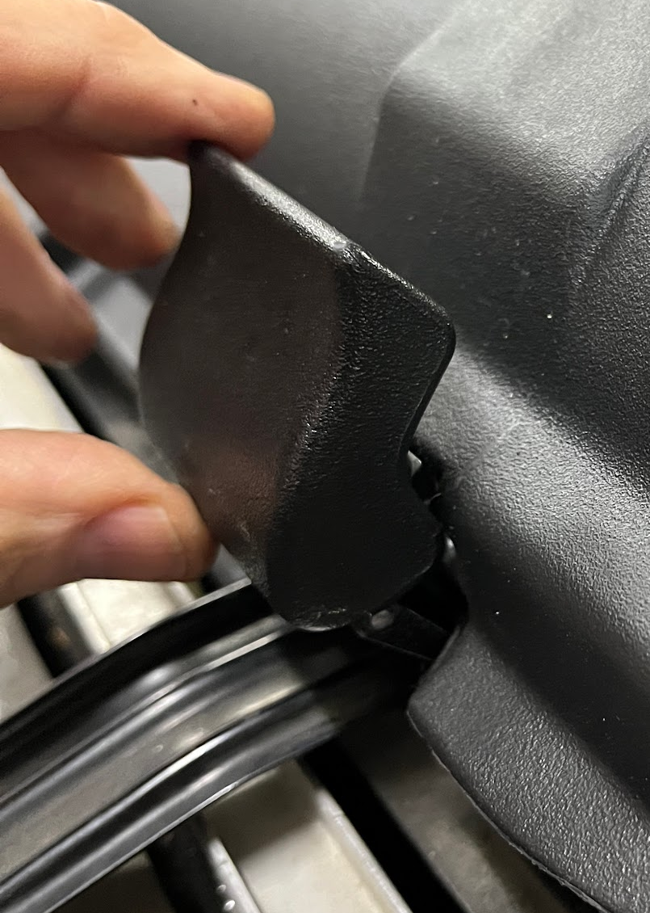
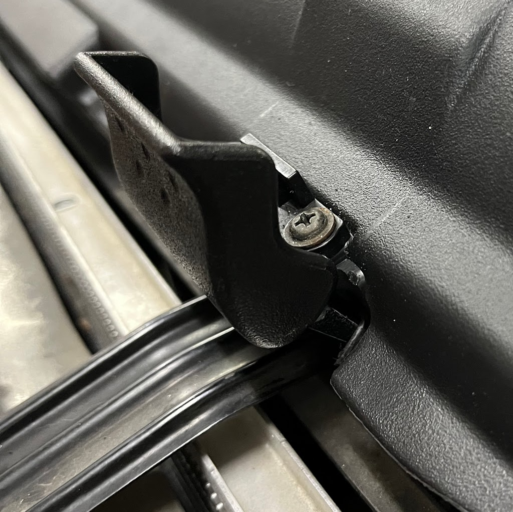

# Frunk Lid Latches

[← Back to chapter index](../README.md)

(Spare tire door latch)

Composed by [cyclehead21@gmail.com](<mailto:cyclehead21@gmail.com>)

Feel free to share

**Contents:**

- [Background](#background)
- [Function](#function)
- [Repair](#repair)
- [Photos](#photos)

Part Number: 64606-17031 About $25 each

## Background

These plastic latches are clever, over-designed latches for the front trunk storage box (spare tire bucket) lid. They are made from plastic and they are rather brittle. When they are not latched properly, they will hit the hood as it is closed and they will break.

## Function

The latches have two positions; one position for opening the lid, and another “service” position that allows access to the screws so the latch can be removed.

To open the storage lid, you should open the latch lever very slightly - maybe 15 degrees or so.

To remove the latch, you need to open the latch into its “service” position, where the latch lever is at roughly 90 degrees. This video shows how the two positions work.

[https://youtu.be/JF875jRHq_0?si=JekNmaBzQVqBmBm2](<https://youtu.be/JF875jRHq_0?si=JekNmaBzQVqBmBm2>)

## Repair

Repair video: [https://youtube.com/shorts/joyyB4U-WyU?si=MAt7XuDT9DC_rUhV](<https://youtube.com/shorts/joyyB4U-WyU?si=MAt7XuDT9DC_rUhV>)

If the latch has been severely abused, it’s possible that the striker bar can be broken off the plastic bucket. I designed a repair part to replace the broken striker bar. I printed mine with ASA filament to withstand the heat by the radiator.

It’s designed to install with two ⅛ diameter rivets (⅜ inch long). However rivets may not be needed at all since it gets trapped in position when you bolt the bucket down.

For the metal bar I used a piece of .090 diameter steel wire. The original wire is .140 inch diameter. Any gauge wire in that range should work fine.

[STL FILE LINK](<https://www.thingiverse.com/thing:6951926>)

## Photos

### Closed position

### Open position

### “Service” position

[← Back to chapter index](../README.md)
