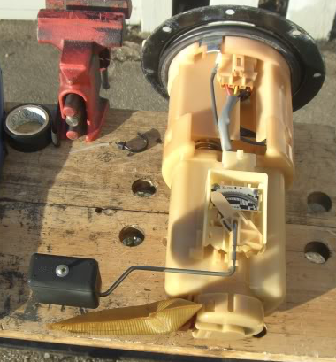
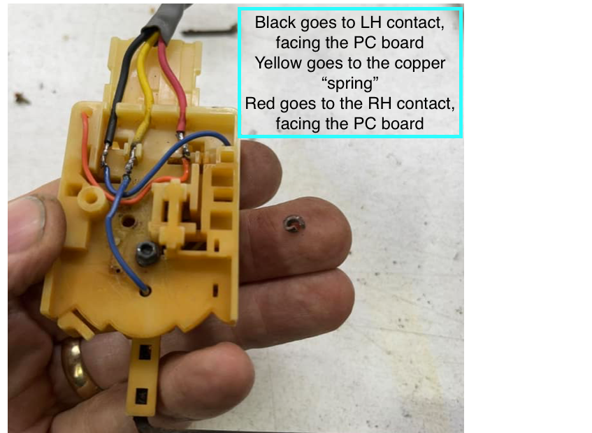
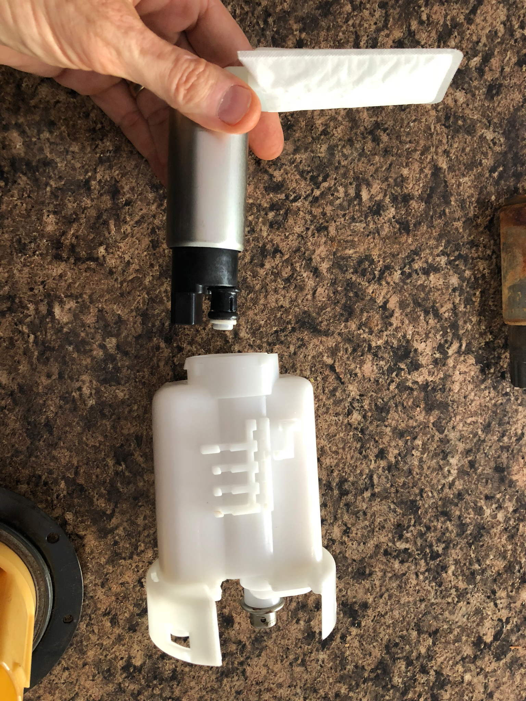
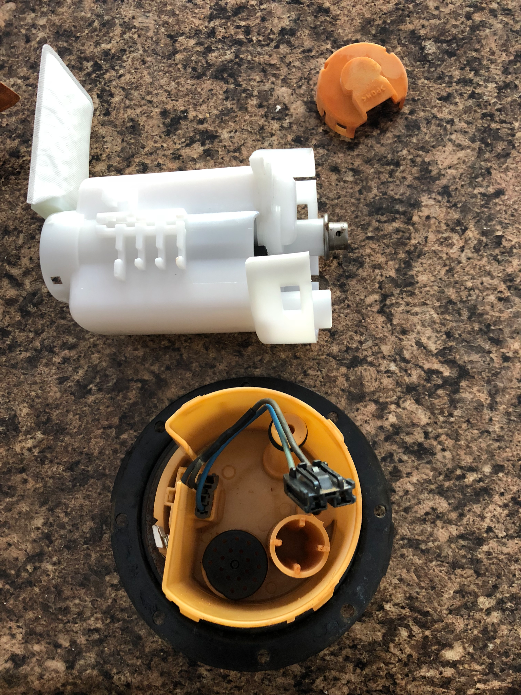
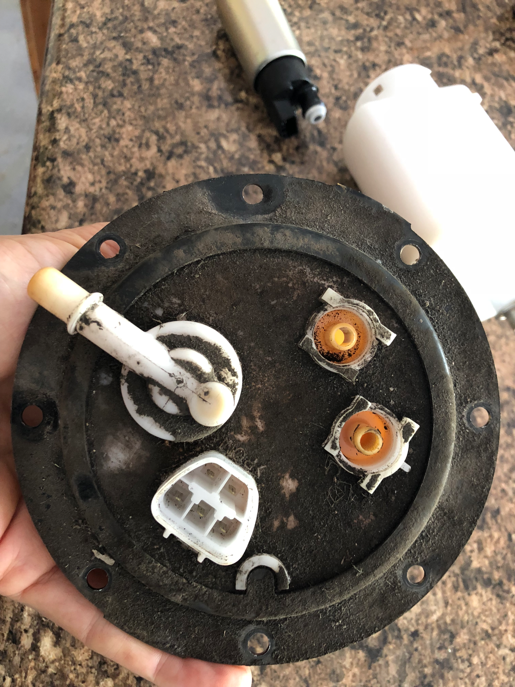
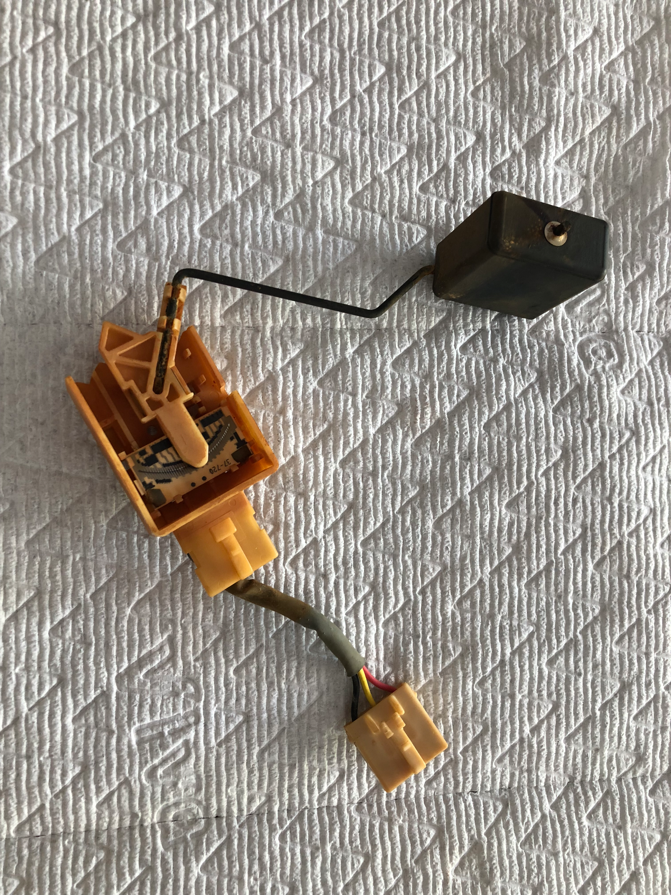
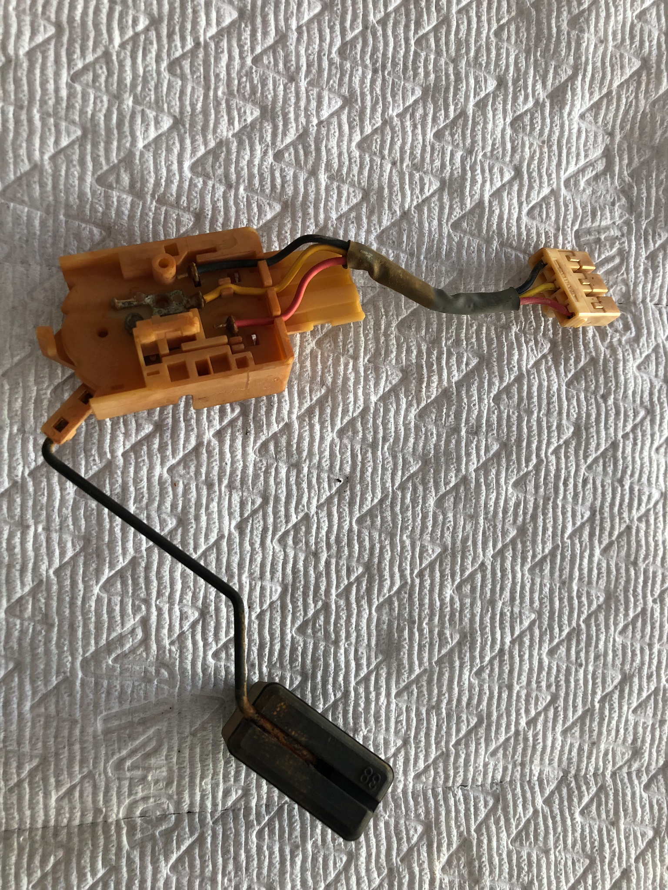
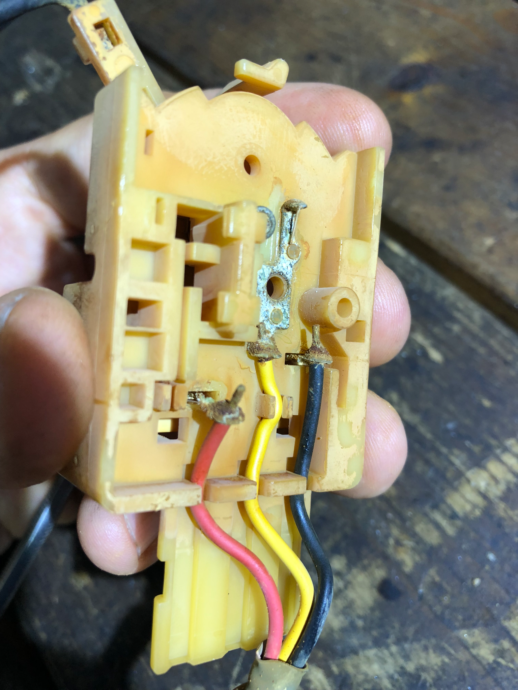
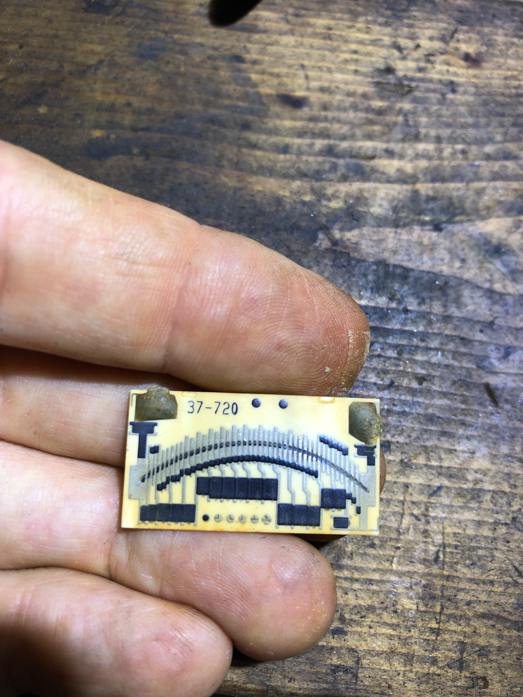

# Fuel Pump Removal Tips

[← Back to chapter index](../README.md)

By [cyclehead21@gmail.com](<mailto:cyclehead21@gmail.com>)

## Removal tips

8 mm socket to remove fuel pump ring

Pry the orange plastic “u” clips off carefully, don’t lose them! Tuck a cloth rag around the side before you pry them off.

Pinch the large fuel line ears and pull the entire piece off. It’s always a fight. Pinching the ears is supposed to make the locks disengage. Try slip joint pliers.

Press the lock tab on top of the fuel sender connector, and jiggle the connector off.

Note one 8 mm bolt hidden under the metal protective plate

Lift the pump assy and rotate it slightly to clear the filter sock and sender float.

Cover the big hole with a paint can lid, so you don’t drop tools into the fuel tank, and keep fumes trapped while you mess with the pump and filter.

The filter is full of gas and will continue to drip when you turn the assembly upside down

## Pump and filter service

If needed, the Fuel pump can be removed without removing the large fuel filter. Reach inside with a small screwdriver to free the connector. Then pop the plastic snap cover off the bottom and pull the pump out.

**ORDER A NEW O-RING FOR FUEL PUMP!** A swollen or pinched O-ring will only cause grief. The car won’t start, or it will be hard to start when O-ring doesn’t seal.

O-ring Part number 90301-09021

$5 at Toyota dealer

Probably wise to order a new fuel pump housing seal also, to prevent P0440 evap codes in the future. PN 77169-33020

Use three or four small screwdrivers to wedge into the plastic barbs and release the fuel filter canister. It’s nasty because the clips all must be pried open simultaneously. (Can you simply break the clips off? I need to look at a new filter!)

If you replace fuel filter, don’t forget to transfer over the fuel regulator to the new filter! It’s the short metal canister that is pushed into the fuel filter port on top.

## Fuel sender

Remove the fuel sender assy by releasing a small plastic finger on one side of the sender. Then push the sender box down about ⅛ inch to release it from fingers in the mounting slot.

Fuel sender connections inside the box will rot and rust away. You can solder new wires to restore operation.

## Video reference

Frank’s video [https://youtu.be/YjvT3BmCwNI?si=o149nQk-1JL1Nqp4](<https://youtu.be/YjvT3BmCwNI?si=o149nQk-1JL1Nqp4>)

Per Frank’s video:

You can use a cheap generic fuel pump from Amazon $40 if you like

Fuel sock push-nut part number 23219-23010 also available from Amazon $5

## Photos

[← Back to chapter index](../README.md)
