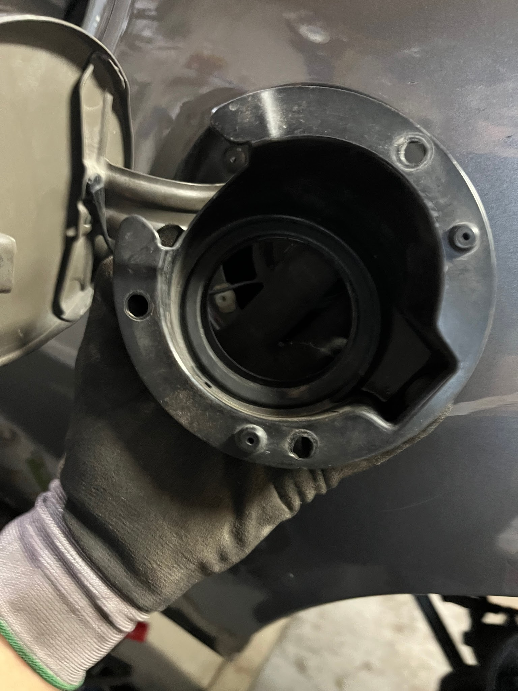
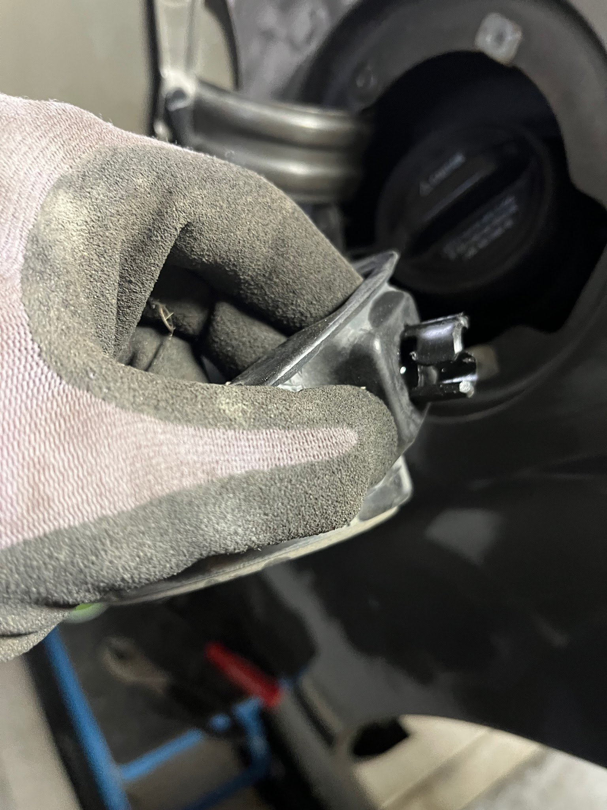
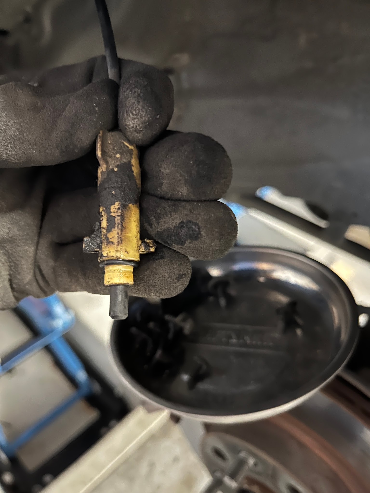
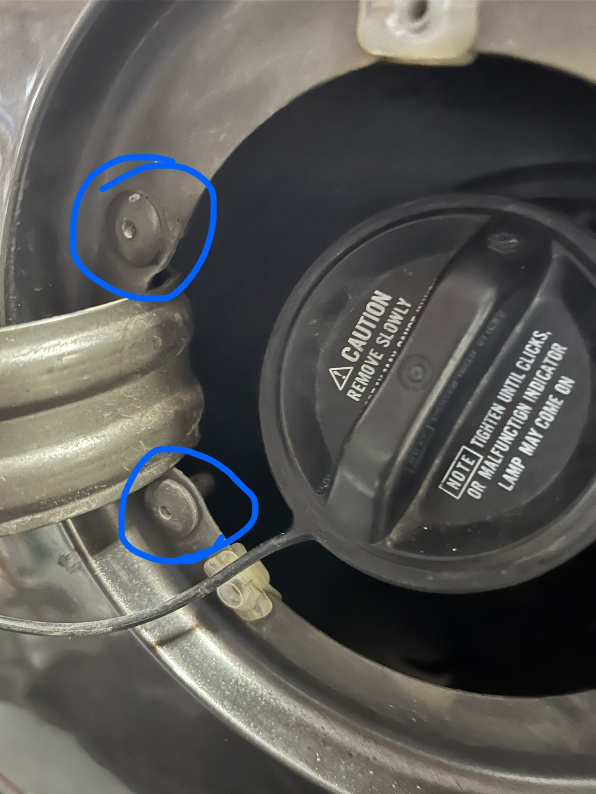
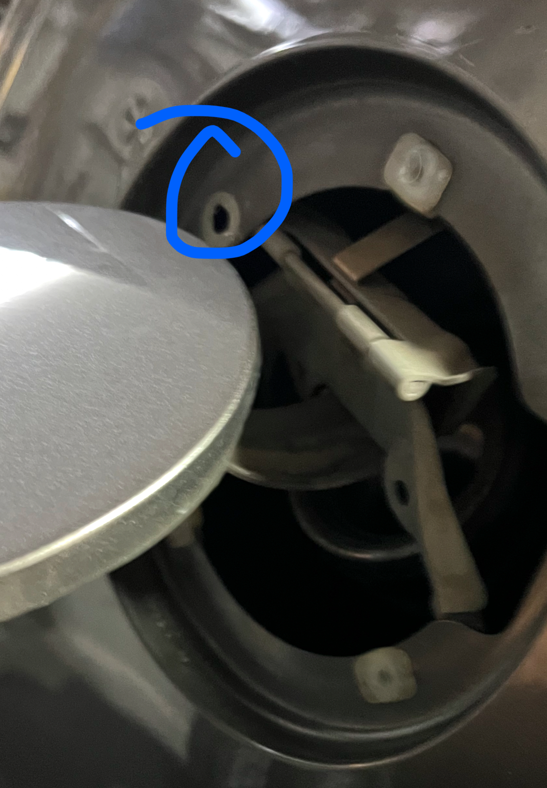
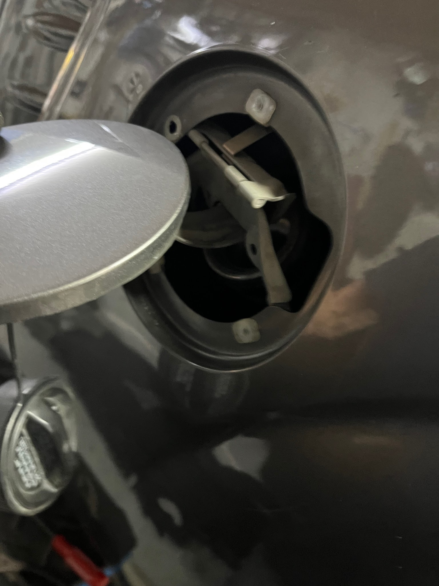
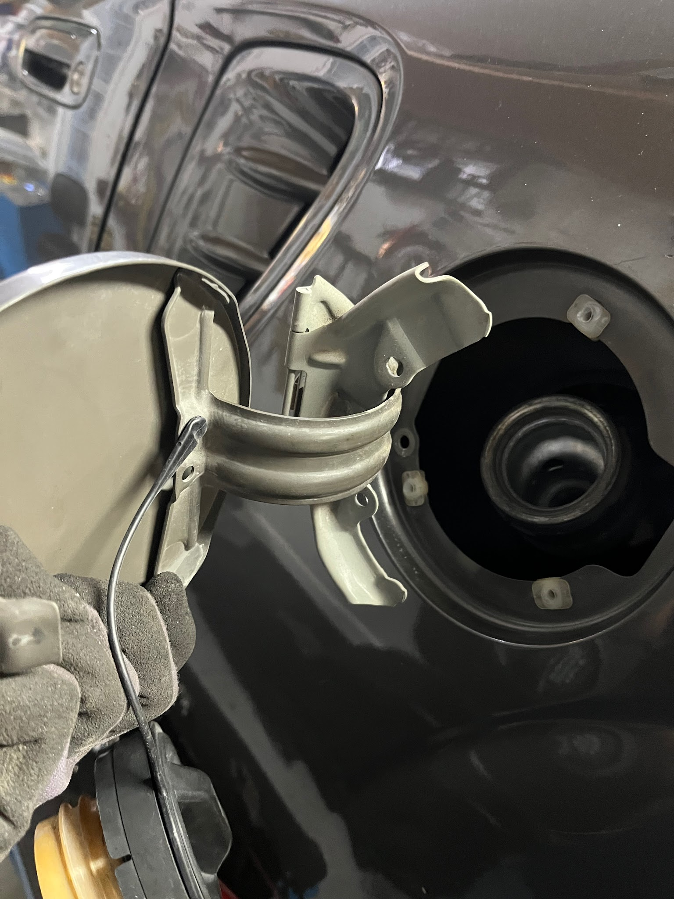

[Back to chapter index](../README.md)

# Gas Door Removal

The gas door frequently gets bent and the hinge gets stiff or frozen.

The hinge is impossible to reach from outside. There is limited access by removing the wheel well liner. The hinge is made from a steel pin riding in two crimped pieces of sheetmetal - no teflon and no bushings. Since it lives in the wheel well it gets rusty and frozen over time.

The hinge is mounted to the fender with two plastic sleeves that have two soft aluminum rivets installed inside the plastic sleeves.

## Removal

Remove the rear wheel and wheel well liner.

Disconnect the gas door release cable inside the wheel well. Turn the piece inside the wheel well ¼ turn, then disconnect the cable in the wheel well and remove the mating grommet from outside. Remove the gas cap. Remove the three screws holding the plastic bucket and pull the bucket off the gas filler neck.

Drill the head off the soft rivets.

Cut the heads off the plastic sleeves.

Rotate the hinge inside the fender and withdraw it past the filler neck.

Reinstall using M6 bolts and nuts.

There is plenty of room for full sized bolt heads.

Lubricate the frozen hinge while you have it out of the car.

Filler bucket

Outer ¼ turn cap

Inner ¼ turn cable tip

Soft aluminum rivets are installed in the center of plastic spacers. Open the gas door wide to get a drill on them. Don’t let the drill bit slip!

The plastic spacer is circled.

Turn the hinge sideways to remove it from the fender.

Gas door and hinge removed.

[Back to chapter index](../README.md)
