[← Chapter index](../README.md)

<!-- Initial conversion 0.1; converted 2026-09-17. Detailed technical review deferred. -->

# GSA Hydraulics Tutorial

Written by Cyclehead21@gmail.com

Feel free to share, copy, and duplicate. Just give me a little credit.

Let me know if you find any errors!

## Contents:

1. [Background](#1-background)

2. [Function](#2-function)

3. [Results](#3-results)

## 1. Background:

The GSA is manufactured from a billet of aluminum, with two bores for control solenoids, and three bores for hydraulic actuators (Clutch, Shift and Select). Fluid paths to the bores are accomplished by internal fluid passages and ports.

Most of the SMT system is shown in the Aug 2001 [UK Patent # GB2368376A by Andrew David Milsom and John Vivian Comfort](https://patentimages.storage.googleapis.com/ae/2f/27/cbd02ce843e5c2/GB2368376A.pdf):

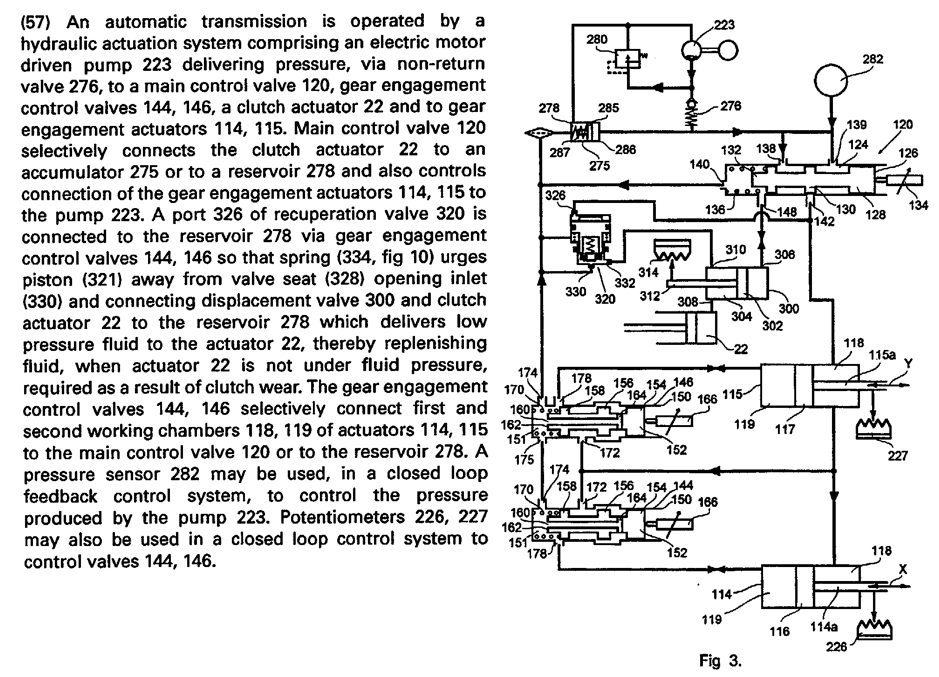

I labelled the essential components of the SMT system:

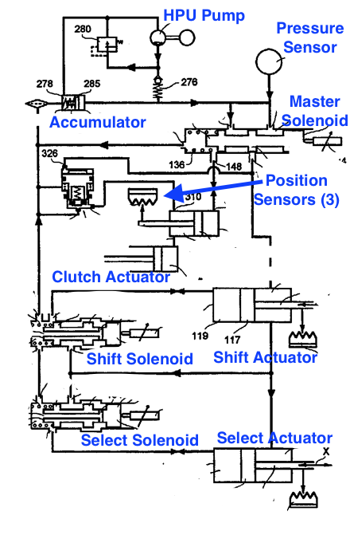

## 2. Function:

The GSA receives pressurized fluid from the HPU via two hoses (blue and gold). There is one hose to return fluid to the HPU (red).

The two GSA solenoids control when/where the pressure is routed, to modulate the shift and select actuators. (The clutch actuator is controlled by the clutch solenoid which is located in the HPU.)

The GSA pressure sensor monitors the supply pressure feeding the Shift and Select solenoids. (The supply pressure is provided by the Master solenoid located in the HPU)

The Shift and Select actuators are both “double acting” cylinders, as they are extended and retracted via hydraulic pressure. The Clutch actuator is a “single acting” actuator, as it is retracted via hydraulic pressure, and extended via springs.

### 2.1 Solenoid Functions:

The solenoids modulate pressure & fluid flow in the SMT system.

The “Tank Port” is connected to the HPU reservoir - low pressure fluid return.

The “Control Port” is connected to the actuators. The solenoid regulates pressure to cause the actuators to extend or retract.

The “Pressure Port” is connected to high-side system pressure. For the Shift/Select system, this pressure comes from the Master Solenoid. For the Clutch system, the pressure comes directly from the HPU pump.

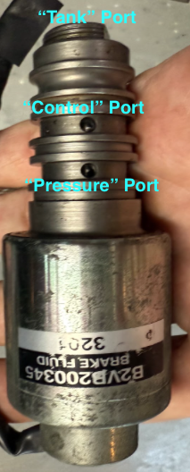

### 2.2 Actuator Functions (for shift and select actuators only):

Port A receives regulated pressure from the “Control” port of the shift/select solenoid.

Port B receives constant “master pressure”.

1. When the TCU commands the piston to extend, it routes master pressure through the shift/select solenoid “Control port” to Port A in the sketch below. The surface area of the piston is greater than the surface area of the piston-minus-rod surface area, so the rod extends (even though the same pressure is applied to both Ports A & B).

2. When the TCU commands the piston to retract, the shift/select solenoid Control Port dumps master pressure back to the fluid return system. The constant master pressure on the rod-side of the piston pushes the piston into the cylinder and retracts the rod.

3. The solenoid can extend or retract the actuator rod by controlling the position of a single port (the solenoid Control Port).

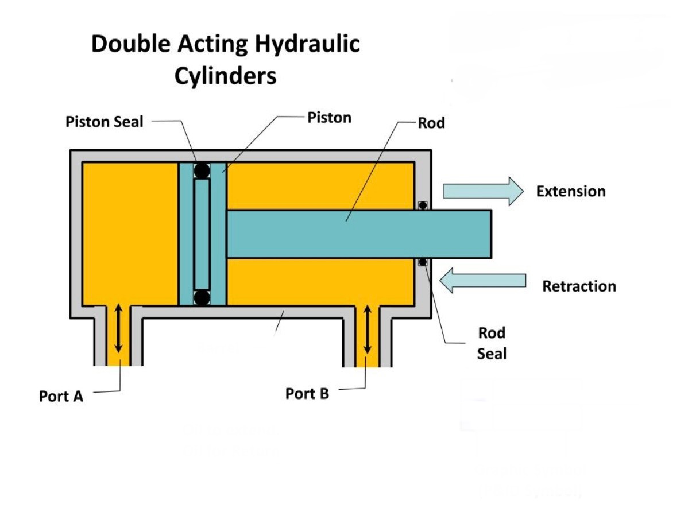

### 2.3 Clutch Actuator Functions:

The Clutch Actuator is a single-acting actuator. It receives pressure from the clutch solenoid (in the HPU) causing it to retract. The clutch pressure plate springs, and the clutch actuator internal spring both act to extend the clutch actuator.

## 3. Results:

I used compressed air and vacuum to route colored pieces of thread through the fluid passages and ports in the GSA.

The Clutch hose (blue) is attached to the GSA (on the right side of the photo below). Clutch fluid pressure feeds the clutch actuator. The Clutch actuator is a single-acting actuator, controlled via a single fluid port. Clutch fluid enters and returns via the same port and the same hose. The clutch pressure plate springs and the coil spring inside the clutch actuator both work to return the actuator to the fully extended position. Hydraulic pressure retracts the actuator when fluid is routed by the clutch solenoid.

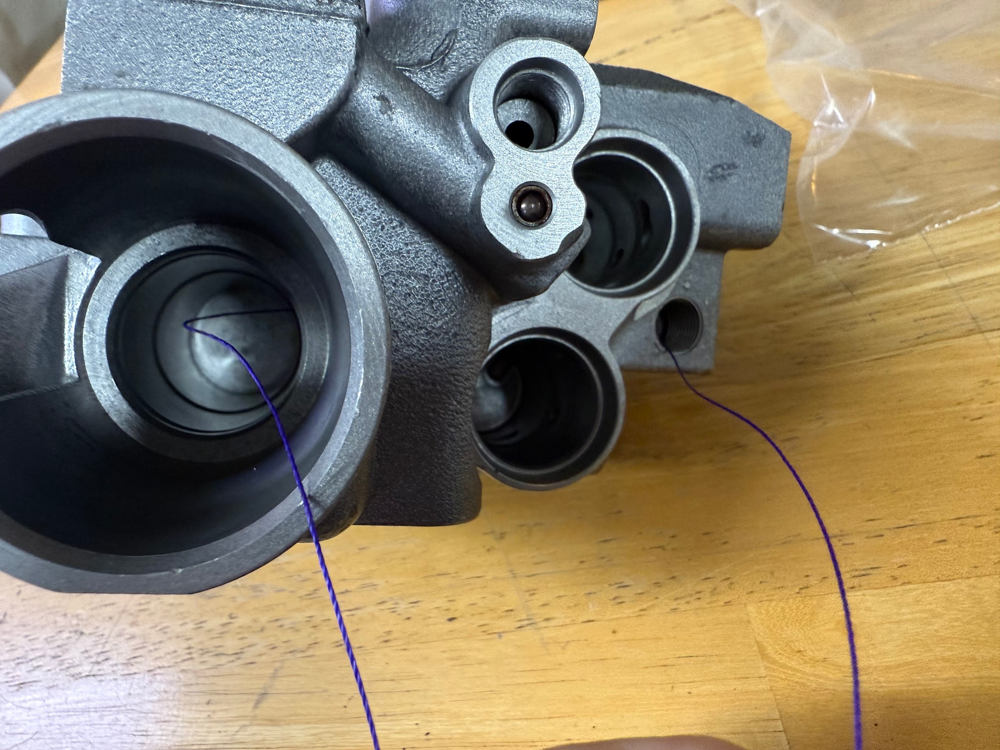

The Master pressure (from the HPU) enters the GSA through the port shown on top (below). Master pressure is routed to both solenoids. Master pressure enters both solenoids through the lowest (big end) port in the side of the spool valves.

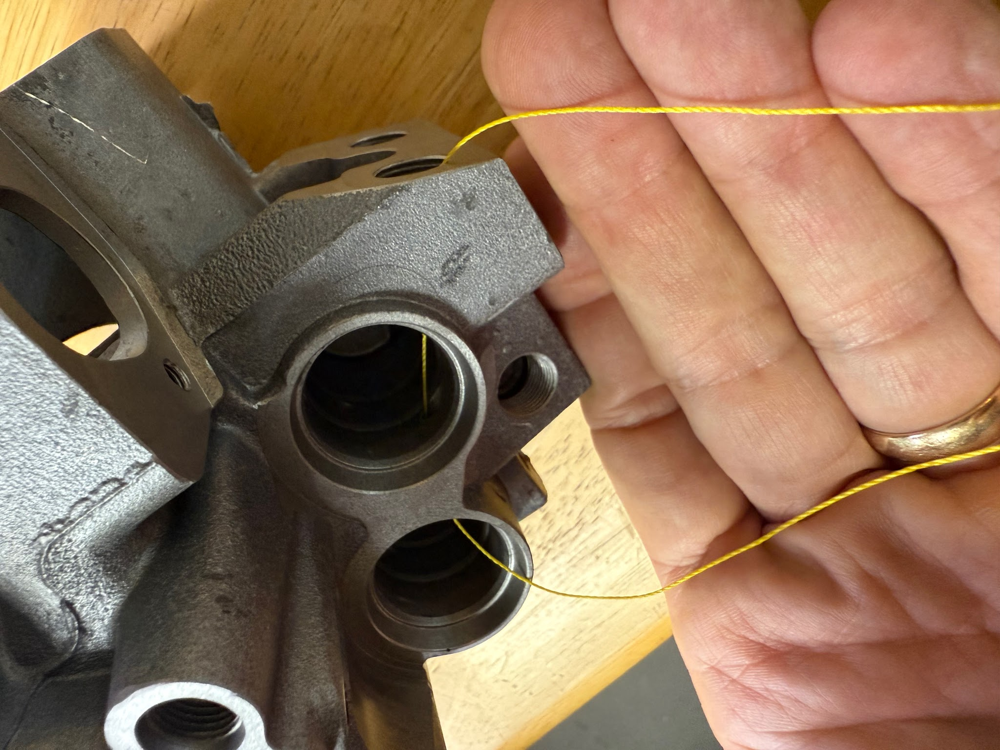

Return fluid leaves via the port shown on top. (Via the red hose). The return fluid is connected to the bottom of both solenoid bores. The return fluid exits the solenoid via the tip (small end) of the spool valve.

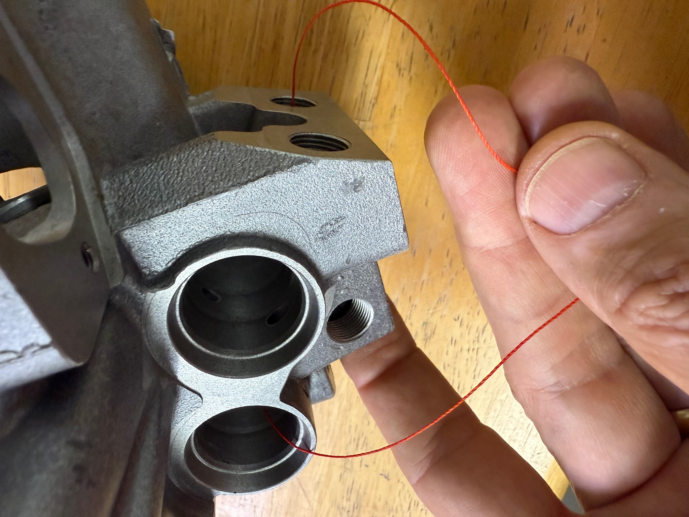

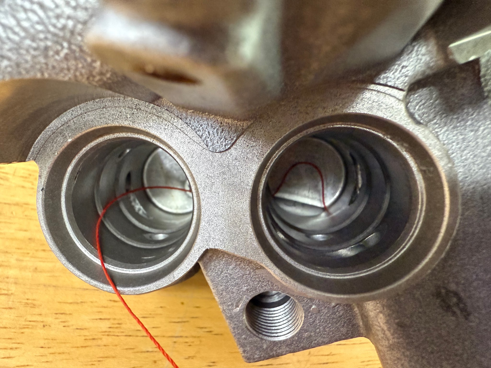

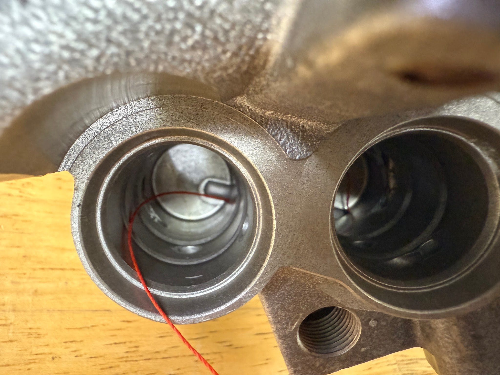

The GSA pressure sensor is connected to the Master Pressure system, which connects to both Shift and Select solenoids. (via the Solenoid Pressure ports)

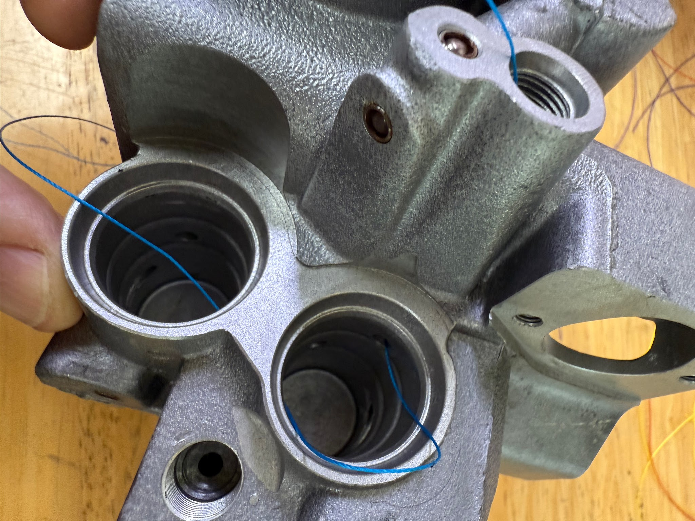

The “Select” solenoid control port is the upper port on the solenoid (towards the small end). Control pressure exits the side of the solenoid and is routed to…

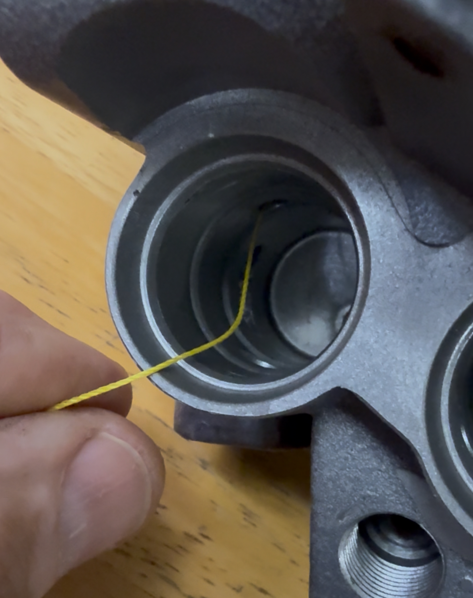

… the bottom of the Select Actuator (short actuator) bore, at the tip of the actuator where it acts on the entire face of the piston.

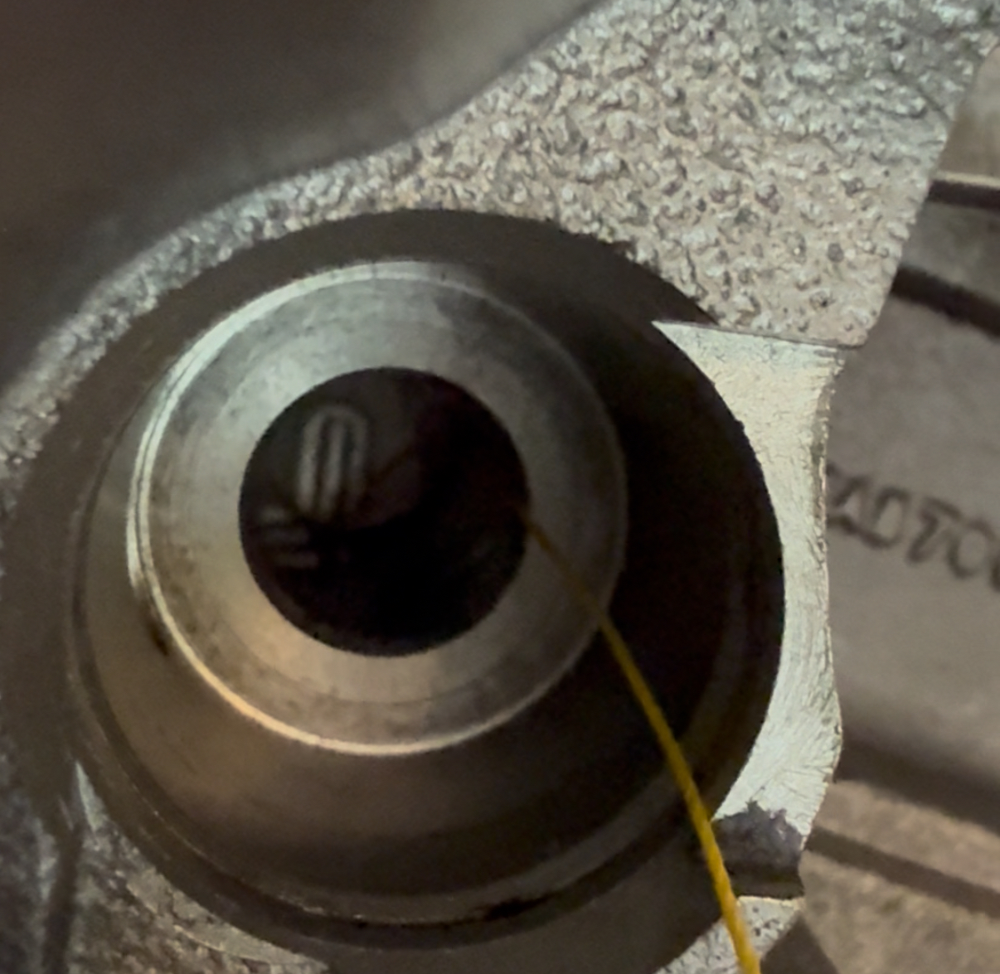

Master system pressure is routed to both the Shift and Select actuators. It pressurizes the rod-side of each actuator's piston. Here is the Shift actuator (long actuator)…

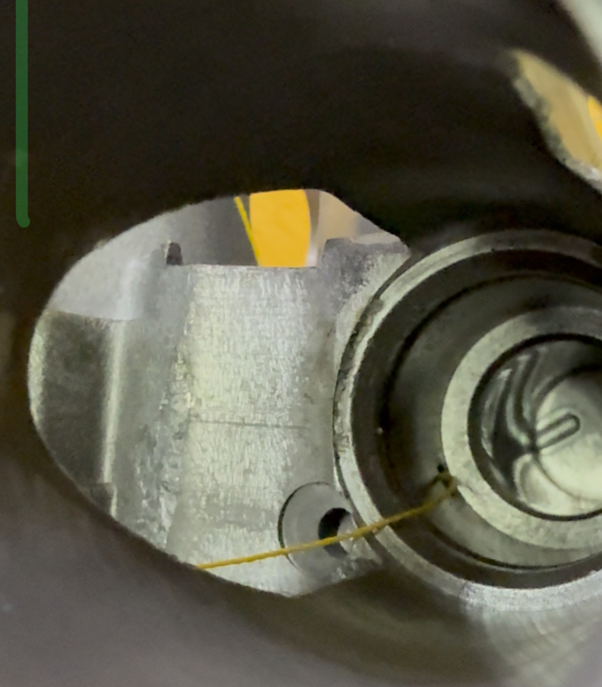

… and here is the Select actuator (short actuator).

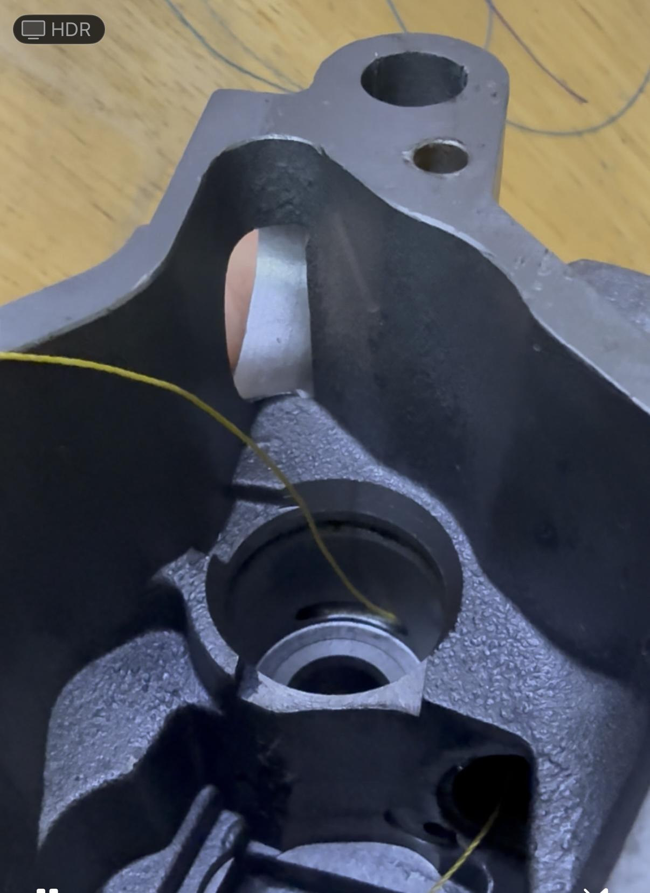

The Shift actuator (long actuator) control pressure is supplied to the bottom of the bore, where it acts on the entire piston face.

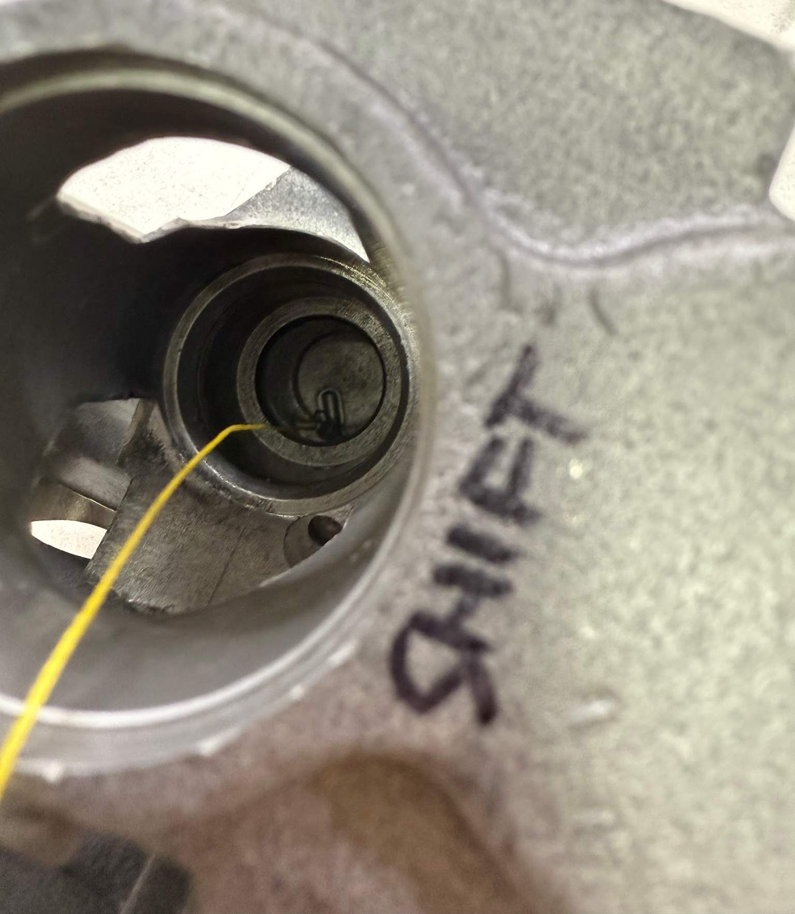

The Shift control pressure leaves the Shift Solenoid via the upper port on the solenoid (small end)

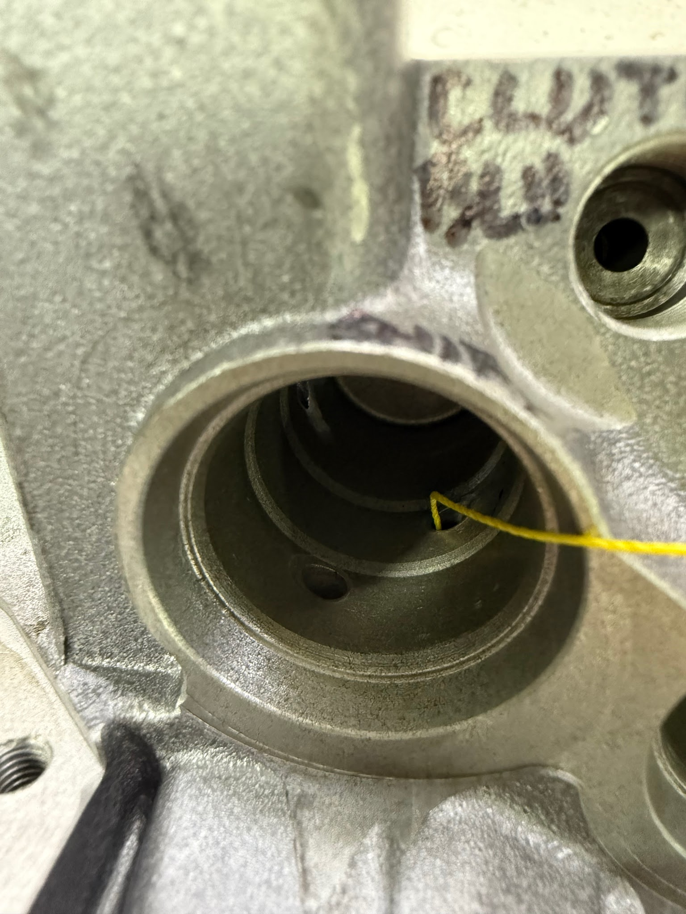

[← Chapter index](../README.md)
