# SMT - GSA Removal and Installation

**Written by Cyclehead**

**Feel free to share, copy, and duplicate**

**Just give me a little credit**

**And let me know if you find any errors!**

Updated May 2025

Email: cyclehead21@gmail.com

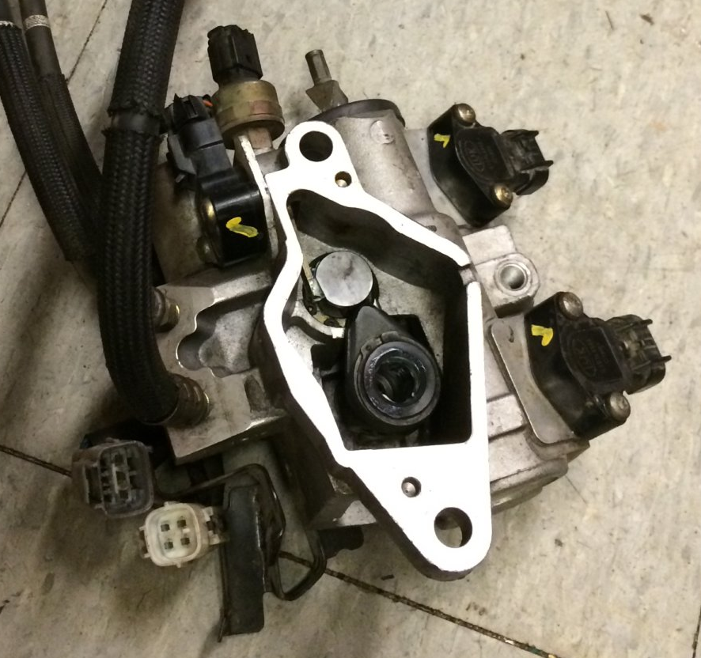

## Contents

1. [Overview](#1-overview-of-the-gsa)
2. [Procedure & Checklists](#2-procedure)
3. [Parts and Tool Reference](#3-parts-and-tool-reference)
4. [Removal Steps](#4-removal-steps)
5. [Reinstallation Steps](#5-installation)
6. [Pictures!](#6-pictures)

---

## 1. Overview of the GSA:

The Gear Shift Actuator (GSA) is a hydraulically actuated remote shifter for the Spyder. (P/N 33960-0W011) The transmission is a standard 5 speed transmission, with this GSA thing bolted to the front side of the transmission case by the firewall. It has three hydraulic lines attached to it. The three lines run from the Hydraulic Pressure Unit (HPU), over the transmission to the GSA. One hose provides Clutch power, the next provides GSA power, and the last is fluid return. (Blue is Clutch pressure and clutch return, Gold is GSA pressure supply or Master Pressure, and Red is fluid return.)

After repairing the GSA, you must perform a re-learn process. This process is needed for the TCU to learn the new actuator and sensor positions. There is a “self-relearn” process that doesn’t require additional software, however it is likely not sufficient. More likely, you will need to use Techstream software to perform a “new component relearn”.

### Techstream:

Techstream is available on Amazon, stolen from Toyota by Chinese(?) hackers. It costs about \$30. Note that some copies of Techstream must run on an old 32bit laptop (Windows XP). There are also 64bit versions of techstream out there. Be sure to verify if you order yourself a copy. There’s a chance the copy of techstream provided with a J2534 OBD cable (which you will also need) will come with spyware hidden on the disc.

A safer alternative is available from a helpful guy on facebook who collected the necessary driver files, composed a custom batch file, plus located links to the Toyota factory website where you can download the latest copy of techstream. His tutorial has links to the necessary driver files (that he wrote), and includes detailed instructions showing how to install on a Windows 7,8,10 or 11 machine. It is available on Facebook “MR2 Spyder SMT Group”, or I can point you to the file, or send you a copy.

## 2. Procedure:

### 2.1

Remove the battery

Remove the air filter box

Unbolt the HPU

Remove three “quick” disconnect fittings at the HPU

Unthread the hoses from the top of the transmission

Unbolt the GSA

Remove the GSA from below the car

### 2.2

After removing the GSA a dozen times, this process takes me about 30 minutes to remove, and about 1 hour to install. The first time probably took me 5-6 hours each. Something stupid like a stubborn hydraulic line disconnect can bring everything to a screeching halt.

Tip: You can reinstall the GSA quickly and perform relearn to ensure it works. THEN go back and finish up all the details like properly clipping the hydraulic lines into their “U” holders. I temporarily install the top half of the airbox and connect the MAF sensor - so I can start the engine if(when) the relearn is successful.

### 2.3

#### Checklists

##### Removal Checklist

1.  Remove battery, plastic tray and airbox (10mm socket)

2.  Disconnect the three hydraulic line connectors, and unclip the hoses from their “U” clips.

3.  Remove the plastic cover plate on the adapter link and remove the 12mm bolt. Do NOT round off the wrench flats. The bolt is very tight.

4.  Disconnect three electrical plugs (gray, black, white) above GSA

5.  Manually shift the car into Reverse or 5th gear (pull the shaft rearwards)

6.  Go beneath the car and remove three 14mm bolts holding the gold bracket.

7.  Remove one 14mm bolt on the end of the GSA. (4inch extension on a ratchet driver)

8.  Loosen one 14mm bolt in middle of the GSA (too long to remove)

9.  Remove the GSA, watch that the hoses don’t get snagged on top.

##### Installation Checklist

1.  Tape over the ends of hoses to prevent dirt

2.  Slide the long 14mm bolt into the GSA

3.  Thread hoses over the top of the transmission - red and gold go on the OUTSIDE of the gold bracket, blue hose goes on the INSIDE (close to center of the car)

4.  Slide the GSA into position, feel inside with your finger to guide the adapter link onto the shaft.

5.  Tighten the long 14mm bolt, install the short 14mm bolt (4 inch extension on a ratchet driver)

6.  Go above the car and fish out the three hoses, connect to the HPU

7.  Manually shift into neutral and install the 12mm bolt into the adapter link. 18Ft.lbs!!

8.  Connect three electrical plugs above GSA

9.  Temporarily install the top half of the airbox, and connect MAF sensor and Evap hose & connector

10. Go beneath the car and pull the clutch cable onto the clutch fork.

11. Install battery and perform relearn.

12. If relearn is successful, then go back and finish installing covers, hose clips, airbox etc

## 3. Parts and Tool Reference

Crazy fine thread bolt M7x0.75 Toyota P/N 90105-07007

Plastic Service Tool Toyota P/N 33963-0W010 “Actuator Link Fixing Plate” (No longer available from Toyota. (Aug 2022), however I am including them in my GSA seal repair kits. I also have them for sale separately) Update: I have uploaded STL file [LINK](https://www.thingiverse.com/thing:7033027)

## 4. Removal steps:

### 4.1 Access

Jack up the rear of the car as high as your jackstands will allow. Get the car secure on two jackstands.

Remove battery and plastic tray, remove the air filter box top and bottom halves.

Remove the three bolts that hold the HPU to the crossmember. Use all the socket set extensions you own to make a 2 foot long extension. No need to remove any heat shields, just reach inside them to get the three bolts.

Next, disconnect clutch pyramid from clutch fork (while the hydraulic lines are still connected to HPU!) You must do this step while the hydraulic lines are all connected to the HPU. Otherwise you will have a hydraulic lock and the clutch cable will not come off. I clamp a pair of vice-grips to the end of the clutch cable, then pry on the vice grips with a long screwdriver or small crow bar pushing against the engine mount for leverage.

### 4.2 Removal:

#### 4.2.1 Vent Cap

Scrounge up an old o-ring to pop on the reservoir cap on the HPU. There is a recess in the reservoir cap made to accept an o-ring. (Picture below) This will block the small vent hole and prevent leaking brake fluid everywhere during the next step. (approx ⅞ inch Inner Diameter o-ring)

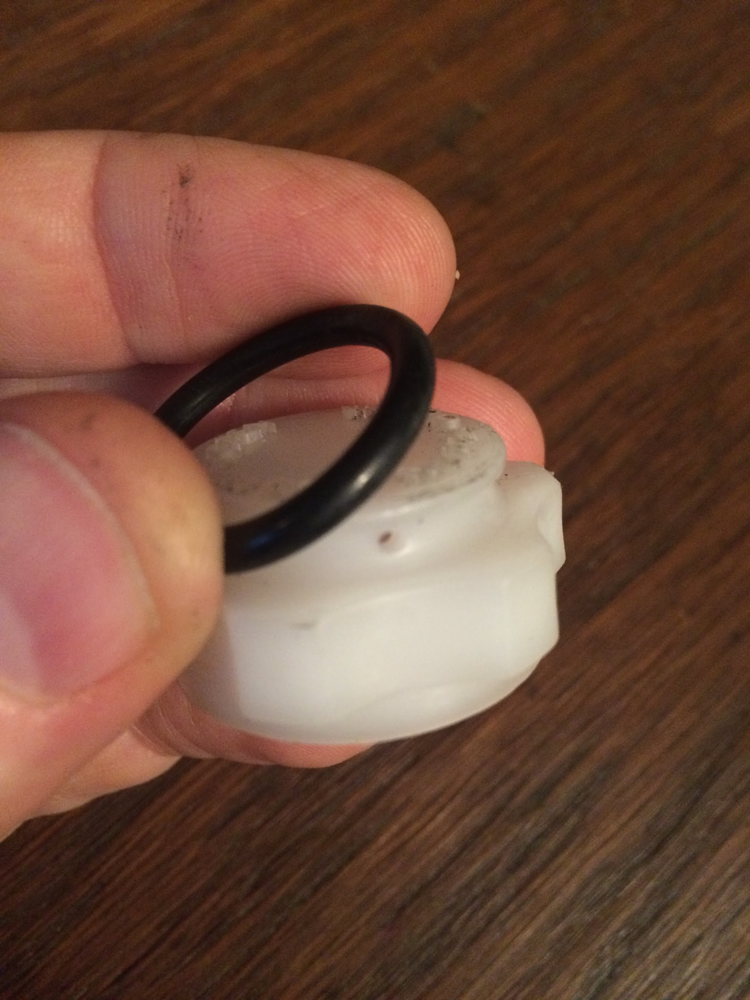

#### 4.2.2

With all the hoses still attached, lay the HPU on its side or its back - whatever it takes to get good access to the hydraulic hose disconnects. You need to press the white plastic rings on each hydraulic connector up inside the red/gold/blue sleeves until they are flush. The white teflon ring pushes against 8 small steel fingers hidden inside the colored sleeves to unlatch the connector from inside. Alternatively, all three hoses can be unscrewed from the GSA body. (Details in the next step)

Reference: Clutch pressure supply hose is Blue, GSA Master Pressure hose is Gold, and Fluid return hose is Red.

#### 4.2.4

Smooth edged screwdrivers are okay to push the white rings up into the connector. Just try not to bugger up the white plastic rings too much, they are very soft plastic.

You can use a small zip tie if you really want to protect the white plastic ring. Zip it up just below the white ring - then press on the zip tie instead of the white ring. (Cut off the zip tie when you're done.) Just walk around the white ring with your screwdriver. The ring usually will stay crammed into the joint. It’s okay to rotate the entire fitting to give you access to the back sides of the white ring. The entire fitting will rotate together and won’t push the white ring out. You might need to use two screwdrivers if you see the white ring sliding back out. Don't try to force the connector apart. It will come apart very easily when all the latch fingers are free.

The gold colored quick disconnect is made from steel, while the red and blue are made from anodized aluminum. The gold fitting is more likely to be rusty. I had one gold fitting so rusted that the white plastic ring would not disengage the locking fingers.

If you get a nasty rusted gold connector, you'll need to unscrew the hose from the HPU housing. Be very careful with the tiny wrench flats. They will try to round off. Apply a little PB blaster or your favorite penetrating oil, then tap the flats with a small punch and hammer to loosen. Use a small pair of “Knipex” brand pliers. (They clamp the flats without slipping) Work hard to avoid rounding off the small flats. Be careful not to use too much penetrating oil. All of the rubber parts of the SMT system will swell up and fail if they are soaked with hydraulic oil or petroleum products (grease, motor oil etc). Note: if the fittings or hoses are beyond repair, you can make new ones. [LINK](brake-line-substitute-for-smt-hoses.md)

If the white teflon release rings are mangled, you can replace them with 3D printed parts. I designed and uploaded them to Thingiverse. Video shows how the collars work: [LINK](https://www.youtube.com/playlist?list=PLmyK-d4KYeZ516okQ8KIg7SV0U25WSvp_)

#### 4.2.4

Unclip the three hydraulic hoses from the plastic "u" clips buried on top of transmission. This will allow the lines to feed through when you withdraw them from below the car. Each hose has two clips holding it. Pay attention to how they’re routed. You really want to put them back the same way so they don’t rub and chafe. The hydraulic lines will chafe over time if they’re not clamped, and they WILL chafe through the soft rubber and destroy them (the hoses move when the pressure hits them).

#### 4.2.5

Find the flat, black plastic access cover on the left side of the GSA and pop it off with your fingernail. Reach into the access window and remove the one bolt holding the shifter actuator link ("Shift Actuator Link" per the BGB ) to the transmission shifter shaft. It has a 12mm head. Use a clean socket that is not worn. You do not want to strip this bolt head! The bolt has a VERY fine thread. (Don't lose it! They are only available from Toyota dealer.) 12mm bolt head.

#### 4.2.6

Unbolt the 10mm bolt from the black electrical bracket on top of the GSA, right next to the firewall. Reach behind the battery to access it. It is very hard to reach. To ease access to the 10mm bolt: Bend the black electrical bracket upward. Then unplug the three electrical connectors on top of the GSA.

Unbolt the two big bolts holding the GSA to the front side of the transmission. One bolt is very long, it must stay hanging in the GSA until you get the GSA completely removed.

#### 4.2.7

Using the stub on the back of the transmission, manually shift the transmission into a gear using a screwdriver. Select a gear that will pull the shifter shaft aft, retracting the shifter shaft out of the GSA. This will get the shaft out of your way, allowing you to snake the GSA off the shaft from below. You may have to fiddle the wiggly part off the shifter shaft with your finger through the access window. If you have the plastic Toyota service tool, you can install it to help keep the actuator link with the GSA, but it’s not really necessary. Just slide the actuator link off the shifter shaft with your finger. Remove the GSA from below the car. The hydraulic lines will try to get snagged on everything as you remove the GSA, so it may help to have an assistant feed the lines over the transmission as you withdraw everything from below.

## 5. Installation:

### 5.1

Put a little light grease on both of the wear surfaces of the actuator link. (Note: The BGB specifies molybdenum paste instead of grease)

Get the actuator link positioned correctly in the GSA. It engages the two actuator pistons (“Shift actuator” and “Select actuator:”). It is easiest if you use the plastic Toyota Service tool called a “fixing tool”. The plastic tool will help you get both pistons set in their central positions, and make installation of the GSA into the car easier as everything is aligned to allow you to install the fine-thread bolt.

If you don’t have the tool, it's not a huge deal. Just position both pistons centered (about half way through their stroke). Then figure a way to hold the actuator link in position as you install the GSA to the transmission. I did it once with a short piece of wooden dowel, whittled to fit into the bolt hole. It let me align the actuator link enough to get it onto the shaft. The dowel stuck out through the access window. Some guys have used a cardboard version of the plastic tool. One guy used some broken pieces of a carpenter’s pencil to wedge the link and hold it. Any way you can invent to hold the actuator link stable as you install. The service tool just makes life easier.

This video shows how the tool works, and how to align the pistons. [\*LINK\*](https://youtu.be/jPQfI5da4Sc)

### 5.2

Feed the three hydraulic hoses back over the top of the transmission. Be careful to feed them through the right holes. One blue hose goes toward the center of the car. The other two hoses (gold and red) go on the opposite side of the gold metal bracket, on the passenger side of the car. It's hard to feed them correctly, while holding the GSA below. An assistant would be handy here again. Or wedge the uninstalled GSA near the transmission using the long bolt, while you feed the hydraulic lines - or hang it with some bailing wire.

Be sure you have the long bolt in place in the GSA before you cram the GSA into position. You cannot install the long bolt AFTER the GSA is in position - there’s no room. When the GSA is in position correctly, it picks up two alignment pins. When you get the GSA close to installed, use a screwdriver in the shifter shaft on the back of the transmission to manually shift into a gear that will push the shaft forward into (towards) the GSA - this helps hold the GSA in position while you connect things. Look in the access window with a mirror to make sure the actuator link mounting bolt hole is lining up with the shifter shaft hole, where the very fine thread bolt goes.

### 5.3

The **<u>factory torque spec for this bolt is 18 ft.lbs</u>!** That’s a lot of torque on an M7 bolt.

Note: Just for information - a bolt that is not tight enough will allow a joint to move under load. This will cause the bolt to fail in fatigue. Whereas a properly torqued bolt in the same joint will never see a fluctuating load, and will never suffer fatigue failure. So it’s <u>important to get this bolt tightened correctly</u>. I have seen quite a few SMT failures due to this particular bolt failing from fatigue. This joint sees motion with every gear shift so the bolt must be properly torqued. (You must have a free running bolt to allow you to apply the correct torque. If yours is unusually tight, in theory you should add the free-running torque to the factory spec torque. Read on...)

Note regarding replacement bolts: I bought some new bolts from Toyota. Perhaps they were just a bad batch, but the very-fine-thread bolts were all slightly oversized with poorly formed threads. They were so very tight that I was afraid I was stripping threads as I threaded one into the shifter shaft. I ended up chasing the bolt threads with an M7x.075 die. Then I used some low strength loc-tite. If you’re fighting the oversized threads (like mine from Toyota) your free-running torque will be very high, and you will not get the proper preload on the joint.

Shift the transmission into neutral so you can thread this bolt into the shaft. Use a 12mm socket to tighten through the access window. If you can’t find room for a torque wrench, you can exert 18 lbs pull on a 12 inch long wrench. Or 36 lbs pull on a 6 inch long wrench!

### 5.3

Hook the clutch pyramid fitting into the shift fork AFTER you connect hydraulic lines to the HPU. The clutch actuator cable is held in the retracted position by an internal spring. To extend the clutch actuator cable, clamp a pair of vice-grips onto the clutch actuator cable-end. Then lever the vice grips with a long screwdriver stuck through the engine mount.

### 5.4

Don’t forget: Remove the o-ring from the HPU reservoir cap! You don’t want to restrict air flow into the vent hole.

Double check that you have removed the plastic “actuator link fixing tool” from the inspection window in the GSA.

Get the cabin gearshift lever, and transmission shifter shaft all set in neutral BEFORE you connect the battery. If the cabin shifter is locked in gear, pry out the tiny silver access door by the shifter, insert a screwdriver and release the mechanism to shift into neutral.

Do the techstream relearn. If it fails, try disconnecting the battery and let the car sit overnight. Then re-try it.

### 5.5 Air bubbles

One time I had my SMT system fail after rebuilding the GSA. I was accelerating through third gear and the car shifted itself into neutral, then killed the engine! Yikes! I believe it was an air pocket that finally hit the control solenoids, after 45 minutes of driving! Disconnecting the battery (everything in neutral) and waiting 10 minutes fixed everything, and it never happened again. So test and cycle your system thoroughly before you turn the car over to a customer, or your wife. It appears that some of the newer versions of techstream have a “bleed air” test function. It opens the Master Solenoid to push fluid through the GSA.

## 6 Pictures

### 6.1

This picture shows the mounting surface for the GSA, the two guide-pins, the two big GSA mounting bolts, the crazy-fine-thread actuator link attach bolt, and the five "U" clips on top of the transmission that route the hydraulic lines to avoid chafing.

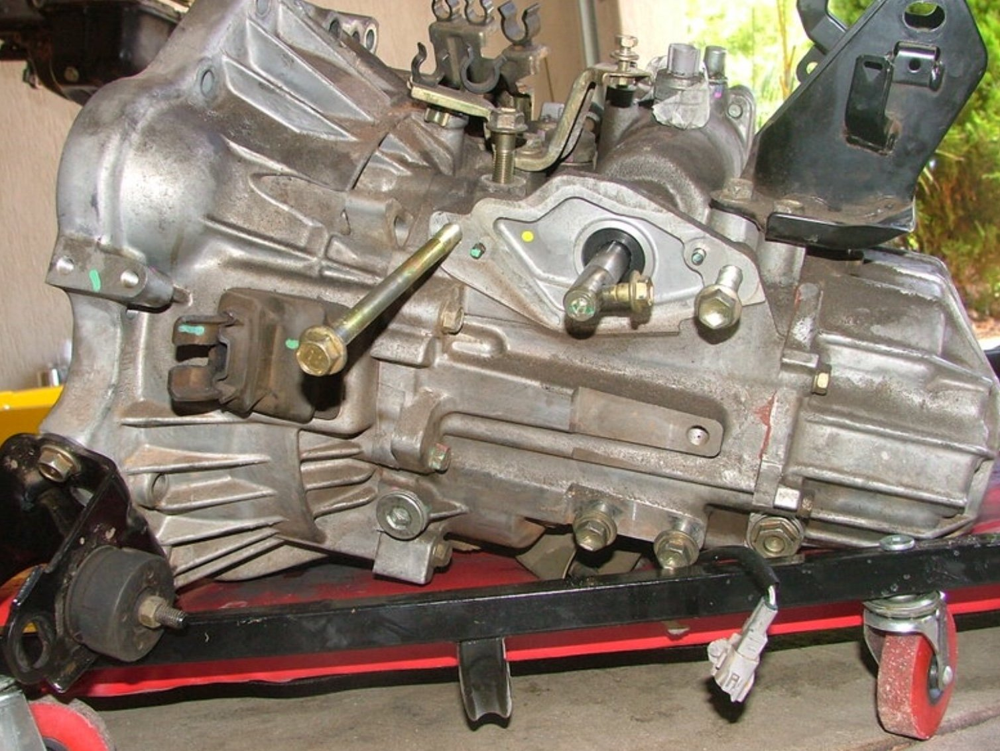

### 6.2 View from above - if you were to look behind the battery

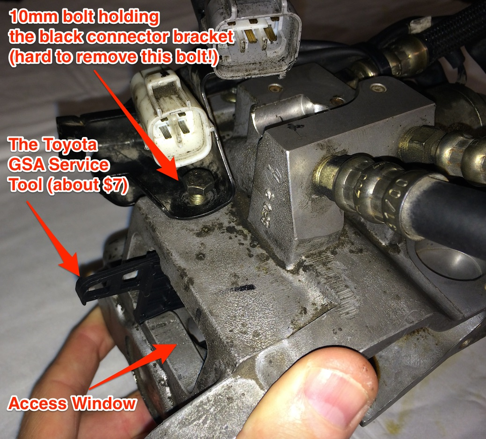

### 6.3 Clutch "pyramid" fitting. Using vice grips to pull the cable out.

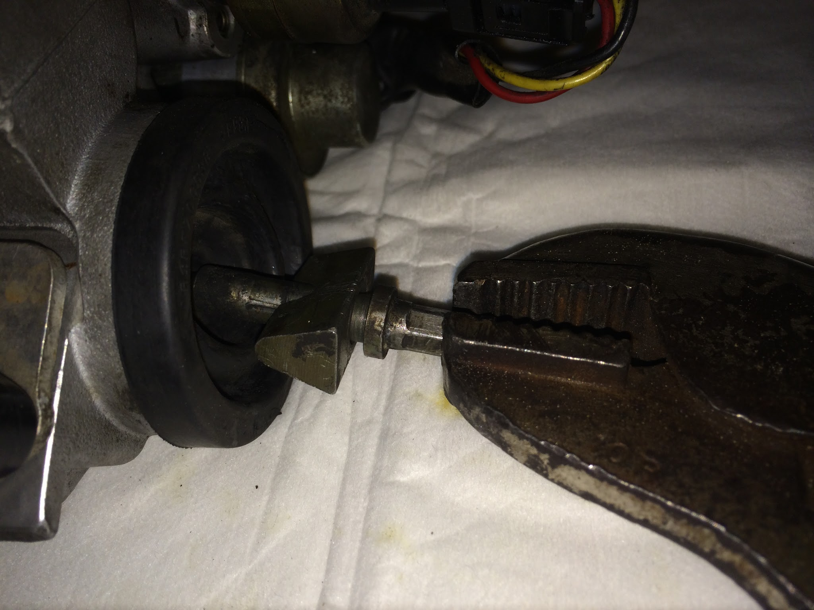

### 6.4 The actuator link:

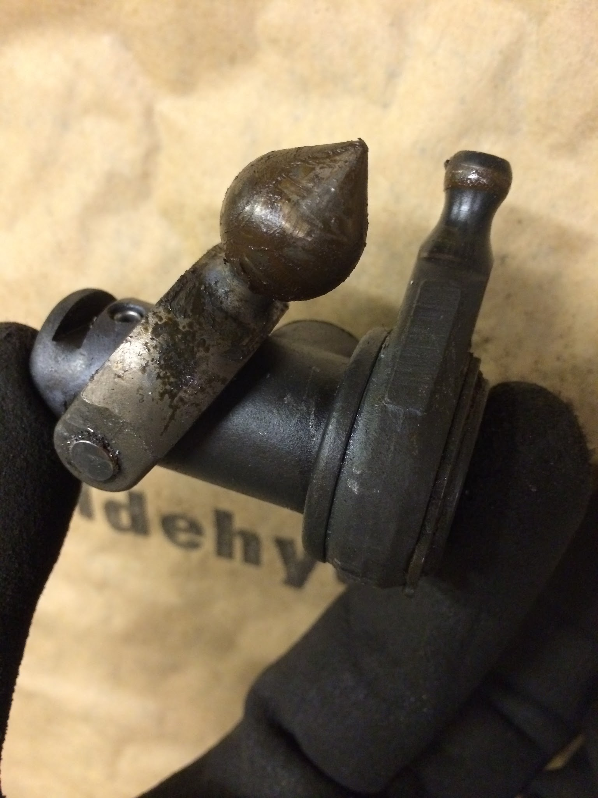

6.5 Homemade wooden peg for aligning the actuator link. It is MUCH easier to use the proper “link fixing plate”. I have them available now. 

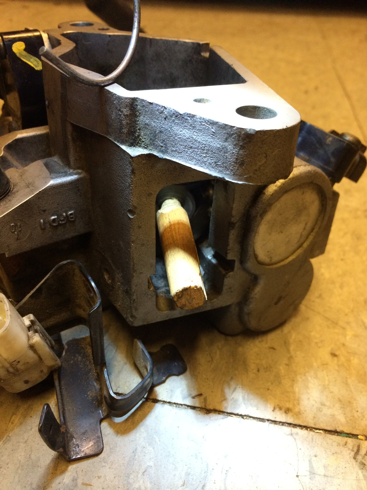

6.6 Access window with the Toyota service tool installed (actuator link “fixing plate”)

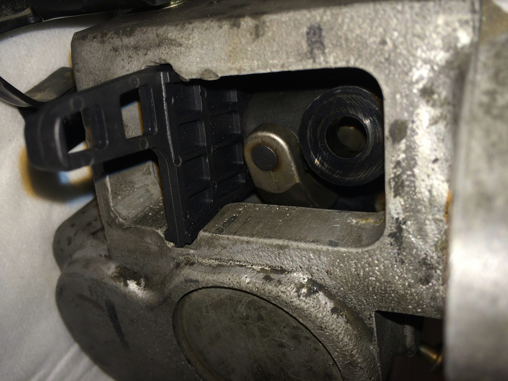

6.7 White teflon disconnect ring pushes the latching fingers out of the way to disconnect.

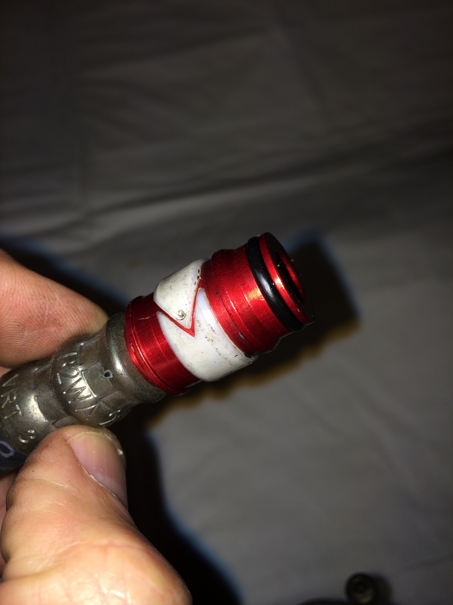

### 6.8 Quick disconnect fingers. Blow out all the crud before you connect!

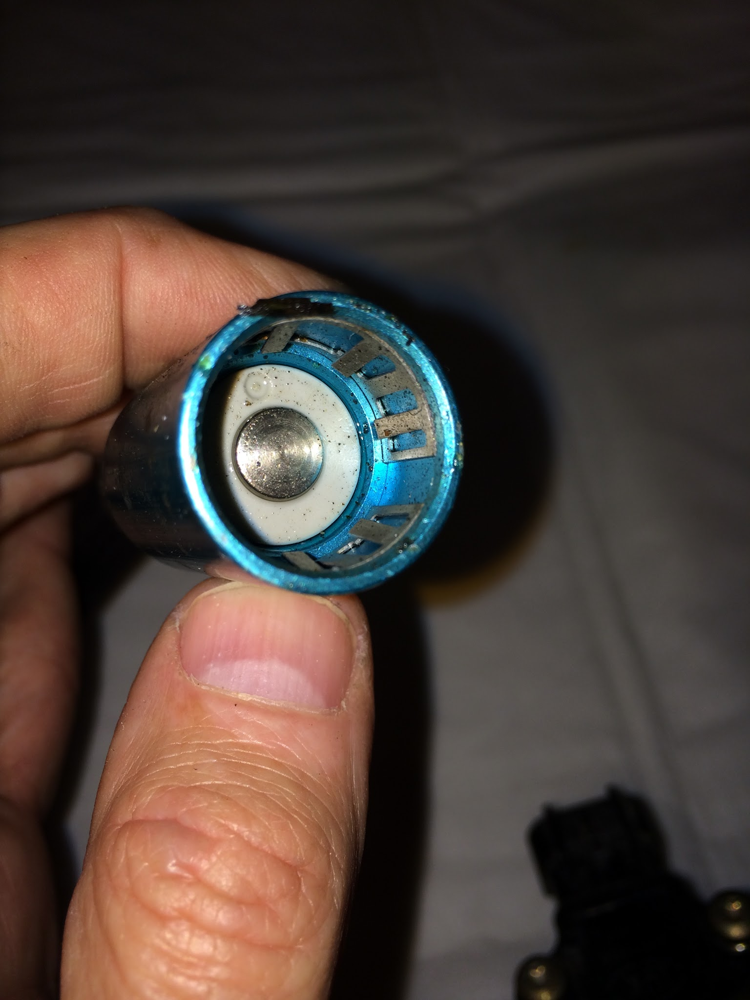

6.9 A horror picture of a corroded gold quick disconnect. It appears that the red and blue fittings are made from anodized aluminum. But the gold fitting is steel! This one was so corroded I could not push the plastic teflon to release the latching fingers. So I unscrewed it from the HPU. Then cut it apart to see what's inside.

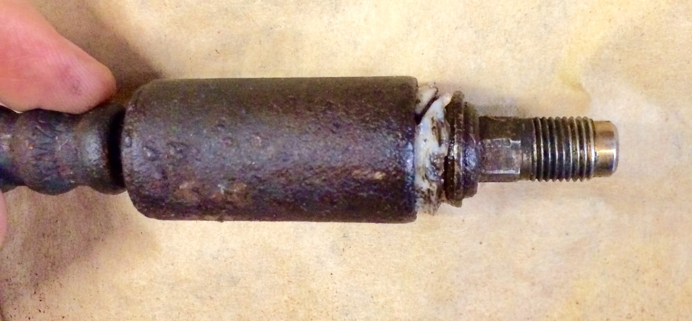

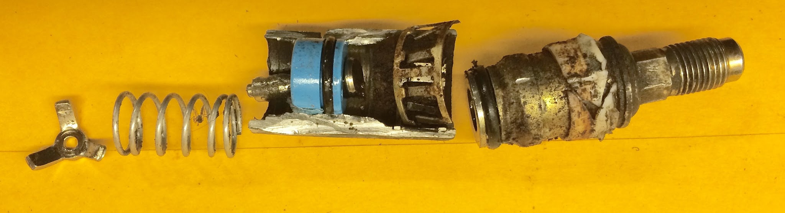

If you must unscrew the hoses, you really need a pair of “knipex” pliers. They are the only tool I’ve used that will not round off the wrench flats. The pair in my photo are 5” pliers - really too small. Order the 6” inch knipex pliers. (NOTE - the gold fitting should be in the middle! Not on the end as shown!)

### 6.10 Success, GSA lying on the floor

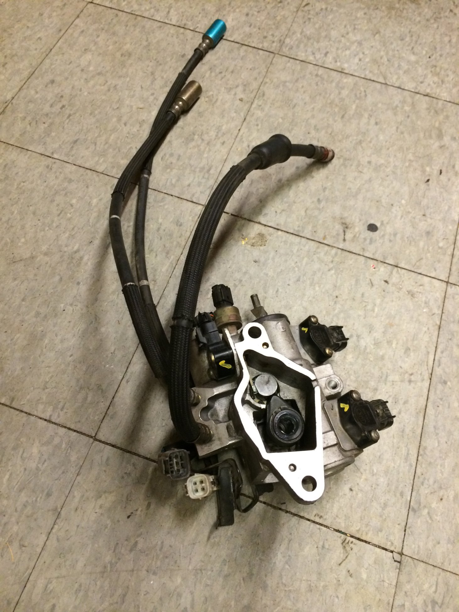

The plastic clips on top of the transmission: These will snag on the hoses, and prevent you from removing the GSA. However you really need to clip them all properly upon re-installation. I have seen the soft hoses chafed clear through if they are not used! There are two clips for each hose. They are hard to reach. Note the routing. One hose goes toward the center of the car. The other two go towards the drivers side of the car (to the left in this photo). There is a metal bracket between, and you must feed them to the correct side.

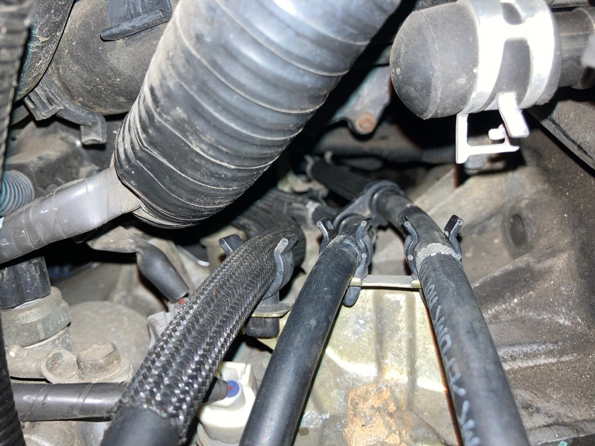
