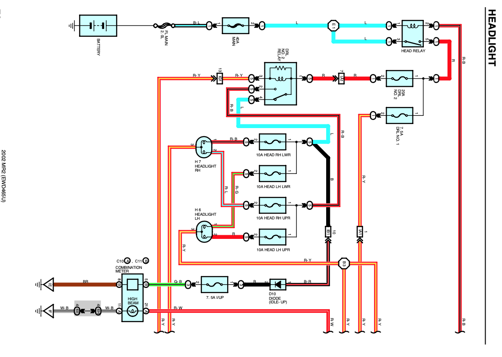
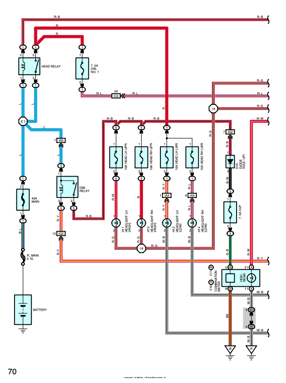

[← Chapter index](../README.md)

# Headlight Swap

Composed by Cyclehead21@gmail.com

## How to install a pre-facelift headlight into a facelift Spyder

(Because the pre-facelift headlight reflector bowl looks nicer than the ugly little bugeye’d projector lens - and pre-facelift headlights are cheaper.)

Pre-facelift headlights have one headlight bulb for high and low beam. (Facelift has two). So you’ll need the bulb sockets that belong with the pre-facelift headlights (they don’t come with new headlights from Toyota). You can order headlight bulb sockets from Amazon. “[2 PCS H4 HB2 9003 Wiring Harness Headlight Socket, 16AWG Ceramic Headlight Connector, Pigtail Socket Female Plug](https://www.amazon.com/dp/B0CQ7B1R37?ref_=ppx_hzod_title_dt_b_fed_asin_title_0_0)” for about $7/pair.

Connect the power supply wires to the appropriate wires for high/low, and connect the ground wires together. (Fat power wires go to the high beams, thin power wires go to the low beams). These wiring changes are all made at the headlight (not buried in the car).

Power supply wires may be Red (low beam), and Red/Blue (high beam), but verify with a test light. Ground wires may be Red/Green (hi beam) and White/Black (low beam) but verify with a voltmeter or power probe.

Note the “daytime running light” feature will send low voltage to the high beam side when headlights are switched off. If you use an LED bulb it may flicker or dimly illuminate the high beams. If so, you can disable the system. (Cut one wire behind the instrument cluster). Details here: [LINK](https://docs.google.com/document/d/1Q2Dx9ocSH6IqhMWuzxDcFCjFuEgxxFvvwAsC7DG33v8/edit?usp=sharing)

## Pre-facelift Headlight Wiring:

## Facelift Headlight Wiring:

[← Chapter index](../README.md)
