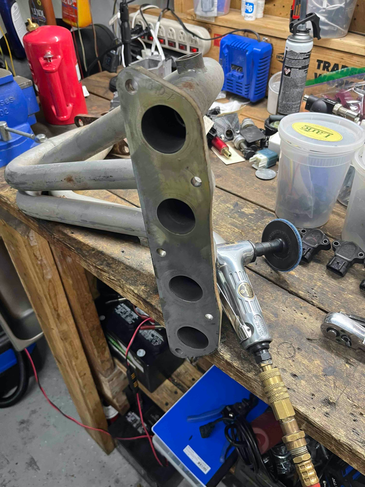
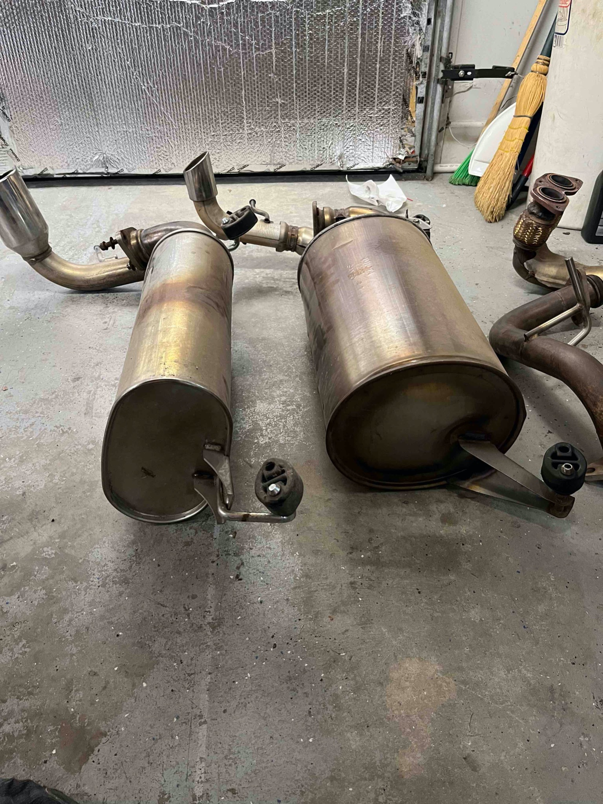
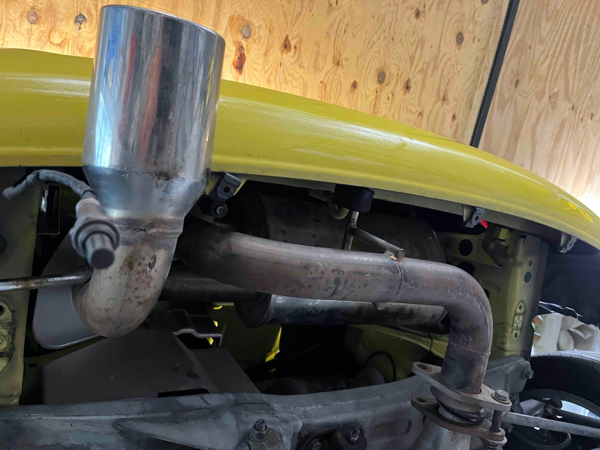
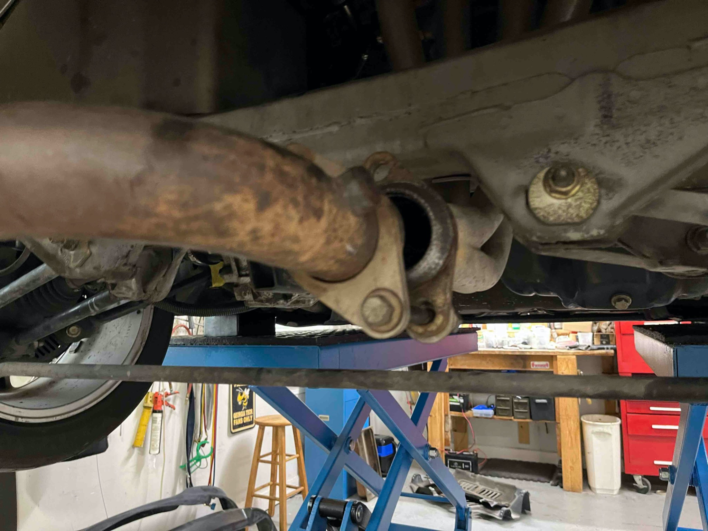
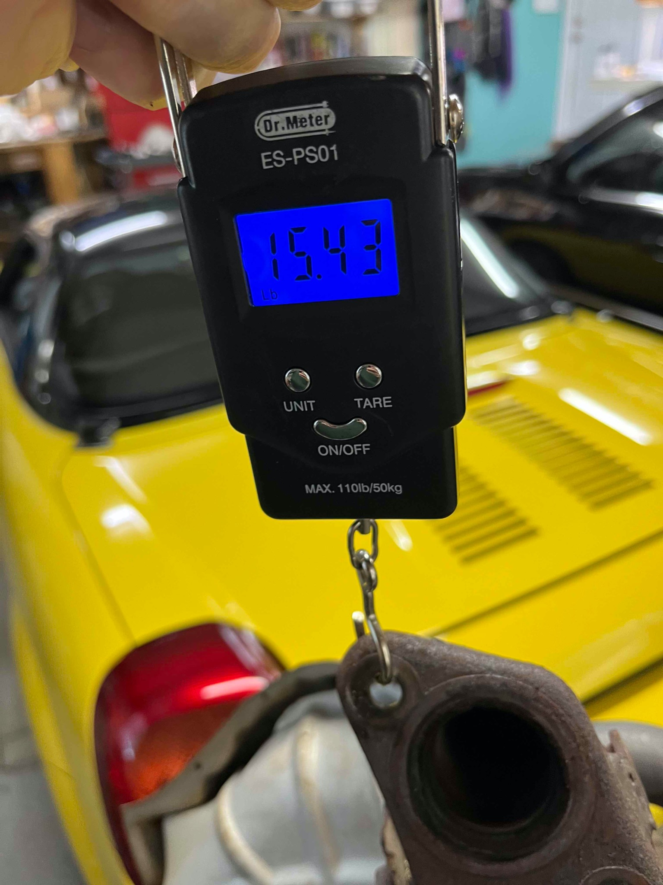
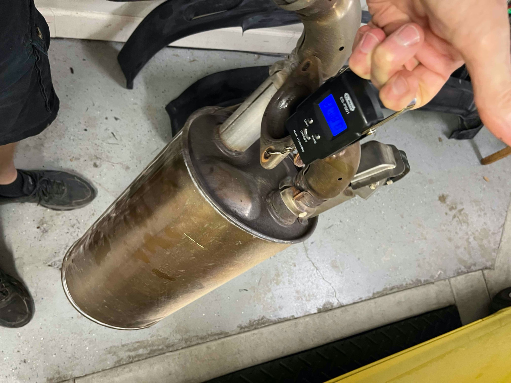
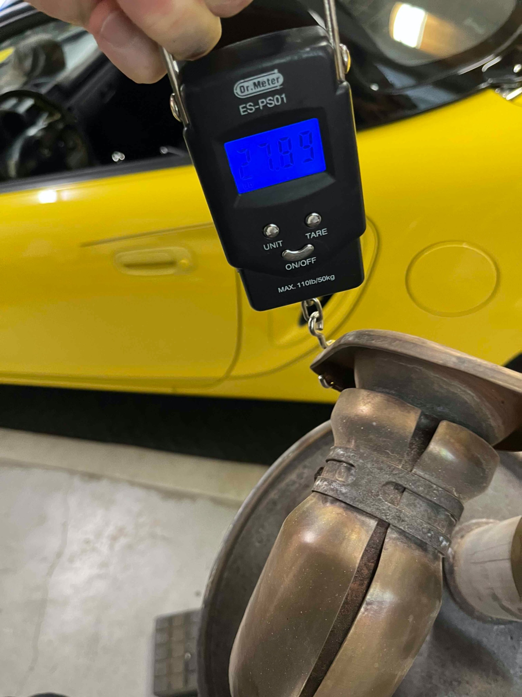
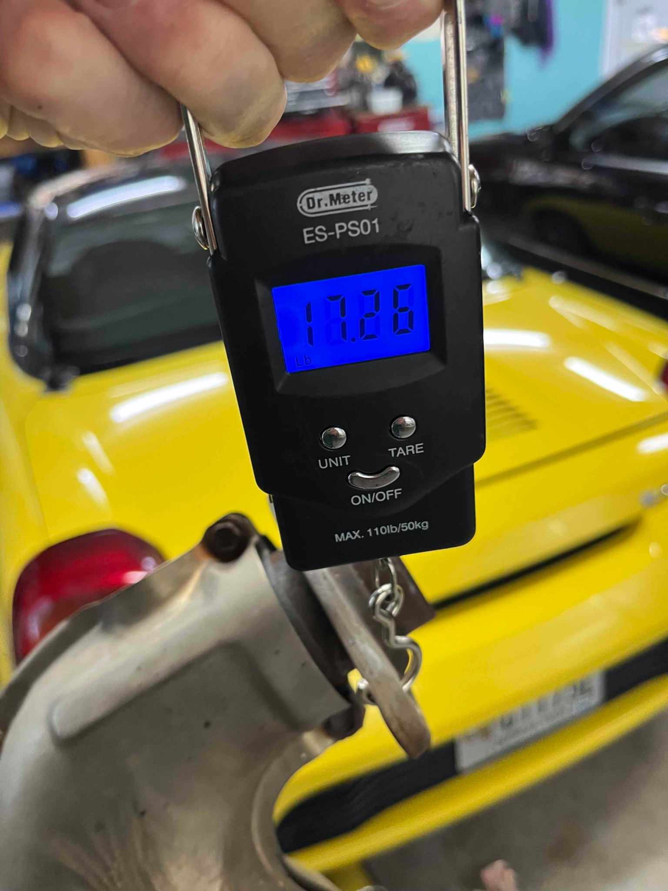
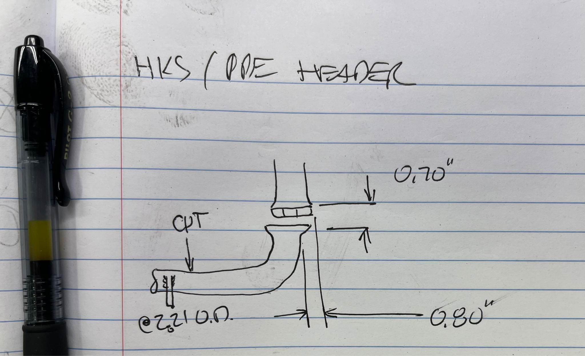

[Back to chapter index](../README.md)

# HKS Muffler with PPE Header

Composed by Cyclehead21@gmail.com

I scored these parts on a scrapped spyder at LKQ. They charged me \$78.55 total for “muffler and exhaust manifold”.

I later learned that Monkeywrenchracing sells the PPE header and downpipe for \$969, and Vivid Racing sells the HKS muffler for \$816. So it looks like I got a used \$1785.00 system… for 96% off!

I tried the header pipe on my stock spyder (which currently has a stock manifold with gutted pre-cats) for a few days. Slightly more noise, but no power change that I could detect.

Then I tried the whole system. Big change in the noise level! It’s not too noisy at light throttle, but when you give it some gas it changes character. It gets loud. It sounds quite nice at high revs approaching redline. On the way up it passes through some nice resonation bands. My butt dyno is not very perceptive and I couldn’t tell much difference - but I’m pretty spoiled by my other spyder with 270hp (engine swap).

It’s not my character though - I don’t want to be making lots of noise every time I hit the gas. It makes an audible “note” at highway speeds that doesn’t really interfere with talking, but it does make it harder to hear the radio. It forces me to be very aware of throttle - I can’t give it much gas without making a lot of noise. I don’t want to make noise in neighborhoods. It is embarrassing to give it the gas to keep up with traffic, and broadcast to all the other motorists “hey, I’m standing on the throttle here!”

I really detest loud cars that make obnoxious noises while I can match their speed without making any racket whatsoever (My swapped spyder has three cats and a large Borla muffler).

I tried the HKS muffler with the stock manifold (gutted precats) and stock main cat. It was louder at idle, and only very slightly louder above idle. Barely audible at highway speeds. Some nice little crackles on throttle lift-off. Maybe some very subdued resonations on the way up rpms.

So I have passed the PPE/HKS system on to another spyder owner (for a dirt cheap price).

One benefit of this system is weight reduction. The factory muffler is a heavy pig compared to the HKS/PPE system. PPE/HKS saves 23 lbs!

Stock muffler assembly = 27.5 lbs

Stock midpipe w/main catalytic converter = 16.7lbs

Stock manifold w/gutted precast = 15.4 lbs

TOTAL stock system weight = 59.6 lbs

HKS muffler assembly = 21 lbs

Straight midpipe w/o cat = 5.7 lbs

PPE header = 10.0 lbs

TOTAL aftermarket system weight = 36.7 lbs

## Videos with audio

[https://youtube.com/shorts/kwgjifrrZA8?si=H_pgc3n4ZkKQQ3xt](https://youtube.com/shorts/kwgjifrrZA8?si=H_pgc3n4ZkKQQ3xt)

[https://youtube.com/shorts/kwgjifrrZA8?si=kJDomeoJqt-6hC_c](https://youtube.com/shorts/kwgjifrrZA8?si=kJDomeoJqt-6hC_c)

## Pictures below

Both stock and PPE system have mismatch causing preload in the mid-pipe/header. Needs a new 2.25 OD 90 degree elbow, with about ¾ inch added to both legs.

[Back to chapter index](../README.md)
