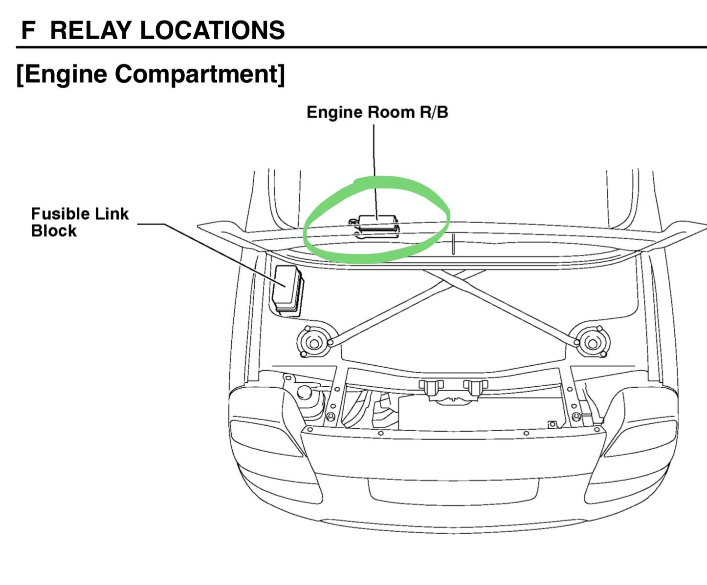
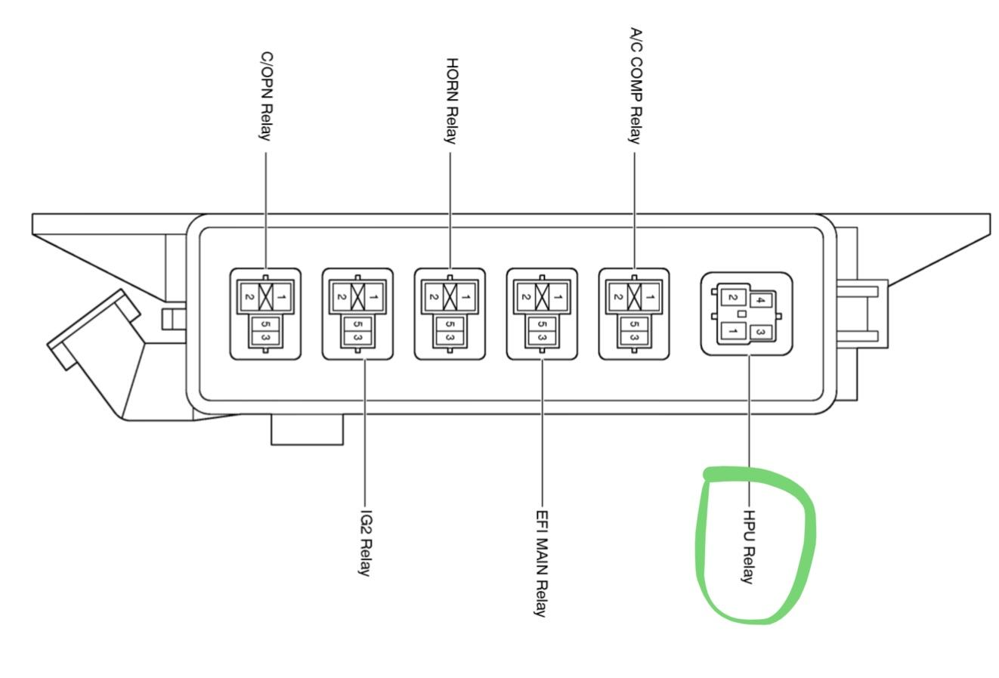
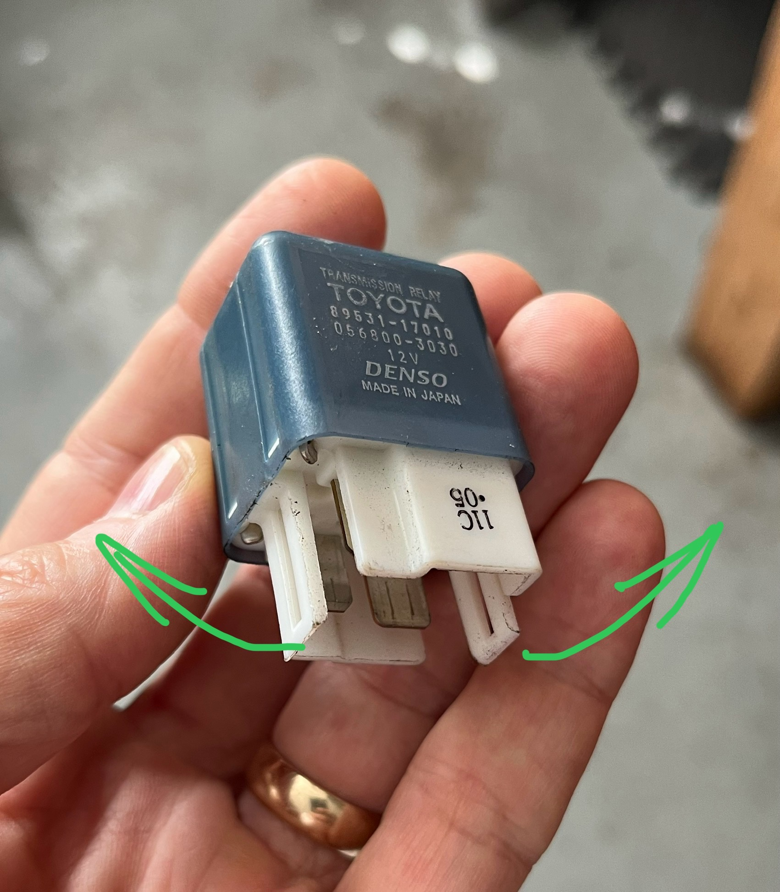

[Back to chapter index](../README.md)

# SMT - HPU Power Relay

Composed by Cyclehead21@gmail.com

Updated August 10, 2025

Feel free to copy and share, just give me a little credit!

The HPU power relay sends power to the HPU motor. It is triggered by the TCU. The TCU decides when to trigger the HPU motor based on input from the HPU pressure sensor. The relay is a regular 30 amp relay, nothing fancy. The two smaller blades are the triggering power. The two larger blades carry the 30 amp power to the HPU motor.

## Removal

The relay is located on the bulkhead in the engine compartment, forward of the battery. (Sketch below). The relay is nasty to remove. It has two heavy plastic clips, one on each side. They must be pried open to unlatch them. Unfortunately access to the clips is difficult, as they are hidden inside the relay block.

## Parts

The original part number is very expensive. However I have found some crossover part numbers that are more reasonable.

Toyota part number: 89531-17010

Denso part number: 056700-9340

Standard Motor Products: Part number RY186 ($21 on amazon)

BWD/NIEHOFF: Part Number R3056

The same relay is used as a Honda Odyssey Rear Window defroster relay.

[Back to chapter index](../README.md)
