[Back to chapter index](../README.md)

# HVAC Backlight

*Heating, ventilation, and air conditioning*

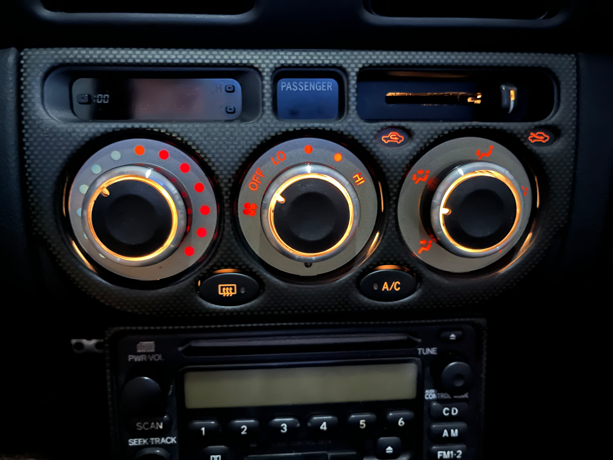

If the backlights behind the heater and vent control knobs are dark, the bulbs may be burned out. If the bulbs are good, then a diode in the “combination meter” gauge cluster may have failed. When the diode has failed, the gauge cluster backlights will work correctly, but the HVAC knob backlights will remain dark.

Here is how to fix:

## Step 1

Verify that the dashboard rheostat is not simply turned to the “off” (dark) position.

## Step 2

Check for burned out bulbs

Pull the three knobs off

Pull the fresh/recirc knob off

Remove two philips head screws

Pry/pull the faceplate off with your fingers

Remove three small gold colored philips head screws

Tilt the circuit board out (it hinges at the bottom on a ribbon connector)

Reach behind and remove (quarter turn) the burned out bulb(s)

## Step 3

If the rheostat is turned up, and the bulbs are good, then the problem may be inside the instrument cluster. Something in the cluster fails, and the gauge cluster backlights continue to work correctly, but the HVAC knob backlight bulbs will not illuminate.

## First option for repair

I did this change on my 2004 spyder. (after I tried the second option below - which did not work, and blew the fuse!)

Remove the cup holder and radio for access. From below the HVAC box,, unplug the white 14 pin connector (A2) from the bottom rear of the HVAC cluster.

Cut the white/green wire and connect the end coming from the HVAC to a ground.

Leave the end going towards the instrument cluster alone, or cap it off.

With this repair, the HVAC bulbs will be at full brightness, and no longer dim with the rheostat.

I cut mine a little too short, so I had to de-pin the wire from the connector to be able to strip the insulation.

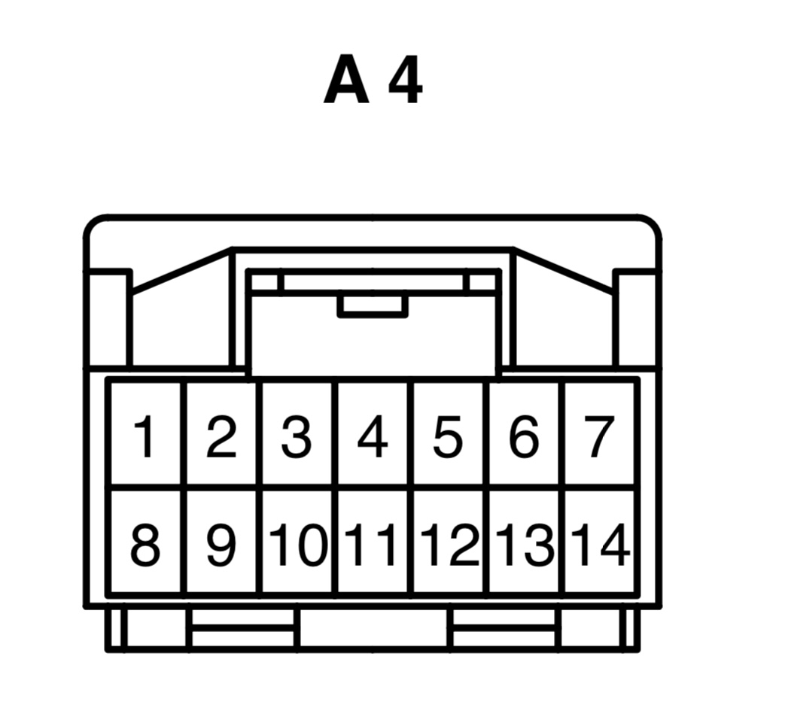

Pin \#8 is green (+12V to the HVAC)

Pin \#10 is white/green (-12V ground for the backlight bulbs)

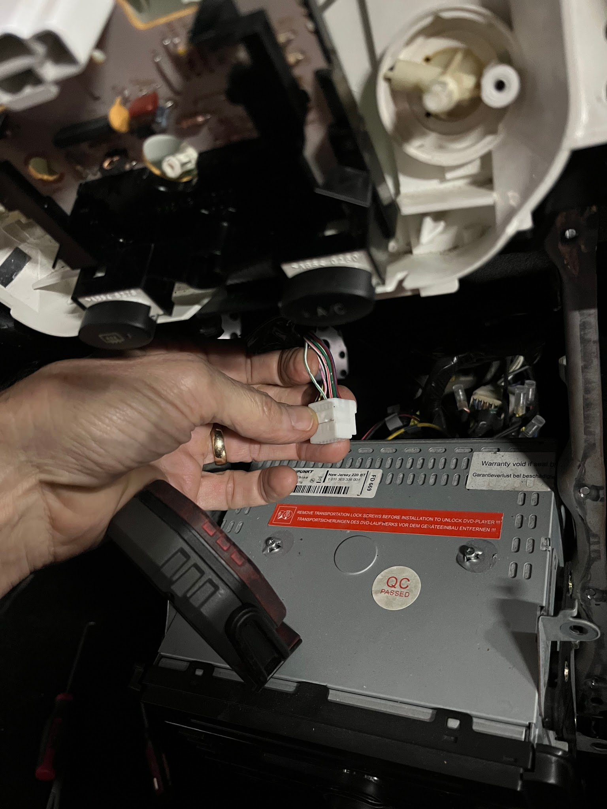

### Connector A2 pin usage

1 PASS SEAT BELT WARNING red/blue

2 PASS AIR BAG green

3 ?

4 PASS SEAT BELT WARNING & DEFOG ground white/black (ground)

5 PASS AIR BAG blue/white

6 ?

7 AC SWITCH white

8 AC SWITCH green (+12V, powers backlights and other items)

9 PASS SEAT BELT WARNING white/red

10 AC SWITCH white/green (-12V ground, grounds the backlights only, not sure why its called “AC SWITCH”)

11 ?

12 REAR WINDOW DEFOG purple/blue (pink?)

13 DEFROST yellow/black

14 AC SWITCH gray/red

## Second option for repair

This wiring change behind the instrument cluster (below). appears to ONLY work on pre facelift spyders. Credit for this fix goes to “ehenry” on spyderchat for figuring out the jumper repair. Thanks!!

Make a jumper to connect pin \#12 with pin \#22 at the large white 22 pin connector (C10) on the back of the gauge cluster. Be careful cutting and splicing the wires. There is no excess wire going into the harness. I cut and crimped in an extension on both wires. If necessary, you can unpin the two wires from the connector, and plug them back in when you’re done.

This video shows how to unpin.

[https://youtu.be/fg1xHMIDcy4](https://youtu.be/fg1xHMIDcy4)

Skip to 1:30 to miss the extraneous chatter.

With this mod, the HVAC backlights will not dim with the dimmer rheostat, but will stay full bright constantly. The gauge cluster backlights will dim properly.

Note: I had huge problems getting the oval defroster and AC buttons to work after snapping the faceplate back into position. For some reason the two oval buttons were too low, and they would snag in the faceplace cutouts, and stick in the “on” position. I finally filed the plastic a little along the bottom of the cutouts, and opened up the mounting holes for the white plastic control panel to allow sliding the knobs up slightly. Very odd.

See photos starting on the next page (below):

Remove the two silver philips head screws and pry the cover plate away from the dashboard.

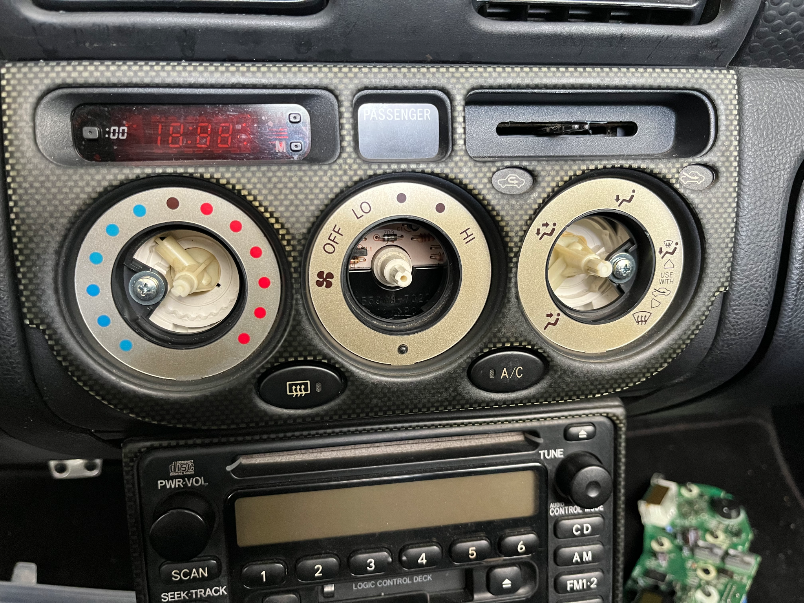

Remove the three gold colored philips head screws to free the PC board.

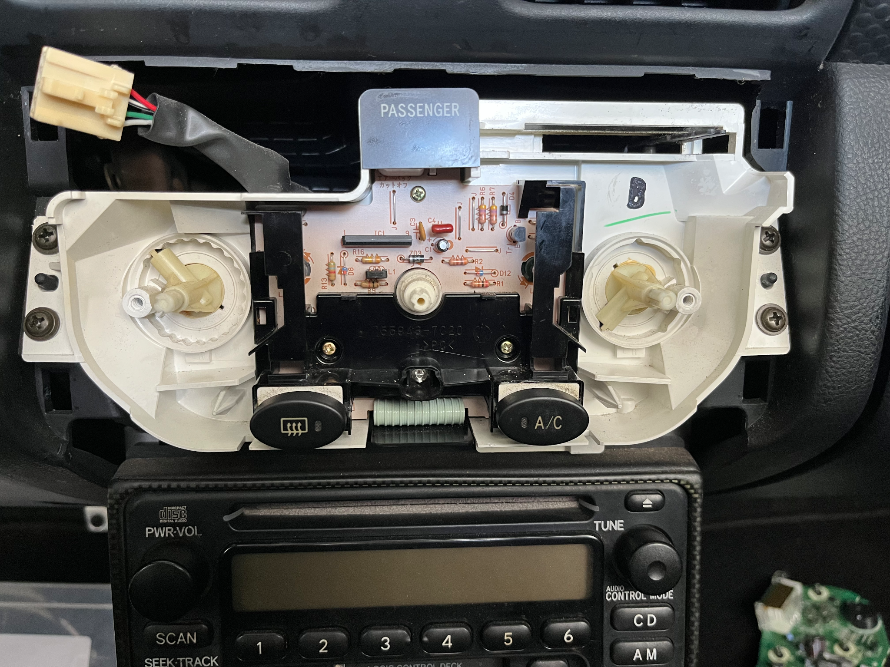

Watch out for the “passenger” window. It will fall off when you pull the PC board out. I stuck mine in place with a small piece of tape at the top, to hold it while I reassembled.

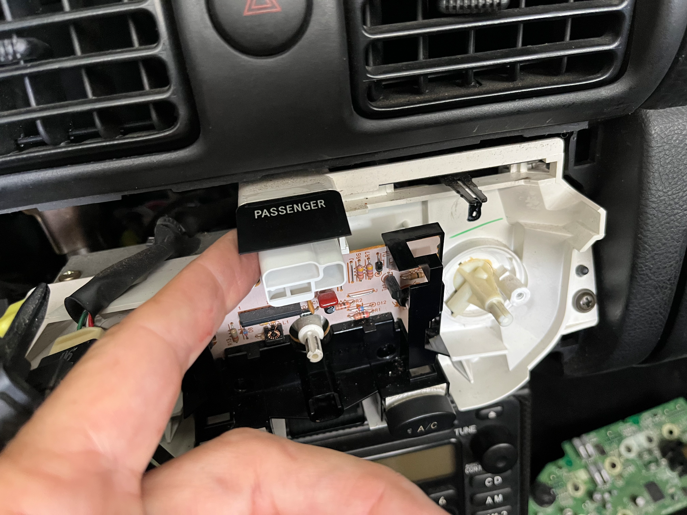

This is the 22 pin connector. The wires to jump are on the far left, and far right, on the same side as the connector lock plate. (white/black and white/green) May be other colors on facelift spyders. (?)

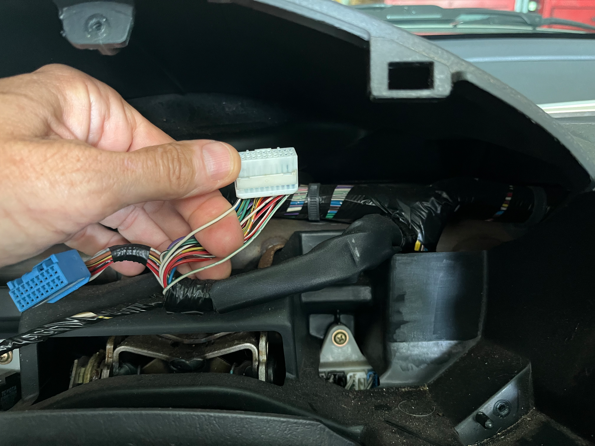

The two connectors can be unpinned if necessary to do the splicing. Stick your release tool into the larger hole above the connector, and pry the (hidden) plastic latch away from the metal connector to release it.

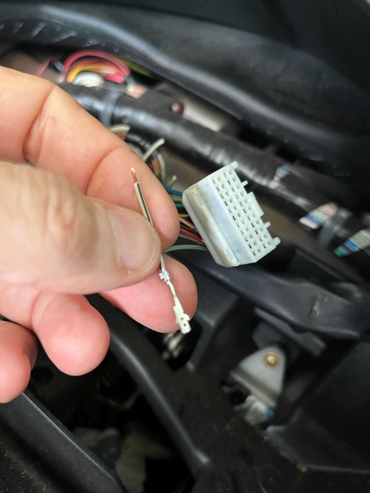

The yellow wire is my jumper. If I ever replace my gauge cluster with a “good one”, I will simply cut the yellow wire.

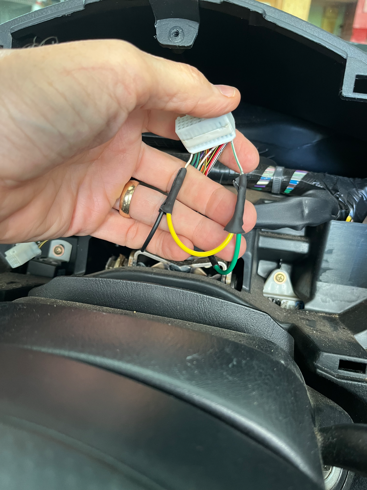

Fixed! Finally I can see my HVAC knobs at night again.

## Reference screenshots

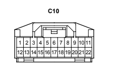

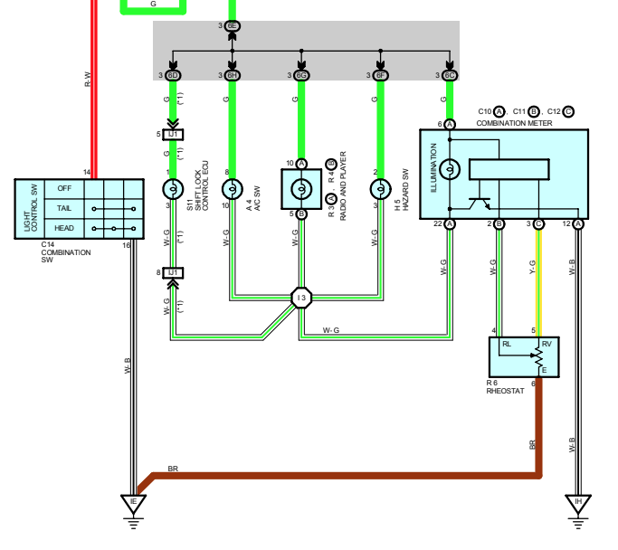

[Back to chapter index](../README.md)
