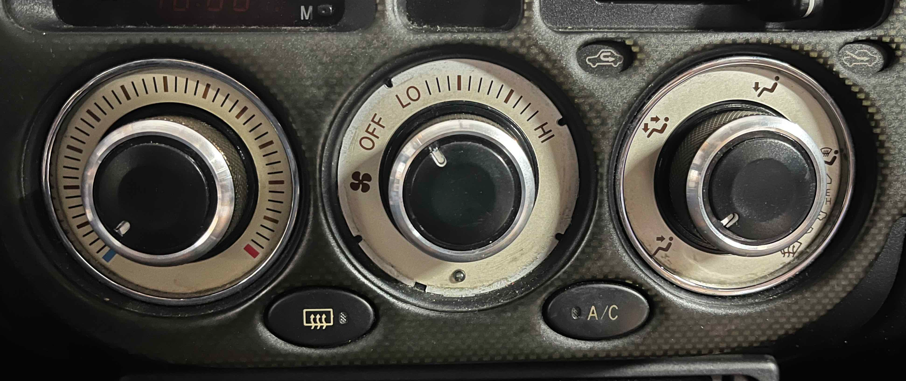
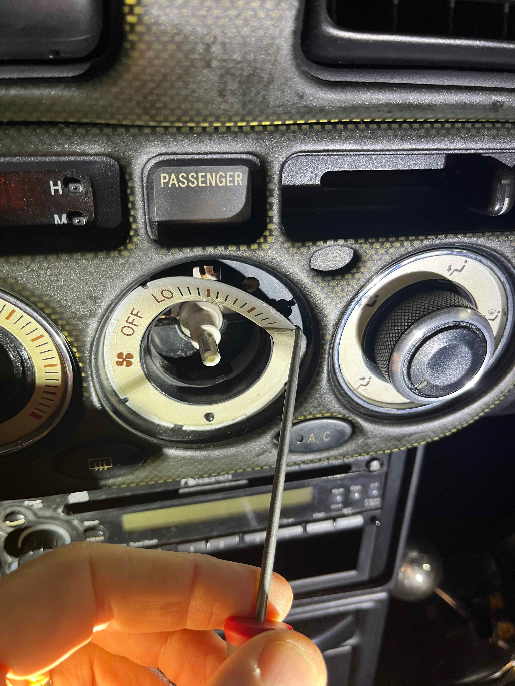
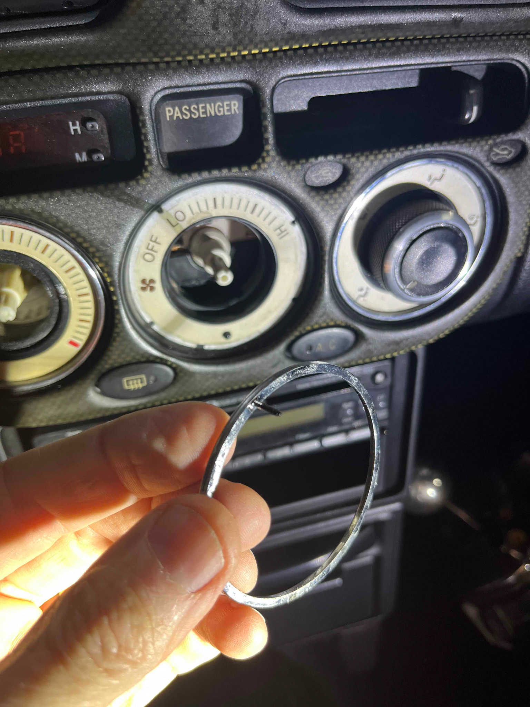
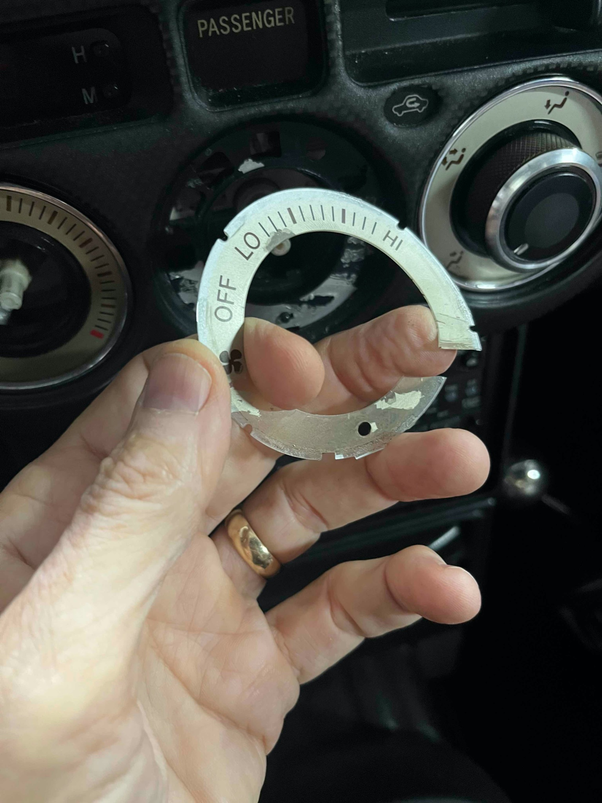
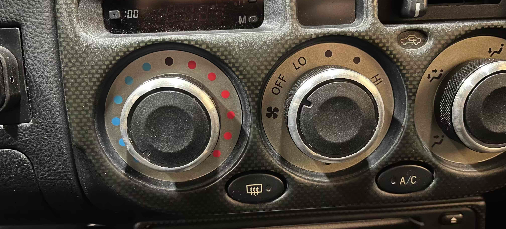
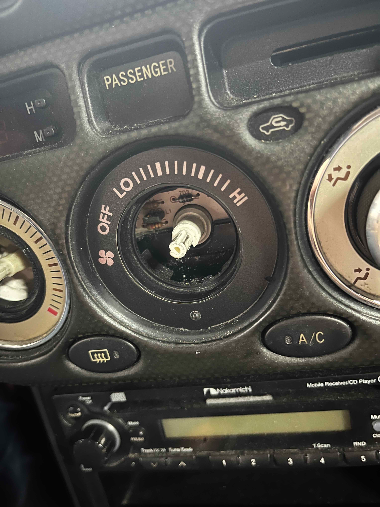
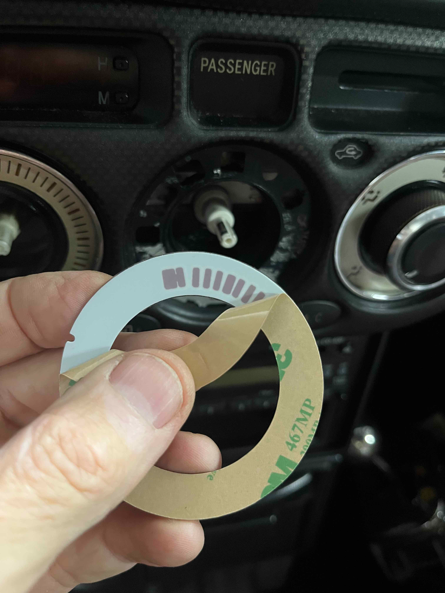
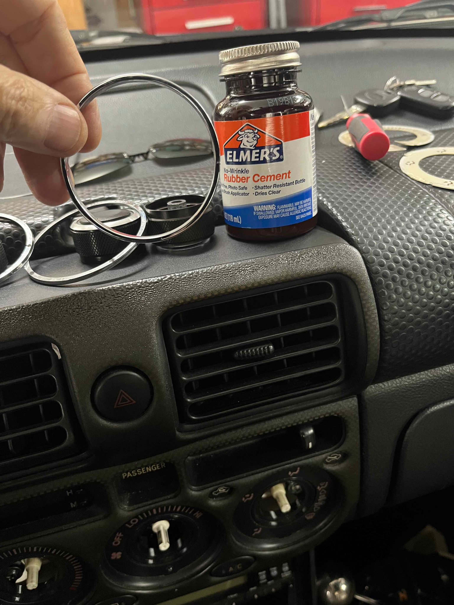
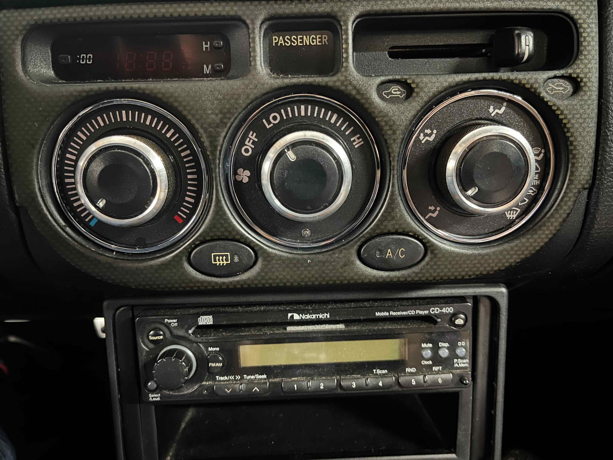

[← Chapter index](../README.md)

# HVAC Decals

By [Cyclehead21@gmail.com](mailto:Cyclehead21@gmail.com)

## Facelift

- 81942-17180
- 81942-17200
- 81942-17060

## Pre-facelift

- 81942-17140
- 81942-17110
- 81942-17130

## Background

The decals behind the climate control knobs get discolored with age. New decals are no longer available from Toyota. [Blackcatcustom.com](http://blackcatcustom.com) makes replacement decals with a silver, white or black face. They sell for $30/set plus $9 shipping.

From Blackcat: “There are 3 versions with different positioning notches that are cut out around the faces. For most vehicles the faces with the single notch are correct, some models came with chrome trim rings around the outside of the dials, those ones need the faces with the multiple notches and there is a version that had no notches at all.”

(Thanks to Revan on spyderchat for the reply from Blackcat!)

I think they have over-complicated the problem: I would say that if your car has the plastic chrome rings, then ask blackcat to cut all the possible notches (for all models). The plastic ring will hide them all. No need to worry about which version.

If you don’t have chrome trim rings - then ask for the version without any cutout notches.

All decals need the single external index tab at the bottom.

## Removal

Pull the control knobs straight off using your fingers.

If you have silver trim rings you may have to break the molded tits off the back to remove the rings. Mine were already broken. It’s not a big problem if they break.

I used a 90 degree pick to hook under an edge of each decal and pull them off. No need to remove the panel from the car - there is no better access from the back side.

Mine all seemed to be particularly stuck at the bottom of the decal. Some of them ripped the silver backing off the old decal.

Wipe off any dust so the new decals will stick.

## Installation

Peel the backing off the new decals and stick them in place. Get the external tab at the bottom tucked into the open slot.

If the plastic tits (sprues) are broken off your chrome trim rings, you can smear a little rubber cement on the back and outside edges of the rings to hold them. Wait for the rubber cement to dry and you can roll off any excess that gets smeared around the face of the decals.

## Pictures below

Old decals get destroyed when you pull them off.

Chrome trim rings should have four tits on them. Mine were all broken except one.

Silver from the old decals left behind. I left it there since it will be hidden by the new decals.

Destroyed the old decal during removal.

Pre-facelift cars don’t have chrome trim rings. Any notches in the decals will be visible, and ugly.

If you don’t have chrome trim rings, the new decals with any notches will be ugly. Be sure to specify “no notches” when you order from Blackcat.

I smeared a little rubber cement around the outside edge of my chrome rings, since all the tits were broken off.

New trim rings!

[← Chapter index](../README.md)
