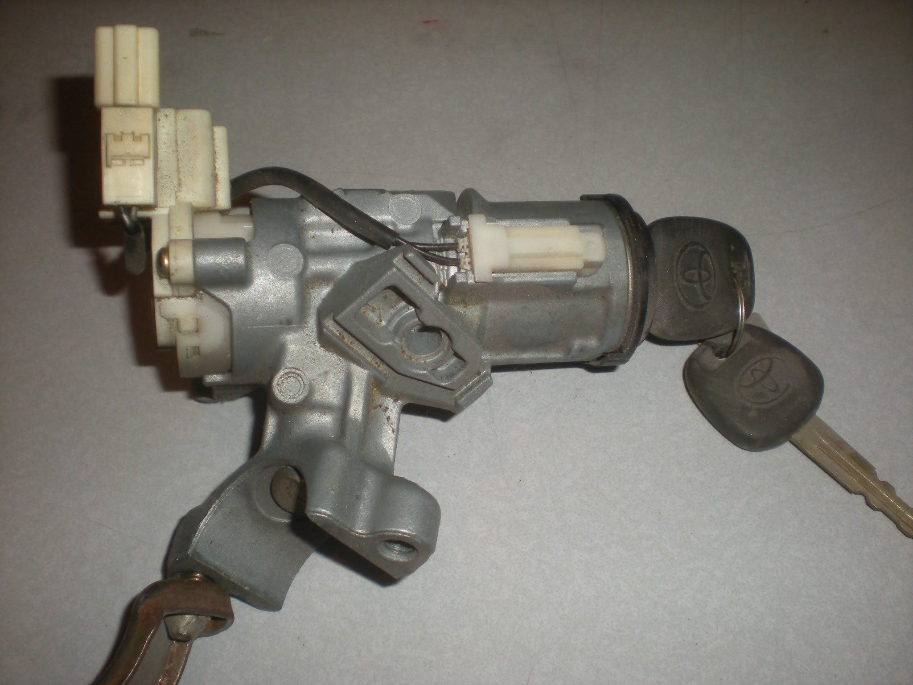
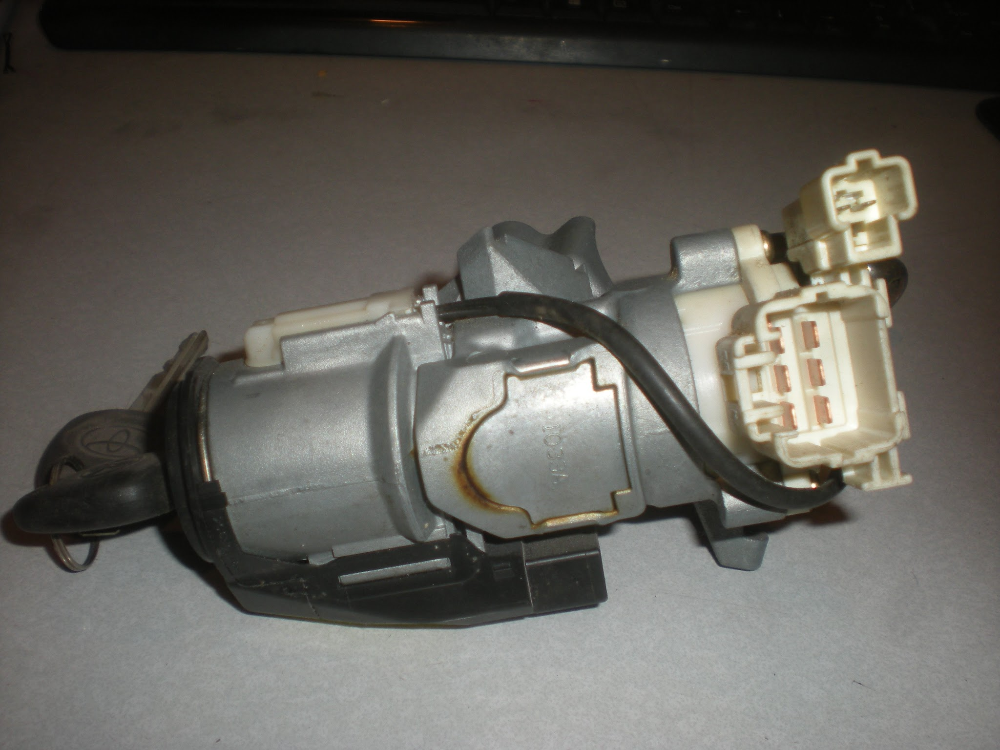
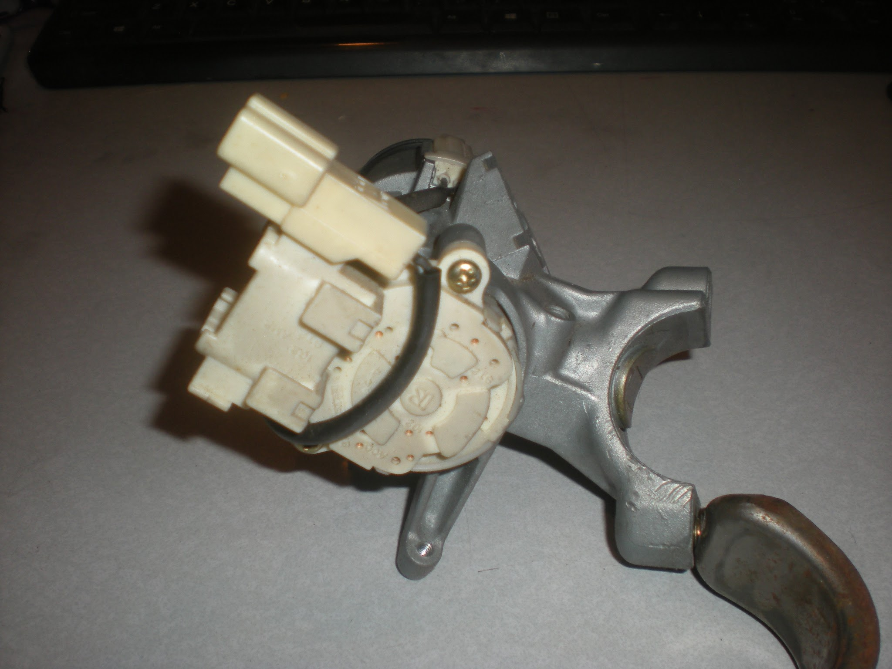
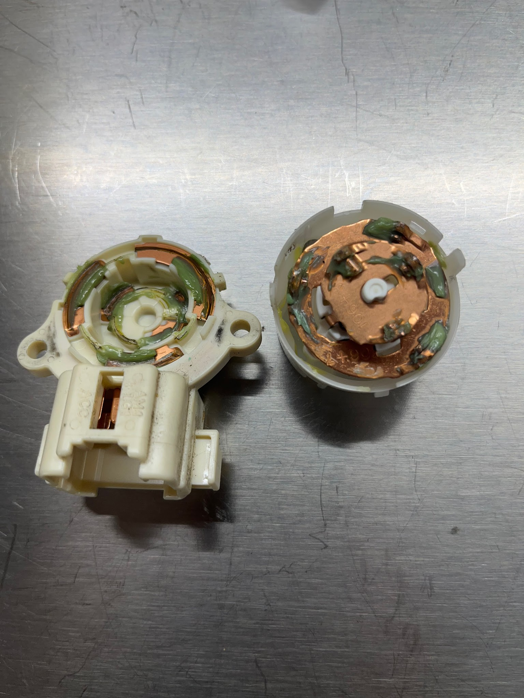
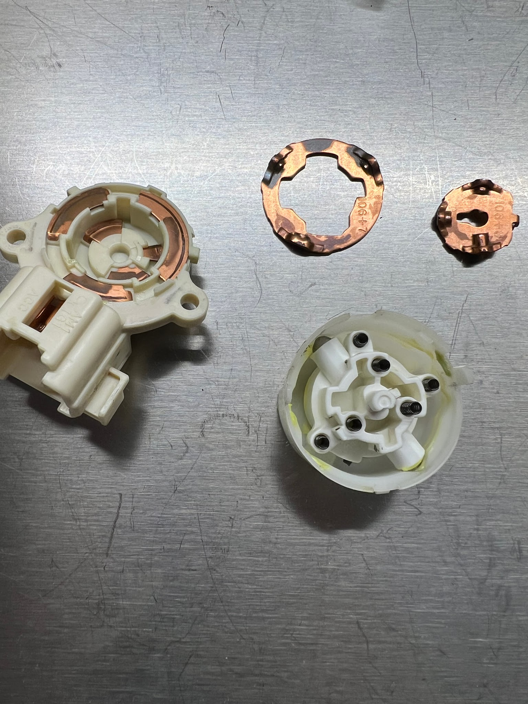
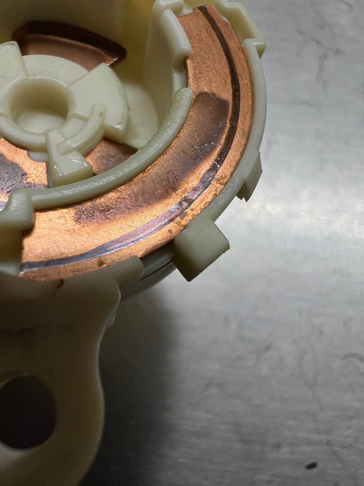
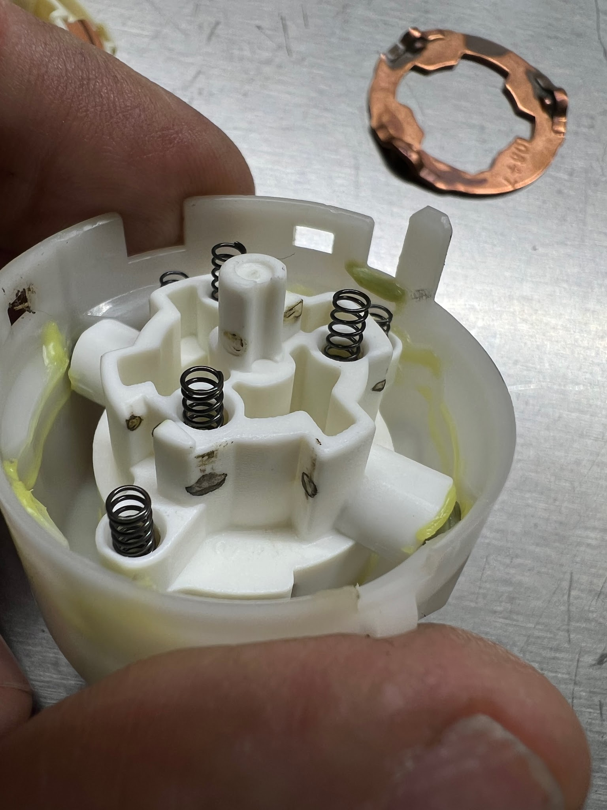
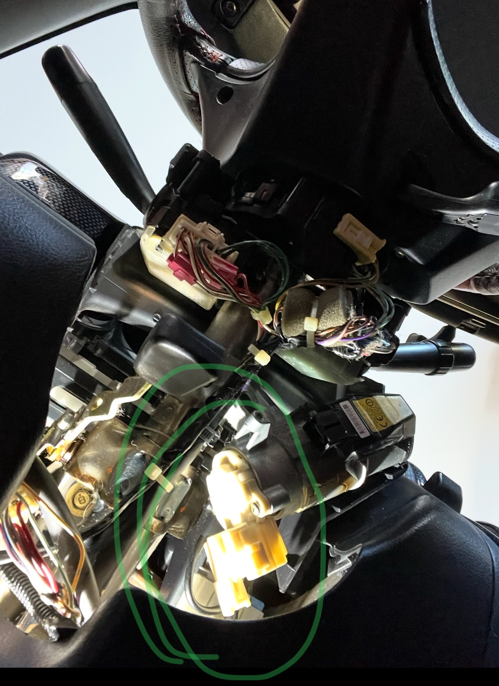

[← Chapter index](../README.md)

<!-- Initial conversion 0.1; converted 2026-09-18. Detailed technical review deferred. -->

# Ignition Switch Contacts - No Start

Researched, invented and documented by cyclehead21@gmail.com

## Background

I had a no-start condition in my Spyder.

When I turned the ignition to the “start” position I would get no response whatsoever. Not even a click. After trying repeatedly, the car would abruptly start with no problems.

I could not get it to consistently fail, so troubleshooting was difficult. I removed the starter and cleaned the starter solenoid contacts. (Large copper contacts). The no-start condition continued to happen.

Next I removed the electrical contacts from the back of the ignition switch and cleaned the contacts inside the switch. That resolved the problem!

Video shows the switch box: [https://youtube.com/shorts/jTNVRr-x36Q?si=dzAnsPWvYnp_mhK4](https://youtube.com/shorts/jTNVRr-x36Q?si=dzAnsPWvYnp_mhK4)

## Procedure

The ignition switch contacts are inside a yellow plastic cylinder that is screwed to the backside of the ignition switch. It is held with two Phillips head screws.

Remove the lower half of the plastic cover under the steering wheel. (Rotate the steering wheel to access two Phillips head screws)

Remove two electrical connectors attached to the ignition switch box.

Remove two Phillips head screws holding the switch box to the back of the ignition, and remove the switch box.

Open the switch box. Watch for tiny springs. The contacts are lubricated by Toyota with some green grease. Clean the contacts with brake cleaner spray, compressed air, Dremel with sandpaper, and scraps of sandpaper.

Lubricate/protect the contacts with some suitable grease. I used Dow Corning silicone grease and reassembled.

## Photos below

**Switch and lock PHOTOS ARE FOR REFERENCE ONLY. NO NEED to remove all this stuff!**

[← Chapter index](../README.md)
