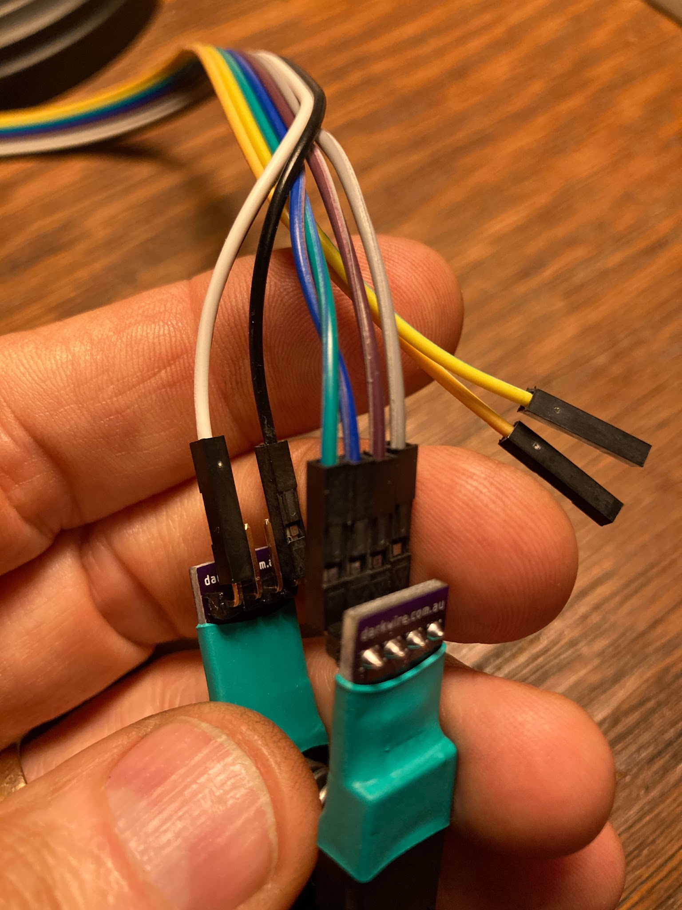
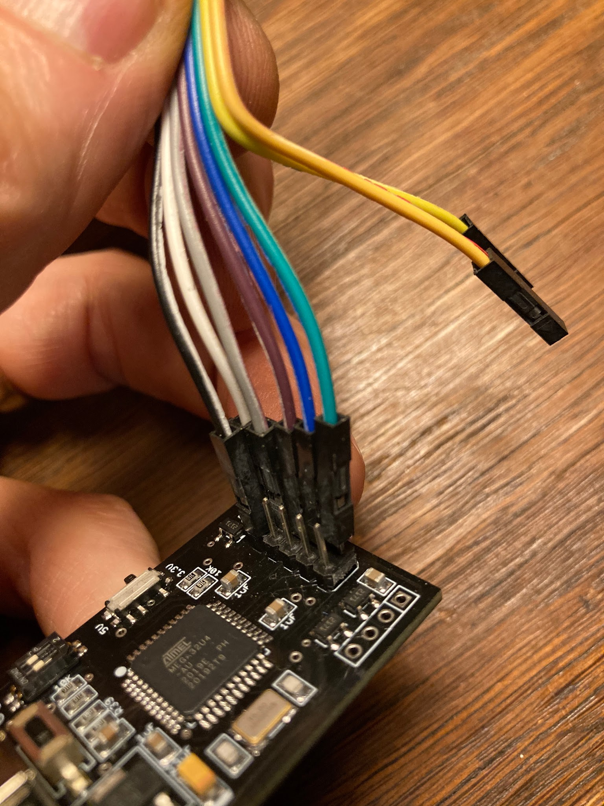
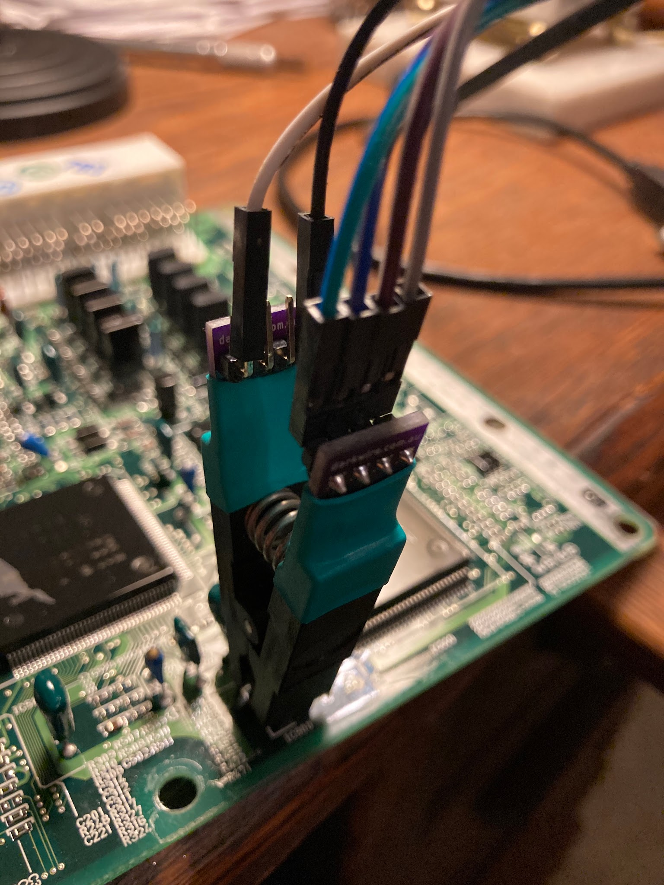
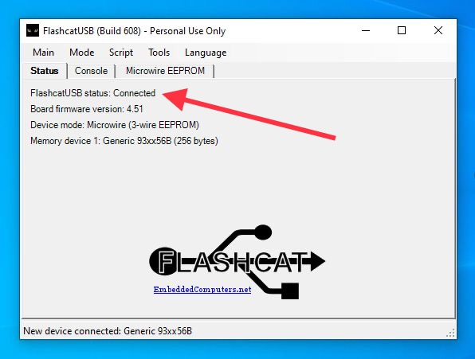
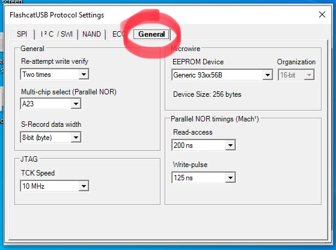
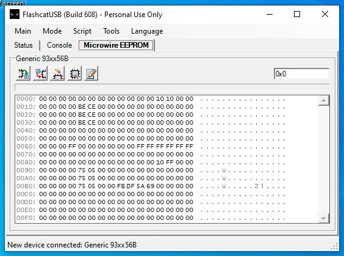
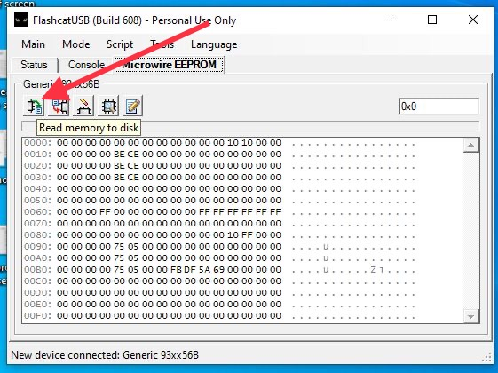
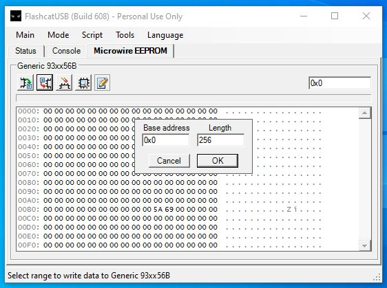
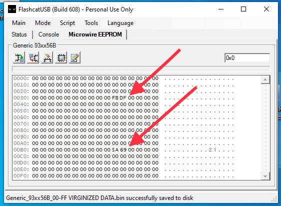
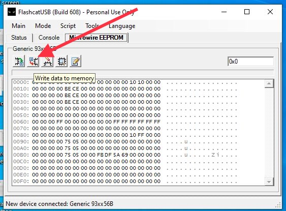

# 
Immobilizer Flash Procedure

[Back to chapter index](../README.md)

## Contents:

- [Credit](#credit)

- [Background](#background)

- [Note (How to add a key, if you have a master key)](#note)

- [Process Summary](#process-summary)

- [Clear the Immobilizer](#immobilizer-procedure)

- [Programming keys to a cleared ECU](#programming-new-keys-to-a-cleared-ecu)

- [Links to buy keys](#links)

> UPDATE: April 2023 - it appears the memory programmer I linked is no longer available. The general process should be the same with a different EPROM programmer board, but the exact wire hookups and settings will be different. Sorry, I can’t outline hookups with another board. I’m just a scribe.

## Credit:

I know absolutely nothing of how these steps work or the EPROM magic involved. I am merely a scribe and a test monkey. Credit for the technical content goes to Joel Faas and "Jason" in Australia. Thanks guys!

## Background:

Spyder keys have an RFID chip molded into the plastic handle. There is a coil buried in the plastic trim surrounding the ignition key slot (on the dashboard), that communicates with the RFID chip in the removable key. The spyder ECU must be programmed to recognize the RFID chip in each key, before it will allow the fuel injectors to fire. If the chip is not programmed (and the key is cut to work in the ignition switch) the engine will turn over but it will never run.

The ECU immobilizer chip mounted to the ECU circuit board keeps track of the ignition keys that are registered to the ECU. Typically there are two Master keys and one Valet key. The Master keys will open all the locks on the car, plus start the engine. The Valet key is cut differently allowing access only to the ignition switch - but not the glovebox, engine compartment lock, or cubby door locks. The Valet key will allow starting the engine.

Problems result when the master key(s) are lost. Techstream software will allow you to program additional keys, however you must have one master key. My used spyder came with only a valet key so I was stuck.

I think the dealer price for “flashing” the computer to accept new keys is expensive. Locksmith stores will supposedly flash the computer for $50 and up. I didn’t pursue that avenue since I prefer having the tools to do stuff like this myself. And the locksmith wanted me to schedule a time, then wait an hour or more while they did the work at their shop.

Other spyder owners have shared that even the Toyota Dealer cannot program keys, if all you have is a valet key. They want to sell you a whole new ECU for $1500-$1700!! (A new ECU will have a cleared immobilizer, same as this procedure creates.)

It appears that there are a limited number of registry spots on the chip for keys. If your ECU has had too many keys already programmed, you may need to clear the immobilizer - even if you have a working master key. (Note that Toyota’s solution for this problem is to SELL YOU A NEW ECU.)

---

## Note:

To add a key…IF YOU HAVE A MASTER KEY THAT WORKS, the processes (below) will allow you to program an additional master key without clearing the immobilizer. I haven’t tested either process. If you do need to virginize or clear your immobilizer chip, then disregard this section.

### Adding a key, using Master key:

(This process worked for me, to add ONE additional master key)

- Get in the car and shut the doors

- press and release the brake and gas pedal once

- insert your master key into the ignition switch

- press and release the gas pedal 5 times

- press and release the brake pedal 6 times

- remove master key

- insert new key

- press and release the brake and gas pedal once

- wait (the security light will blink slowly while you wait)

- After about 50-80 seconds the security light will quit blinking - success!

- remove new key

- press brake

-or-

(This process did not work for me)

### To register an additional master key:

- Insert already registered master key into key cylinder

- (within 15 sec) Depress and release the acceleration pedal 5 times.

- (within 20 sec) Depress and release the brake pedal 6 times then remove the master key.

- (within 10 sec) Insert key to be registered as a master key into the key cylinder.

- (within 10 sec) Depress and release the accelerator pedal 1 time (security light blinks).

- Wait 60 seconds and the security light will go off and the new key is now registered.

- Remove key and press and release brake once within 10 seconds of security light going out to end the program mode.

- Program mode will also end 10 seconds after (either the security light going off or removing the key).

---

## Process Summary:

No soldering or de-soldering!

Buy a small circuit board, and an IC test clip (currently both pieces cost about $53 on amazon) Links at the very bottom of this document.

Download and install a program and drivers (free) onto Windows computer or laptop

Remove the ECU from your spyder

Re-program the immobilizer chip on the ECU board

Reassemble, and the ECU will accept any three keys.

(Of course any “new” keys will need to be cut before they will turn in your ignition and door locks. If you are working with key blanks, you’ll have to get them cut at the hardware store.)

## Immobilizer Procedure:

### 1.1 Buy stuff

Order “Flashcat USB Memory Programmer” (was available on Amazon for $46)

Order “SOIC8 SOP8” IC Test Clip from Amazon (was available on Amazon for $7)

Links are at the bottom of this document.

### 1.2 Install

Download Flashcat software and drivers from “embeddedcomputers.net”.

They are all bundled in a zip file.

Extract the files and store them all in one folder.

### 1.3 Remove the ECU

Disconnect the battery. Remove the ECU from behind the driver’s seat. It’s bolted to the firewall, partially hidden under a cardboard piece. Four 10mm bolts. Unplug the four big connectors. I push the release tab with a small screwdriver, then gently pry the connector loose.

Open up the ECU case (four phillips screws)

Remove the ECU circuit board (two phillips screws)

### 1.4 Flashcat board set up

When the flashcat board arrives you have to install drivers on your PC.

Follow the documentation in the “Manual” folder that comes with the flashcat download.

Note: Windows 10 will generate an error “Windows found drivers but encountered an error while attempting to install...check with the device manufacture”. This is a lie. Windows 10 has a driver protection block built in. You must disable it before you can install the driver files. You need to disable “Device Driver Signing”. Google the process. It involves changing the startup settings, advanced options, startup options, and restarting the computer 2-3 times. The protection will reset automatically after you have installed the drivers and restarted the PC.

Link: I used “Option One”. [https://www.tenforums.com/tutorials/156602-how-enable-disable-driver-signature-enforcement-windows-10-a.html](<https://www.tenforums.com/tutorials/156602-how-enable-disable-driver-signature-enforcement-windows-10-a.html>)

Next you need to verify the correct firmware is installed on the flashcat board.

Open the flashcat program, and hit the “console” tab.

Check at the bottom for the messages “Disconnected from Flashcat USB Classic device”, and “software requires firmware version 4.5.1”. If you see this (like I did) then you need to install the newer firmware included with the downloaded files.

Follow the Manual instructions for “bootloader” - basically throw one tiny dip switch to the “off” position. Click on the new firmware file in the downloaded file. Throw the switch back to the “on” position.

Note: I saw two hex files in the “firmware” folder. One suffix 4.51.U2 and another suffix 4.51.U4. The U4 file worked for me.

Check the switches on the flashcat board. The two dip switches should both be “on”, and the voltage switch should be set to “3.3v” (not “5v”).

If everything is working, the flashcat board will have one red LED showing when the board is plugged into a USB port. Then a blue LED will illuminate when you launch the flashcat program.

### 1.5 Flashcat board hookups

You need to plug in six wires on the board, and six wires on the clip.

See the photographs.

Don’t confuse the gray and white wires (look at the sequence of wires in the strip)

### 1.6 ECU hook up

Find the immobilizer chip on the ECU circuit board. (It is labelled “IC900”)

Clean the protective varnish off the 8 tiny wires.

Scrub the terminals with a stiff brush and rubbing alcohol and pat it dry with towels.

Hook the spring loaded clip onto the immobilizer chip as shown in the photos. Don’t get it backwards - the four wires go near the edge of the ECU board.

I presume it’s smart to hook up the clip to the chip with the flashcat board unplugged from the computer. (Voltage spikes?)

Note: During one test I heard a faint squealing from the odometer PC board speaker. I found that it was caused by switching the voltage switch on the flashcat board to 5v. Don’t do that. Set the switch to 3.3 volts.

### 1.7 Flashcat program settings

Set all the pulldown options like shown in the pictures below.

Don’t dick around with the other settings, leave them as they are preset.

### 1.8 Rewriting the immobilizer

It’s a good practice to copy the existing codes from the chip before you modify them. If something goes wrong, you can copy the original settings back onto the chip. See pictures below.

Edit the hex codes on the immobilizer, changing them all to “00” EXCEPT the four cells shown in the photos. You only need to do this once, since you can save the zero’d out settings in a file, and use it again in the future. (Avoids you having to type all those zeros)

Write your edits to the chip. See pictures below.

Note: To save your edits you must hit the “edit buffer” button a second time. It will ask if you’d like to save the changes to the chip.

### 1.8 Reinstall and program keys

Now the ECU is “virginized”, and it will be ready to accept new keys with no hassle.

It is a very quick process to program up to three keys.

Reinstall the ECU into the car, hook up the battery and get all your keys laid out.

Insert any key, and look for the immobilizer LED on the dashboard to go solid red (not flashing)

This is “program mode”.

Follow the procedure below, inserting your keys for 5 seconds each, one after the other.

I did it twice and never got really good at understanding which one gets assigned as “valet” key. (I think I failed to wait 30 seconds for the car to exit “programming mode”.)

But they all start the car, and I ended up with two Master keys.

### 1.9 Programming keys

Here is the process for programming new keys to the virginized ECU.

#### Programming new keys to a cleared ECU

Normal standby/secure mode will show a slowly blinking security light (just below the fan speed knob on your HVAC panel). The red LED will flash once approximately every 2 seconds).

Note: Three keys are needed. (Otherwise the ECU will get stuck in “programming mode” as it waits for the 3rd key to be programmed. If this happens, the car will start using the first and/or second programmed key, but the red light will stay illuminated (solid red) when you remove it. You can program blank (uncut) keys if you like. The programming only looks at the chip. It doesn’t care if the key will turn in the ignition or not.

When a newly “flashed” ECU is connected to the car, the ECU will be in Auto-Programming Mode and will accept new keys per the following procedure. This is a one-time deal after clearing the immobilizer. When you finish this procedure, the new keys are programmed “permanently” (unless you remove the ECU and flash the chip again.)

#### STEPS:

1. Briefly insert any key into the ignition lock cylinder and remove immediately. The security light should illuminate and remain illuminated. This means the ECU is in “programming mode” and ready to program new keys.

2. Insert the first transponder key into the ignition lock cylinder for registration, DO NOT TURN ON. The Security light will blink ONCE indicating it has accepted one key. After 3-5 seconds remove the first key from the ignition. The Security light will remain on (solid) indicating you’re still in programming mode.

3. Insert the Second transponder key into the ignition lock cylinder for registration, DO NOT TURN ON. The Security light should blink TWICE indicating it has accepted two keys. After 3-5 seconds remove the second key from the ignition. The Security light will remain illuminated (solid) indicating you’re still in programming mode.

4. Insert the third transponder key into the ignition lock cylinder for registration, DO NOT TURN ON. The light will blink once, then go off. After the Security light goes off remove the third key from the ignition. The security light should extinguish and then commence to blink slowly in the “standby” mode. (If it stays dark, simply close the car doors and it will go into security mode and commence slow flashing)

5. Wait 30 seconds and the programming mode will close. (Note: One time I tried to program only two keys, and the ECU refused to exit programming mode. I had no luck forcing it to exit programming mode, until I programmed a third key.)

The first two keys are now programmed as Master keys, and the 3rd key is programmed as a Valet key.

#### To verify keys are programmed:

Insert either of your master keys into the ignition. The security light will stop blinking immediately.

Insert the “valet” programmed key. The security light will remain illuminated (not Blinking) for 2 seconds and then go out.

If the Security light continues the slow “standby” blinking with any key inserted (one blink every 2 seconds), then that key is not programmed to the car.

## SEE PICTURES BELOW:

Hook up wires connecting the IC Clip to the Flashcat board.

Attach the IC clip to the immobilizer chip. The four wires go towards the edge of the ECU board.

Launch the Flashcat program and verify it is “connected” to the chip.

Verify the Mode tab settings are all correct.

Set all the Protocol “General” settings as shown.

Don’t dick around with the other tabs (SPI, SWL, NAND etc)

Look at the gibberish in your immobilizer, prior to flash.

Save a copy of these settings, in case something goes awry.

When the little box with “ Base Address 0x0” and “Length 256” comes up, just hit okay.

Change the hex codes all to “00” except the four that are marked. Leave them alone.

To avoid editing all these hex codes to “00” every time you flash an ECU, you can do it once, then save the binary file to use in the future. It seems best to leave the pre-assigned file name alone, and add your own suffix to the file name.

If you have previously saved a “00” file, instead of typing all those zeros, you can just “Write the file” to the chip memory.

Th th that’s all folks.

Close the Flashcat program and unplug the Flashcat board.

Then unclip the IC clip.

Go install the flashed board in the car.

## Links:

### Flashcat circuit board on Amazon

[https://www.amazon.com/Flashcat-Memory-Programmer-EEPROM-software/dp/B00F2P9AS6/ref=sr\_1\_1?dchild=1&amp;keywords=flashcat&amp;qid=1607046305&amp;sr=8-1](<https://www.amazon.com/Flashcat-Memory-Programmer-EEPROM-software/dp/B00F2P9AS6/ref=sr_1_1?dchild=1&keywords=flashcat&qid=1607046305&sr=8-1>)

EDIT: I think the above linked part is no longer available. I believe this one will work the same, but I don’t have hookups figured out, and I’ve never tried it.

[https://www.amazon.com/Flashcat-Memory-Programmer-EEPROM-software/dp/B00F2P9AS6/ref=sr\_1\_1?crid=2FMA9DUT4VK1W&amp;keywords=eeprom+flashcat&amp;qid=1687623746&amp;sprefix=eeprom+flashcat%2Caps%2C84&amp;sr=8-1](<https://www.amazon.com/Flashcat-Memory-Programmer-EEPROM-software/dp/B00F2P9AS6/ref=sr_1_1?crid=2FMA9DUT4VK1W&keywords=eeprom+flashcat&qid=1687623746&sprefix=eeprom+flashcat%2Caps%2C84&sr=8-1>)

### Test Clip on Amazon

[https://www.amazon.com/Organizer-SOIC8-Flash-Programmer-Adpter/dp/B07ZCZ7L85/ref=sr\_1\_4?dchild=1&amp;keywords=SOIC8+SOP8%E2%80%9D+IC+Test+Clip&amp;qid=1607046412&amp;sr=8-4](<https://www.amazon.com/Organizer-SOIC8-Flash-Programmer-Adpter/dp/B07ZCZ7L85/ref=sr_1_4?dchild=1&keywords=SOIC8+SOP8%E2%80%9D+IC+Test+Clip&qid=1607046412&sr=8-4>)

### Spyder keys with RFID chips

[https://www.uhs-hardware.com/products/2000-2005-toyota-toy57-transponder-key-4c-chip-k-toy57?rq=mk\_toyota~md\_mr2~yr\_2004](<https://www.uhs-hardware.com/products/2000-2005-toyota-toy57-transponder-key-4c-chip-k-toy57?rq=mk_toyota~md_mr2~yr_2004>)

### Combined flip key and fob:

[https://www.ebay.com/itm/361995951119?fbclid=IwAR2LUziLQ9CeOB90cGkqsx4-zJl8BQF8zSxEu7\_hzIOUAEr4lFVJ07nTYxA\_aem\_AUXgkVrF2iIJnWPKiRgiX6zbqV1GUW9FNdN1AVr5Jxw2xB4G1drlzYshYlBgSYLsRex3qIhSory4b3fZzUZusBVQ](<https://www.ebay.com/itm/361995951119?fbclid=IwAR2LUziLQ9CeOB90cGkqsx4-zJl8BQF8zSxEu7_hzIOUAEr4lFVJ07nTYxA_aem_AUXgkVrF2iIJnWPKiRgiX6zbqV1GUW9FNdN1AVr5Jxw2xB4G1drlzYshYlBgSYLsRex3qIhSory4b3fZzUZusBVQ>)

---

*Initial conversion 0.1 — September 18, 2026. Detailed technical review pending.*

[Back to chapter index](../README.md)
