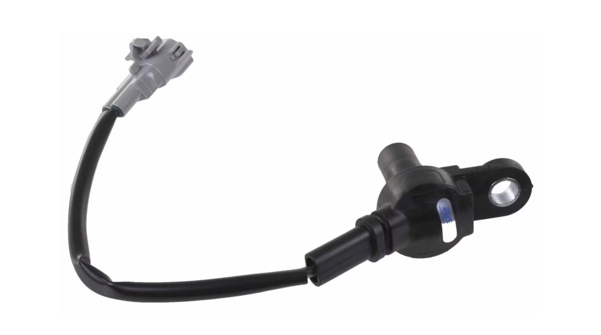
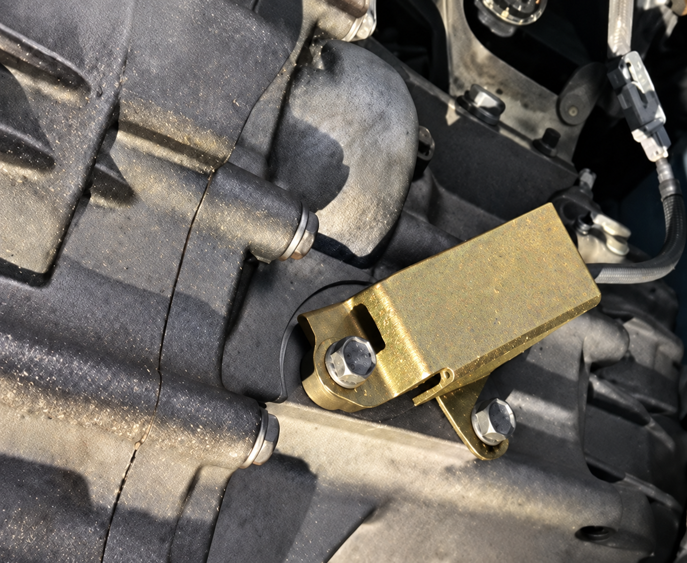

[← Back to chapter index](../README.md)

# Input shaft speed sensor

Composed by <Cyclehead21@gmail.com>

*Initial conversion 0.1 — September 18, 2026*

Feel free to copy and share this information.

## Function

The input shaft speed sensor monitors the speed of the transmission input shaft. It contains a coil of wire that uses a hall effect to create a voltage signal driven by the gear teeth sweeping past. The TCU uses this voltage signal to coordinate clutch control. If this sensor fails, you’ll likely experience some clutch-control problems.

## Failure

When this sensor fails, the car may still be driveable but have some problems shifting smoothly. Mine would abruptly engage the clutch and chirp the tires when starting from rest.

A bad sensor should throw error code P0715.

The only time I had a bad sensor, the car also had water intrusion in the gearbox. When I drained the gearbox oil, it was frothy and brown like a milkshake. Water gets turned into an emulsion when mixed with oil.

One repair shop left this sensor unplugged by mistake. The car would disengage the clutch during engine braking around 3000 rpm (instead of remaining engaged.)

## Repair

The tip of this sensor attracts metal chips from the gearbox. So, the sensor might be returned to proper operation by simply wiping off the tip of the sensor and reinstalling it. Of course lots of metal chips may indicate other transmission problems. Changing the gearbox oil would be wise if you find a lot of metal chips. Use Redline MT-90 or Amsoil “GL4”. I prefer the Amsoil oil.

## Replacement

This sensor is mounted on the bottom of the transmission, under a gold colored sheetmetal cover. The sensor and cover are both mounted with a single (?) 12mm (?) bolt. (I’ve forgotten! I’ll confirm)

You can remove the sensor and hold your thumb over the hole to prevent gearbox oil from draining as you install the new sensor.

## Parts

Toyota PN 89413-17010

### Alternate part numbers

- AIRTEX 5S12625
- CARQUEST 72-4297
- WELLS SU14040
- AISIN RST0051
- BWD SN8330
- NGK AU0082

[← Back to chapter index](../README.md)
