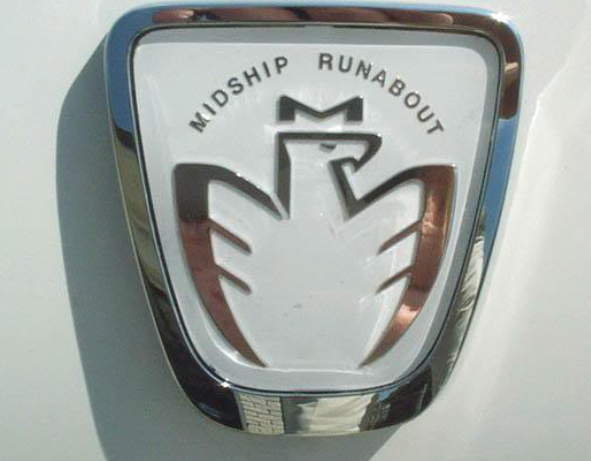
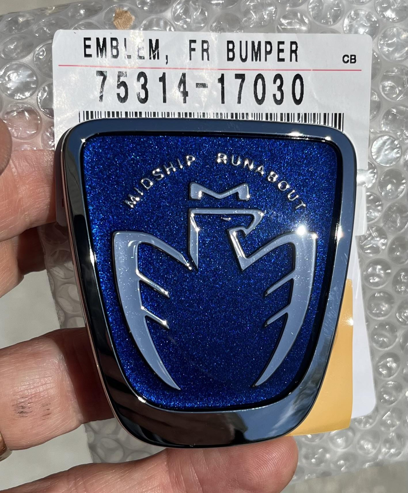
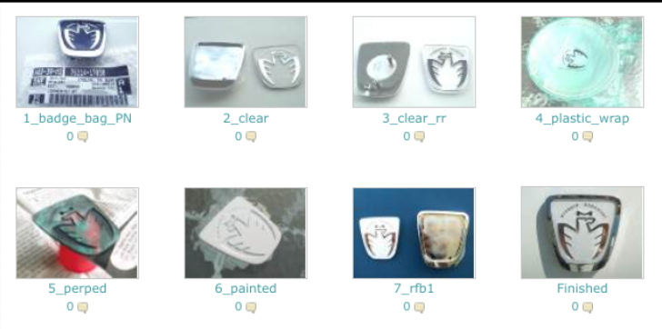

[← Back to chapter index](../README.md)

# JDM Nose Badges

Copied, pasted and edited by <cyclehead21@gmail.com>

*Initial conversion 0.1 — September 18, 2026*

Please share!

Years ago BottleFedMR2 and MR2oyota on Spyderchat.com were buying the JDM nose badges, disassembling them and changing the background colors to whatever you liked.

Of course the how-to info they published was lost to a “photo bucket” type site that deleted the information and photos.

I slogged through the wayback machine and recreated the “how-to” information that they posted. See below.

## Part Numbers

- 75314-17030 Blue background badge
- 75314-17020 Black background badge

(Currently selling on ebay for about $38 and up.)

## How to change Background color

(Paragraph number corresponds to photo):

1. Badge Bag: This is the JSPEC nosebadge. Go to your local Toyota dealer and ask the parts counter clerk to type this number, 7531417030, no hyphen, into his "parts search" computer. He will not find this part number in his listings.

2. Clear: There is a small hole at the lower, right corner of the bright, vacuum metalized bezel. Use something rigid, the diameter of the hole to gently push the nameplate so that at least one corner has exposed the double sided tape that adheres it to the bezel. Use a hobby knife to cut this tape as you push on the name plate. You can use two "ice cream" sticks to leverage the nameplate but be careful not to damage the bright surface of the bezel. Next, Use many cotton swabs and lacquer thinner to remove the blue paint from the back of the nameplate. This task must be done methodically and meticulously being careful not to get too much thinner in the recessed areas where the "hot stamp" of the lettering and insignia reside. The thinner will cloud the back of the nameplate but this will not affect the gloss of your new color. Use the thinner in the same manner to remove the remaining adhesive tape from the bezel. This is how your badge should appear when you have finished!

3. Clear RR: Note the double sided tape used to adhere the nose badge to your bumper cover is left intact with its carrier. DO NOT REMOVE THE CARRIER UNTIL YOU ARE READY TO APPLY THE BADGE TO THE BUMPER COVER! As you can see, the recessed area remains colored "blue". The delicate "bright hot stamp" is under the paint. The hole in the bezel should remain free and clear as it is designed to drain any moisture from the climatic elements.

4. Plastic Wrap: I recommend the use of adhesive plastic over masking tape to protect the "class A" side of your nameplate from paint. Home improvement stores sell this material to laminate paper products but I like the product that is used to protect carpet from dirty feet. Unfortunately this is only available in large rolls, last resort, kitchen plastic wrap. Stretch this, tight, over a bowl. Push the nameplate into the wrap and trim approximately two millimeters around the nameplate. Use vinyl tape on the edge.

5. Propped: Prop the nameplate above a clean "dust-free" horizontal surface. DO NOT ATTEMPT TO APPLY SPRAY PAINT TO ANY OBJECT LYING IN CLOSE INTIMATE CONTACT WITH THE HORIZONTAL SURFACE, you'll wish you had not! I'll only say this once.

6. Painted: If you are not a practiced spray painter, please use the following method. Obtain proper breathing apparatus and eye protection. Shake the can for two minutes after the mixing ball is free......... NOW, please shake the can for two more minutes. Quit complaining and just do it! Hold the can at a forty five degree angle and pass over the BACK side of the name plate, exceeding the peripheral edge, in a perpendicular fashion. Apply light coats, thirty seconds apart.

7. I like to use a fine 1200 grit or greater sandpaper to remove some of the gloss for adhesion to the bezel. The bezel is "vacuum metalized", a process which produces a bright "chrome like" finish. After which the bezel is treated to a clear coat. I used CLEAR, RTV 100% silicone. This did not attack the paint and adheres quite well. REMEMBER NOT TO ALLOW THE SILICONE INTO THE DRAIN HOLE! I used three small "dabs" where you see the discolored areas.

## Finished

We chose color "white" and here it is! All finished and applied to the bumper cover. I recommend at least 24 hours between all applications for drying and curing. Have fun and GOOD LUCK! **"MR2oyota"**

Reference: Wayback link <https://web.archive.org/web/20121017083650/http://rides.webshots.com/album/437215126MJjyRJ>

[← Back to chapter index](../README.md)
