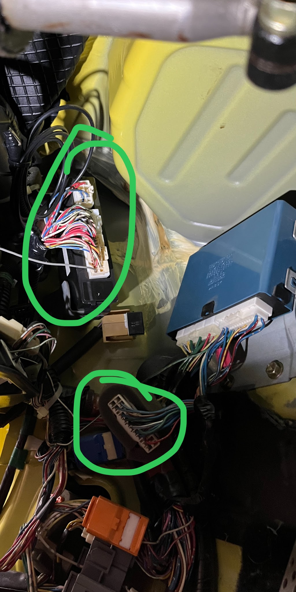
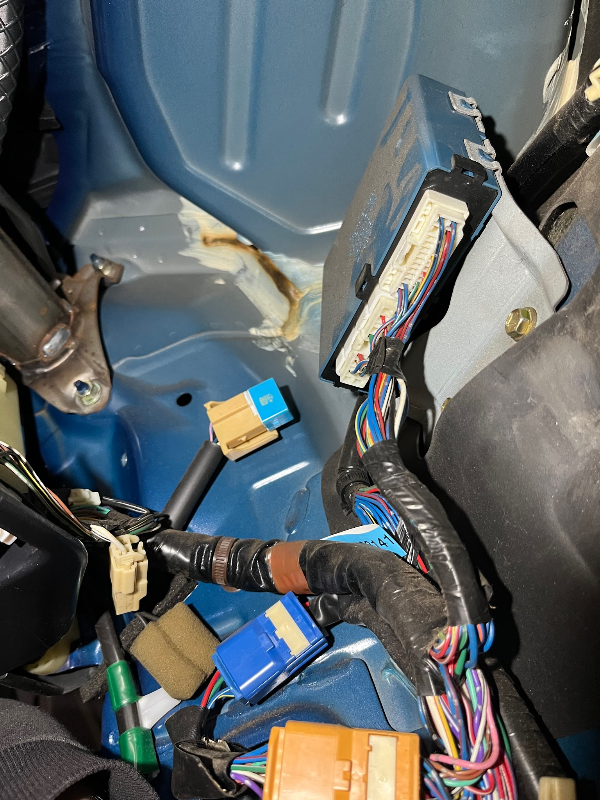
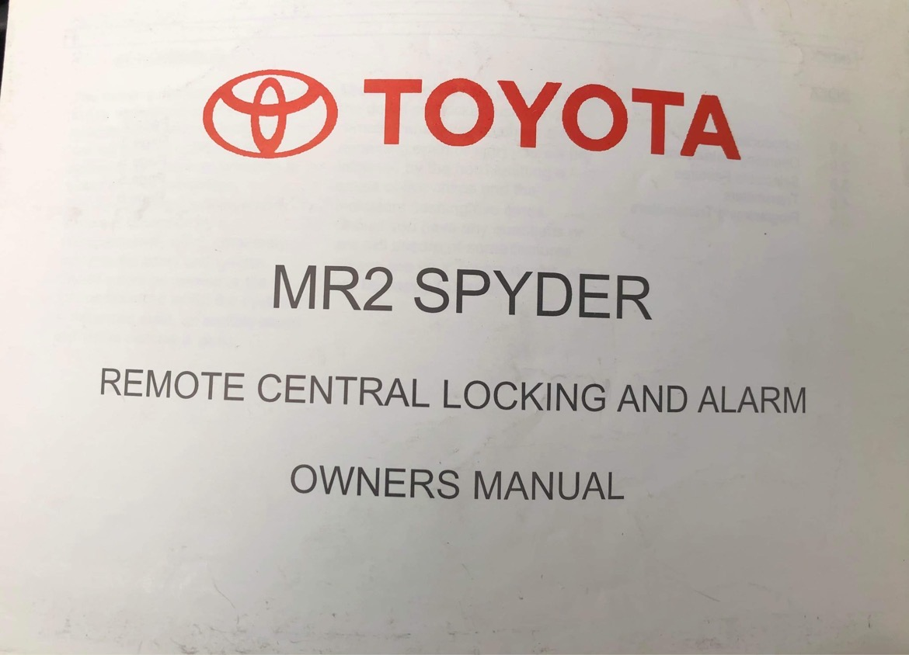
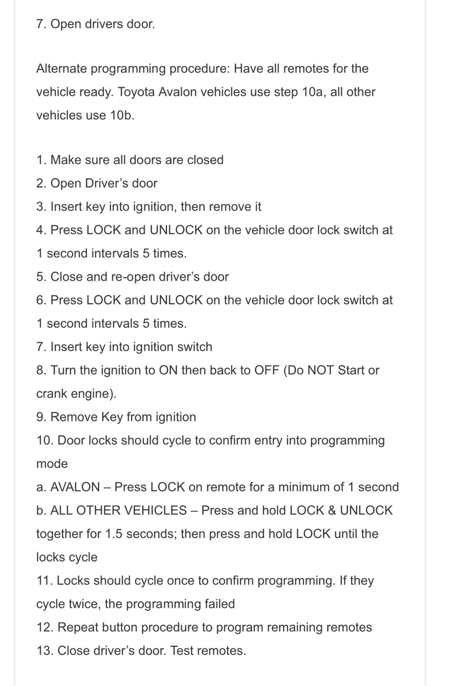

[← Back to chapter index](../README.md)

# Key FOBs for the Spyder

Compiled by <cyclehead21@gmail.com>

Spyder Key Fob Toyota Part Number: 08191-00922  
Numbers on the back of the remote FCC ID: BAB237131-056

> Note: NOT all spyders have remote keyless entry. If your spyder does not have this box under the dashboard on the driver’s side - you can’t program a key fob.

Yellow car has the harness connector and box. Blue car does not!

## Contents

- [Pair a new fob](#pair-a-new-fob)
- [Auto Door Lock after ignition (Ignition Controlled door locking)](#auto-door-lock)
- [Auto Door re-lock after pressing “unlock”](#auto-door-relock)
- [All Doors Unlock (when pressing “unlock” once)](#all-doors-unlock)
- [Program a new fob — Step-By-Step How To Programming Instructions](#program-a-new-fob)
- [Comments from Spyderchat](#comments)
- [From AUZ instruction manual](#australian-manual)
- [US versus Europe fobs](#us-versus-europe)
- [“Alternate” procedure](#alternate-procedure)
- [Links to buy replacement fobs](#replacement-fobs)
- [Australian “one button” remotes](#australian-one-button)

## To pair a new key fob

MR2 Spyder

1. Start with the key out of the ignition, drivers door is open all others closed and drivers door is unlocked.

2. Perform these steps within 5 seconds.
   - **A.** Insert the key into the ignition(Do NOT Turn) Pull key out.
   - **B.** Insert the key into the ignition(Do NOT Turn) Pull key out.

3. Perform these steps within 40 seconds.
   - **A.** Close then open the drivers door.
   - **B.** Close then open the drivers door.
   - **C.** Insert the key into the ignition(Do NOT Turn) Pull key out.

4. Perform these steps within 40 seconds.
   - **A.** Close then open the drivers door.
   - **B.** Close then open the drivers door.
   - **C.** Insert the key into ignition and leave it in ignition.
   - **D.** Close the drivers door.
   - **E.** Turn the ignition to ON (Do NOT Start) then back to OFF.
   - **F.** Remove the key from the ignition.

5. Within 3 seconds, the power door locks should lock then unlock automatically indicating successful entry into programming mode. Return to step 1 if the locks do not cycle at this point.

6. Perform these steps within 40 seconds.
   - **A.** Press the lock and unlock buttons on the remote simultaneously for 1.5 seconds.
   - **B.** Immediately after letting go of the lock and unlock buttons, Press the lock button by itself and hold for 2 seconds. Within 3 seconds, the door locks should lock and then unlock once indicating successful programming. If the door locks cycle twice, repeat steps A and B in step 6 as the remote was not accepted.
   - **C.** Repeat steps A and B in step 6 for each new remote.

7. Open drivers door.

## Auto Door Lock w/ ignition

(Will automatically lock the doors 30 seconds (?) after ignition is turned on.)

Open the driver's door and remove the key from the ignition.

Complete these steps within 30 seconds:

1. Insert the key into the ignition switch and turn it from LOCK to ON five times, ending at ON.

   The tail & marker lights will flash one time and the buzzer chirps one time. The immobilizer LED turns on for 30 seconds.

2. Choose one:
   - **a)** Close the driver's door to enable the “auto door lock feature”, or
   - **b)** Close, open and close the door to disable the “auto door lock feature”.

3. Turn the ignition key back to LOCK to exit reprogram mode. The tail and marker lights will flash one time, and the buzzer will chirp twice.

## Auto door re-lock after pressing “unlock” (Automatic Re-Arming)

If you press “unlock” on the key fob, but don’t open the driver’s door within 30 seconds, this feature will re-lock BOTH doors automatically. I unlocked the car and loaded some stuff in the passenger side, including my car keys. As I walked around the car, it went “beep beep” and locked both doors!

I cannot find a procedure to disable this. Nor, can I find a function in techstream to change it.

When I’ve asked, people confuse this with the “passive arming” function - but that is not the feature in this discussion.

(Note: “Passive arming” will automatically lock the doors after you turn off the car, shut the doors and walk away. This feature is normally set to OFF by the factory. If you want that feature turned on, it can be found in the RS3200 programming instructions on line.)

## All Doors Unlock (when pressing “unlock” once)

1. Driver’s door open (only)

2. Insert and remove ignition key twice

3. Close and open driver’s door twice

4. Insert and remove ignition key once

5. Close and open driver’s door twice

6. Insert ignition key and leave it in

7. Close driver’s door

8. Switch ignition on and off 4 times, ending with key “off”

9. Remove key

10. Confirm lights flash and beeper sounds

11. Press Lock/Unlock buttons simultaneously
    - **a)** Press “unlock” once to change setting to unlock all doors with a single press
    - **b)** Press “lock” once to require two presses to unlock passenger door

12. Confirm lights flash and beeper chirps once

13. Confirm doors lock/unlock by themselves once

14. Open driver’s door to exit settings

## Program a new fob

Step-By-Step How To Programming Instructions

1. **Prepare Vehicle**

    With the key OUT of the Ignition, OPEN and UNLOCK the Driver’s door.

2. **Enter Programming Mode – Step 1**

    Perform the following steps within 5 seconds:

    - **a.** INSERT key into Ignition (Do NOT turn) and PULL the key out.

    - **b.** INSERT key into Ignition (Do NOT turn) and PULL the key out.

3. **Enter Programming Mode – Step 2**

    PERFORM the following steps WITHIN 40 seconds:

    - **a.** CLOSE then OPEN Driver’s door.

    - **b.** CLOSE then OPEN Driver’s door.

    - **c.** INSERT key into Ignition (Do NOT turn) and PULL the key out.

4. **Enter Programming Mode – Step 3**

    PERFORM the following steps WITHIN 40 seconds:

    - **a.** CLOSE then OPEN Driver’s door.

    - **b.** CLOSE then OPEN Driver’s door.

    - **c.** INSERT the key into the Ignition and LEAVE it in the Ignition.

    - **d.** CLOSE the Driver’s door.

5. **Enter Programming Mode – Step 4**

    TURN the Ignition to ON position (Do NOT crank engine) then back OFF.

    - Do this ONCE to retain existing remotes programmed and ADD NEW remote.

    - Do this TWICE to ERASE all existing remotes programmed and ADD NEW remote.

    - Do this THREE times to CHECK how many remotes are programmed to the vehicle.

    - Do this FIVE times to ERASE all existing remotes programmed.

6. **Enter Programming Mode – Step 6**

    REMOVE key from Ignition. The power door locks will respond by cycling the locks from LOCK/UNLOCK to signal successful entry into Programming Mode.

7. **Program Remote**

    Perform the following steps within 40 seconds:

    - **a.** PRESS and HOLD the LOCK and UNLOCK buttons on the remote simultaneously for 2 seconds. RELEASE.

    - **b.** PRESS and HOLD the LOCK button and hold for 2 seconds. RELEASE.

    The vehicle will respond by cycling the locks from LOCK to UNLOCK to indicate successful programming of the remote.

8. **Program Additional Remotes**

    REPEAT Step 7 for any additional remotes to be programmed, including working ones.

9. **EXIT Programming Mode**

    OPEN Driver’s Door to EXIT Programming Mode.

10. **Test Remotes**

    TEST all remotes. Programming is complete.

## Comments from spyderchat

I managed to do it my first time, funny to have the car lock and unlock 4 times. Just make sure you follow the directions correctly.

I didn't use the OEM key either, just a copy and also put my key from full on (right before starting it) to ready to take out of the ignition not just "off" and didn't turn the key on when it says just put it in the ignition. Maybe that will help?

If anyone is still getting confused by this there seems to be two slightly different procedures for different models. For my North America 2001 only the above steps worked. In other cars you only do the “ignition on” turn once. ( I have not been able to verify this: Cyclehead)

Turn the ignition switch from “Lock” to “On” and back to “Lock” at about 1 second intervals to select the desired mode:

- **a.** 1 time for ADD mode.
- **b.** 2 times for REWRITE mode.
- **c.** 3 times for CONFIRMATION mode.
- **d.** 5 times for PROHIBITION mode.

(I have not been able to confirm this: Cyclehead)

## From AUZ instruction manual

### PROGRAMMING TRANSMITTER

#### 5.0 Programming Transmitters

When entering the transmitter programming mode, all transmitters (maximum of three) which will be required to operate the system will have to be programmed at the same time. The unit has been designed this way for the security of the user, so that if a transmitter is lost it will be erased from memory when programming the existing transmitters.

#### Procedure (with at least one functional transmitter)

- **a.** Ensure a door is open.
- **b.** Arm then disarm the system.
- **C.** Within 20 seconds of disarming, turn the ignition key from the "OFF" position to the "'ON" position 20 times leaving the key in the "OFF" position after the twentieth Turn. (??)

The vehicle's indicators will flash 20 times to indicate successful entry.

Once the indicators have finished flashing press the button on each of the transmitters.

Once finished turn the ignition key to the "ON" position to lock in and exit from the programming mode.

#### Procedure (without transmitter)

- **a.** Ensure a door is open.
- **b.** Disconnect the negative battery cable, wait 5 seconds then reconnect.

Note: If the system begins to sound, complete the manual override procedure, on completion of manual override proceed with:

Within 20 seconds, turn the ignition key from the '"OFF" to "ON" position 20 times leaving the key in the " OFF" position after the twentieth turn.

The vehicle's indicators will flash 20 times to indicate successful entry.

Once the indicators have finished flashing, press the button on each transmitter.

Once finished turn the ignition key to the "ON" position to lock in and exit from the programming mode.

Rev 2 09/02

### OPERATING INSTRUCTIONS

#### 2.0 Operating Instructions

#### 1. Arming the Alarm.

Press the button on the transmitter and the following will happen:

- All doors will lock.
- The horn will emit one chirp
- The vehicle's indicators will flash once.

Note: Should the horn emit a series of five chirps and the indicators flash five times, check that all doors are properly closed.

#### 2. Disarming the Alarm

Press the button on the transmitter and the following will happen:

- All doors will unlock.
- The horn will emit two chirps.
- The vehicle's indicators will flash twice.

#### 3. Panic Feature

To activate the panic feature, ensure that the ignition is turned " OFF" . Press the button on the transmitter for longer than 3 seconds and the following will happen:

- The doors will lock or unlock (depending on whether they are locked or unlocked).
- The horn will sound.
- The vehicle's indicators will flash. To deactivate panic, momentarily press the button.

#### 4. Manual Override

In the event that the system is armed and the transmitter is lost or becomes inoperative, the following procedure will enable you to manually disarm the system:

Note: During this procedure the horn will sound. Ignore this and continue with the procedure.

Unlock the driver's door using the ignition key.

Using the ignition key quickly turn the ignition switch from the "ACC" to "ON" position 10 times, leave the ignition "OFF" after the tenth turn and wait for the horn to stop sounding. If the system fails to override after the horn stops sounding, re-cycle the ignition ten times then wait for the horn to stop.

## US versus Europe fobs

From DaWaN on spyderchat:

“The European and JDM cars use fobs on 433MHz, unlike most remotes sold on AliExpress for US market which uses 315MHz fobs.

(Europe and Japan fobs use) Denso 433MHz fob, which are sold on AliExpress, but usually you find them easier by searching on Celica or Yaris fobs. I use a 433MHz fob from AliExpress for my UK MR-2.

Also take note that most Corolla's and Yaris built in UK and France after 2002 uses keyfobs from Valeo instead of Denso. Denso and Valeo keyfobs are incompatible with each other.”

From my notes it says TOY41 RIGHT. As for the blade, you need to carefully check, because some of the key types are mirrored. If I recall correctly there are even 2 different TOY41 types.

Immobilizer chip type is 4C.

You can swap the immobilizer chips between the remotes, it is the small 10x5mm black square in the remote.

The transmitter is 89071-52020 for France, 89071-52021 for rest of Europe.

Not sure about the differences, this was before having unified wireless transmitter regulation over the whole of Europe, so even the label could lead to different part numbers. AliExpress sellers usually label them as 433MHz Denso. Japan production EU Celica and Yaris have the same transmitter.

FCC is the Federal Communication Commission of the United States, which only applies to US remotes at 314MHz. European remotes do not have an FCC ID.

## Alternate procedure

One website claimed that this is an alternate procedure. I have never tried it.

## Links to buy replacement fobs

<https://www.amazon.com/gp/product/B07PXTCBK8/ref=ppx_yo_dt_b_search_asin_title?ie=UTF8&psc=1>

THESE fobs from Amazon will program and work correctly: <https://a.co/d/fyusZPB>

$35 for two fobs

## Australian “one button” remotes

From “Monkey_relish” on Spyderchat:

“The Australian MR2 Spyder has a one button keyfob remote.

Toyota part number PZQ71-00042.

These are also used in the ~2000s era Corolla, Landcruiser, Prado and Hilux.

To program (an existing good remote is required) :-

Step 1 - Open Drivers side door (all other doors need to be closed)

Step 2- On the existing remote, press the "Lock/Unlock" button twice.

Step 3 - Insert the key in the ignition

Step 4- Turn the key from "OFF" to "ON" 20 times Finishing it at "OFF", the Hazard lights should flash 20 times if successful

- i - The key needs to be turned 20 times really quickly (in approximately 10-12 Seconds)
- ii - Do not start the engine or remove the key from the ignition when performing step 4 or else you will need to start from step 1 again.
- iii - If the Hazard lights do not flash up to 20 times after you have turned the key 20 times, start again from step 1. Otherwise continue with Step 5.

Step 5 - After the Hazard lights stop flashing (up to 20 times) press and hold the "Unlock/Lock" button on the NEW remote for two seconds then do the same on the existing remote.

Step 6 - To save the above, turn Key from "OFF" to "ON", then Back to "OFF", then remove key, close the driver door and test the buttons on the remote.”

[← Back to chapter index](../README.md)
