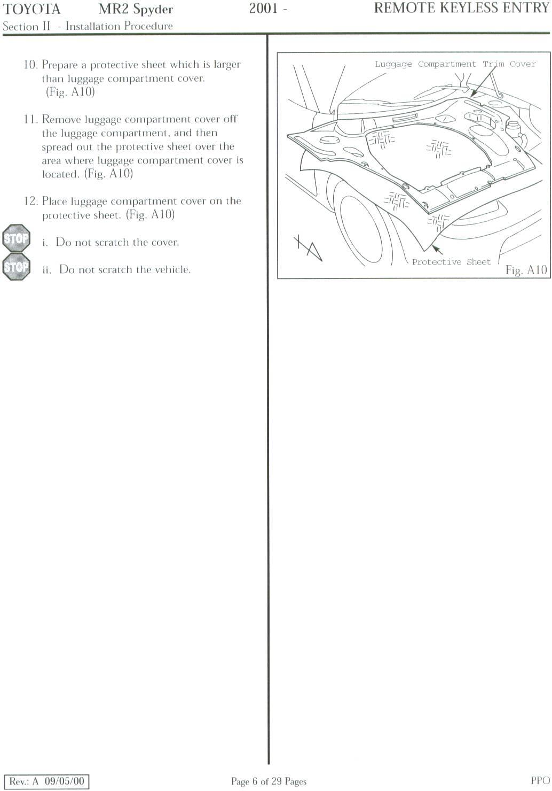
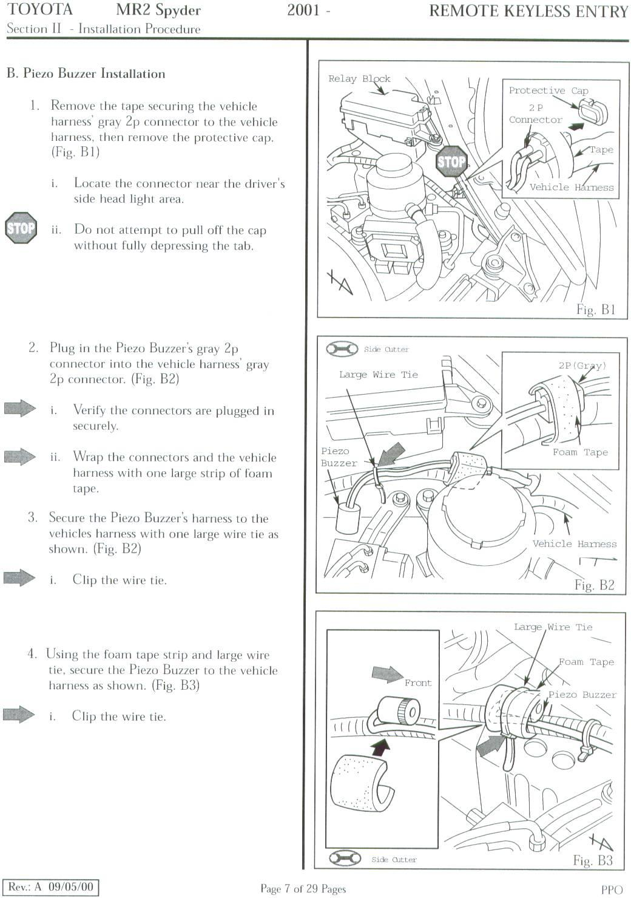
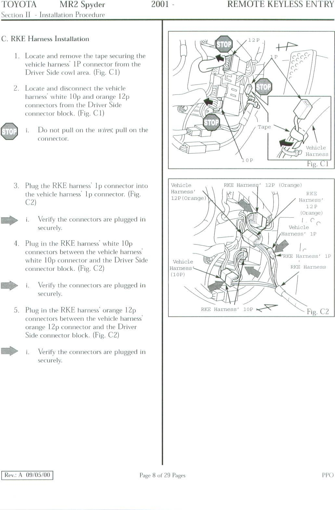
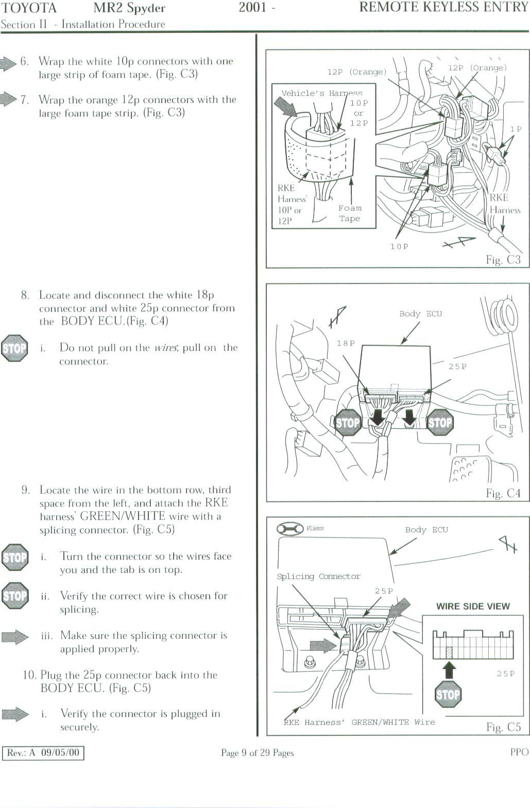
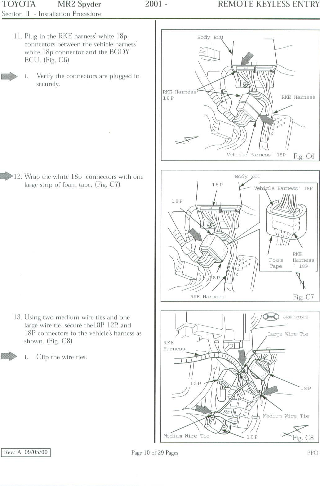
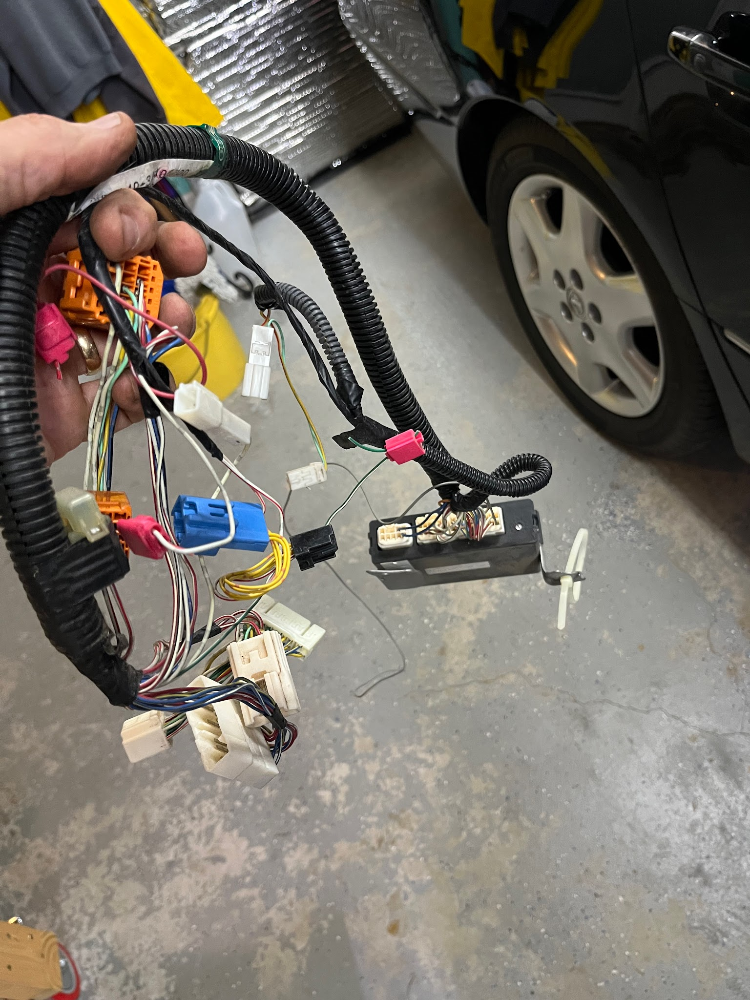
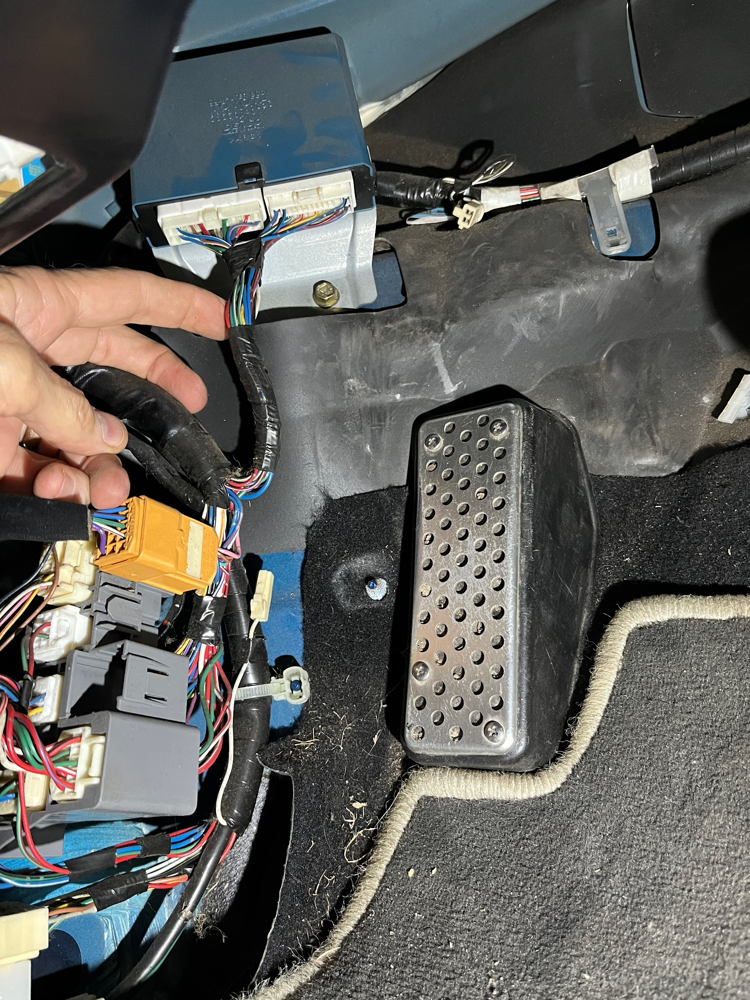

# Keyless entry system installation

[Back to chapter index](../README.md)

Written by Cyclehead21@gmail.com

This is the “dealer installed” system.

Apparently there is also a factory installed system. I have never seen the latter.

I’ve read that the key fob for the dealer-installed system has a red LED light in the fob, and the factory system fob does not. This doesn’t seem correct. All my original key fobs have an LED, and they ALL have the “dealer installed” control box. The only fob without an LED is one I got on Amazon. And it works fine also.

My Spyder was imported from Germany and was missing the system. So I got the system from a scrap car and retrofitted it into my Spyder.

The system consists of one computer box, and a fairly large wiring harness. The box installs under the dashboard on the driver’s side. The harness connects to the body ECU and various adjacent connectors in the left kick panel. It also runs under the steering wheel to the clock spring and adjacent connectors.

All of the connections are prewired connectors that plug into existing plugs under the dashboard, except three wires:

One green/white wire must be spliced into the body ECU harness in the left kick panel area. Two red/white wires must be spliced at the steering wheel.

One dark gray wire appears extraneous because it doesn’t connect to anything. I believe it’s an antenna. It is threaded from the control box, along the steering column up to the clock spring and simply tied there with no electrical connection.

The dealer uses “Scotchlock” (also called T-tap or tap-con) connectors that allow you to pinch a metal barb into the wires. These work well since there is no extra wire in the car’s harness to allow cutting/splicing and soldering. I pried the old ones apart and reused them successfully.

For access, remove the door threshold plastic, the driver’s kick panel cover, the steering wheel, the “under steering wheel” cover, and the two kick panel covers under the steering wheel (plastic cover and metal shield).

When finished, use some zip ties to bundle up the loose sections of harness. Tuck the new connectors out of the way.

Apparently there is a piezoelectric beeper that installs in the frunk, but I didn’t salvage that part, so my car doesn’t beep when the doors lock or unlock.

## Installation reference images

## System photographs

---

*Initial conversion 0.1 — September 18, 2026. Detailed technical review pending.*

[Back to chapter index](../README.md)
