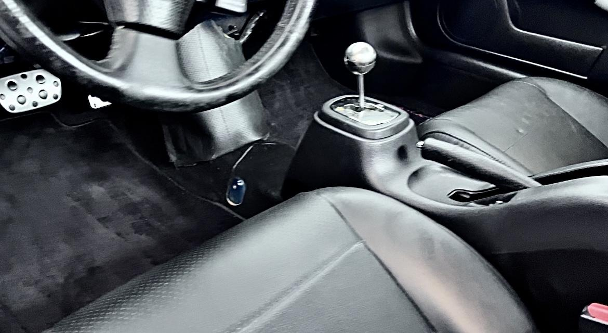
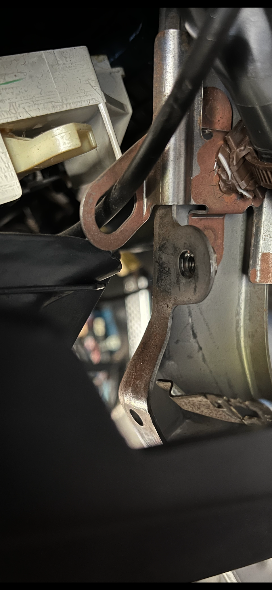
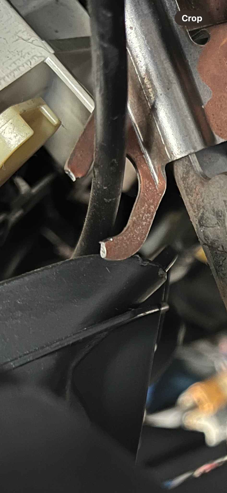
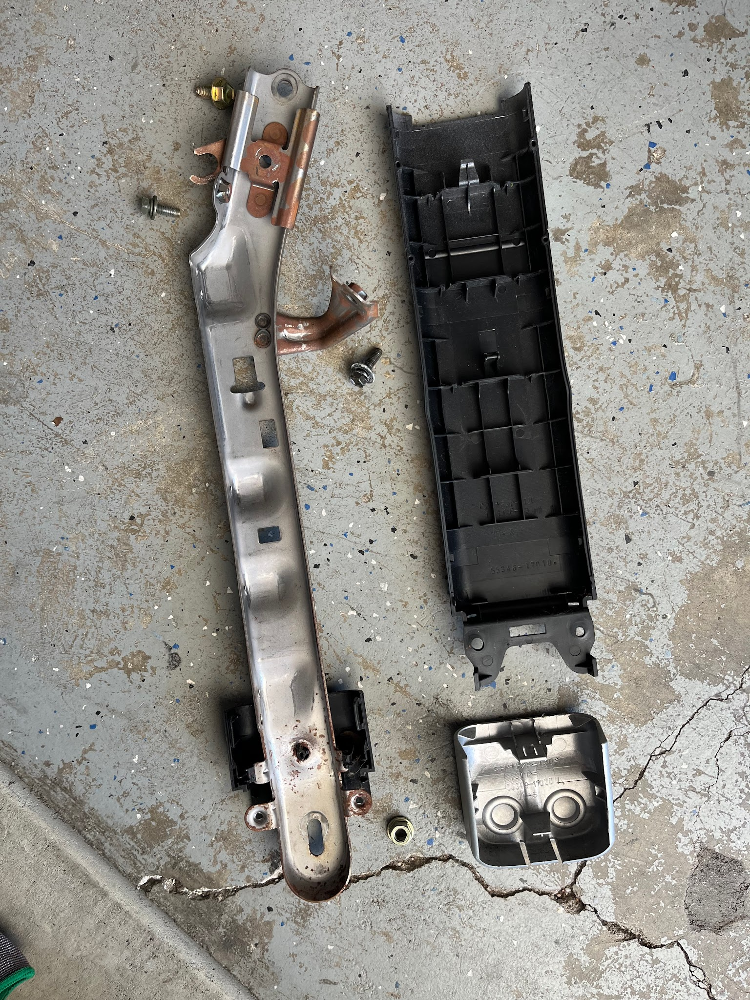
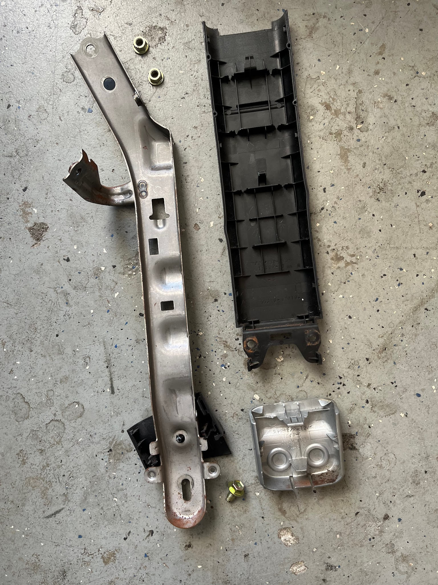
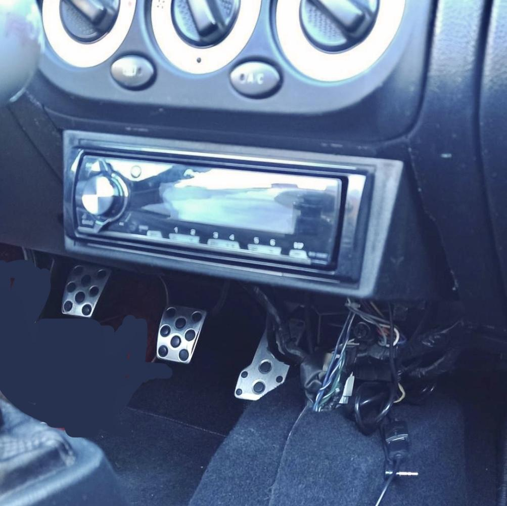
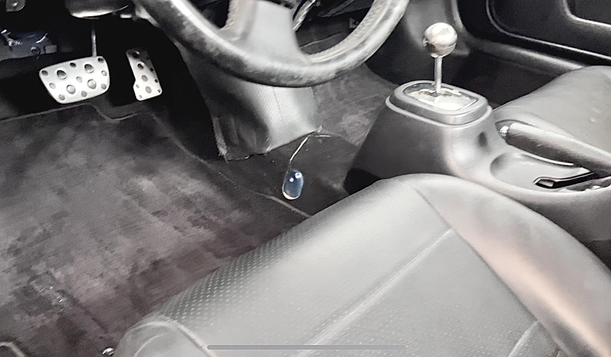
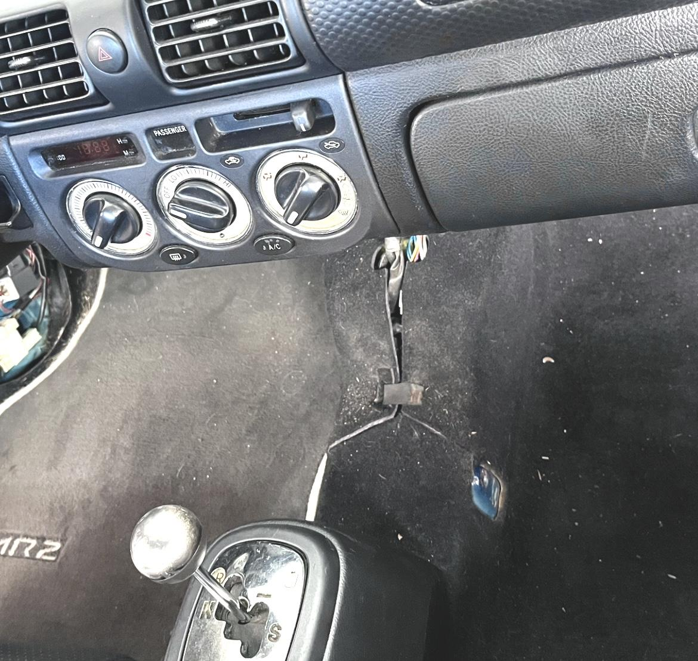

# Legroom Mod

[Back to chapter index](../README.md)

(Radio support delete)

Summary by cyclehead21@gmail.com

This mod removes the two vertical stiffeners under the dashboard, leaving more room for your legs.

With the stiffeners removed, the bottom of the dashboard is slightly less supported and you may notice some movement when driving over bumpy roads.

## Summary:

- Remove the ashtray, cigarette lighter, cup holder and radio.

- Remove the plastic covers from the vertical supports.

- Remove 12 mm nuts and bolts to free the steel vertical support pieces.

I haven’t included steps describing how to remove the radio and accessories.

To remove the plastic support beam covers, start at the bottom. Remove the silver plastic caps first. Pry on the front and back edges to unclip them.

Remove two Phillips head screws from the bottom of the vertical plastic covers. Pull the long plastic covers downward and remove them.

Remove the center plastic cover under the steering wheel.

Remove the center metal shield under the steering wheel.

Remove the glovebox.

Lie on your back and slide under the dashboard. Wear gloves as the sheet metal parts all have very sharp edges. Bring 10 mm and 12 mm wrenches and sockets. Bring a forked “rivet puller” tool also.

The top of the metal support is held by 12 mm nuts. They are obscured by heavy wiring harnesses. You may need to unclip various standoff clips to allow you to move the harnesses out of the way. The 12 mm nuts are very tight!

There are some 10 mm nuts and bolts holding electrical grounds to the sides of the steel supports. You should reconnect the electrical grounds to something else under the dashboard to reestablish a ground path. There is one 12 mm bolt holding the bottom of each steel support.

The right support has a thin metal loop with one climate control cable routed through it. You can cut the loop open using some wire cutters. It’s made from soft steel.

### Before

### After:

### Right side support:

### Left side support:

You’ll probably want to make a black cover to hide the exposed electrical wires and hide the gaps in the carpet under the dashboard. My photo at the top has a scrap of leather hiding the mess. I sewed some Velcro hooks to the backside of the leather to grab the carpet pile and hold the cover in position.

I borrowed this photo from the Facebook group. This guy made some additional cuts and mounted his single DIN radio to the bottom of the dashboard.

---

*Initial conversion 0.1 — September 18, 2026. Detailed technical review pending.*

[Back to chapter index](../README.md)
