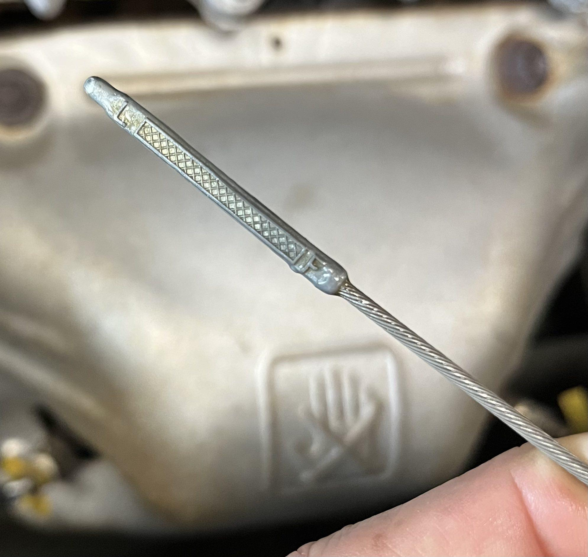

# Tips for an MR2 Spyder owner

[Back to chapter index](../README.md)

## Engine Oil Level:

The dipstick is notoriously hard to read. Correct oil level is especially important on the spyder. Solution: Check the oil first thing in the morning. No need to even wipe the dipstick, just pull it out and read. (All the oil will have settled overnight)

Try to keep it filled to the “full” mark. Don’t settle for half way down. Add small amounts of oil; 1 cup will move the oil level about half way on the dipstick because the engine only holds 4 quarts total.

## Oil Change:

Use full synthetic 5W30 and change it every 5000-6000 miles. Early MR2s had a problem with oil supply ports getting clogged, seizing the piston oil-control rings, which led to oil usage and subsequent failure of the “pre-catalytic” converters. 6000 mile oil change interval will be sufficient to preclude oil usage and pre-cat problems.

## Driving in rain:

Drive slowly if water on the road is deep enough to splash. The spyder will hydroplane fairly easily. The car is light and has relatively wide tires. I stay below 45mph if there is deep or standing water on the road surface.

## Frunk spare tire latches:

[This video](<https://youtu.be/JF875jRHq_0>) shows how they operate. Be gentle and make sure they are shut before closing the hood.

## Parking under trees:

If you ever see ANY leaves around the ragtop back glass, it is likely some of them will have washed into the car and been caught in the drains. There is a drain on each side of the car, just behind the doors. If the drains are clogged, then water will overflow and pour into the cabin soaking the carpet under the seats. It is good practice to reach in there and clean the drains periodically, especially if you park under trees. Open each door and sit on the threshold. Face backwards and reach your arm into the drain pocket and pull out all the leaves and trash.

## Parking:

Don’t pull up to the bumper (parking curb)! The front bumper of the spyder is very low to the ground. If you try to park with the front extending over any kind of curb, you will scrape off the front air dam. Also, the rear of the car will be so far out of line with other cars, it will appear the parking spot is vacant! Always park 2-3 feet away from the front of a parking curb. You will avoid damaging the front air dam, and the rear of the spyder will be in-line with the other cars.

## Tire Pressures:

Check your tire pressures every few months, and especially if seasons have changed. The spyder is sensitive to incorrect tire pressures. Too little, or too much can make the car very squirrelly to drive. 26psi front, 32psi rear (see the sticker in the door jamb)

## Ragtop operation:

> **Safety note added during conversion:** Raise or lower the top only when safely parked. The original paragraph below is retained for later review, not as a recommendation to operate the top while driving or to follow a truck closely.

It is possible to raise the ragtop while driving, up to 60 mph or so. (Higher if you tuck into the draft behind a tractor-trailer) Best to have a passenger to help. Grab the center handle firmly and close both latches promptly. Caution - you cannot change your mind and lower the top at high speeds. The rear glass will balloon out and prevent closing the top until you slow below 40mph. You can lower the top at speeds below 40 mph.

## Storage doors

The storage doors behind the seats are very easy to remove if you want easier access. Just remove the 6 bolts (10mm) and save the doors to reinstall later.

## Plastic center console

Do not press down on the plastic center console with your elbow. It will crack the plastic just forward of the molded cup holder.

## Auto Door lock feature

The spyder has a pesky safety feature - if you press “unlock” on the key fob, but don’t open the driver’s door within 30 seconds, it will automatically hit the “lock” button itself. I locked myself out once when I hit “Unlock”, and opened the passenger door to load some stuff (including my car keys). As I walked around the car it went “beep beep” and locked both doors!

## Missing parts:

Work hard to keep all the parts of the car together. Used spyders are always missing the spare tire kit, the towing eye (inside the kit), the plastic “engine diapers” that mount under the engine, and the original floor mats. Having all these parts intact increases the value of the car if you ever decide to sell it. “Jiffy Lube” type places will destroy the diapers by reinstalling them carelessly. They are thin plastic and easy to repair if necessary, provided they are not left loose to rip off the car and get mangled.

## SMT pump:

The pump will run about 25 seconds in the morning when you open the driver’s door. Wait patiently for it to quit running before you shift into first or reverse gear. If you shift too soon, it won’t hurt anything, but the green neutral light will flash and the car will not shift into gear…until you shift back to neutral and try again.

## SMT shifting:

- Lift off the throttle for a second when you shift gears, just like you would on a manual shift car.

- Be careful if you slow down in a tall gear (like 4,5 or 6) and then try to accelerate. This can happen when a red light changes to green unexpectedly. You will be in the wrong gear to accelerate. Repeatedly press a downshift button on the steering wheel in rapid succession to downshift quickly.

- Make a habit of downshifting through the gears, as traffic slows. That way you’ll always be ready to accelerate quickly.

---

*Initial conversion 0.1 — September 18, 2026. Detailed technical review pending.*

[Back to chapter index](../README.md)
