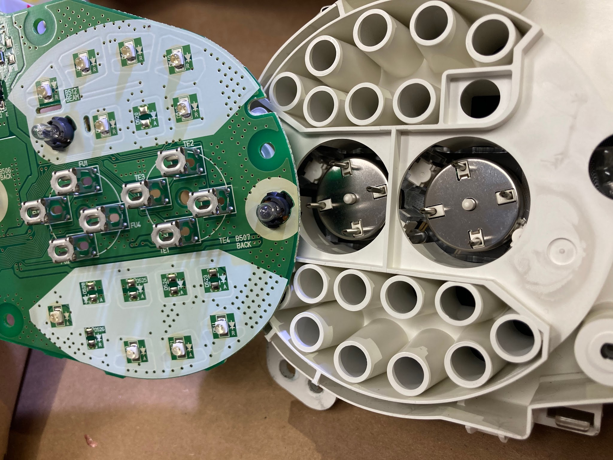
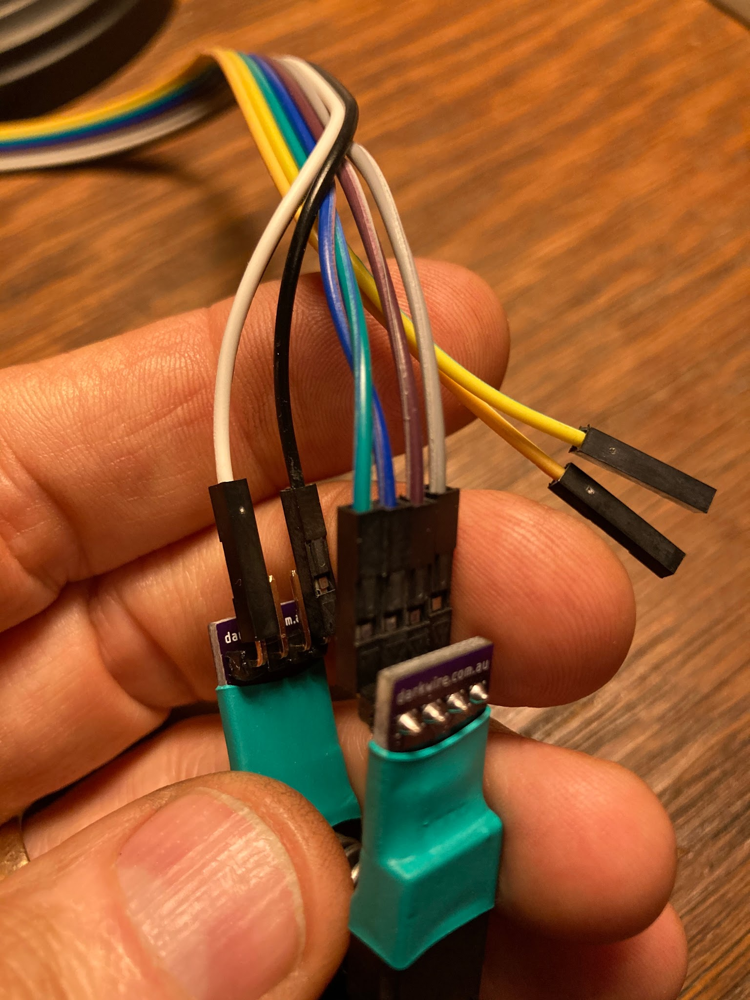
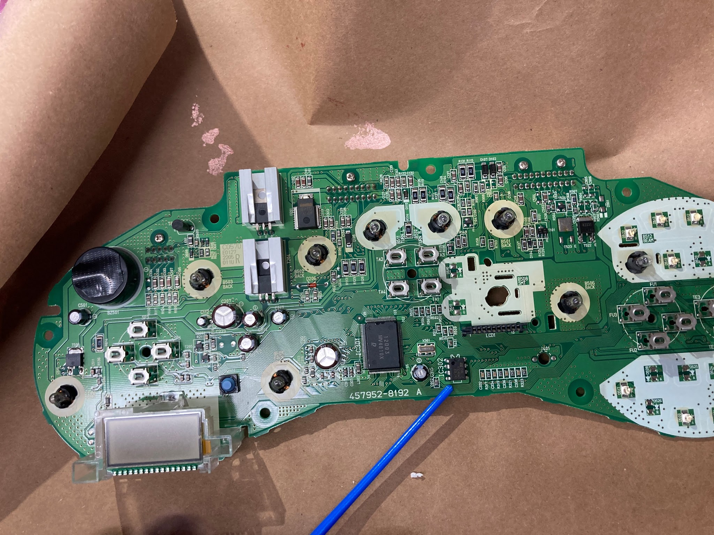
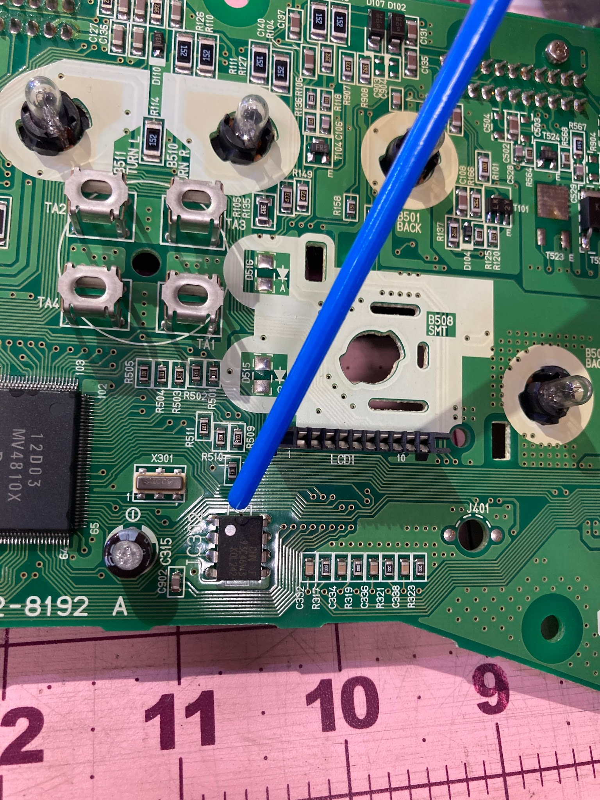
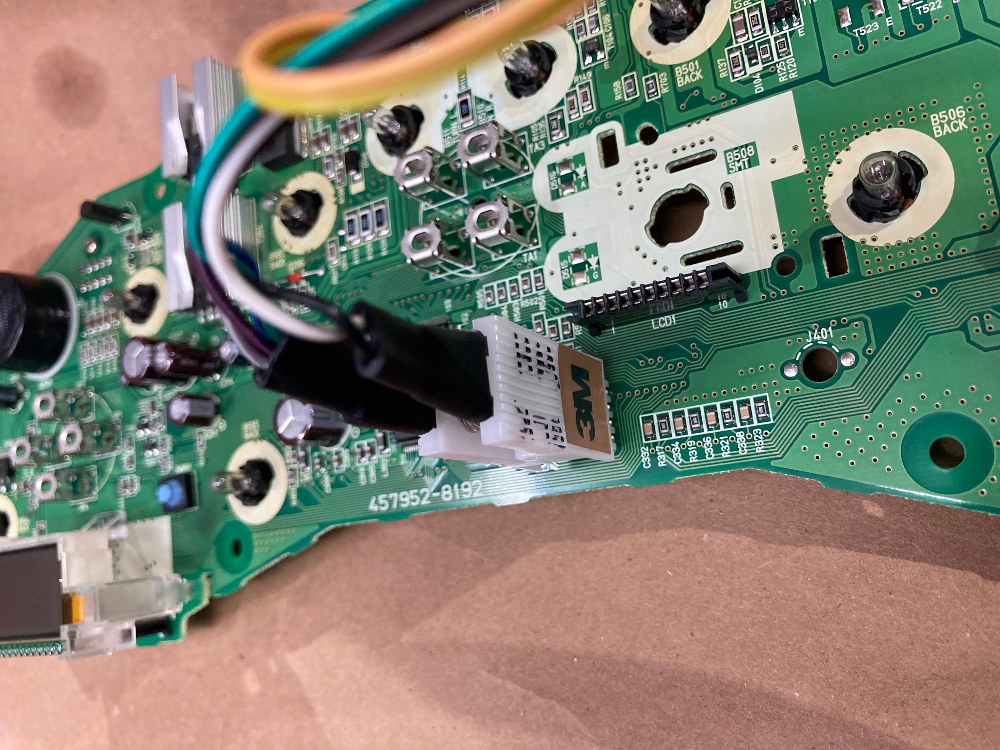
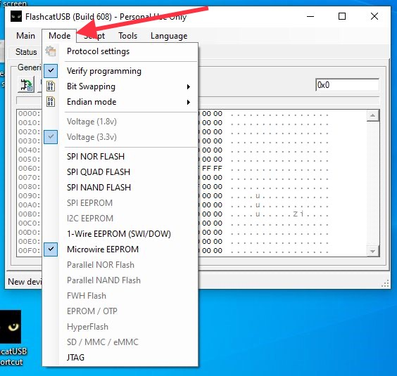
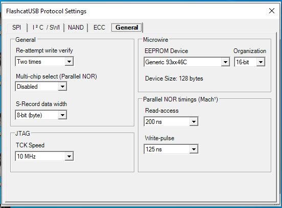
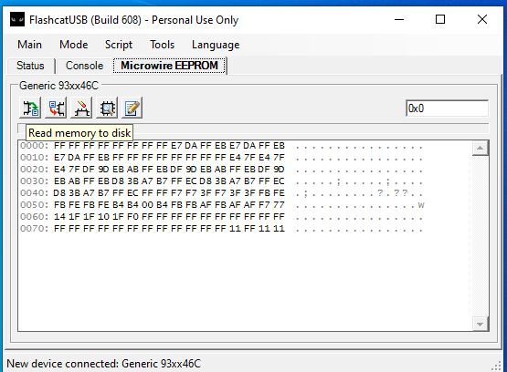
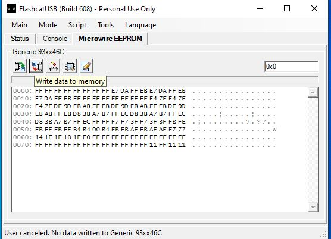
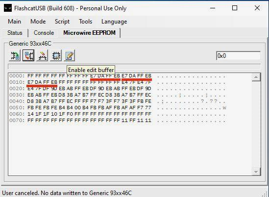

# Odometer Edit Procedure

[Back to chapter index](../README.md)

## Credit:

I know absolutely nothing of how these steps work or the IC chip magic involved. I am merely a scribe and a test monkey. Credit for the technical content goes to Joel Faas and "Jason" in Australia. Thanks guys!

## Caution and Disclaimer:

It is illegal to change odometer readings for the purposes of misrepresenting the miles on a car. It is not illegal to change the odometer readings to correctly reflect the miles on a car.

The information below will allow you to replace your instrument cluster with a junkyard part, or convert your odometer from kilometers per hour (kph) to miles per hour (mph) - or vice versa. Spyder owners replacing damaged instrument clusters or converting from SMT to manual would benefit when changing the cluster.

This information could conceivably be used to cheat other people. If you want to rob from others, I request that you do so without abusing my efforts - go rob a bank instead.

> UPDATE: April 2023 - it appears the memory programmer I linked is no longer available. The general process should be the same with a different EPROM programmer board, but the exact wire hookups and settings will be different. Sorry, I can’t outline hookups with another board. I’m just a scribe.

## Background:

The Spyder instrument cluster has one large printed circuit board. It contains an IC chip that stores the odometer data. The same chip controls whether the odometer displays mph or kph. The chip can be easily accessed (without soldering or de-soldering) to read, edit and save. You can change the odometer digits, and/or change the display to show kph or mph.

## Process:

No soldering or de-soldering is required!

Buy a small circuit board on Amazon Prime, and an IC test clip from Digi-Key. About $76 total. (Links are at the bottom.)

Download and install a program and drivers (free) onto a Windows desktop or laptop.

Remove the instrument cluster PC board from your spyder

Re-program the odometer chip on the ECU board.

Reassemble

## Procedure:

### 1.0. Buy stuff

Order “Flashcat USB Memory Programmer” (Currently available on Amazon Prime $46)

Order “Test Clip DIP 8 (2x4)” part number 923690-08-ND from Digi-key.com. (Currently $28 including shipping)

Links are at the bottom of this document.

### 2.0. Install software

Download Flashcat software and drivers from “[embeddedcomputers.net](<https://www.embeddedcomputers.net/software/>)”. They are all bundled in a zip file.

Extract the files and store them all in one folder on your computer.

### 3.0. Remove the PC board

Disconnect the battery. Lower the steering wheel, and yank on the instrument bezel. It pulls straight aft to remove.

Disconnect the instrument cluster (three Phillips screws)

Reach over the top, behind the cluster and disconnect the multi pin connectors (four I think?). It is best to use a small screwdriver to press the release latch, and pry/wiggle each connector loose. You can see it best by looking down through the windshield from outside the car.

Remove the cluster from the car.

Remove the white plastic cover from the back (7 small Phillips-head screws)

Remove the gauge cluster PC board. Use your fingertips to gently pry it away from the gauges. It is only held by four sets of four straight pins. It will slide off by “walking” it loose, no tools are needed. (photo below)

### 4.0. Flashcat board set up

**4.1. When the flashcat board arrives you need to install device driver software on your PC.**

Follow the documentation in the “Manual” folder that comes with the flashcat download.

Note: Windows 10 will generate an error “Windows found drivers but encountered an error while attempting to install...check with the device manufacture”. This is a lie. Windows 10 has a driver protection block built in. You must disable it before you can install the driver files. You need to “disable Device Driver Signing”. Google the process. It involves changing the startup settings, advanced options, startup options, and restarting the computer 2-3 times. The device driver protection will reset automatically after you have installed the drivers and restarted the PC. Here is a link to the process I used:

Disable device driver signing:

I used “Option One”. [https://www.tenforums.com/tutorials/156602-how-enable-disable-driver-signature-enforcement-windows-10-a.html](<https://www.tenforums.com/tutorials/156602-how-enable-disable-driver-signature-enforcement-windows-10-a.html>)

**4.2. Verify the correct firmware is installed on the flashcat board.**

Open the flashcat program, and hit the “console” tab.

Check at the bottom for the messages “Disconnected from Flashcat USB Classic device”, and “software requires firmware version 4.5.1”. If you see this (like I did) then you need to install the newer firmware that is included with the downloaded files.

Follow the Manual instructions for “bootloader”. (Basically throw one tiny dip switch to the “off” position. Then click on the new firmware file included in the zip file from embeddedcomputers.net, and it will load itself. Throw the switch back to the “on” position.)

Note: I saw two hex files in the “firmware” folder. One suffix 4.51.U2 and another suffix 4.51.U4. The U4 file worked for me.

### 5.0 Hook up the Flashcat PC board

You need to plug in six wires on the flashcat board, and six wires on the test clip.

See the photographs.

Don’t confuse the gray and white wires (look at the sequence of wires in the strip)

Of course the actual colors don’t matter, just get them hooked up in the proper order.

### 6.0 Select Flashcat program options

Set all the pulldown options like shown in the pictures below.

Don’t dick around with the other settings, leave them as they are preset.

### 7.0. Connect to the IC chip

Find the odometer control chip on the gauge cluster circuit board. (It is labelled “IC302”)

No need to clean the IC chip pins. They seem to be bare. If they have a coating on them, I’ve cleaned it off using a stiff brush and some rubbing alcohol, then pat it dry with a paper towel.

Hook the spring loaded clip onto the IC chip as shown in the photos.

I presume it’s smart to hook up the test clip to the chip with the flashcat board unplugged from the computer. (Voltage spikes?)

If everything is working, the flashcat board will illuminate a red LED when the flashcat is plugged into a USB port. Then a blue LED will illuminate when you launch the flashcat program. I think the blue light confirms the program is talking to the IC chip on the instrument PC board.

Note: During one test I heard a faint squealing from the odometer PC board speaker. I found that it was caused by switching the voltage switch on the flashcat board to 5v. Don’t do that. Set the switch to 3.3 volts.

### 8.0. Edit the chip contents

#### 8.1. Review and copy the chip contents

Look at the contents of the chip (hex data). The flashcat software reads the chip as soon as you launch the flashcat program.

It’s a good practice to copy the existing codes from the chip before you modify them. If something goes wrong, you can copy the original settings back onto the chip. See pictures below.

#### 8.2. KPH to MPH

If you don’t want to change from kph to mph, or vice versa, just skip this whole paragraph. If you want to change, you need to get a .bin file from a friend with the desired speedo readings. AUZ and Europe owners should have a copy of the KPH data. US and UK will have a copy of the MPH data. Or contact me. I have some copies of both files - Kilometer and Miles.

Copy the data onto the chip before you edit the odometer data on the chip.

#### 8.3. Encode and scramble

Using a piece of paper, encode the odometer digits you want to save on the IC chip. Each of your digits must be crossed-over using the crossover table in 8.3.1. The numbers must be entered in a “scrambled” sequence per 8.3.2.

Get all your numbers and letters written down on paper before you start editing the hex data on the chip.

The youtube presentation is very good, see it instead if you prefer. (Link is below)

##### 8.3.1. Encoding

Toyota used a simple crossover table to “encode” the odometer digits.

| Odometer&nbsp;digits | 0 | 1 | 2 | 3 | 4 | 5 | 6 | 7 | 8 | 9 | A | B | C | D | E | F |
| --- | --- | --- | --- | --- | --- | --- | --- | --- | --- | --- | --- | --- | --- | --- | --- | --- |
| Hex&nbsp;code | F | E | D | C | B | A | 9 | 8 | 7 | 6 | 5 | 4 | 3 | 2 | 1 | 0 |

Example: to display the digit “4”, you must enter “B” on the chip.

##### 8.3.2. Scrambling

Toyota chose to enter the digits from the odometer in a different order.

Instead of...

100,000; 10,000; 1,000; 100; 10; 1 - they changed the sequence to...

1,000; 100; 10; 1; 100,000; 10,000.

Same information, just a scrambled sequence.

8.4. Type your encoded and scrambled hex codes that you wrote down, into the edit screen using the flashcat program. You need to enter the same codes in three places, overwriting the existing hex codes with your new ones. The three places are underlined in red below. Save your edits to the chip.

Note: Only edit the 1st, 2nd and 4th block in each set. Do not edit the “FF” block (third block in each set). Leave that box alone.

### 9.0. Reinstall the PC board

Install the PC board back onto the gauges. Press on the board to slide it onto the four sets of pins. Press using your thumb.

Install the plastic cover plate and snap the three multi pin connectors into place.

Power up the gauges and verify everything is correct.

Mount the cluster with three Phillips screws, and snap the bezel back into position.

Scroll down for pictures and more info

## 10.0 Pics and Screenshots

**10.1. Remove the instrument panel circuit board from the cluster. The board slides on four sets of four straight pins.**

**10.2. Wire the hookups on the test clip. (Pretend the green &amp; black test clip in this photo is actually white)**

**10.3. Wire hookups on the Flashcat PC board:**

**10.4. Find the 8 pin odometer chip, labelled “IC302” on the instrument panel circuit board.**

**10.5. Attach the test clip to the odometer chip. Orientation is important. “Pin #1” is designated by an indented circle on the IC chip. So the top left pin is Pin #1 below. The green wire goes onto pin #1. The black and white wires will be on the right side of the chip.**

**10.6. Launch the Flashcat program and verify it shows “connected”.**

**10.7. Verify the Mode tab settings are all correct**

**10.8. Set all the Protocol “General” settings as shown.**

Don’t dick around with the other tabs (SPI, SWL, NAND etc)

**10.9. Save a copy of these hex code settings, in case something goes awry.**

When the little box with “ Base Address 0x0” and “Length 256” comes up, just hit okay.

**10.10. The “Write data” button will allow you to write the contents of a file to the chip. Use this only if you want to change mph/kph. Borrow a .bin file from somebody with the kph/mph display that you want. Save the file on the chip. Then edit the odometer digits.**

### 10.11. Edit the chip data

Hit the “enable edit buffer” to allow editing data.

Enter the numbers and letters you wrote down.

You must enter the same information in three places (underlined in red)

When you’re done editing, press the “enable edit Buffers” button again, and it will ask if you’d like to write the changes onto the chip.

Reminder: Don’t change the contents of the third block in each set. Leave them set to “FF”. Also note that contrary to the linked YouTube videos, I believe the spyder can edit the 1’s digit. You’ll notice that my screenshot has a value entered for the 1’s place. Spyders win!

Th th that’s all folks.

Close the Flashcat program and unplug the Flashcat board.

Then unclip the IC clip.

Go install the PC board in the car.

## 11.0. Links:

### Flashcat circuit board on Amazon:

[https://www.amazon.com/Flashcat-Memory-Programmer-EEPROM-software/dp/B00F2P9AS6/ref=sr\_1\_1?dchild=1&amp;keywords=flashcat&amp;qid=1607046305&amp;sr=8-1](<https://www.amazon.com/Flashcat-Memory-Programmer-EEPROM-software/dp/B00F2P9AS6/ref=sr_1_1?dchild=1&keywords=flashcat&qid=1607046305&sr=8-1>)

### Flashcat software, drivers &amp; manual:

Zip file provided by the manufacturer

[https://www.embeddedcomputers.net/software/](<https://www.embeddedcomputers.net/software/>)

### Test Clip at Digi-key:

Part Number 923690-08-ND

[https://www.digikey.com/en/products/detail/3m/923690-08/3849?s=N4IgTCBcDaIJxgMwDY4AYC0aAcGByAIiALoC%2BQA](<https://www.digikey.com/en/products/detail/3m/923690-08/3849?s=N4IgTCBcDaIJxgMwDY4AYC0aAcGByAIiALoC%2BQA>)

### YouTube videos explain hex crossover and sequence codes:

Skip to 3:40.

[https://youtu.be/8wygJwWnFm4](<https://youtu.be/8wygJwWnFm4>)

Skip to 3:50. (Enjoy the toothbrush pointer!)

[https://youtu.be/k7T\_z0LT7wk](<https://youtu.be/k7T_z0LT7wk>)

---

[Back to chapter index](../README.md)
