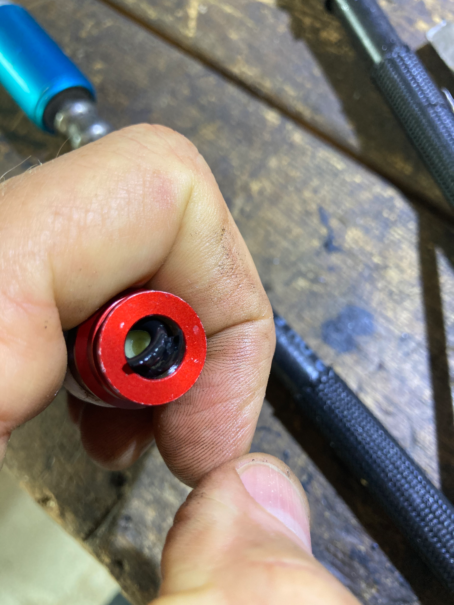
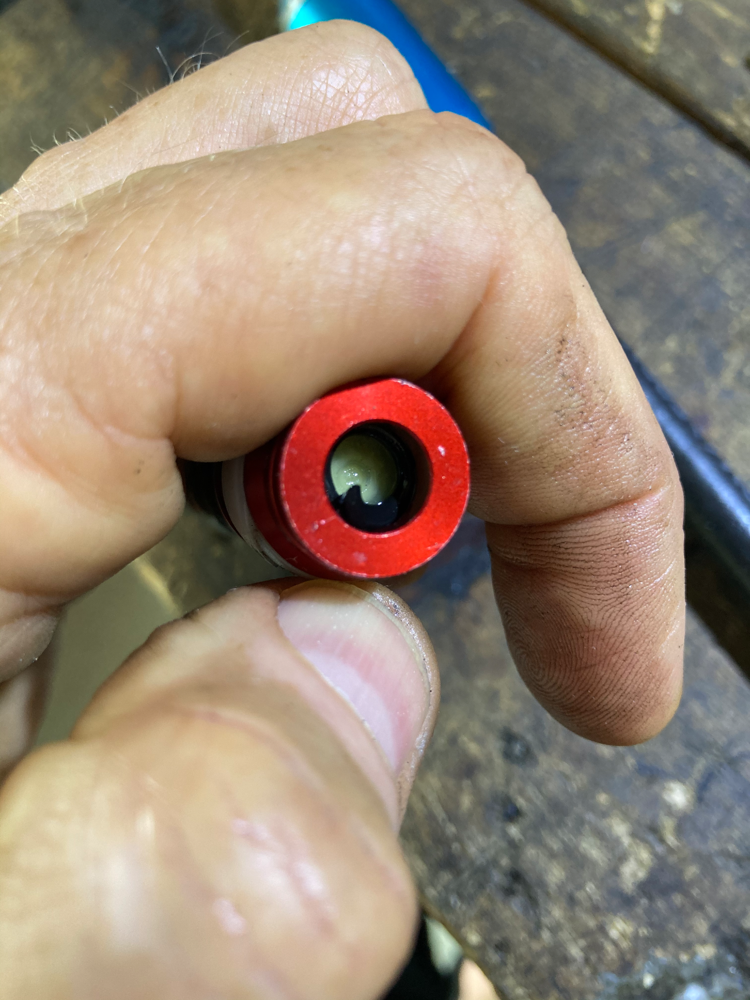
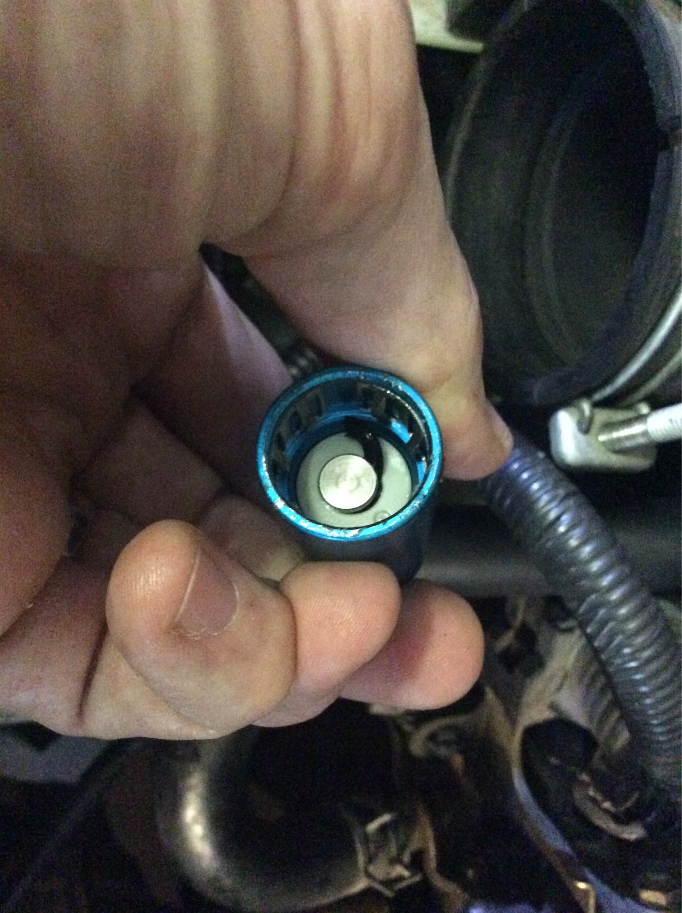
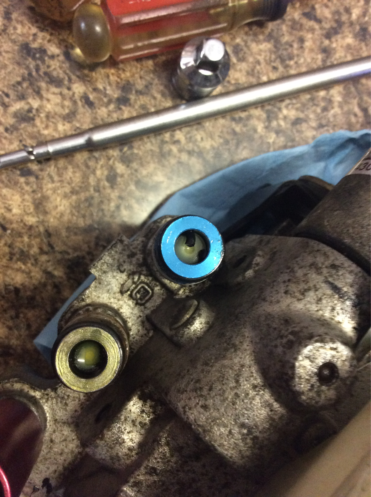
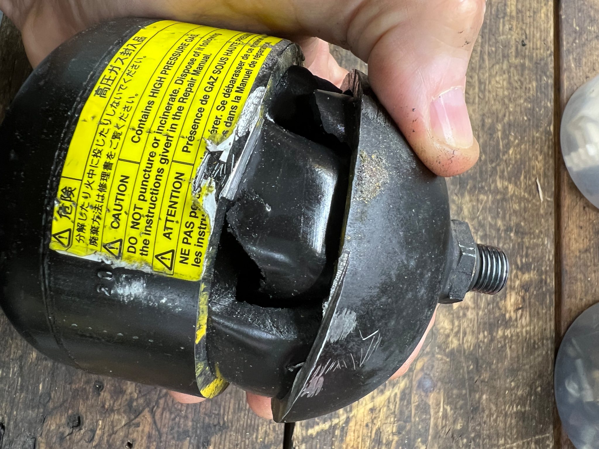
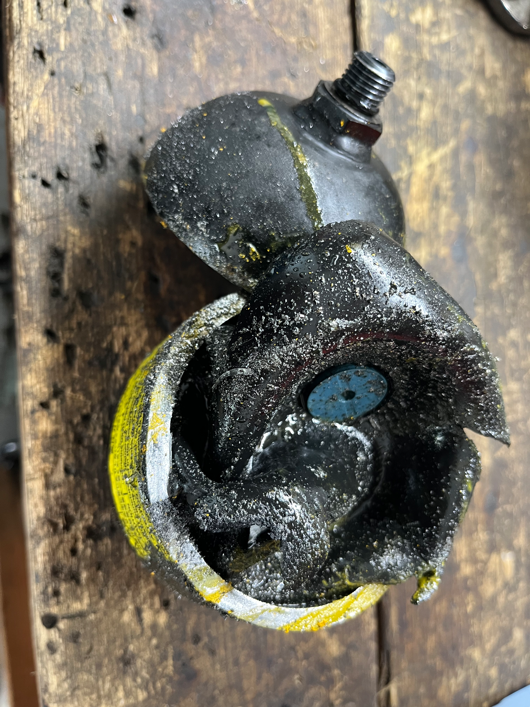

# Oil Damage to SMT system

[Back to chapter index](../README.md)

Written by Cyclehead

Feel free to share, copy, and duplicate

Just give me a little credit

July 2025

Email: cyclehead21@gmail.com

## Contents:

- [Background](#background)

- [Failure](#failure)

- [Repair](#repair)

- [Photographs](#photos)

## Background:

The SMT system uses brake fluid. More than once, people have poured gear lube, automatic transmission oil or hydraulic fluid into the HPU reservoir. All the seals in the SMT system are made from EPDM material, which is designed to work in brake fluid. However, any kind of oil will cause the EPDM rubber to swell and split. Usually within one week, the system will start leaking, and stop shifting properly.

[Monkeywrenchracing](<https://www.monkeywrenchracing.com/product/toyota-oem-fluid-smt-transmission-hydraulic-system-1l/>) publishes some photographs of oil-damaged seals on their website. They incorrectly blame brake fluid for the damage. I think they’re trying to push sales of their very expensive “Toyota SMT Fluid”. $193/liter. Wow! The SMT system uses cheap DOT3 brake fluid - or very expensive Toyota SMT fluid. Your choice. Extensive discussion of SMT fluid is [here.](<https://docs.google.com/document/d/1b3HJDNPx7NwBmjMxb0H08Bd2vk4veIaJNV15yTmL1yQ/edit?usp=sharing>)

## Failure:

When the plastic HPU reservoir is filled with oil (instead of brake fluid), the first rubber to fail are the o-rings in the quick connectors on the three hoses. O-rings are particularly susceptible to oil, since they increase in diameter very quickly (surface to volume ratio).

Hoses - When the o-rings in the quick connect fittings swell, they begin to leak fluid, usually appearing on the floor after about a week. There are two o-rings in each quick connector. One is external, and one is internal. The external o-ring will allow fluid to leak onto the floor. The internal o-ring causes more trouble - it extrudes from inside the connector and can block fluid flow. Or it can break off a chunk of rubber and travel elsewhere in the system and cause trouble.

The hose tubing seems to soften and swell when exposed to oil. However I have successfully used oil exposed hoses - after fixing the problems at the connectors.

Reservoir - The seals under the plastic tank will eventually fail, and allow fluid to leak onto the floor.

Accumulator - The rubber bladder inside the accumulator will swell up and split, allowing the nitrogen to escape into the system.

Solenoids - the four solenoids use o-rings to separate the fluid flow ports. Since o-rings are so susceptible to swelling (increasing diameter) they can cease to function, allowing pressure to leak (internally). If/when this happens, the TCU will no longer be able to accurately control fluid flow, and will lose control of the actuators. Once the system senses control loss of the actuators, it will declare “fatal error” and kill fuel supply to the engine.

Actuator seals - I haven’t seen failures specifically due to oil damage on the actuator seals. The oil will make the seals swell up and (in theory) make them seal more tightly! I expect the oil will also soften the rubber, lowering the durometer. This would (again theory) make the actuator seals wear out more quickly, with the increased pressure and lowered durometer.

HPU - the HPU pump is made from steel. It will work fine in oil. However the seal on the 12v motor shaft will be destroyed. The static o-rings in the pump housing might be okay. The reservoir base seals will be damaged (discussed above). The two solenoids will have damaged o-rings (discussed above).

## Repair:

To salvage an SMT system that has been filled with oil - drain the oil as soon as possible. Flush the system with brake fluid. I’d fill the system, cycle through gears, drain, refill and repeat 4-5 times.

If the car hasn’t exhibited any SMT problems, I would drive on. However, most people discover the horrible mistake after leaks appear on the floor, and/or shifting problems appear. I would replace parts in this order:

1. Hose quick connect o-rings. Replace the outer o-rings. Press the connectors open and pull out the inner o-rings and discard. They are intended to stop leakage from the hoses while open. They are not critical.

2. HPU Accumulator. Unscrew and test the accumulator with a small screwdriver to determine if the bladder is deflated. If it’s good, I would not replace it.

3. HPU Reservoir seals. If fluid is not dribbling from beneath the reservoir, I would leave them alone.

4. HPU Motor shaft seal. If fluid is not leaking from the bottom of the HPU, between motor and pump, I would leave it alone.

5. Solenoid o-rings. If the car will shift gears properly, I would leave them alone.

6. GSA seals - Check for fluid leaks on the bottom of the GSA. Look at the square holes in the casting. If there are no leaks, and the system is shifting gears correctly, I would leave the GSA alone.

7. Nuclear option - if you want to restore the whole system, you can replace all the seals in the HPU and GSA.

8. This quick connector shows the external o-ring has been removed. But the internal o-ring has swollen and extruded past the valve. The internal o-ring only prevents drips while the connector is open. You can press the white plunger and pull the damaged o-ring out, and discard.

## Photos

Check the mating connector for loose chunks of o-ring.

This is an accumulator with a damaged diaphragm. It was swollen and split. Of course the nitrogen precharge had departed. The blue plastic disc in the center will prevent you damaging the diaphragm when using a screwdriver to measure depth.

---

*Initial conversion 0.1 — September 18, 2026. Detailed technical review pending.*

[Back to chapter index](../README.md)
