

# MR2 Spyder

## Parking Brake Cables - Failure and Preventive Maintenance

[Back to chapter index](../README.md)

Written by Cyclehead21@gmail.com

Feel free to share, copy, and duplicate just give me a little credit

And let me know if you find any errors!

Updated Sept 2024

[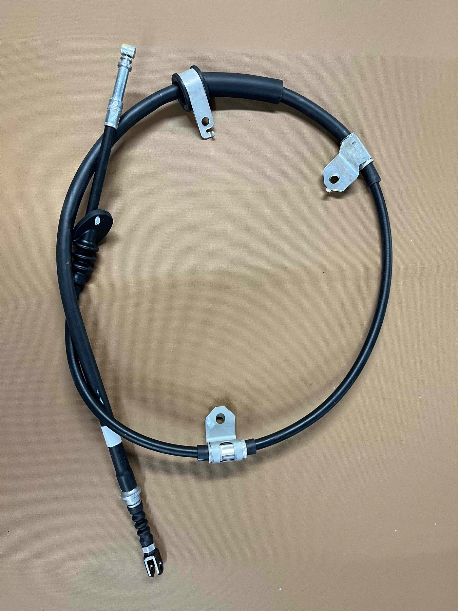](../images/parking-brake-cables-failure-and-maintenance/01-complete-parking-brake-cable.jpg)

### Video:

<https://youtube.com/shorts/INNh-Hr1FQ0?si=y26um-CMUH9Jp-75>

## Contents:

- [Background](#background)

- [Problem](#problem)

- [Prevention](#prevention)

- [Replacement cable options](#replacement-cable-options)

- [Photos](#photos-and-videos)

## Toyota Part Numbers:

- RH facelift cable; 46420-17100

- LH facelift cable: 46430-17100

- RH pre facelift cable: 46420-17090 (Repl by 46420-17091)

- LH pre facelift cable: 46430-17090 (Repl by 46420-17091)

(Reportedly - facelift cables are slightly longer than prefacelift cables to allow routing past additional suspension bracing on the facelift cars. Facelift cables will work fine on a pre-facelift car)

## Background:

Parking brake cable failures are very common on the spyder. The parking brake handle becomes stiffer and stiffer, until it won’t engage (or release). Occasionally, the cables will work fine until the temperature drops below freezing. Then suddenly they will not release and your car is immobilized. This is a nasty surprise as you hurry out on a winter morning.

I suspected water was trapped so I sliced open my parking brake cables (that were working fine) and water came pouring out! I can't recall the last time I drove this car in any rain. It has been kept in a dry garage ...forever.

Video as I sliced open the outer casing - and the water started dripping out:

[MR2 Spyder - parking brake cable full of water](<https://youtu.be/bxMuYlBvNH4>)

## Problem:

Water gets past the tiny rubber bellows at the calipers. My bellows were split and cracked due to age.

[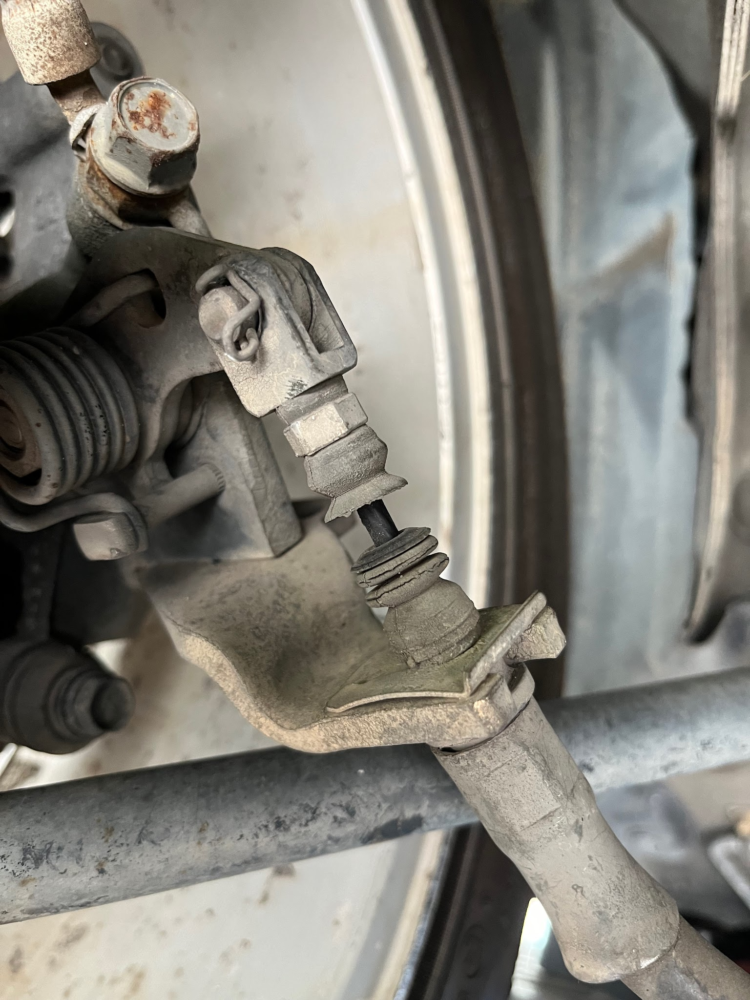](../images/parking-brake-cables-failure-and-maintenance/02-cracked-caliper-bellows.jpg)

There are two heavy rubber/plastic sleeves covering the brake cables near the brake calipers. I assume the heavy casings are designed to protect the cables from damage. However in practice, they serve to trap and retain every single drop of water that gets past the cracked rubber bellows at the brake caliper. Once any water gets inside, it will gather at the low spot (loop) just in front of the brake calipers. When I sliced open the casing, the water started pouring out.

Blowing the water out using compressed air:

[MR2 Spyder - parking brake cable - blowing out the water](<https://youtu.be/XfySEWs28Ro>)

The inner cable is made from steel strands, with a hard plastic coating to lower friction and prevent wear. A hard plastic coating is bonded or melted to the inner cable.

However, the outer cable is a standard spiral cable housing made from a high-carbon steel. It has absolutely no corrosion preventive coatings on it. WHEN it rusts, the byproducts of corrosion build up on the inside of the spiral cable and seize the inner cable.

I cut apart one completely seized set of cables and found the spiral steel cable housing packed with red rust. (photos below) The corrosion products/rust were very hard. They felt like grit and sand.

## Prevention:

For preventive maintenance, you should inspect the tiny bellows. If they are cracked or split you can try repairing the bellows with a piece of ¾ inch diameter heat shrink.

[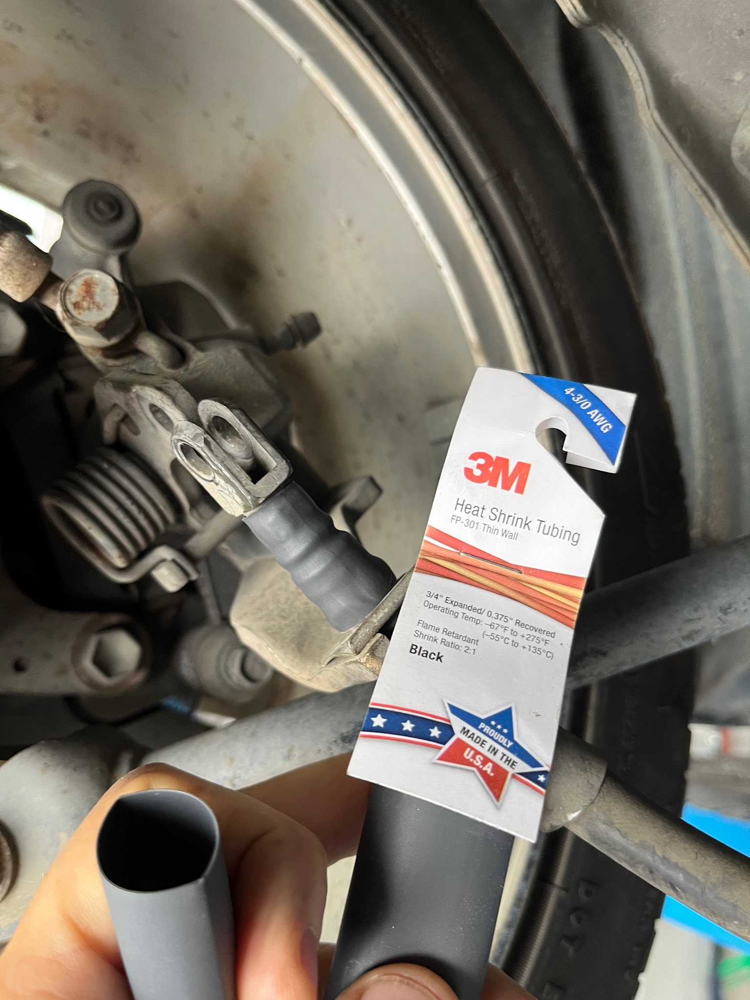](../images/parking-brake-cables-failure-and-maintenance/03-heat-shrink-tubing.jpg)

Next, you should slice open the two heavy rubber/plastic layers. Split both coatings. Cut and discard the inner cable coating (hard plastic), and retain the outer rubber coating (soft rubber). Let all the water drain out and blow compressed air through the spiral cable until the cable is completely dry.

Then fill (completely fill) the split outer coating with some good rust preventive/water displacing compound and tie wrap it back into place. Finally snap on a piece of plastic split wire loom to help keep dirt and crap out.

I cut my outer coating on the upper side to help make a pocket that would keep the spiral cable soaked in corrosion preventive fluid. I installed the plastic split loom with the open seam facing downwards (opposite the split I made in the rubber coating). I plan to peel off the split wire-wrap and the rubber housing once a year or so, blow out any accumulated water and reapply more corrosion preventive compound.

I like a marine corrosion preventive product called "Corrosion Block" for this purpose. I am confident it will not degrade the plastic coating on the inner brake cable, and it will displace water and protect the bare steel.

## Replacement cable options

### Toyota Parts:

#### For 2003-2005 Spyder:

- RH - Toyota Part Number: 46420-17100 CABLE ASSY, PARKING BRAKE, NO.2

- LH - Toyota Part Number: 46430-17100 CABLE ASSY, PARKING BRAKE, NO.3

#### For 2000-2002 Spyder

- RH - pre facelift cable: 46420-17090 (Repl by 46420-17091)

- LH - pre facelift cable: 46430-17090 (Repl by 46420-17091)

(Reportedly - facelift cables are slightly longer than prefacelift cables to allow routing past additional suspension bracing on the facelift cars. Facelift cables will work fine on a pre-facelift car)

You can replace the cables WITHOUT dropping the fuel tank. Procedure is here: [https://docs.google.com/document/d/1-AcYFYLW34Rv1Ra5I7Q2fk7Mvdhd1eL2xbuQ0jqLxCY/edit?usp=drivesdk](<https://docs.google.com/document/d/1-AcYFYLW34Rv1Ra5I7Q2fk7Mvdhd1eL2xbuQ0jqLxCY/edit?usp=drivesdk>)

### Aftermarket Parts:

[PartsGeek.com](<https://www.partsgeek.com/ss/?i=1&ssq=W0133-1749813>)

- LH - Part Number: W0133-1749813 (replaces 46430-17091)

- RH - Part Number: W0133-1749814 (replaces 46420-17091)

Cost after shipping and taxes was about $30 each.

These cables are made in Japan by “Chuhatsu”.

Update Mar 2025 - these have shown “out of stock” …forever

#### Alternate part numbers:

- ADT346361

- FKB3403

- W0133-1749813

- K13941 ADT346300 1987482296 17.1228 FKB2902, J3932110 BHC-9105 9045172 BC3476 46420-17090, 46420-17091 1160-17.1228 1313-1 47131145 V70-30046, 8140131145

Cables made by “Triscan”, sold from Latvia via ebay for $58 each

Manufacturer Part Number 8140131145

Photos below showing the PartsGeek cables made by “Chuhatsu” in Japan.

(I suspect that Chuthatsu is the original equipment manufacturer for Toyota.)

Vendor part number:

W0133-1749813. $20 each!

<https://www.partsgeek.com/8117fpm-toyota-mr2-spyder-parking-brake-cable.html>

[https://www.partsgeek.com/8j36td3-toyota-mr2-spyder-parking-brake-cable.html?gb=pp&cid=28884375&aid=4168799377&kid=1100003048840&msclkid=57bab483f7ea19a4e231d3c84c447f03](<https://www.partsgeek.com/8j36td3-toyota-mr2-spyder-parking-brake-cable.html?gb=pp&cid=28884375&aid=4168799377&kid=1100003048840&msclkid=57bab483f7ea19a4e231d3c84c447f03>)

### Repair idea:

Forum members have reported that replacement inner cables can be easily fabricated by various shops. This is a great idea, PROVIDED you can successfully remove the old cables from the housing. I have seen inner cables seized so tightly that they would not move. I used a threaded coil spring compressor to extract the inner cable from a rusted set of cables. Very difficult!

## Photos and Videos:

I sliced the rubber housing and water started dripping out:

[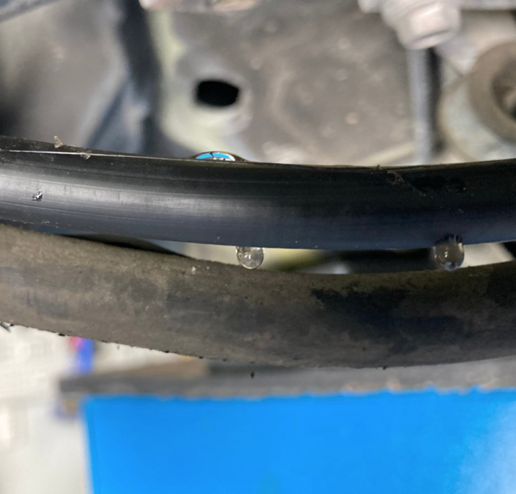](../images/parking-brake-cables-failure-and-maintenance/04-water-dripping-from-casing.png)

[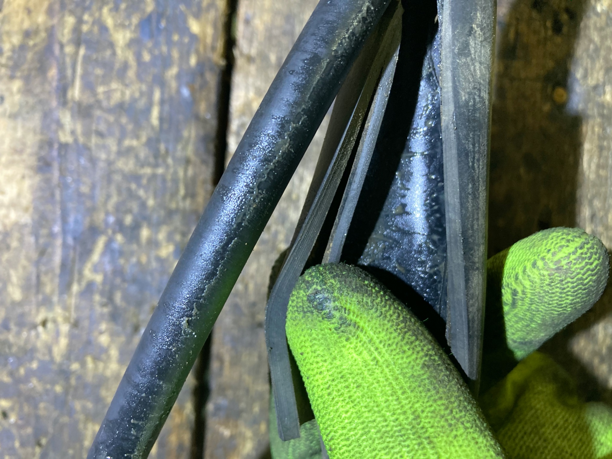](../images/parking-brake-cables-failure-and-maintenance/05-corroded-spiral-housing.jpg)

[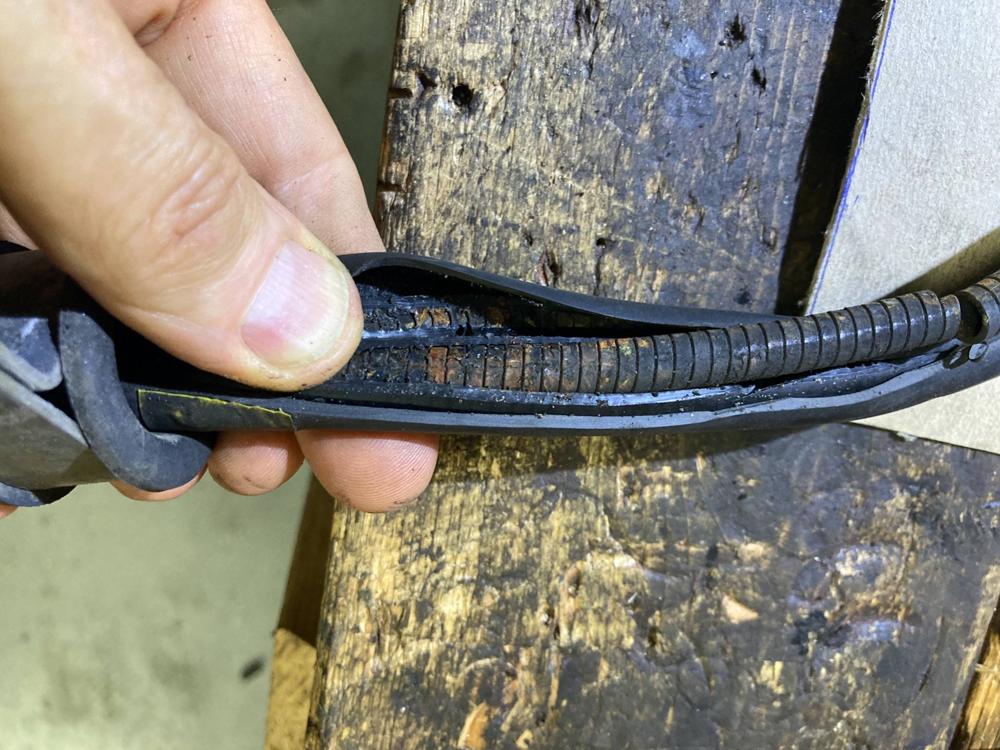](../images/parking-brake-cables-failure-and-maintenance/06-split-cable-casing.jpg)

This shows all the crud packed inside the steel spiral housing. This is after the inner cable was pulled out (using a threaded spring compressor!) You can see that the cable has NO ROOM to slide with all this crud packed inside the spiral housing. These corrosion byproducts feel like gritty sand.

[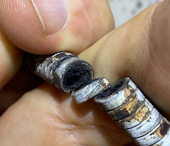](../images/parking-brake-cables-failure-and-maintenance/07-housing-corrosion-closeup.png)

More photos of the hard corrosion products packed inside the spiral cable housing. There’s no room for an inner cable to slide in there!

[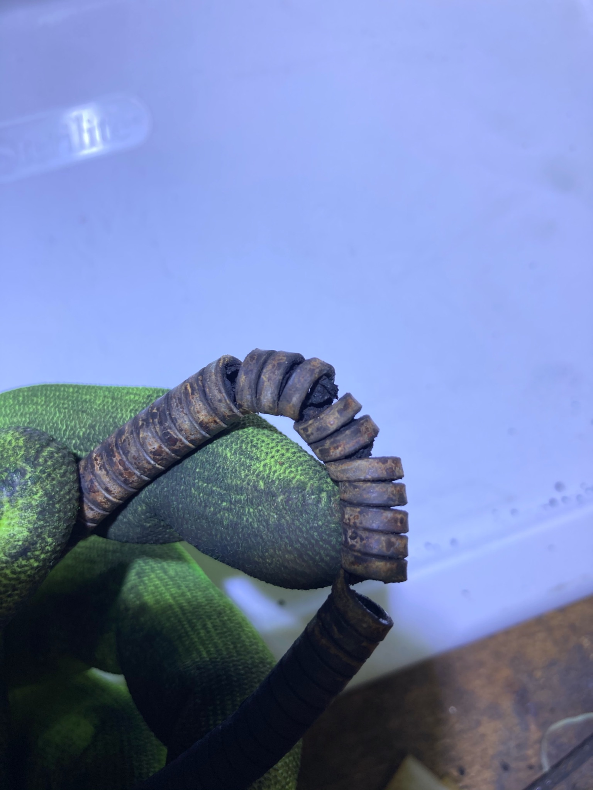](../images/parking-brake-cables-failure-and-maintenance/08-bent-corroded-housing.jpg)

[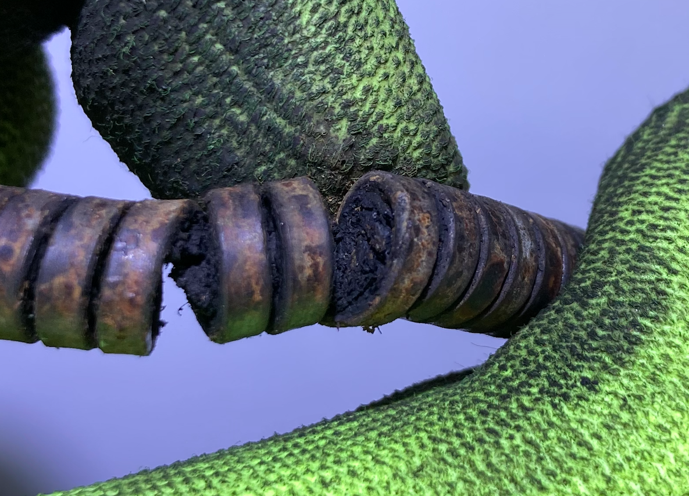](../images/parking-brake-cables-failure-and-maintenance/09-corrosion-in-spiral-housing.png)

[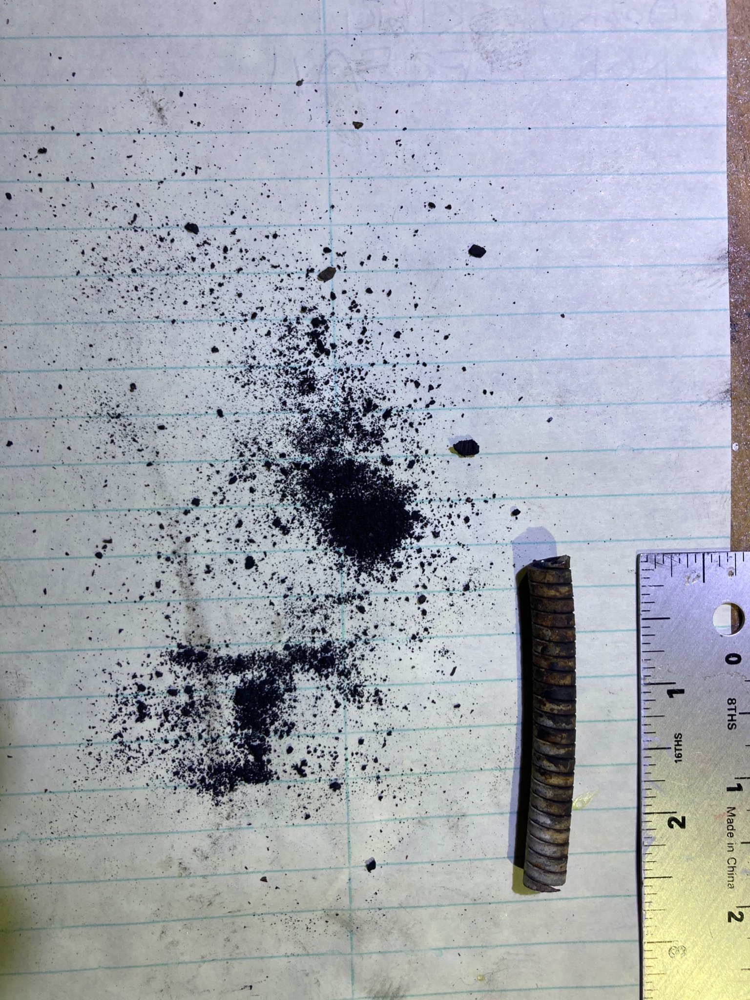](../images/parking-brake-cables-failure-and-maintenance/10-removed-corrosion-debris.jpg)

I like this product below. I know it’s not harmful to plastics and rubber, and it’s designed to prevent corrosion.

[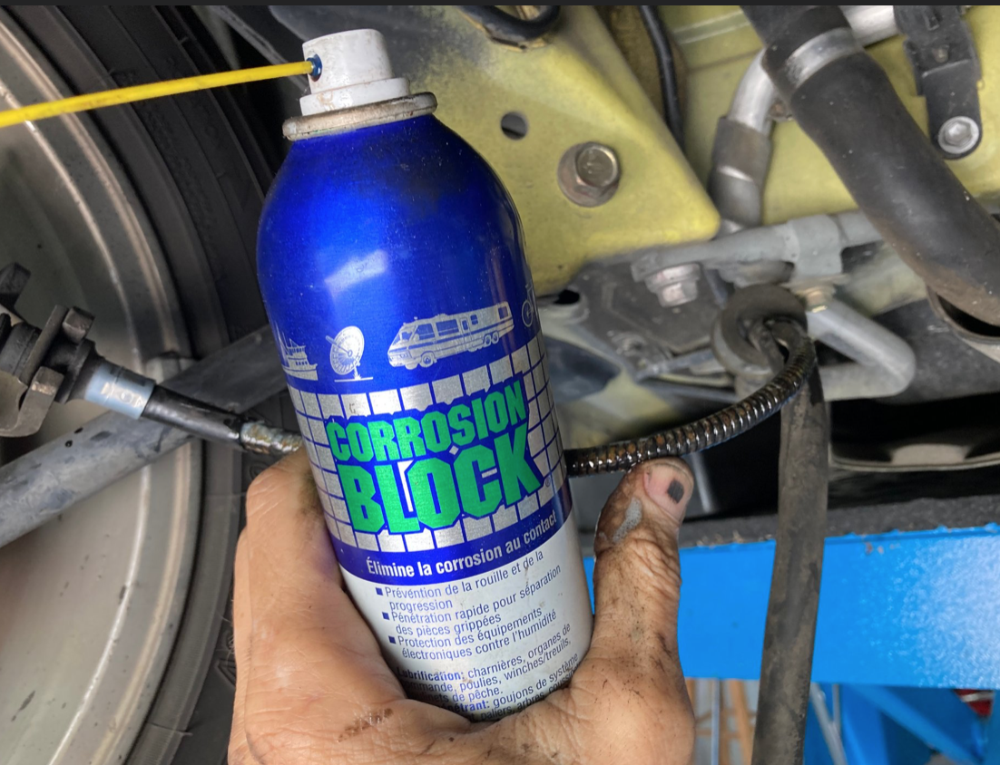](../images/parking-brake-cables-failure-and-maintenance/11-corrosion-block-product.png)

This shows the split plastic wire loom cover, to keep crud out after I sliced the rubber/plastic casings open. Notice the broken small rubber bellows at the aft end of the cable (on the left) by the calipers. That’s where the water gets in!

[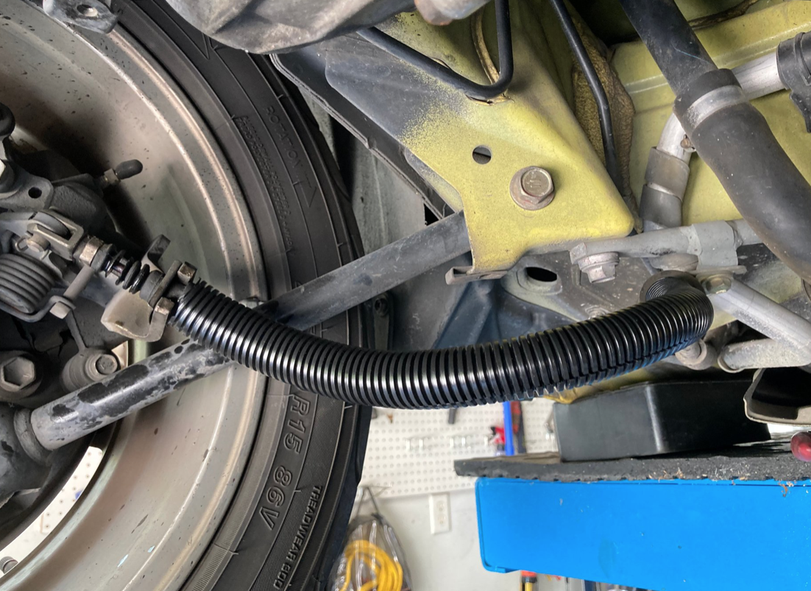](../images/parking-brake-cables-failure-and-maintenance/12-split-wire-loom-cover.png)

Remove the retention spring clip and clevis pin to install some heat shrink tubing.

[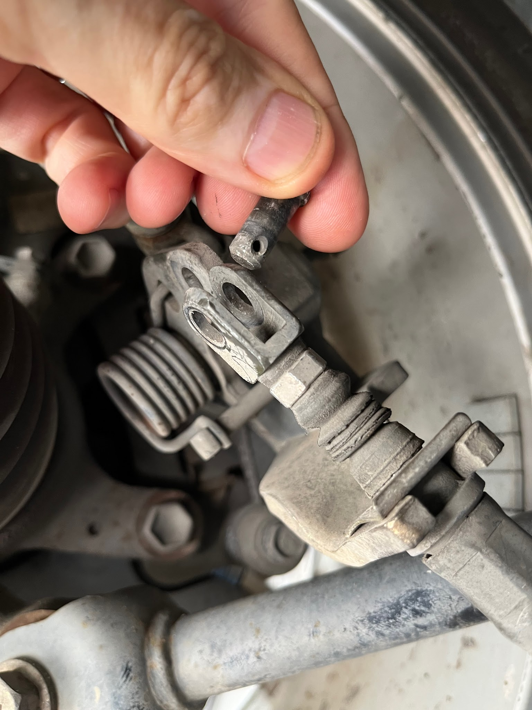](../images/parking-brake-cables-failure-and-maintenance/13-clevis-pin-removal.jpg)

Don’t lose the spring clip, it will shoot across the garage and disappear!

[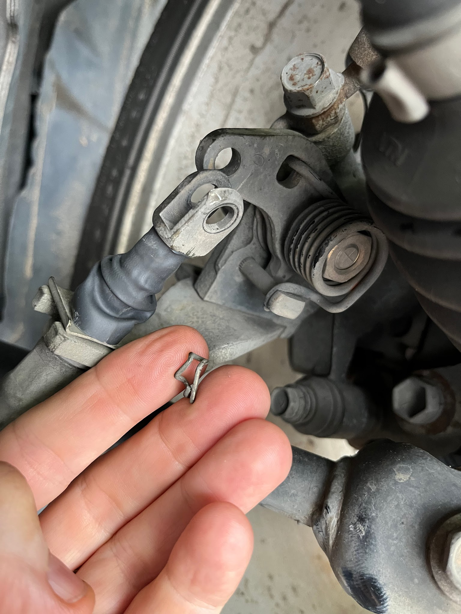](../images/parking-brake-cables-failure-and-maintenance/14-retention-spring-clip.jpg)

¾ inch diameter heat shrink tubing will slide over the clevis end of the cable. A little extra length because the length will also shrink as you heat the tubing.

[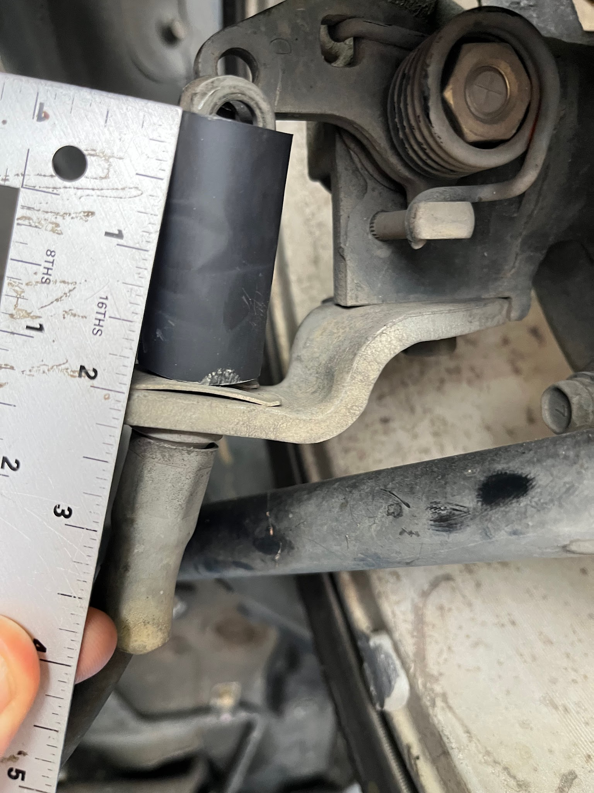](../images/parking-brake-cables-failure-and-maintenance/15-heat-shrink-length.jpg)

### Heat shrink bandaid:

[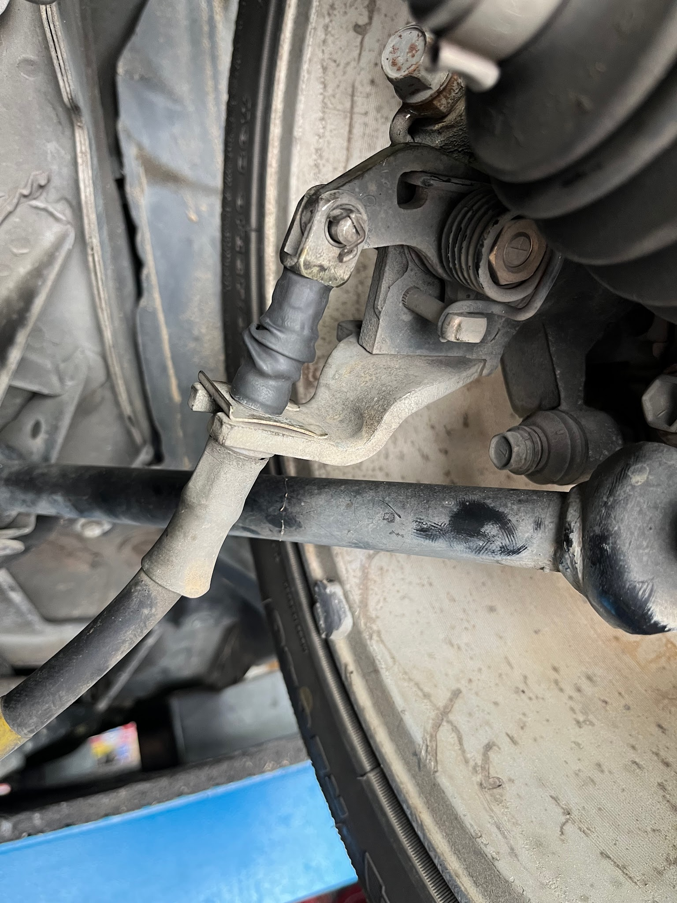](../images/parking-brake-cables-failure-and-maintenance/16-heat-shrink-bellows-repair.jpg)

### How to replace the cables:

[https://docs.google.com/document/d/1-AcYFYLW34Rv1Ra5I7Q2fk7Mvdhd1eL2xbuQ0jqLxCY/edit](<https://docs.google.com/document/d/1-AcYFYLW34Rv1Ra5I7Q2fk7Mvdhd1eL2xbuQ0jqLxCY/edit>)

### Videos:

Slicing open the outer casing - and the water starts dripping out:

[MR2 Spyder - parking brake cable full of water](<https://youtu.be/bxMuYlBvNH4>)

Blowing the water out using compressed air:

[MR2 Spyder - parking brake cable - blowing out the water](<https://youtu.be/XfySEWs28Ro>)

[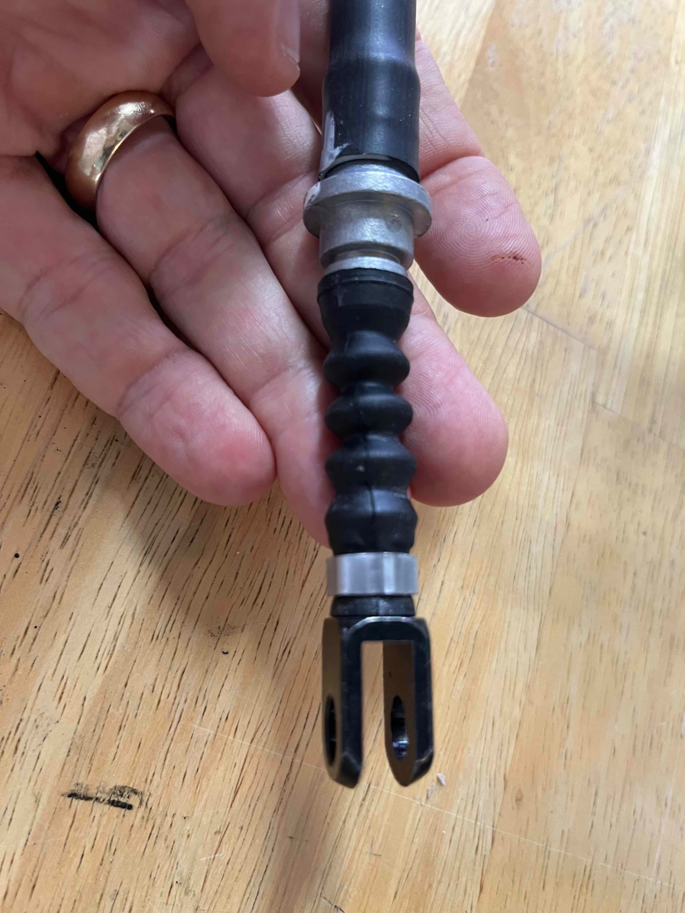](../images/parking-brake-cables-failure-and-maintenance/17-replacement-cable-caliper-end.jpg)

[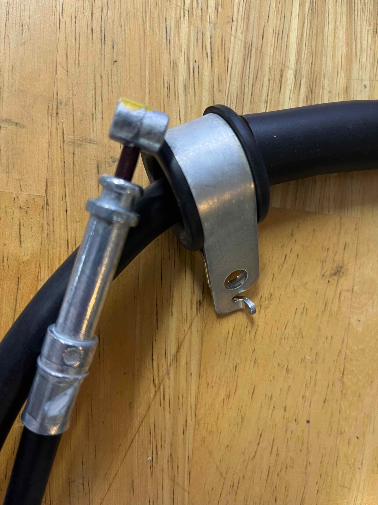](../images/parking-brake-cables-failure-and-maintenance/18-replacement-cable-front-end.jpg)

---

[Back to chapter index](../README.md)
