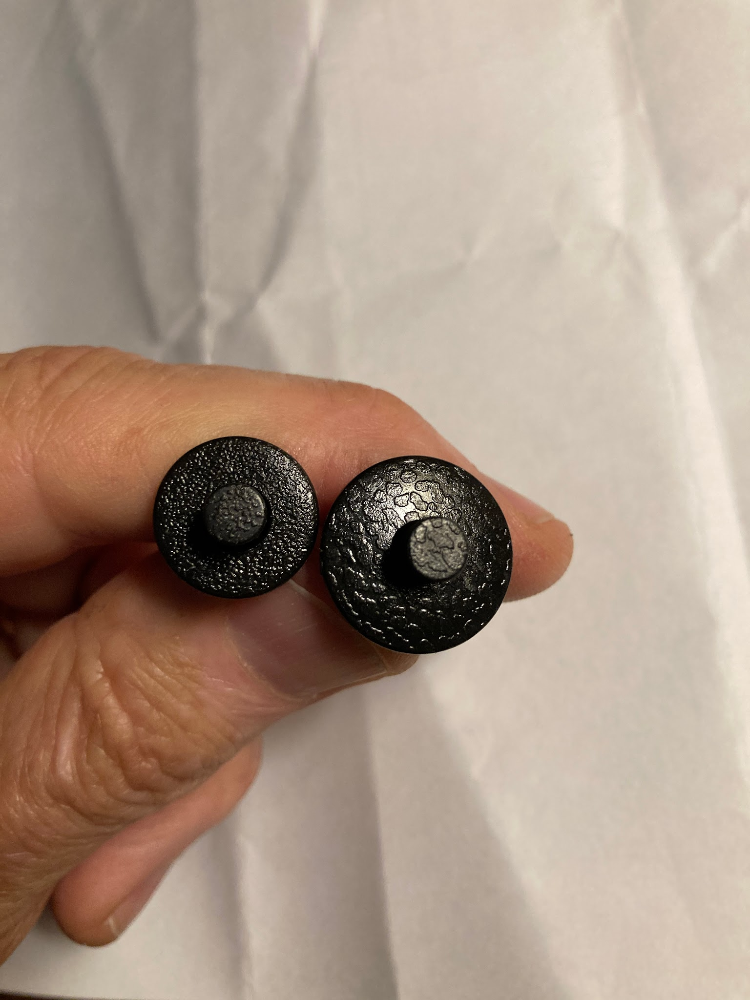
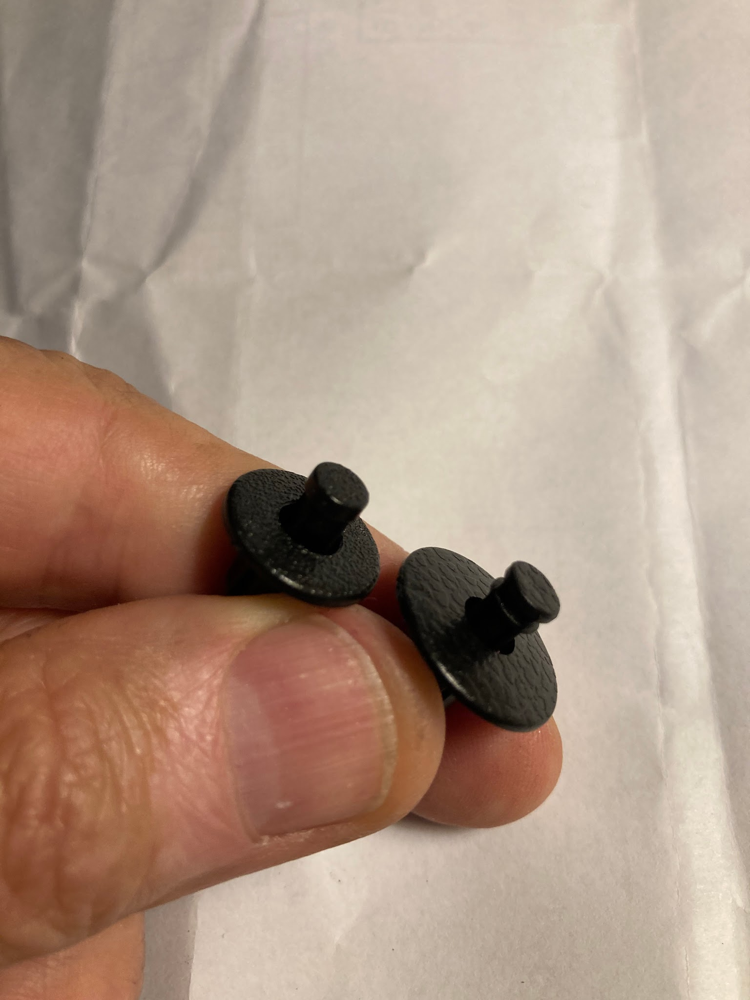
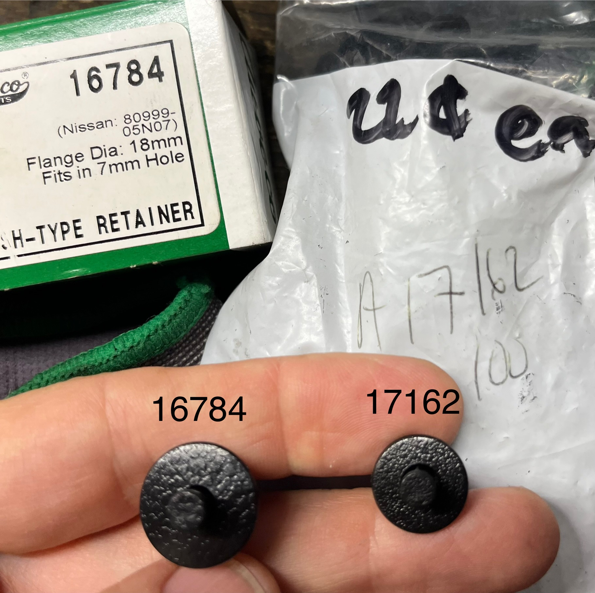
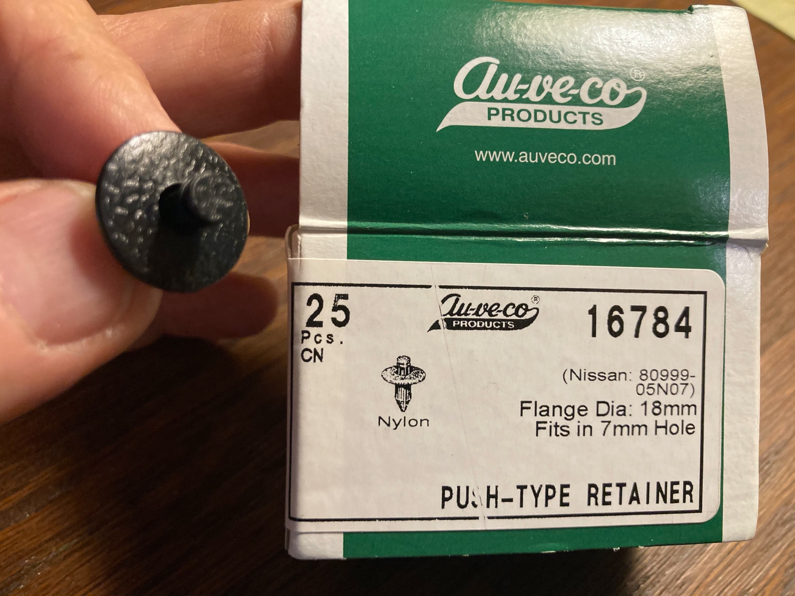
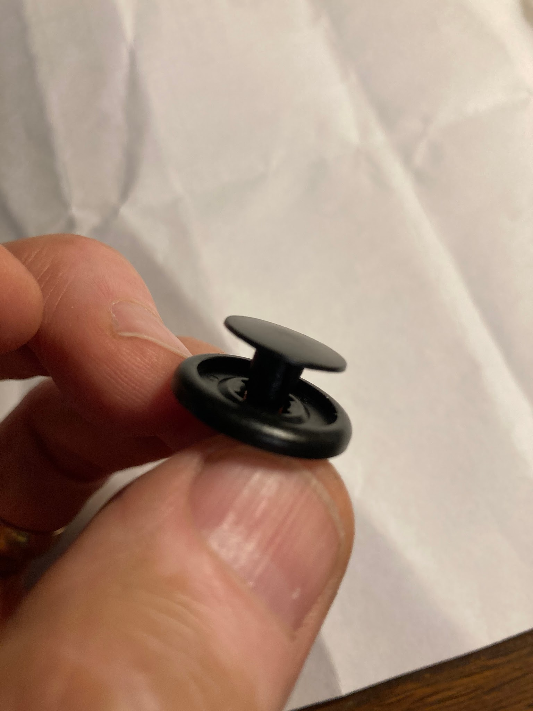
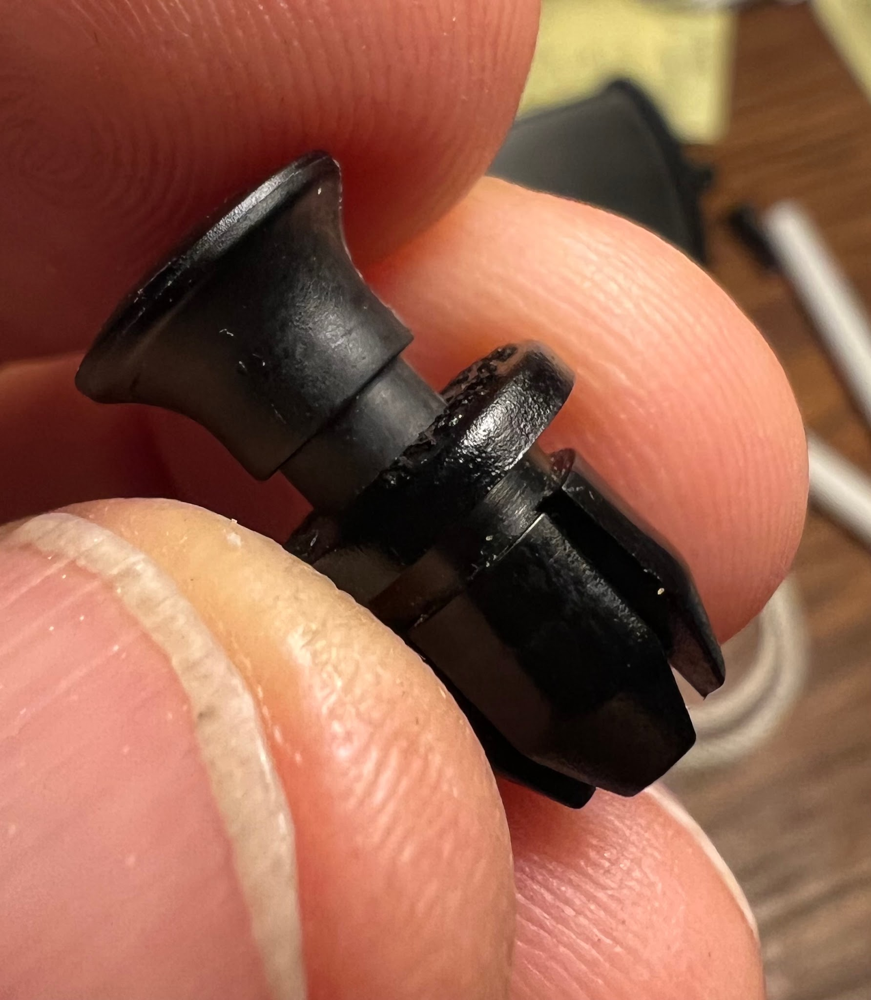
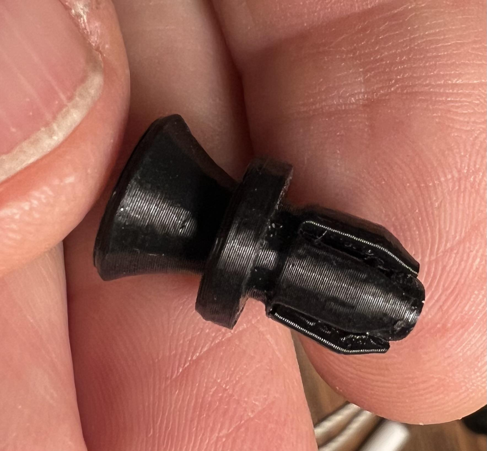
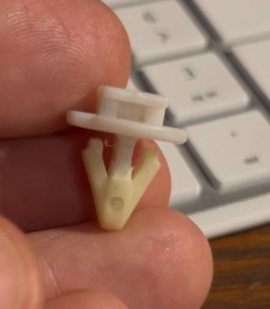
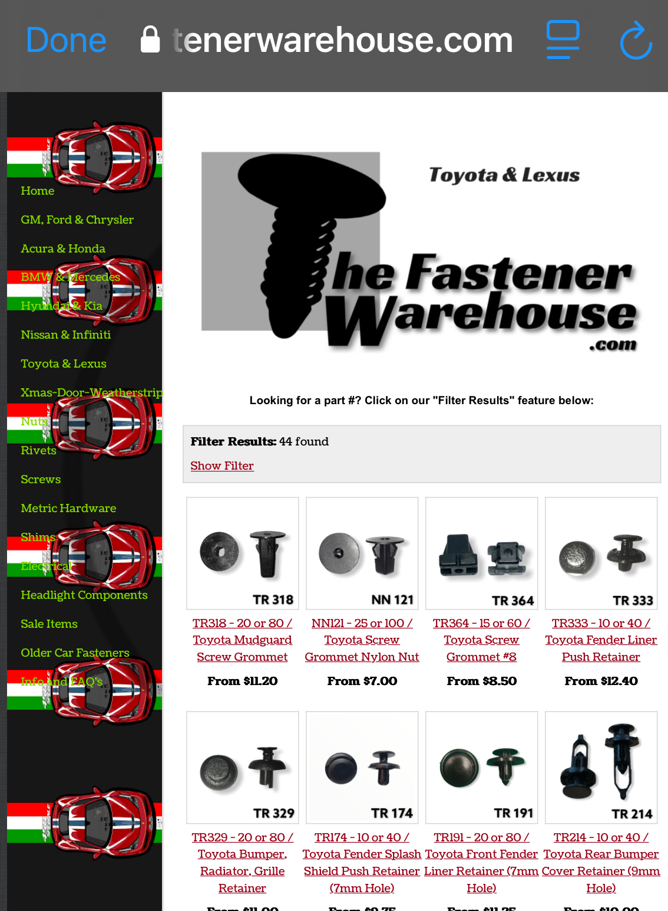

# Plastic Rivets - MR2 Spyder

[Back to chapter index](../README.md)

“Auveco” appears to be the high quality manufacturer for auto body hardware.

---

## 1. Frunk and cabin crossbar pushbutton rivets:

Toyota #90467-07055-C0 is the correct rivet for MR2 Spyder. Same as Auveco #16784

- 7mm hole

- 11mm grip

- 18mm head dia

### Option:

Auveco #17162

This rivet has a smaller head and shorter grip. These work fine in the frunk with one layer of sheetmetal behind the plastic. They are cheaper than the larger “correct” rivets above.

(Auveco #17162 is same as Toyota #90467-07076-C0 which is used on SW20 Toyota MR2)

- 6.3mm hole

- 8mm grip

- 15mm head dia

### Option:

3D print a similar rivet I designed.

[https://www.thingiverse.com/thing:6960368](<https://www.thingiverse.com/thing:6960368>)

### Sources:

Ebay - Seller: “Fastener-Factory”

“50 Pcs Cowl Vent Panel Clip Push Type Retainer A16784 For Toyota Fits For Nissan” $8.57 for 50 pieces.

These are real junk. They come un-assembled, and stuck together with flashing nubs like a cheap model car. They do not function correctly, the center pin does not lie flush when installed. The texture of the rivet head is not correct and looks cheap. The flashing nubs must be individually cut and sanded off, then the rivets assembled. Don’t waste your money buying from this seller.

Ebay - Seller: “Autoplicity”

“AUVECO 16784 fits Nissan & fits Toyota”. $20 for 25 pieces. These are top quality identical to the Toyota rivets. The center pin lies flush when installed, the “leather grain” finish on the rivet heads is correct to match the Toyota parts. The rivets are assembled and ready to use.

---

## 2. Fender Liner push-tab rivets:

Toyota #90467-07166 (this is the correct rivet for the fender liner on MR2 Spyder). Same as Auveco #18888

- 7mm hole

- 8mm grip

- 20mm head dia

### Option:

Slightly longer grip - Used on Camry, Yaris, Corolla etc

Toyota #90467-07201

Auveco #20955

- 7mm hole

- 10mm grip

- 20mm head dia

---

## 3. Storage Cubby corner panel “push pin” rivets:

These are special rivets with an extended center pin to ease removal.

They do not appear on any Toyota parts lists. They only come with the entire corner panel. Made by NIFCO - “NIF LATCH CLIP”.

I have modeled these clips in CAD so I can print them and mail them out for cheap.

[https://www.thingiverse.com/thing:6952008](<https://www.thingiverse.com/thing:6952008>)

---

## 4. Side Vent clips:

Toyota PN 62955-12010

I have modeled these clips in CAD. If you have a 3D printer, STL file is available for free.

[https://www.thingiverse.com/thing:6951994](<https://www.thingiverse.com/thing:6951994>)

## Sources:

[https://www.allensfasteners.com](<https://www.allensfasteners.com/order.asp>)

[https://www.fastener.zone/products/auveco-6552-toyota-and-lexus-push-type-retainers](<https://www.fastener.zone/products/auveco-6552-toyota-and-lexus-push-type-retainers>)

[https://autofastenersandclips.com/pages/search-results-page?q=17162](<https://autofastenersandclips.com/pages/search-results-page?q=17162>)

[https://onlinecatalog.auveco.com/Auveco-Catalog/550/](<https://onlinecatalog.auveco.com/Auveco-Catalog/550/>)

[TheFastenerWarehouse](<https://www.thefastenerwarehouse.com/toyota-lexus.html>) .

[Thefastenerwarehouse@outlook.com](<mailto:Thefastenerwarehouse@outlook.com>)

Owner (?) hailey.wagner@yahoo.com

Seems to be a small (one person?) company, but they have nice parts!

Website is a little quirky.

---

[Back to chapter index](../README.md)
