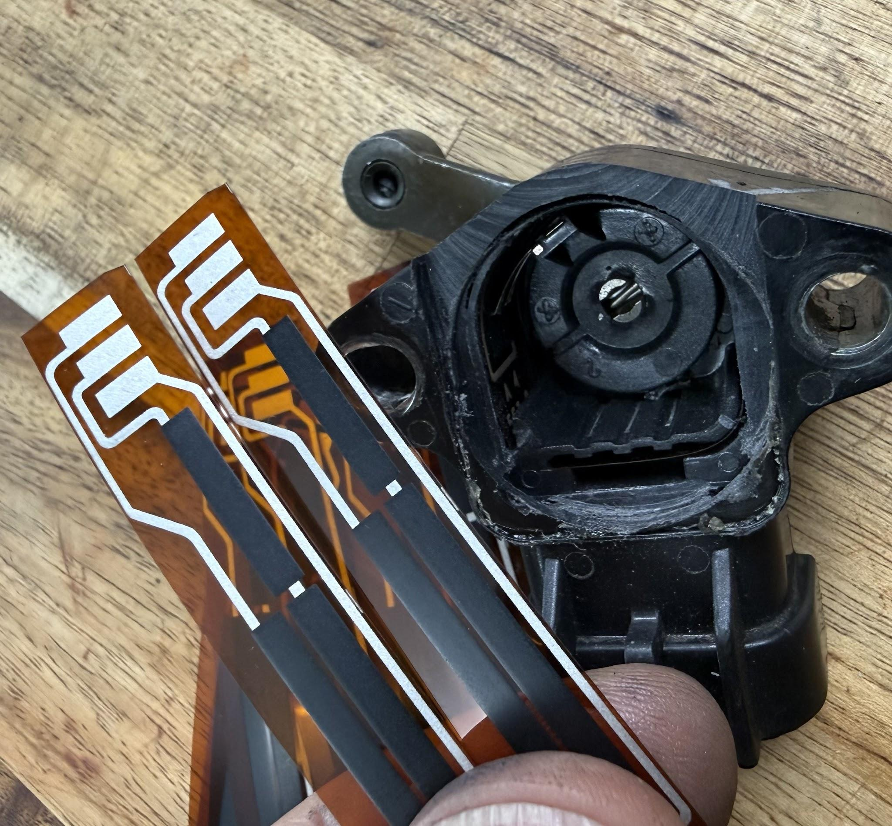
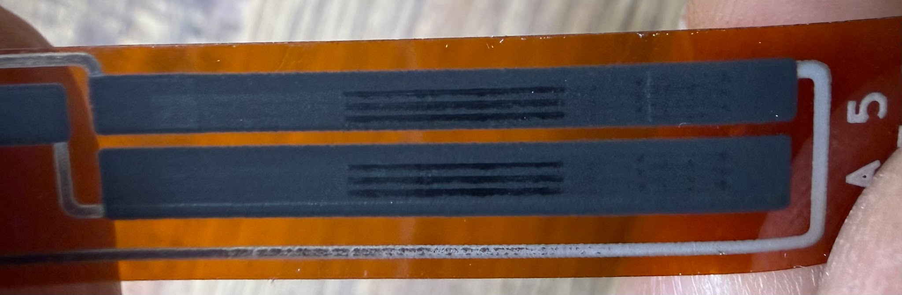
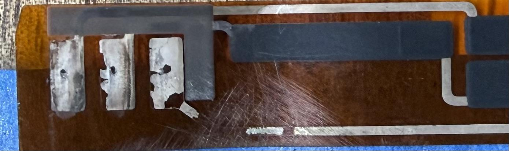
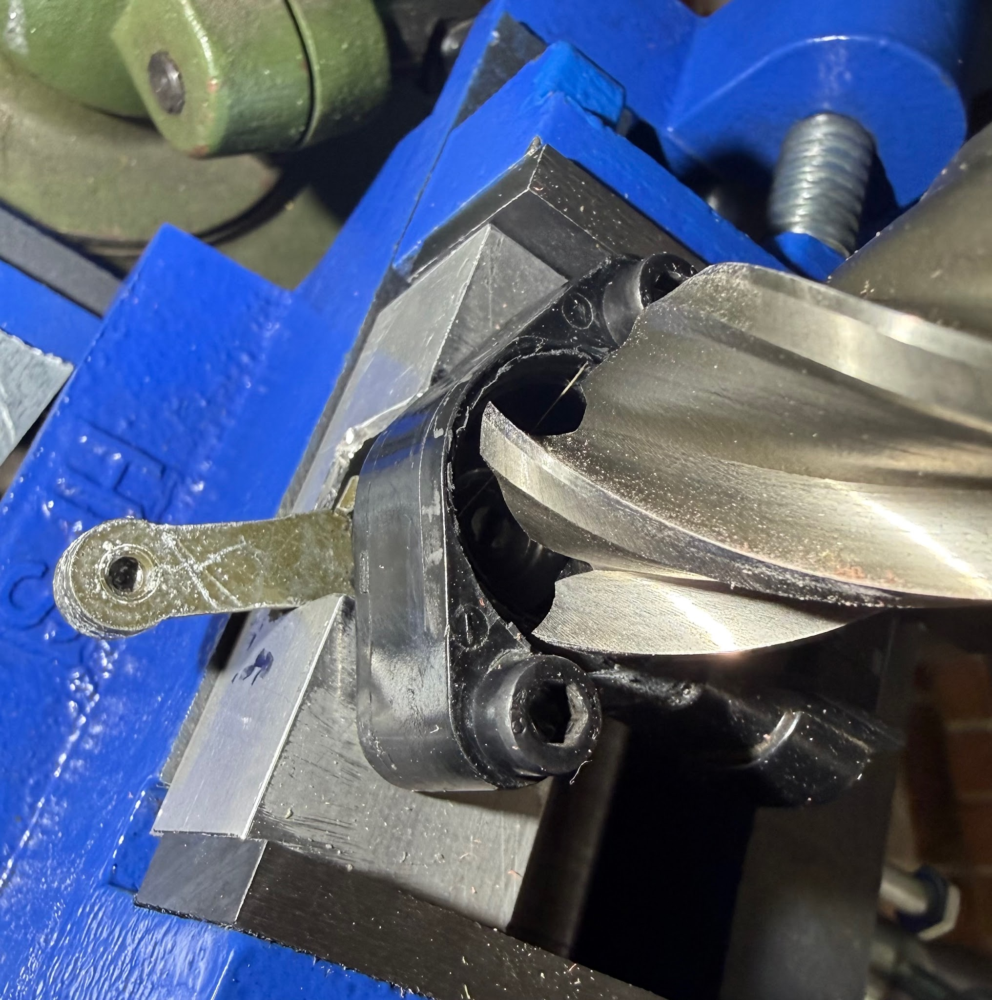
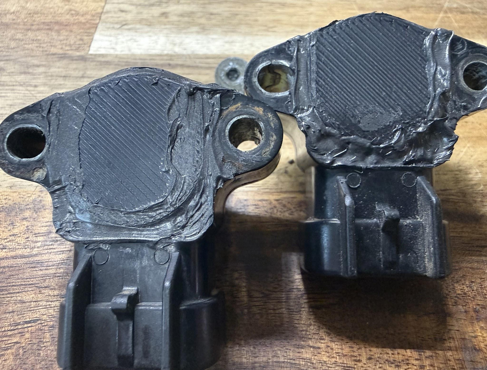

# SMT - Position Sensor PCBs for sale

Composed by [cyclehead21@gmail.com](<mailto:cyclehead21@gmail.com>)

[Back to chapter index](../README.md)

Feel free to copy and share.

## Prices:

New printed circuit Boards (PCBs): $20 each, please order (from me) through Ebay: [https://www.ebay.com/itm/157967612065](<https://www.ebay.com/itm/157967612065>)

Renewed position sensor assemblies: $45 each exchange\*, plus shipping

### \*For exchange parts:

Email me at [cyclehead21@gmail.com](<mailto:cyclehead21@gmail.com>) BEFORE you send me anything. When you send me your old position sensor, I can promptly send you a renewed sensor.

Alternatively, I can cut your old sensor apart and insert a new PCB. Your choice. Sending you an exchange sensor is faster since I have completed sensors ready to ship immediately. Sample photos below.

For SMT owners in Australia: Contact Asela Fernando apn.fernando@gmail.com

## History:

The SMT system uses three position sensors to feed variable voltages to the TCU. They report the positions of the actuators (shift, select and clutch). New position sensors became unavailable about 8 (?) years ago. Since then, the only supply of replacement parts comes from used sensors salvaged from other SMT Spyders, and those are all 25 years old! As a result, the price of the used sensors has gone up, with one supplier selling them for $300 each! Wow!.

## Failures:

Position sensors most commonly fail after getting soaked with brake fluid which has leaked from the GSA. The brake fluid contaminates the circuit board inside. The brake fluid attracts moisture. The moisture causes corrosion on the electrical contacts on the PCB, and the car will cease shifting.

A second failure mode is wear: The sensors have small metal brushes that ride on the resistive tracks. They can simply wear through the conductive paint printed on the PCBs.

This one is still good but you can see where the brushes wear on the tracks:

A third failure mode results from the electrical traces crumbling or breaking. I think this results from extended soaking in brake fluid, and possibly aggravated by high temperatures.

Broken and missing traces:

## DIY Repair:

A sensor that is contaminated with brake fluid can be cut apart, and usually cleaned with alcohol to successfully save the sensor. Tracks that are worn through cannot be repaired. Electrical traces that have broken or crumbled cannot usually be repaired. (I tried some electrically conductive paint - with poor results) DIY repair info is below. PLEASE work carefully as these sensors are irreplaceable.

Video: [https://youtu.be/hDJ1Oe-PQbw](<https://youtu.be/hDJ1Oe-PQbw>)

Repair to a position sensor is accomplished by making four cuts in the plastic sensor case, about ⅛ inch deep. The cuts will allow you to remove the flat cover plate and access the internal parts. Use a Dremel with a thin blade to cut the flat cover plate off the sensor. Look at the video above to see where to cut.

Some cleaning can be done without removing the mylar strip. However moisture contamination of the sensor may require you to completely remove the strip for thorough cleaning. To remove the mylar strip, use a pair of tweezers to pull out the metal “U” clip (clip has three prongs). After removing the metal clip, the mylar strip can be pulled out of the sensor housing. Be careful not to bend the tiny metal fingers on the wiper! I think that “Simple Green” or similar detergent is best to clean off any old brake fluid inside the case. After cleaning, rinse with water and thoroughly dry the sensor case using compressed air. ( I tried brake cleaner and it doesn’t remove the brake fluid. )

When you insert the new PCB strip, again be careful not to bend the tiny metal fingers on the wiper. I like to slide the strip into position while sweeping the arm. This allows the fingers to jump onto the mylar without being bent sideways. Press the metal “U” clip back into position. Verify resistances and smooth voltage output before you proceed any further.

When you’re satisfied with the repair, glue the flat lid back into place. Automotive “RTV” gasket compound works well - the goal is to keep dirt and moisture (and any leaking brake fluid) out of the sensor. DO NOT use thin watery adhesive like model airplane glue, because it will leak inside the sensor, harden and destroy the sensor!!

## Position Sensor Exchange:

You can send me your non-functioning sensor (with no physical damage), and I will install a new circuit board. I use an end mill to cut a nice round hole in the cover plate. Then I insert the new circuit board, and seal a 3D printed plastic cover over the hole using RTV sealant.

I can either renew your old sensor, or immediately ship you a previously renewed sensor. Your choice. Renewing your old sensor will take a little longer as I have to fit the rework time into my schedule, and allow time for the RTV to cure.

Please email me BEFORE you send me your old sensor ([cyclehead21@gmail.com](<mailto:cyclehead21@gmail.com>)).

This video shows how I’m cutting the case open: [https://youtube.com/shorts/w1LpZhz8Mx4?si=rIHpiNRQvXxzeNRl](<https://youtube.com/shorts/w1LpZhz8Mx4?si=rIHpiNRQvXxzeNRl>)

A 1” diameter end-mill cutter makes a clean cut that allows installing the new PCB.

I try to make the sealant look pretty, but I’m not an artist.

---

[Back to chapter index](../README.md)
