

# Position Sensors - Test and Repair

[Back to chapter index](../README.md)

(DO NOT discard bad sensors, they can be repaired!)

Composed by Cyclehead21@gmail.com

Updated August 2026

Feel free to copy and share, just give me a little credit!

Ref: Toyota Part Number 89419-0W010 (early), 89419-0W020 (late)

(Note: ALL position sensors are interchangeable!)

[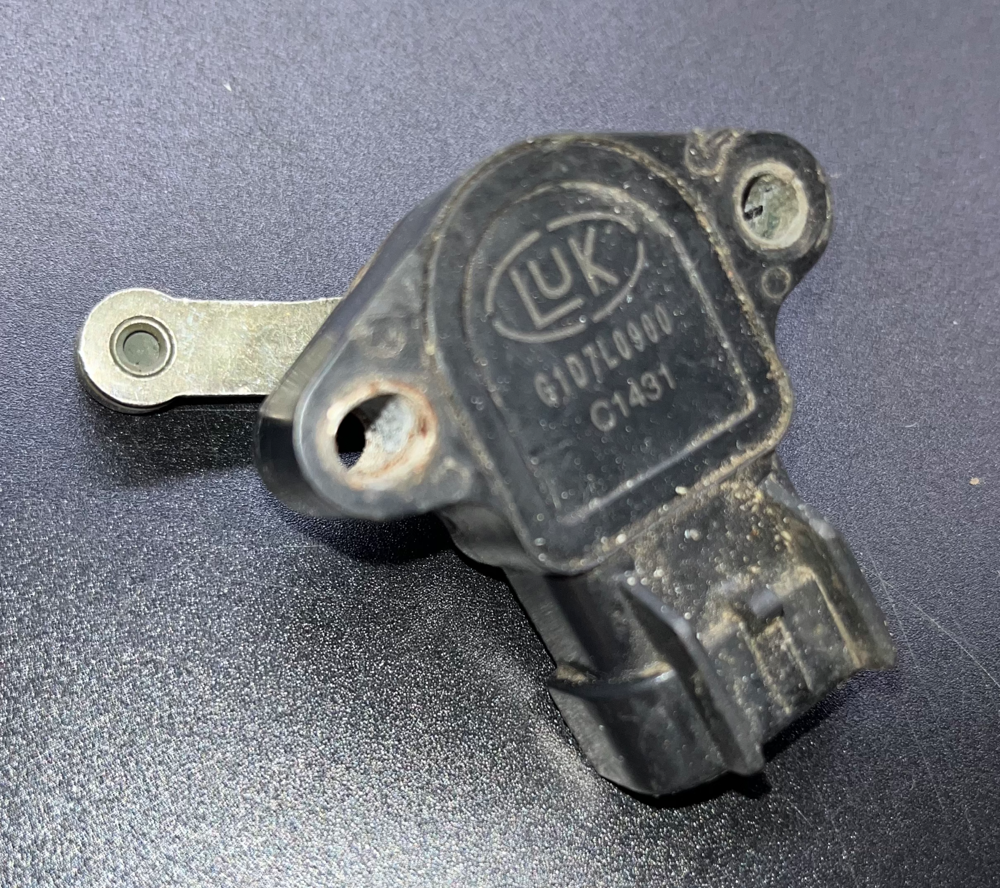](../images/position-sensor-test-and-repair/01-position-sensor-front.png)

[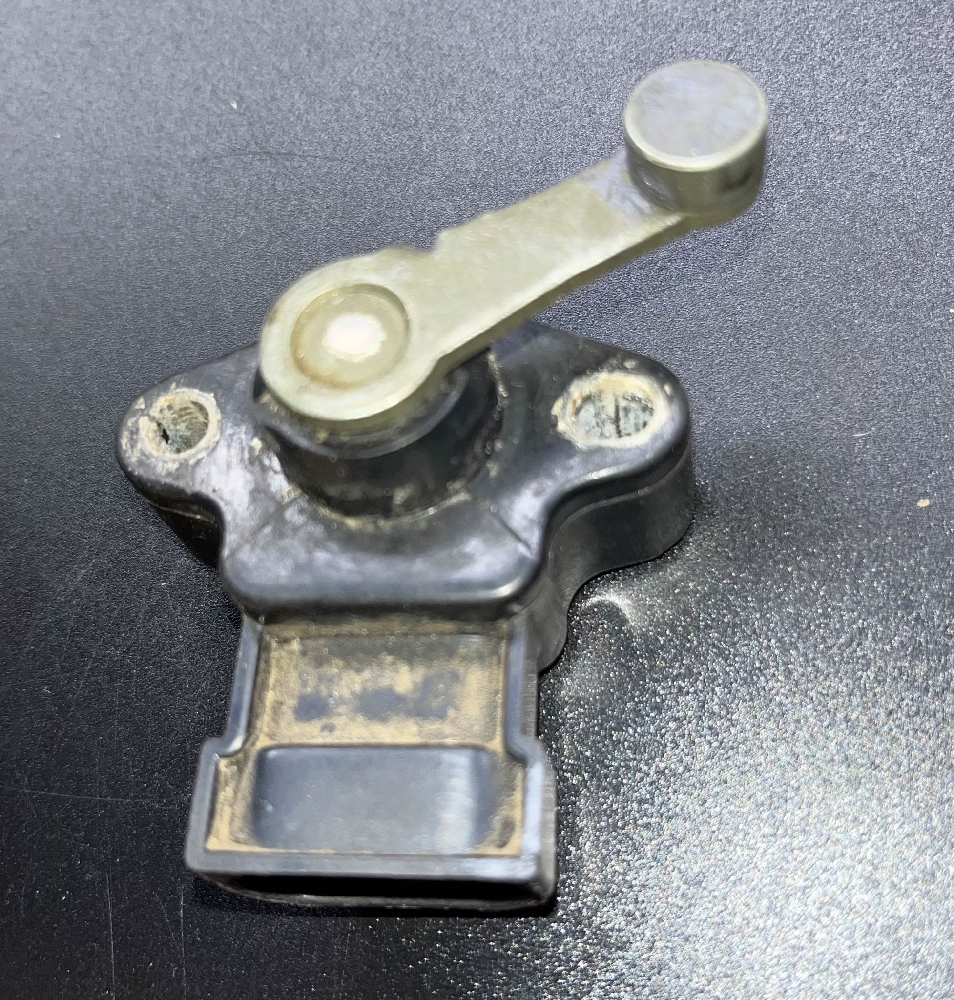](../images/position-sensor-test-and-repair/02-position-sensor-arm.png)

## Table of Contents

- [Background](#background)

- [Removal](#removal)

- [Failures](#failures)

- [Disassembly and Reassembly](#disassembly-and-reassembly)

- [Testing](#testing)

  - [a) Voltage output](#voltage-output)

  - [b) Voltage dropout](#voltage-dropout)

  - [c) Total Resistance check](#total-resistance)

  - [d) Swap the sensors](#swap-the-sensors)

- [Repairs](#repairs)

  - [1) Cleaning](#cleaning)

  - [2) New circuit boards !](#replace-circuit-board)

  - [3) Reassembly](#reassembly)

- [Videos](#videos)

- [Installation](#installation)

- [Programming](#programming)

- [Photos](#photos)

- [Reference info](#reference-info)

## Background:

The SMT system uses three identical position sensors to monitor the physical position of each of the three hydraulic actuators in the SMT system. This function is part of a closed-loop feedback system needed by the TCU to control and monitor clutch modulation and gear shifts.

The position sensors have a short metal arm that rides on the appropriate actuator in the GSA. Internally the arm is connected to some tiny metal “fingers” that ride on a flexible Printed Circuit Board (PCB). As the arm moves, the fingers sweep over a conductive strip allowing varying voltage to pass through the sensor. The varying current signal is monitored by the TCU, as it uses the values to determine the precise locations of the actuators.

Two sensors are visible on the bottom of the GSA, and one is hidden on top of the GSA. The bottom inboard sensor (closest to the clutch fork) monitors the clutch actuator’s position. The adjacent sensor is the “shift” sensor. The sensor on top of the GSA (not accessible without removing the GSA) is the “select” sensor. (see the sketch below)

All SMT position sensors are interchangeable. They are identical between the three positions in the system, and between all models (pre-facelift and facelift spyders). There are slight differences in early and later flexible PCBs, yet they all function identically. (Early and late revision PCBs have different pattern circuits, and different internal resistance values.)

New sensors are no longer available. Toyota ceased supporting the SMT system about 10 years ago, and LUK steadfastly refuses to provide any spare parts for the system. Monkeywrenchracing sells used position sensors for a premium price, so DO NOT throw away your old sensors! Fix them, or send them to me and I’ll gladly fix them.

Monkeywrenchracing buys used SMT systems, and strips all the valuable parts off them to sell separately. This includes these 25 year old position sensors - now selling for $300 each. Holy crap!

[https://www.monkeywrenchracing.com/product/toyota-oem-sensor-smt-gsa-travel-used-2/](<https://www.monkeywrenchracing.com/product/toyota-oem-sensor-smt-gsa-travel-used-2/>)

## Removal:

Each position sensor is secured to the GSA by two torx head T-25 screws. The Clutch sensor is easily removed. The “shift” sensor (adjacent to the clutch sensor) can also be removed, but access is tight. You’ll need to cut the tip off your T-25 tool so it will fit in the small space available. The “select” sensor is mounted on top of the GSA and requires removal of the GSA to remove it.

If you need to chase the threads on the two screws, (or find replacement screws), they are M5x0.8 thread. (In a pinch, you can use an SAE #10-24 die, which is very close).

## Failures:

The position sensors can fail due to:

a) Corrosion and shorts resulting from contamination with SMT fluid (brake fluid) from a leaking seal in the GSA. The brake fluid gets inside the sensor and attracts moisture. The moisture shorts the contacts and causes the printed circuit contacts to corrode. This is the most common source of failures.

b) Wear of the conductive strip due to age and cycles. Surprisingly this is very rare. I have seen only one sensor like this, where the wiper contacts actually wore through the printed resistance strip.

c) Open circuits resulting from cracked and broken printed circuit traces on the mylar strip. I believe this is the result of high heat combined with soaking in brake fluid for a long time. This is probably the second-most common reason for a position sensor to fail.

When a position sensor fails, you should see a TCU failure code (the red gear warning light).

- P0916 indicates a failed “shift” sensor. (on bottom of the GSA)

- P0906 indicates a failed “select” sensor. (on top of the GSA)

- P0807 indicates a failed clutch sensor. (on bottom of the GSA)

This video shows me testing a variety of bad position sensors. Some show total resistance too high (NOT a reason to scrap a sensor!), some show output voltage too low or too high, some exhibit jumpy output voltage as I sweep the arm. [https://youtu.be/DxjTGWTHUAo](<https://youtu.be/DxjTGWTHUAo>)

## Disassembly and Re-assembly:

Video: [https://youtu.be/hDJ1Oe-PQbw](<https://youtu.be/hDJ1Oe-PQbw>)

Position sensors can be cut open by making four cuts in the plastic sensor case with a dremel tool, or by maching the flat cover plate off using an end-mill (much neater cuts!). I made a fixture to hold the sensor while I cross-feed the sensor into the mill blade. Both methods work fine.

To cut yours open with a Dremel tool, make each cut about ⅛ inch deep. The cuts will allow you to remove the flat cover plate and access the internal parts. Use a Dremel with a thin blade to cut the flat cover plate off the sensor. Look at the photos below (and video above) to see where to cut - avoid cutting the Mylar strip inside.

Sometimes cleaning can be done without removing the mylar strip. However moisture contamination of the sensor may require you to completely remove the strip for thorough cleaning.

To remove the mylar strip, use a pair of tweezers to pull out the metal “U” clip (clip has three prongs). After removing the metal clip, the mylar strip can be pulled out of the sensor housing. Be careful not to bend the tiny metal fingers on the wiper! I think that “Simple Green” or similar detergent is best to clean off any old brake fluid. Rinse with water and thoroughly dry the sensor case using compressed air. (Brake cleaner doesn’t remove brake fluid.)

When you re-insert the mylar strip, be careful not to bend the tiny metal fingers on the wiper. I like to slide the mylar strip into position slowly, while sweeping the arm. This allows the fingers to jump onto the mylar without being bent sideways. Lastly press the metal “U” clip back into position. Verify resistances and smooth voltage output before you proceed any further.

When you’re satisfied with the repair, glue the flat lid back into place. Automotive “RTV” gasket compound works well - the goal is to keep dirt and moisture (and any leaking brake fluid) out of the sensor. DO NOT use thin watery adhesive like model airplane glue, because it will leak inside the sensor, harden and destroy the sensor!!

## Testing:

### a) Voltage output (bench test)

Apply 5V across two outer pins (note \* below), and read output voltage on the center pin. The factory manual defines the exact voltage that should be present, based on the position of the arm. The manual requires a .18v range from the specified values. However I see very little value in calibrating all the angles and voltages throughout the sweep. The voltage dropout test is much better.

### b) Voltage Dropout

This test looks for erratic and jumpy voltage output that would confuse the TCU.

Use an analog voltmeter, watch for smooth and uniform voltage rise as you sweep the arm through its full range of motion. I’ve seen some sensors make an analog needle bounce as you sweep the arm. To be even more thorough, use an oscilloscope to watch for voltage dropouts as you sweep the arm. This cheap one from Aliexpress works fine for $36.

[https://www.aliexpress.us/item/3256805833382411.html?spm=a2g0o.order\_list.order\_list\_main.5.3d4c1802VvAg6A&gatewayAdapt=glo2usa](<https://www.aliexpress.us/item/3256805833382411.html?spm=a2g0o.order_list.order_list_main.5.3d4c1802VvAg6A&gatewayAdapt=glo2usa>)

Performing this test with a digital voltmeter is NOT adequate, because nobody can detect an intermittent voltage drop by looking at a bunch of numbers flashing by a digital display.

Note\*: I use a USB transformer to supply the test voltage. Simply crack open a usb cellphone transformer (wall wart). Or you can use three 1.5 volt batteries (AA size is fine).

The Toyota test procedure is pasted below.

This video shows a sensor that fails the “voltage output” test. I fixed it by drilling a small hole in the cover and spraying the interior with “DeoxIT Fader F5”. [https://youtube.com/shorts/nVxRe\_1ZCQk?feature=share](<https://youtube.com/shorts/nVxRe_1ZCQk?feature=share>)

This video shows another failed sensor. It’s easy to detect the voltage dropout using the cheap oscilloscope!

[https://youtube.com/shorts/kpg1LN\_g3Fs?feature=share](<https://youtube.com/shorts/kpg1LN_g3Fs?feature=share>)

### c) Total resistance (bench test)

Check the resistance between the two outer pins. Toyota specifies it should be between 3.5k ohm and 6.5k ohms. HOWEVER - There are two different revisions of the flexible PCB in the position sensors. One provides low resistance, and the other provides higher resistance. I’m convinced the lower resistance (published in the Toyota factory manual) is only valid on the early (revision A) PCBs. The new PCBs that I have for sale are based on the Revision B PCB, which has a higher resistance. Both PCB revisions work fine in all SMT spyders.

### d) Swap ‘em

If your “shift” sensor has failed, you can try swapping it with the clutch position sensor since these two are adjacent to each other on the bottom of the GSA (easily accessible). I have seen a jumpy sensor work fine on the clutch position, yet cause trouble in the “shift” position. Of course, if you move a questionable sensor to another position and the problem moves with it - you’ve found your bad sensor.

Note: DO NOT throw “bad” sensors away! These sensors are no longer made, so new parts do not exist. If you don’t want to attempt a repair of your bad sensor, send it to me. I have a jig and fixture set up with an end mill cutter. I can cut your sensors open very neatly and glue a nice 3D printed cover plate in place. After this repair, the sensor can be easily disassembled in the future for cleaning or repairs.

## Repairs:

### 1) Cleaning

#### 1.(a) Voltage dropout

This can be caused by contamination on the surface of the conductive strip. Contamination can be cleaned without cutting the sensor apart. Simply drill a hole in the center of the cover plate - in line with the arm pivot. Then spray the contents and blow it clear with compressed air.

Dropouts in voltage output may be caused by crud on the surface of the conductive strip preventing contact with the metal fingers. I’ve had success using “moving contact lubricant” designed for potentiometers. (ie: [DeoxIT Fader F5](<https://www.amazon.com/Hosa-D5S-6-DeoxIT-Contact-Cleaner/dp/B00006LVEU/ref=sr_1_1?crid=3SMKDVUT63O38&dib=eyJ2IjoiMSJ9.Cr0w1rfCs0cpsQ90vTZPJr_f-gifbfhG31iackwzXzh1OMoDLEnK9UlaGXHubK7QEiOOzyVqALr8EWqFvg38m-KZcWMnc--ldBACmAYq7wtpScuMjEtleFY3KYsKhPRs5gx5OK47G9nPJ2V03ctNYhc537zjL0UDv6_rX3hy3NxzBuuaA-7sjFqBUZwIO0PrKT4f_hEGGttRKHvMgIusOt6R-C4ABGD-bwap8Jv7rKBFfKvC_SDfmlaWHxkRUGnR-K6nBxXD7YRHK09MNiGXrzWRDNJKrKifBoAlJXKjiv4.K6DGHx-BjIa_YXPCoXjsqDLsn1Nc9xYPlW3se_fnKR4&dib_tag=se&keywords=deoxit%2Bd5%2Bspray%2Bcontact%2Bcleaner&qid=1721395602&sprefix=deoxit%2Caps%2C120&sr=8-1&th=1>)) I simply drill a small hole in the middle of the flat plastic cover and spray the interior, instead of cutting the entire top off the sensor.

If the whole sensor is drenched in brake fluid, then you can clean using a detergent like “Simple Green” and rinse with water. Be sure to blow all the moisture out of the sensor after cleaning. Note: Brake cleaner does not remove brake fluid very well at all.

#### 1.(b) Internal short

If you have an internal short it is likely caused by corrosion products or moisture creating a short. (Typically hidden under the metal “U” clip). Disassemble the sensor and remove the Mylar strip. Wipe the surface of the PCB dry with a paper towel and alcohol. Clean the residual brake fluid from the plastic case using detergent, water and some compressed air. Look INSIDE the plastic case at the three metal contacts (adjacent to the “U” clip). Scratch and wipe them clean.

#### 1.(c) Replace circuit board

May 2026 - I now have NEW flexible circuit boards available to renew your old sensor!

Cut the flat lid off your old sensor (carefully) and insert the new PCB.

How to disassemble and inspect position sensors:

[https://youtu.be/hDJ1Oe-PQbw?si=gtDZRO97qSFqCNKt](<https://youtu.be/hDJ1Oe-PQbw?si=gtDZRO97qSFqCNKt>)

New PCB sale details are here: [https://docs.google.com/document/d/1EqprInUkLTpsLSfBgH3iZ\_P0Kp8ObMkIpnQ6WV7pW50/edit?usp=drivesdk](<https://docs.google.com/document/d/1EqprInUkLTpsLSfBgH3iZ_P0Kp8ObMkIpnQ6WV7pW50/edit?usp=drivesdk>)

### 6) Reassembly

Glue the flat lid piece back onto the sensor. Use RTV, Silicone or anything similar that will stick to plastic and keep moisture out. Recently I’ve been using “3M Plastic and Emblem Adhesive” and it seems to work nicely. It’s like airplane glue but it stays slightly rubbery, and sticks nicely to the plastic parts. Use glue sparingly so it doesn’t get inside the sensor. Low viscosity, runny glue that will get inside the sensor and get all over the contact can destroy your sensor!

[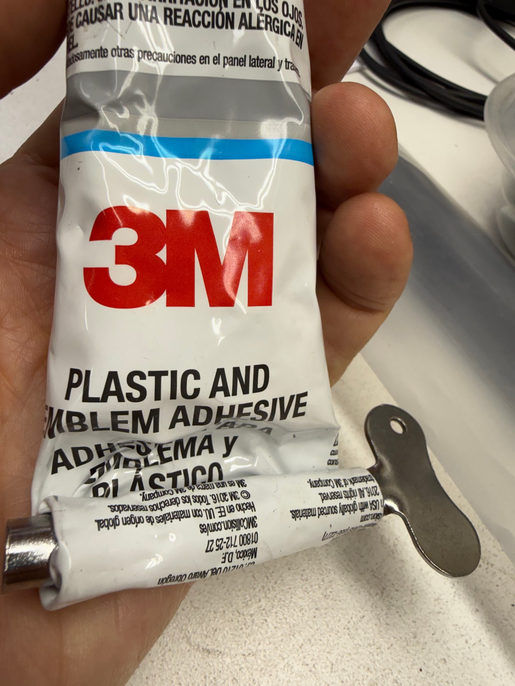](../images/position-sensor-test-and-repair/03-plastic-and-emblem-adhesive.jpg)

Photo below shows the WRONG WAY to reassemble your 25 year old irreplaceable position sensor! Thin adhesive was used, and it poured inside the sensor before it hardened. It completely destroyed this sensor.

[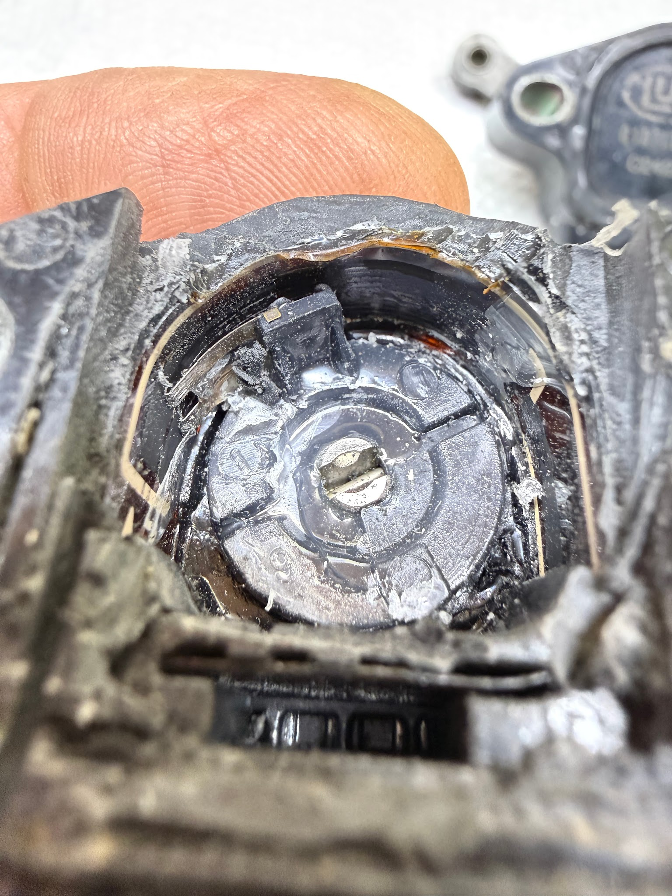](../images/position-sensor-test-and-repair/04-sensor-damaged-by-adhesive.jpg)

## Videos:

Here’s a time lapse video showing how to cut the lid off a position sensor with a Dremel tool: [https://youtube.com/shorts/fXODdR9hTdQ?feature=share](<https://youtube.com/shorts/fXODdR9hTdQ?feature=share>)

WEAR SAFETY GLASSES! I got a glob of hot plastic in my eye doing this.

Note: if you don’t have the skills to perform these cuts carefully, please send your sensor to me. I have an end-mill and fixture set up where

I can cut your sensor open very neatly.

These videos show bad (jumpy) position sensors. One was repaired using #2 pencil, and the other using DeoxIT Fader F5 spray.

[https://youtube.com/shorts/nVxRe\_1ZCQk?feature=share](<https://youtube.com/shorts/nVxRe_1ZCQk?feature=share>)

[https://youtu.be/d9UWKJbBVCI](<https://youtu.be/d9UWKJbBVCI>)

(The meter shown on the test box is simply a 0-5V voltmeter)

## Installation:

BE CERTAIN you get the tip of the spring-loaded arm correctly positioned in its slot. The slot can be hard to see. You must engage the slot, then wind up the sensor body against spring tension, then insert the mounting screws, while juggling the aluminum mounting/spacer plate.

Tip: Cut about ⅛ inch of length from the two “shift” position sensor mounting screws. They are longer than they need to be, and clearance to install the screws is very tight with GSA mounted to the transmission.

Tip: Manually shift the transmission into 2nd or 4th gear. This will move the actuator slot towards the center of the access hole, making it easier to reach the slot and engage the tip of the sensor correctly.

How to install position sensors on GSA: [https://youtu.be/7SZ4vbpYv30](<https://youtu.be/7SZ4vbpYv30>)

Caution: if you fail to get the tip of the sensor into the slot, the actuator will cycle and rip the arm off of your sensor and destroy it.

## Programming:

After you replace a position sensor, try the self-relearn sequence. Link: [https://docs.google.com/document/d/1B5M5ObAbnowzyhDFXD0KqyKjlYgp2viwc4jUs1FoS3k/edit?usp=drivesdk](<https://docs.google.com/document/d/1B5M5ObAbnowzyhDFXD0KqyKjlYgp2viwc4jUs1FoS3k/edit?usp=drivesdk>)

I believe the clutch sensor does not require TCU learning. If the clutch engages smoothly I would say you’re done. If not, then perform the clutch [grab-point relearn process](<https://docs.google.com/document/d/1Wve7p27o9amOl176zKN8BPAb4C9prxZYot0C2Lks39g/edit?usp=sharing>).

If self-relearn is not successful, then (as a last resort) the TCU needs a full relearn. Link: [https://docs.google.com/document/d/1KImxagEIIML6ikxcnAU\_BZdQSQUmu0ZKM3JUhMk33UY/edit?usp=drivesdk](<https://docs.google.com/document/d/1KImxagEIIML6ikxcnAU_BZdQSQUmu0ZKM3JUhMk33UY/edit?usp=drivesdk>)

During full relearn, the TCU will record where the actuator is positioned, based on the voltage it reports to the TCU. You will need a copy of techstream to accomplish this. ([available for free](<https://docs.google.com/document/d/1006y677Wq7qDS6OZPNTUGBZGfGpAACF1v597aHFkB2Q/edit?usp=sharing>))

## Photos are below

[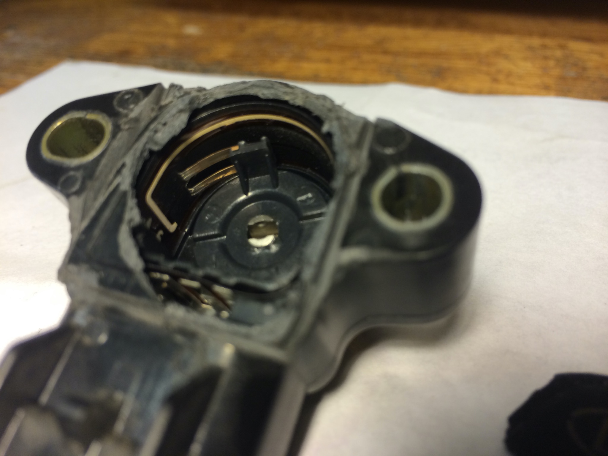](../images/position-sensor-test-and-repair/05-open-sensor-housing.jpg)

[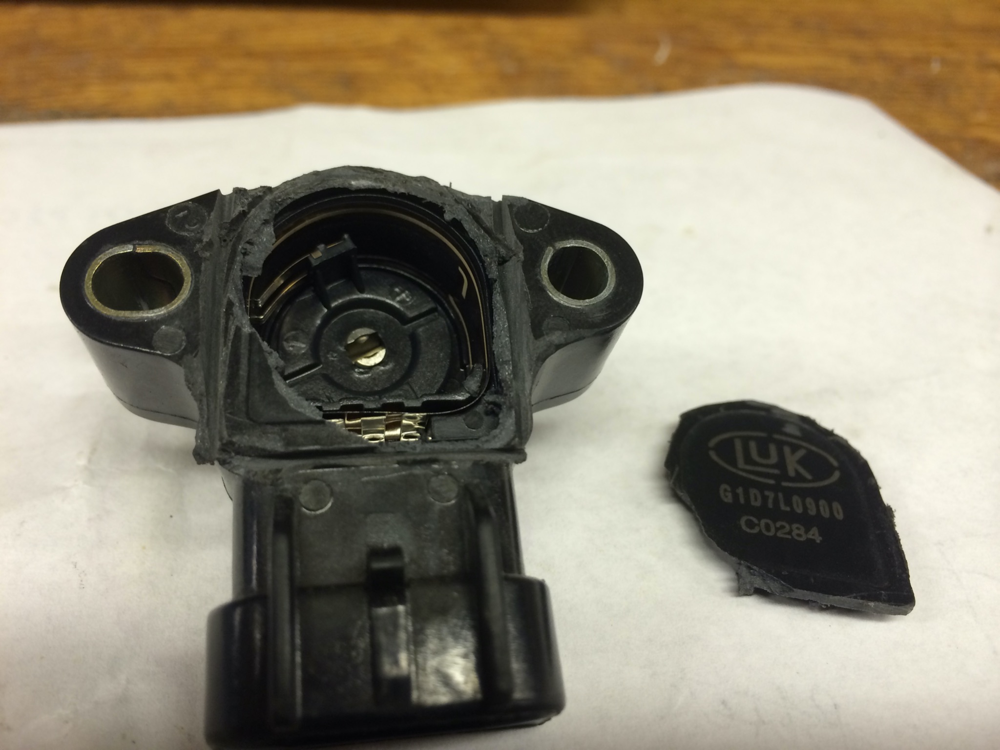](../images/position-sensor-test-and-repair/06-sensor-and-removed-cover.jpg)

[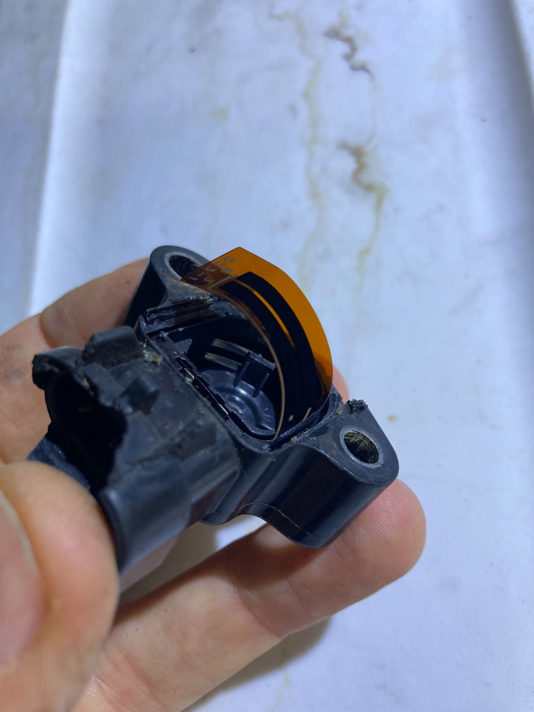](../images/position-sensor-test-and-repair/07-flexible-pcb-removal.jpg)

[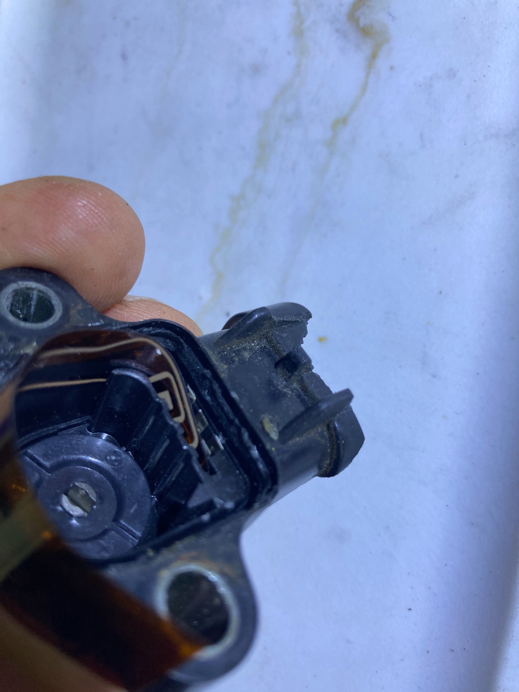](../images/position-sensor-test-and-repair/08-sensor-interior-closeup.jpg)

[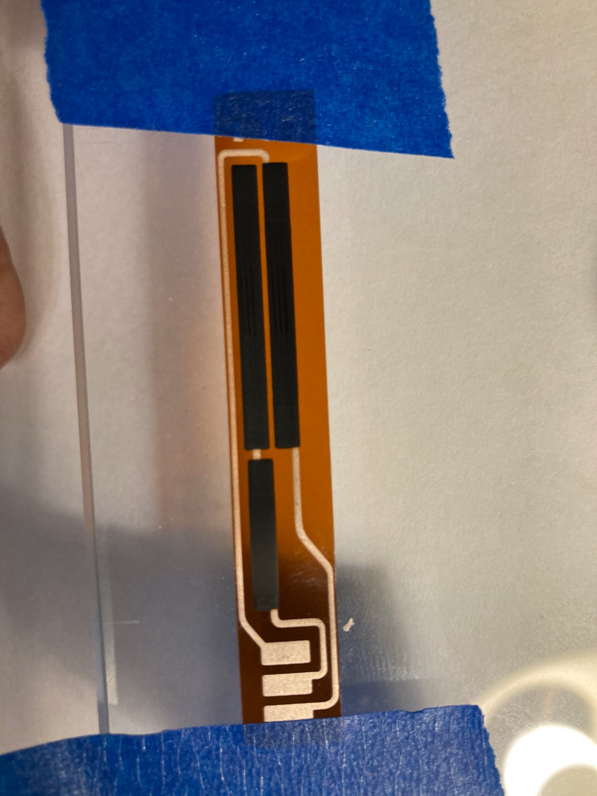](../images/position-sensor-test-and-repair/09-flexible-pcb-on-workbench.jpg)

[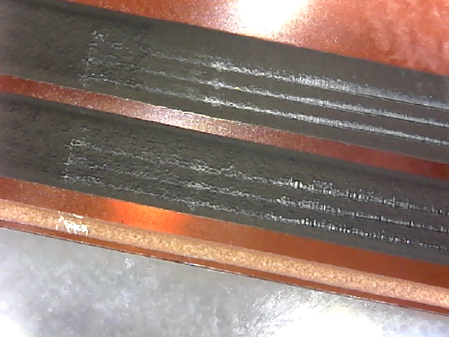](../images/position-sensor-test-and-repair/10-conductive-track-closeup.jpg)

This sensor failed due to an open circuit. You can see where the conductor is broken.

[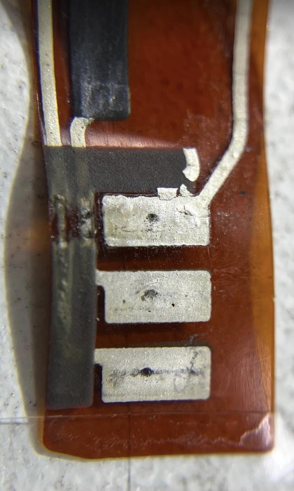](../images/position-sensor-test-and-repair/11-pcb-contact-end.jpg)

This PCB failed due to a tiny crack in the printed circuit.

[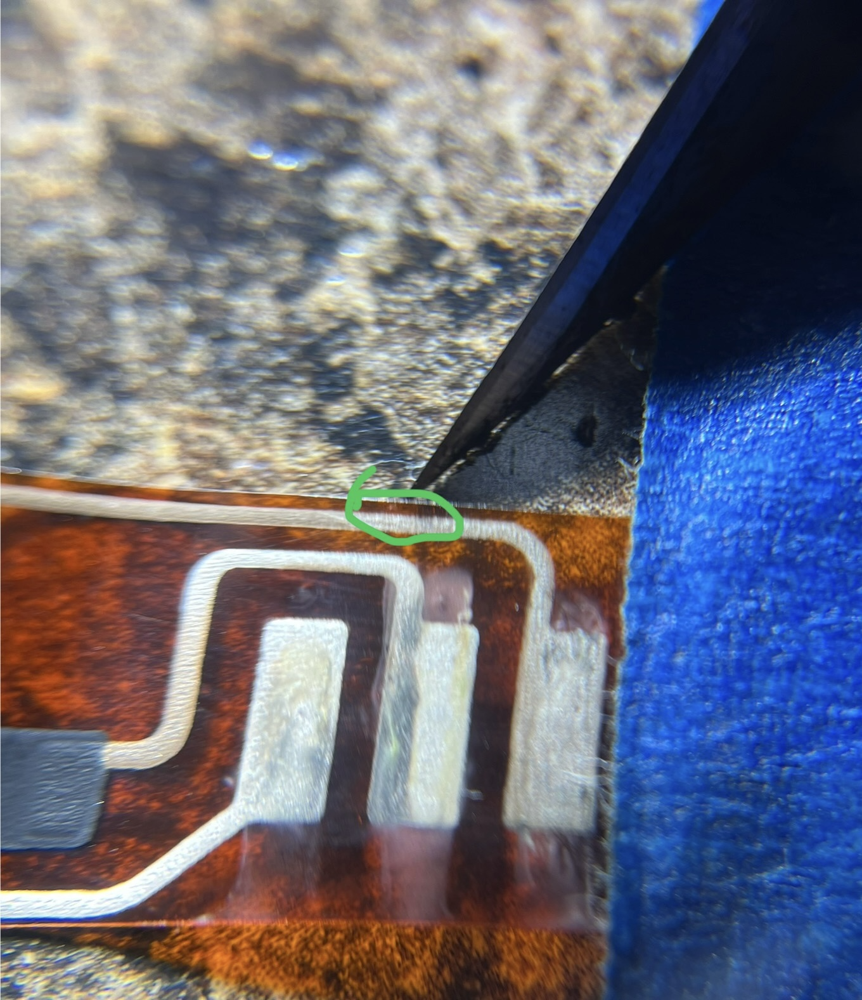](../images/position-sensor-test-and-repair/12-cracked-circuit-trace.png)

This sensor failed due to a short circuit. I think the moisture and green corrosion products created a path for current. This one worked perfectly after I simply wiped it dry with a paper towel and reassembled. Note the metal “U” clip with three fingers.

[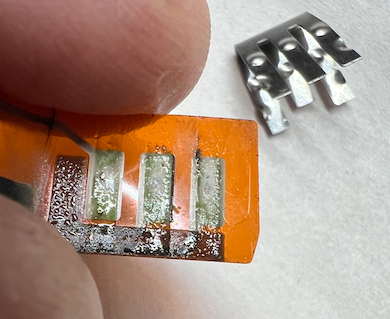](../images/position-sensor-test-and-repair/13-corroded-contacts-and-u-clip.png)

### TOYOTA TEST PROCEDURE

The top sketch is correct. (Toyota finally issued a correction)

The bottom sketch shows the remainder of the test (with errors marked out in red).

[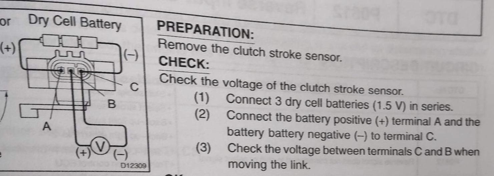](../images/position-sensor-test-and-repair/14-toyota-corrected-test-excerpt.jpg)

[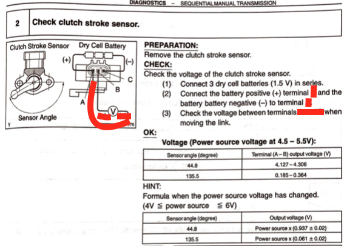](../images/position-sensor-test-and-repair/15-toyota-test-with-source-markups.png)

[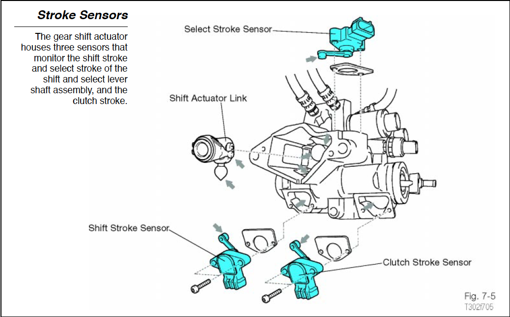](../images/position-sensor-test-and-repair/16-stroke-sensor-locations.png)

Here is the origin of the total resistance check. My tests have proven that the 6.5K ohm max limit is INCORRECT. Position Sensors work fine with 20K ohms resistance!

[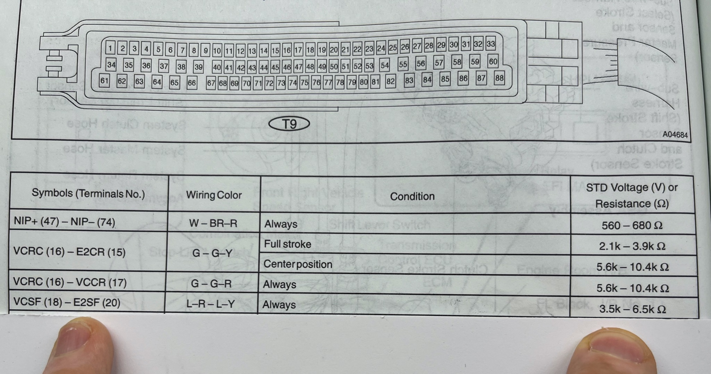](../images/position-sensor-test-and-repair/17-source-resistance-table.jpg)

[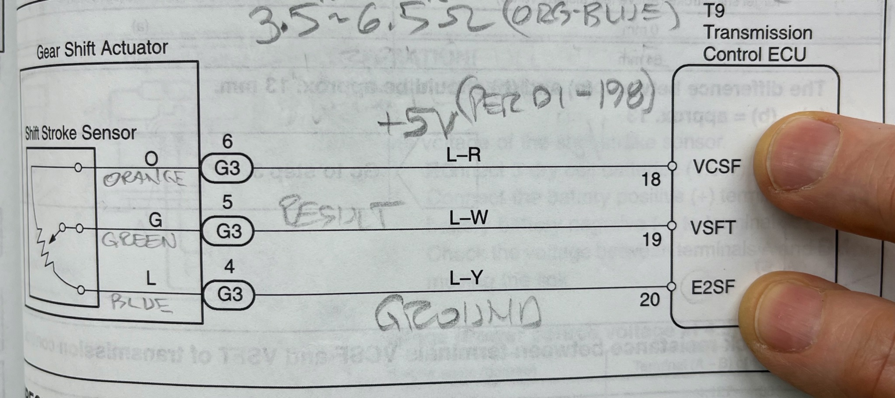](../images/position-sensor-test-and-repair/18-sensor-wiring-diagram.jpg)

This stuff appears to work well to fix voltage dropouts. No need to cut the sensor apart. Just drill a small hole in the cover and spray!

[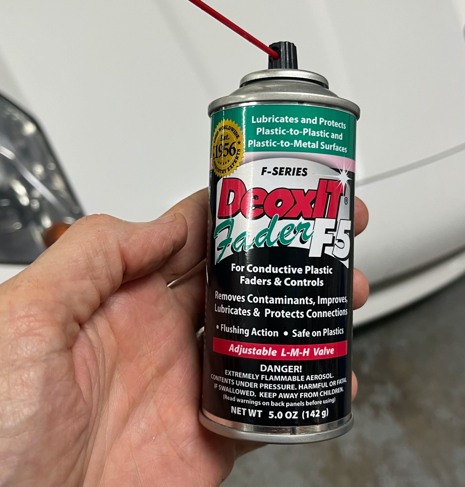](../images/position-sensor-test-and-repair/19-deoxit-fader-f5.jpg)

## Reference Info:

### Connectors

Manufactured by TE AMP, “Super seal” product line

Male plug: #282087-1 with female Crimp connector #282110-1

Female receptacle: #282105-1 with pin crimp connector #282109-1

Available from Digikey.com

---

*Initial conversion 0.1 — September 18, 2026. Detailed technical review pending.*

[Back to chapter index](../README.md)
