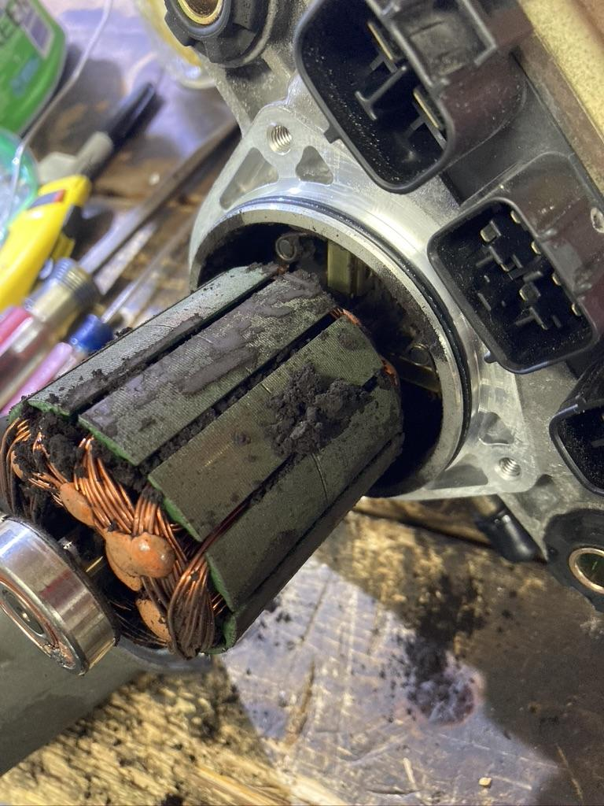
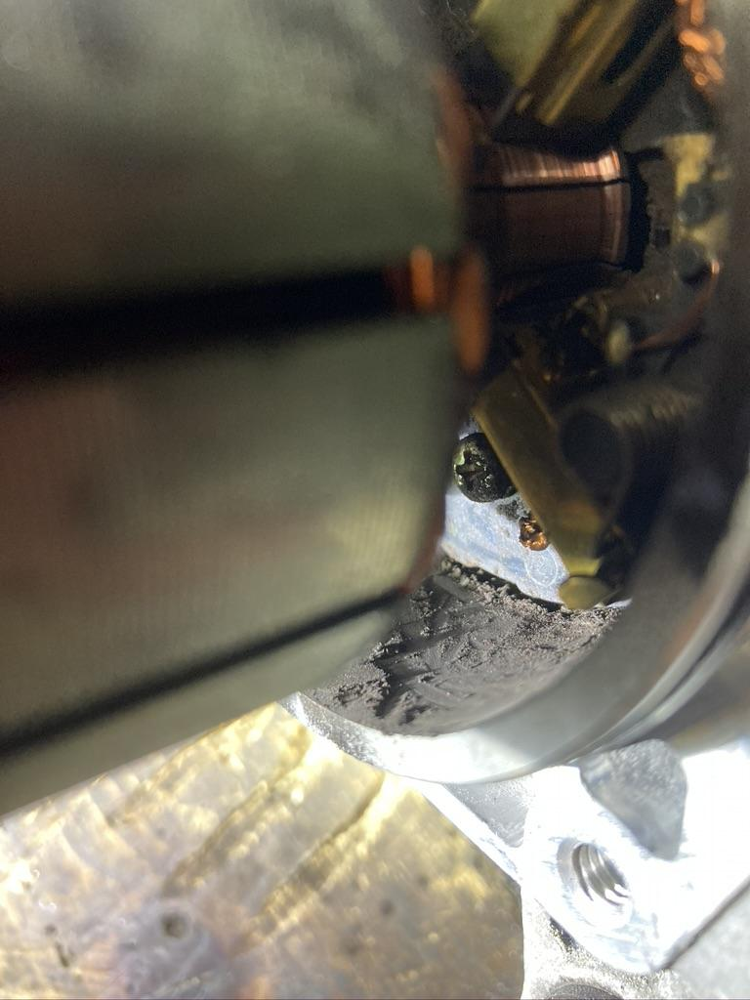
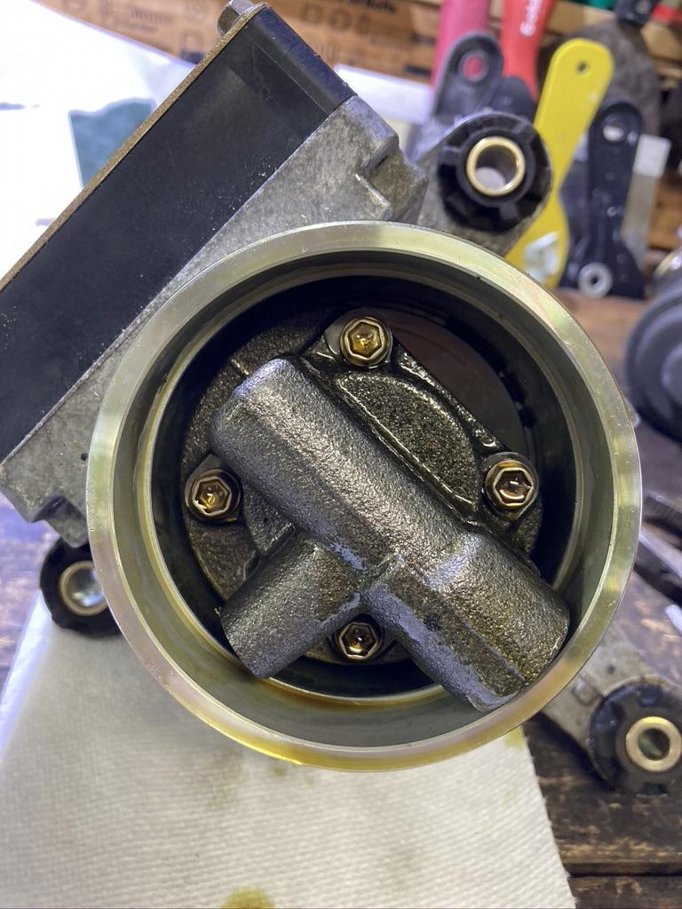
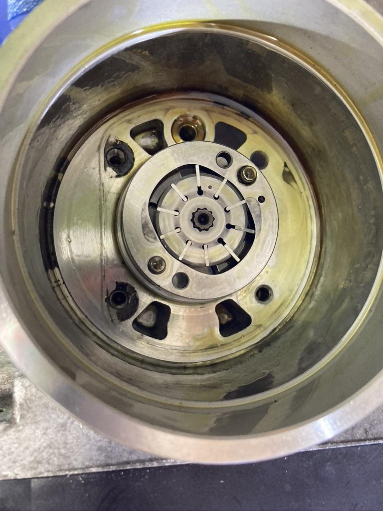
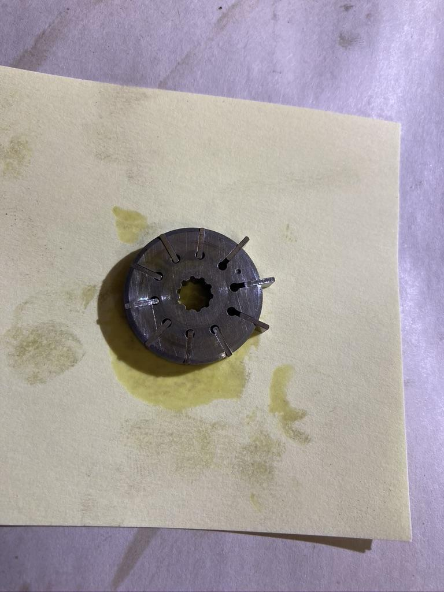
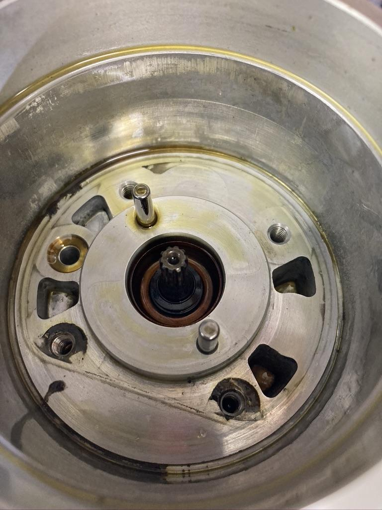
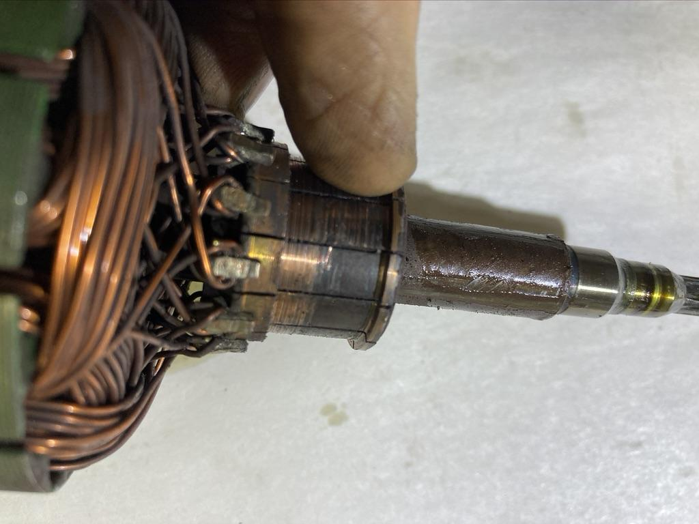
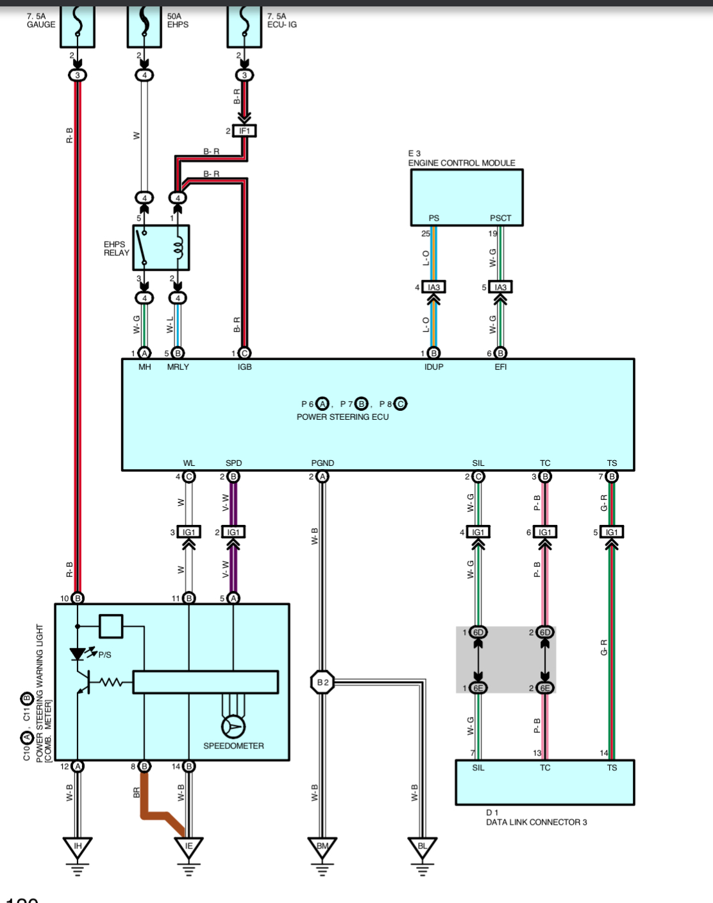
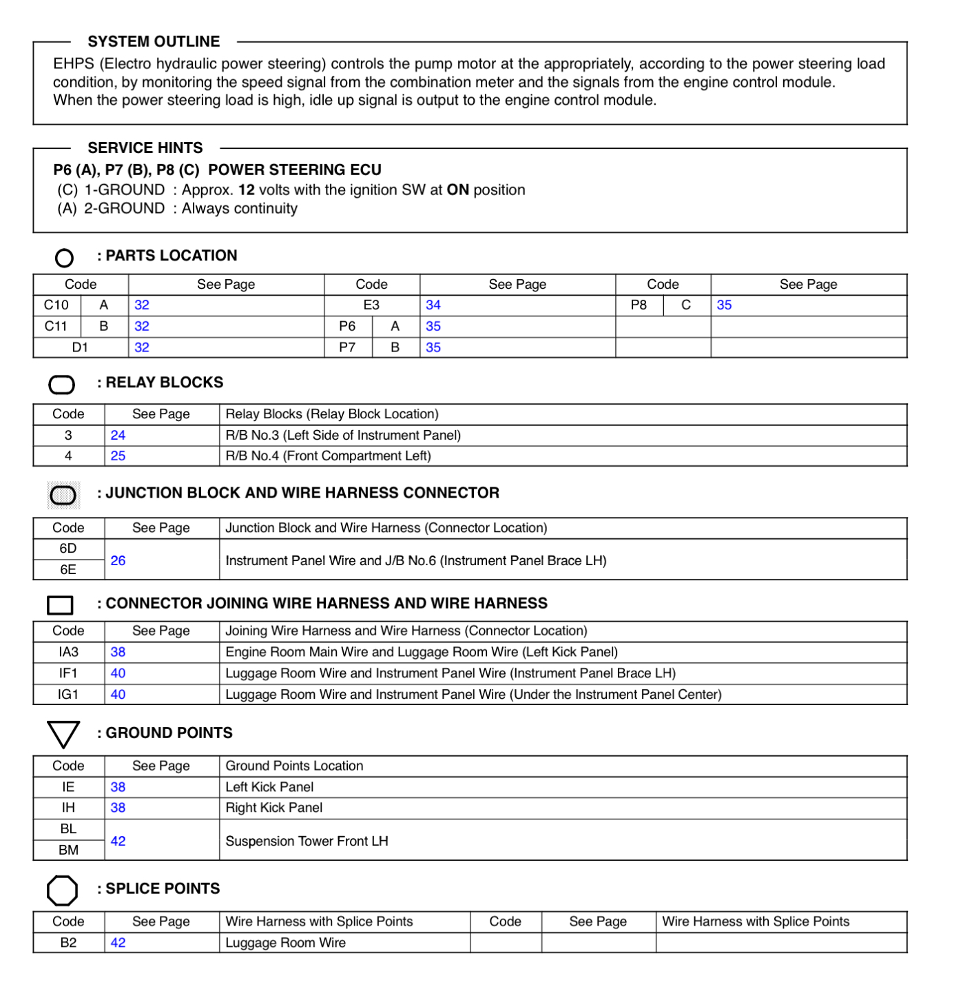

[← Chapter index](../README.md)

# Power Steering Pump

MR2 Spyder

Written by [cyclehead21@gmail.com](<mailto:cyclehead21@gmail.com>)

Feel free to share

Let me know if you see any errors!

## Contents:

- [Overview](#overview)
- [Minor Disassembly](#minor-disassembly)
- [Major Disassembly](#major-disassembly)

## Overview

The electric power steering pump is a self-contained electrical powered (12V) pump. It has a brush-type 12V motor, fancy control system, and rotary-vane hydraulic pump all built into a small unit. Since it does not require a pulley drive, and it’s easy to install in any location it is popular with street-rod builders.

Pump failure is typically due to the electric motor wearing out. The carbon brushes will wear down the copper commutators on the armature. Eventually the commutators wear through and the motor quits working.

Electric Power Steering Fluid is required. Toyota makes some specifically for the spyder, however it’s expensive. As with SMT fluid - some helpful guys on the Spyder forums did a chemical analysis of the Toyota Fluid and determined that Nissan EPSF is a very close match. (And much cheaper)

Reference:

Toyota Power Steering Fluid EH # 08886-01206

Nissan E-PSF # 999MP-EPSF00P

## Minor Disassembly

### Electric Motor Inspection and Cleaning:

To inspect the motor and brushes, remove the metal canister from the bottom.

There is a “wavy washer” in the bottom of the canister that will jump onto the magnets as you withdraw the canister from the motor.

The canister will be full, and the armature will be coated with carbon dust from years of wear on the carbon brushes.

You can inspect the copper armature and the four carbon brushes.

If you’re just cleaning things up, brush off all the carbon and blow out the unreachable dust with compressed air.

Unfortunately, that’s all you can do to help your pump - without some major disassembly.

When you re-install the canister, you will need to make sure the wavy washer stays in place in the bottom of the canister as you place it over the armature. A slight bump will cause the washer to jump out of place (onto one of the magnets). It appears the factory uses a glob of grease to help hold the washer in place. I’ve done it successfully by just being careful.

## Major Disassembly:

### Removing the armature

Steps:

- Remove the pump head
- Remove the pump vanes
- Press the driveshaft out of the case

Details:

The pump head unscrews easily.

The pump vanes and carrier slide off easily.

But, before you can press the drive shaft (and armature) out of the case, you must find a way to retract the four brushes. They are carbon and they can break if you pry on them sideways. The armature will likely be very worn leaving a ⅛ inch wide lip. The lip will snag on the brushes and ruin them. So you must find a way to retract the brushes. It may be possible to flip the tension spring off the back of each brush, and allow the brush to retract.

Remove the large hose clamp and pry off the plastic reservoir.

Remove the pump cover shown here.

Pump cover removed, exposing the vanes and carrier.

Pump rotor lifted out. The little vanes will go everywhere, and they are tiny. Keep a magnet handy!

Pump cover and pump assembly removed...

Press the shaft out of the housing using a threaded “gear puller”.

Below you can see why the brushes must be retracted. The giant lip on the commutator will catch the brushes. You can also see why this motor quit working. The commutator is worn clear through to the phenolic base!

### Removing the Brushes

This step is just nasty. I don’t see a way to neatly remove the brushes without tearing up the four metallic tabs. Maybe somebody can develop a clever method. Metal tabs are spot welded, and not designed to be disassembled. (I’ll try to find a picture)

---

*Publication status: Initial conversion 0.1. Formatting and cursory editorial check only; detailed technical review is pending.*
