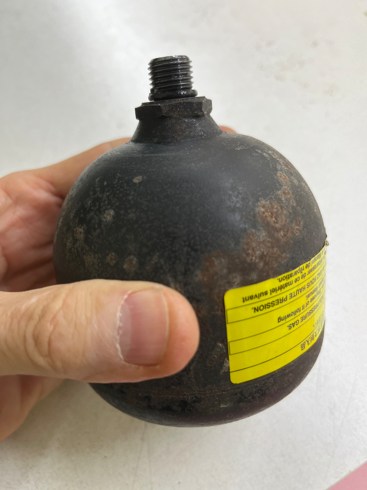
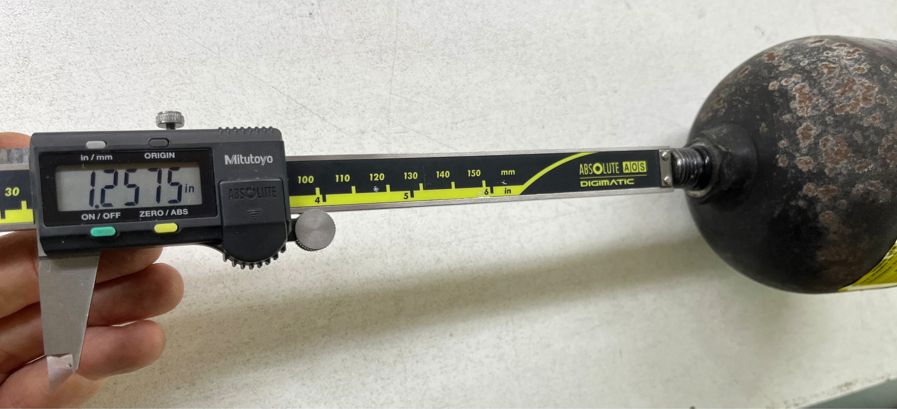
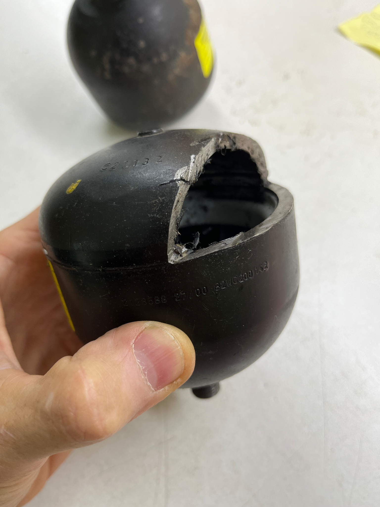
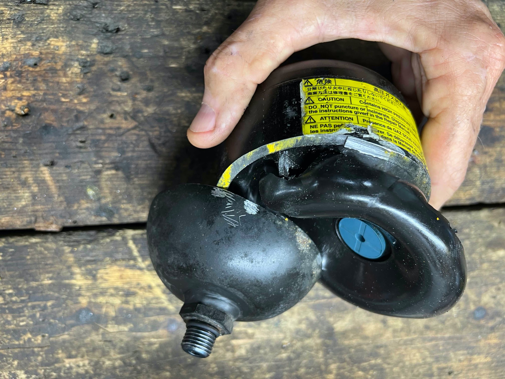
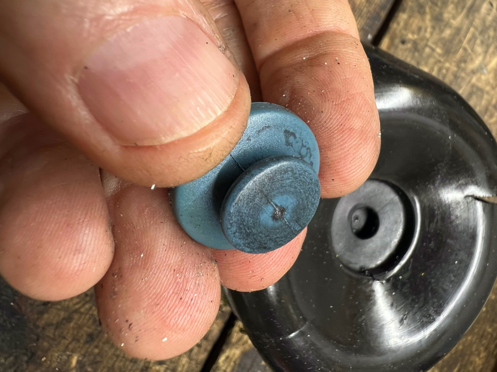
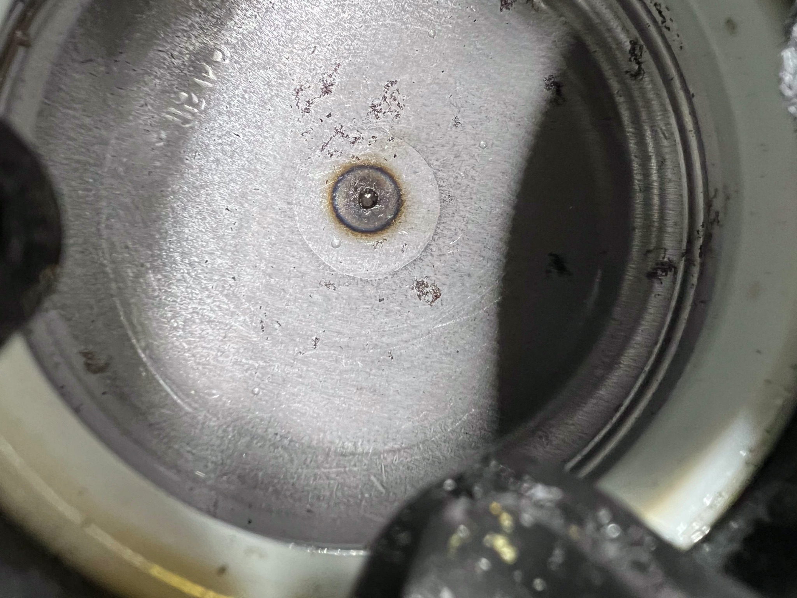

[← Chapter index](../README.md)

# Pressure Accumulator

**Written by Cyclehead21@gmail.com**

**Feel free to share, copy, and duplicate**

**Just give me a little credit**

Updated June 2025

## Contents:

- [Function](#function)
- [Design](#design)
- [Removal](#removal)
- [Symptoms](#symptoms)
- [Testing](#testing)
- [Functional Test](#reference-info)
- [Reference Info](#reference-info)
- [Replacement Parts](#replacement-parts)

## Function:

The HPU accumulator functions the same as any fluid system accumulator. It stores fluid while the pump is running - then slowly releases the fluid back into the system as needed. This reduces the need to cycle the pump on/off as frequently and provides sufficient volume &amp; pressure for high demand events. The HPU pump turns on when the low-pressure limit is reached (about 40 bar), and shuts off when the high-pressure limit is reached (about 52 bar) as sensed by the HPU pressure sensor.

## Design:

The accumulator is a spherical steel ball with a very thick wall (.20 inches thick). It has a heavy rubber bladder (EPDM material) inside that is charged with nitrogen on one side, and open to the system (brake fluid) on the other side. The bladder moves as the nitrogen pressure is balanced with system pressure. The bladder has a heavy plastic disc (blue color) mounted in the top center - in line with the pressure port. This will prevent poking a hole in the rubber bladder when inserting a screwdriver to check for bladder position, and prevent the bladder from extruding into the fluid port when fully discharged. If the nitrogen has not completely left the accumulator, the disc can be felt 1.25 inches inside the end of the threaded port. If the nitrogen has completely leaked out, a screwdriver inserted into the port will go much further into the accumulator, because the bladder has deflated.

Accumulator pre-charge pressures are purposely set close to the minimum system operating pressure. This ensures that the accumulator will begin to charge as soon as system pressure rises. And will ensure that all the usable volume in the accumulator will discharge back into the system, as the system pressure falls.

Accumulators typically have a sticker or stamping indicating the maximum safe precharge pressure for that particular design. The actual precharge pressure (nitrogen) will be far below the maximum safe pressure that is marked on the case.

## Removal:

The accumulator is simply threaded into the HPU body. Use a rubber or metal “strap wrench” to unthread the accumulator.

For info: the accumulator has wrench flats at the base. But it requires a very thin wrench to fit. If you have a very thin wrench it will work, but I always use a strap wrench.

Caution!

If the pump has charged the system recently, there may be as much as 900-1000psi in the system. This could potentially squirt brake fluid in your eyes. I suggest letting the car sit overnight to deplete pressure. Then throw an old towel over the HPU as you unthread the accumulator. That will prevent you getting squirted with pressurized brake fluid. Alternatively, you can use the “depressurize” function in techstream to deplete the system pressure before you remove the accumulator.

Note: The o-ring at the base of the threads seals the fluid leak path (not torque on the threads!) There is no need to go crazy tightening the accumulator during reinstallation. Just tighten it snug enough so it doesn’t vibrate loose.

## Symptoms:

### Collapsed bladder

A completely collapsed accumulator will allow the pump to overpressurize the system very quickly, running the pump only 5 seconds (minimum pump run-time) while pushing the system pressure over its normal limits. It makes a screeching noise as the high pressure relief valve bypasses the excessive pressure.

A failed accumulator will make the reservoir fluid level appear too low. The “missing” fluid will stay inside the accumulator (due to the missing nitrogen pressure), where normally it would be slowly pushed back into the reservoir.

Video:

[https://youtube.com/shorts/lc209OdPhrA?si=Ba\_GaLurjLRt3kS3](<https://youtube.com/shorts/lc209OdPhrA?si=Ba_GaLurjLRt3kS3>)

With a failed accumulator, the pump will run for an abnormally short time in the morning. Instead of 25-30 seconds that is normally required to pressurize the system after bleeding down overnight - the pump will only for 10 seconds. This short time is sufficient to completely pressurized the system, when the accumulator is “flat”.

Notice the screeching noise as the pump overpressurizes the system.

Video:

[https://youtu.be/AXP9JCeLHwA?si=MzZt135na6B3zTrI](<https://youtu.be/AXP9JCeLHwA?si=MzZt135na6B3zTrI>)

### Fault Codes

Usually a failed accumulator will generate a P0942 “Accumulator Pressure” fault code. The car may continue to drive and shift normally, but there will be a screeching noise at the end of every pump-run cycle as the system overpressurized. (The high pressure relief valve usually makes a screeching noise when it relieves pressure). I believe the fault code results from the TCU sensing excessively high system pressure.

I have seen a partially collapsed accumulator cause trouble (on a similar Ferrari F430 system). It passed the “screwdriver test” because it was not completely collapsed, yet it would randomly fail to shift and the pump would run too frequently. Note: Ferrari lists their shifter pressure accumulator as “regular maintenance item” that should be replaced as part of routine maintenance! I have never identified a partially collapsed accumulator on an SMT Spyder.

A Toyota HPU accumulator will fail if any kind of oil is poured into the HPU reservoir. The diaphragm is made from EPDM which is incompatible with ALL petroleum oils! Photos below show an accumulator that was destroyed by 90W gear lube.

Accumulators can also fail due to age and cycles. I speculate that the rubber develops cracks where it flexes during inflation/deflation cycles, and loses its nitrogen precharge over time.

## Testing:

### A) Screwdriver test

1. Unscrew the accumulator.
2. Insert a small screwdriver into the fluid port. It should go in about 1 ¼ inches. If it goes further in, it means the rubber bladder has completely deflated and the nitrogen charge has leaked out, and the accumulator is scrap. See photo below.

SMT system pressure (HPU pressure monitored via Techstream Data List) varies between 40 bar and 52 bar (plus or minus a few bar). Data List is so slow to refresh data that it’s hard to get an accurate reading of pressure when the pump starts and pump stops. You can get techstream to display only the HPU pressure by selecting that one item.

If the accumulator has lost its nitrogen precharge, the pump will only need a few seconds to reach max system pressure (roughly 3-5 seconds when starting at zero pressure). A good accumulator will slowly fill, forcing the pump to run much longer to reach max pressure (roughly 20-30 seconds when starting at zero pressure).

### B) Gearshift Test:

A good accumulator will support shifting quite a few times before the pump comes on. With the car at rest with ignition on (and engine off) shift into N, 1, 2, N, R. It should be able to complete maybe 3-4 repetitions of that entire sequence before the pump runs. A bad accumulator will be depleted too soon, and cause the pump to run after less than one repetition.

### C) Run/Rest time

This test monitors how long it takes to pressurize the system up to maximum pressure. Then monitors how fast the pressure bleeds down until the minimum pressure is reached and the pump turns on.

Run time: ROUGHLY 7-9 SECONDS

Bleed down: REST TIME ROUGHLY 1:40 to 2:40

When performing this test with the engine off (ignition on), the clutch and master solenoids are closed - so the run-time/rest-time test simply monitors bleed down time of a small portion of the hydraulic system (pump, accumulator, and internal HPU passages up to the solenoids.) The hoses and all of the GSA are excluded. The clutch and master solenoids would trap pressure inside the HPU.

However with the engine idling, the clutch solenoid is held open and the clutch actuator is fully pressurized (clutch disengaged) so more of the system is included.

## Reference info:

I have done a crude “functional test” of various accumulators on the bench. I set up a GSA and HPU and ran the pump to full system pressure. Then cycled the clutch, select and shift actuators repeatedly until the system pressure was depleted. (This was how I confirmed that the Porsche accumulator was not providing the proper fluid and pressure. This is also how I confirmed that the monkeywrenchracing accumulator was providing slightly less fluid to the system than the original LuK accumulator.

Note: Usually the pump runs for 8-10 seconds to recharge. I am uncertain about the significance of recharge time. I suspect the run time has a MINIMUM RUN-TIME set by the TCU - and not simply driven by pressure readings from the pressure sensors. I say this, because I have seen a system OVER PRESSURIZE during the 10 second recharge. If it were simply reading pressure, it would have stopped at the correct max pressure. However the system (with a bad accumulator) repeatedly ran past max pressure and overcharged the system with every charge cycle.

DO NOT use the Porsche brake system accumulator. It has roughly the same volume, and the thread pitch and length are correct. I tested one in my spyder and it did not function properly. It accepts only a small charge of fluid at normal system pressures. It generated P0942 error code, and resulted in a system overpressure. The car did shift correctly and reliably, but it regularly showed the SMT error light and made a screeching noise as the system went over max pressure and opened and chattered the pressure relief valve. (See the note about minimum run-time above.)

For historical reference only. DO NOT order this part:

Porsche 911 6 Cyl 3.8 liter

1995-2012

Turbo Clutch Hydraulic Accumulator

Porsche PN 997-314-166-00

Corteco PN 80000659

Monkeywrenchracing website offers a new accumulator, currently listed for $259 each (plus shipping). Their advertisement mentions they purposely precharged theirs to a lower pre-charge pressure (and “slightly larger volume”) - hoping it would increase the capacity of the accumulator. But that’s not what I saw on my comparative bench tests. The MWR accumulator displayed slightly LESS capacity than an original accumulator in my bench test. However their accumulator will work fine in spite of these slight differences.

An SMT accumulator should be precharged to roughly 35 bar nitrogen pressure, 0.33 liter volume, and have a port thread of M14x1.5 (12mm long).

Note: On my bench test, I got .16 liters from the fluid return hose, when I cycled the actuators and completely depleted a fully-charged accumulator.

## Photos:

Insert a rod into the port to check for a deflated diaphragm. This is a good accumulator. The pin only goes 1.25 inches into the port.

This shows the thickness of the steel sphere. .20 inches of steel! This thickness is driven by safety factors and liability. Maximum safe case pressure is noted on the exterior of the sphere.

This swollen diaphragm was caused by gear oil, which expanded and cracked the rubber and destroyed the accumulator. The blue plastic disc is very thick, and will protect the bladder when you insert a screwdriver into the fluid port to check for deflation.

This shows the blue plastic disc removed from the bladder.

This shows the inside of the accumulator fill port. After pressurizing the accumulator with nitrogen, the fill port is welded shut.

## Replacement parts:

I have new accumulators for sale. $180 plus shipping. I had them specifically manufactured to match the original Toyota (LuK) accumulator. Email me your mailing address and I can check shipping options and promptly ship one to you. Cyclehead21@gmail.com

Monkeywrenchracing also sells new accumulators. Theirs are currently listed for $259.00 each (plus shipping).

[https://www.monkeywrenchracing.com/product/mwr-hydraulic-accumulator-mr2-spyder-smt-pump-hpu/](<https://www.monkeywrenchracing.com/product/mwr-hydraulic-accumulator-mr2-spyder-smt-pump-hpu/>)

---

*Publication status: Initial conversion 0.1. Formatting and cursory editorial check only; detailed technical review is pending.*
