[← Chapter index](../README.md)

# SMT - Pressure Sensors

RevA - Feb 2023

Feel free to copy and share, just give me a little credit!

Composed by Cyclehead21@gmail.com

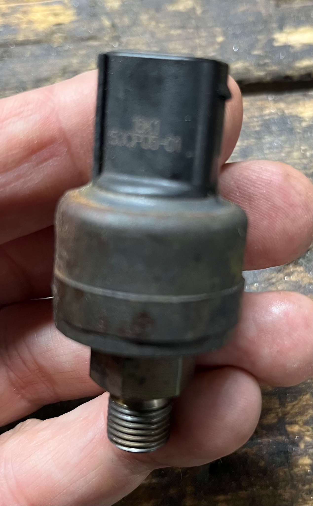

---

## Contents:

1. [Background](#1-background)
2. [Replacement Parts](#2-replacement-parts)
3. [Failures](#3-failures)
4. [Testing](#4-testing)
    - [Max pressure](#max-pressure)
    - [Rising pressure](#rising-pressure)
5. [Photos and Sketches](#5-photos-and-sketches)

---

## 1. Background:

One pressure sensor is used on HPU, and another on the GSA. They are identical. They are installed with a 14mm wrench. They seal via an o-ring at the base (so there is no reason to tighten them too much). An original (LuK) sensor can be installed with either a 14mm or 17mm wrench. The new (replacement) sensors I sell use a 15/16 inch or 24mm wrench.

## 2. Replacement parts:

New pressure sensors are not available from Toyota, nor from LuK in UK or Germany. There is no Toyota part number for pressure sensors. And LuK doesn’t sell any spare parts - period.

I currently have a small quantity of NEW pressure sensors for $120 each plus shipping cost. I’m happy to ship worldwide. Or you can buy from Monkeywrenchracing.com who sells 20 year old used pressure sensors for $189 each!

## 3. Failures:

A failed HPU pressure sensor should generate code:

P1880 (was P0942) “HPU Pressure Control System Malfunction”; or

P1851 (was P0847 or P0935) “Accumulator Pressure Sensor Malfunction/Low Voltage”

A failed GSA pressure sensor (master pressure sensor) should generate code:

P1860 “Master Pressure Sensor Malfunction/High Voltage”

P1863 “Master Pressure Control Malfunction”

## 4. Testing:

The pressure sensors operate similarly to the position sensors - apply 5VDC across the outer two pins. Then read the resulting output voltage at the center pin.

You can use three AA batteries for a 4.5-4.8 volt power source. Or a USB transformer will supply 5 volts. You’d have to be able to apply some fluid pressure to the sensor to check it for proper function. You can do this manually by powering the HPU motor directly at the large gray HPU connector #H10. The factory repair manual tells you to monitor output using techstream data list.

+5V on the red pin.

Ground the black pin.

Read the resulting output on the yellow (center) pin.

You can chase wire continuity from the TCU to the HPU pressure sensor if you suspect a wiring problem. On the TCU connector #T9 the pins are #9,11 and 10 The wire colors are Black/Red, Black/Blue and Yellow (respectively in the same order). The wire colors change at the HPU connector #H10, to Yellow, Red and Black (respectively). See the colored wiring harness pasted below.

There are no continuity or resistance checks provided in the Toyota factory repair manual for this sensor. Only the 5V test outlined above.

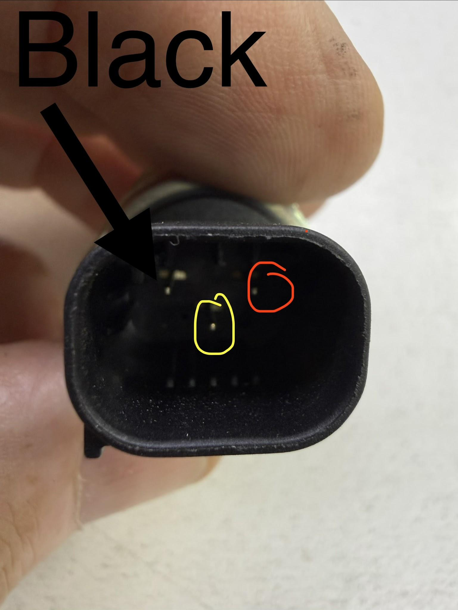

### Max pressure:

For the easiest access - you could check the HPU pressure sensor by running the HPU pump until it shuts off (full pressure). Then unplug the big gray HPU connector (10 pin connector). Connect to the pins on going to the HPU:

Probe pin numbers 1,4,7 (all in a row on the side - see sketch below)

Pin #1 is yellow - voltage output

Pin #4 is red - apply +5V

Pin #7 is black - ground for power supply and voltage output reading

Confirm the pin colors by looking under the gray connector. You can see the wires coming out below the pins.

Output voltage should be around 2.7V - 2.8V with the accumulator fully pressurized, and about 0.4V with no pressure on the system at all. (If you see high voltage, like 4.7V, then check the polarity. You likely have the +5V and Ground terminals reversed.)

The voltage output should rise/fall smoothly as pressure changes up/down. The accumulator will take quite a while to slowly depressurize, so you can sit there and monitor the output voltage, or check back periodically and watch for a slow drop in output voltage.

This video shows testing a used Toyota pressure sensor, and monitoring output pressure with a gauge.

[https://youtu.be/orHhqSXKlOQ](<https://youtu.be/orHhqSXKlOQ>)

### Rising pressure:

If you can do more hookups, you can run the pump yourself by applying 12V directly to the motor. Pin 2 is a large red wire (+12V), and pin 6 is a large black wire (ground). Verify by looking below the connector. Be careful applying power directly to the motor, because you can over-pressurize the system - which should crack open the internal pressure relief spring.

By powering the motor directly, you can monitor pressure sensor output voltage as the system pressure rises and confirm that the pressure sensor voltage is rising accordingly.

## 5. Photos and Sketches

Connector PIN I.D.

Note this sketch shows the female half of the connector. The wires going to the HPU are connected to the male half of the connector, so pin numbers are reversed. Verify you are on the correct pin by checking wire colors on the back side of the connector.

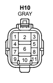

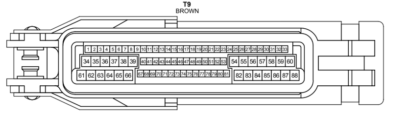

Schematic shows that Connector #H10 uses pins 1,4,7 to see HPU pressure sensor output.

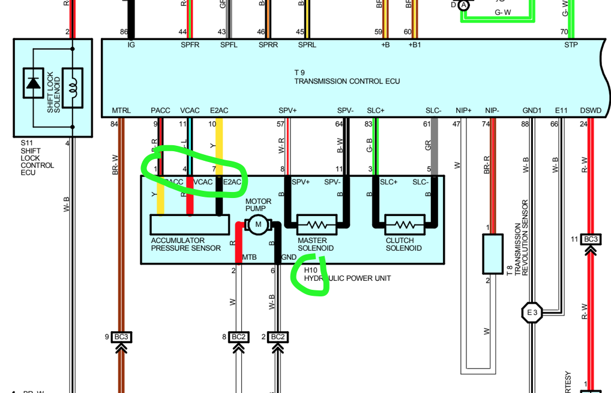

HPU (male) connector

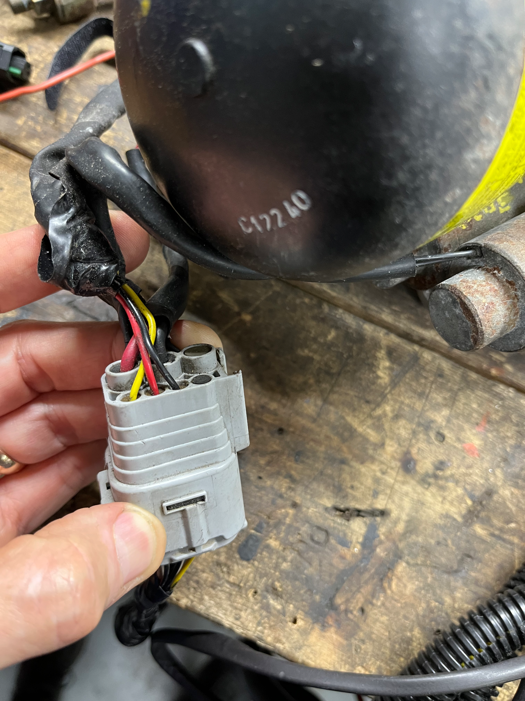

Pressure sensor and its connector

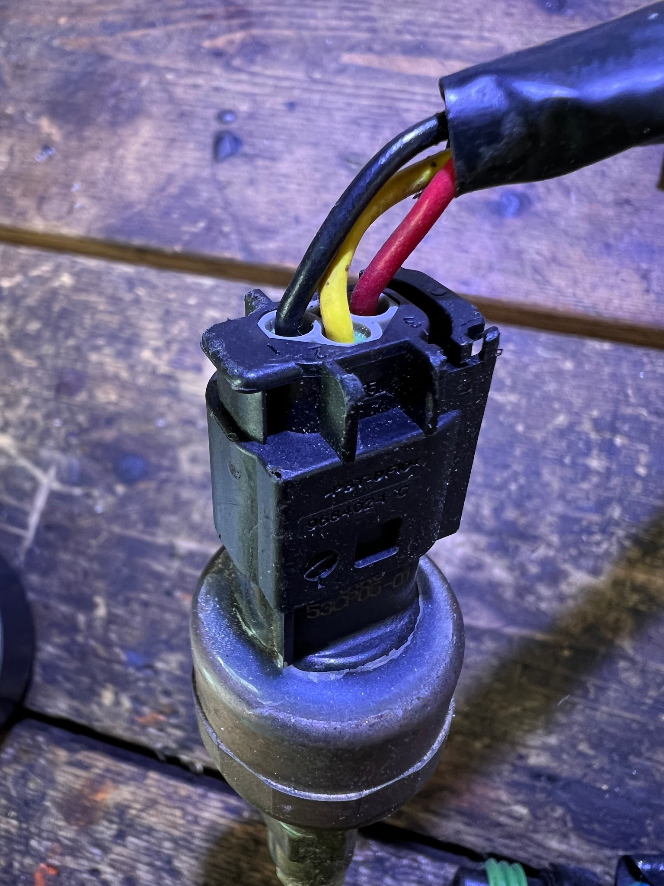

Pressure sensor pins

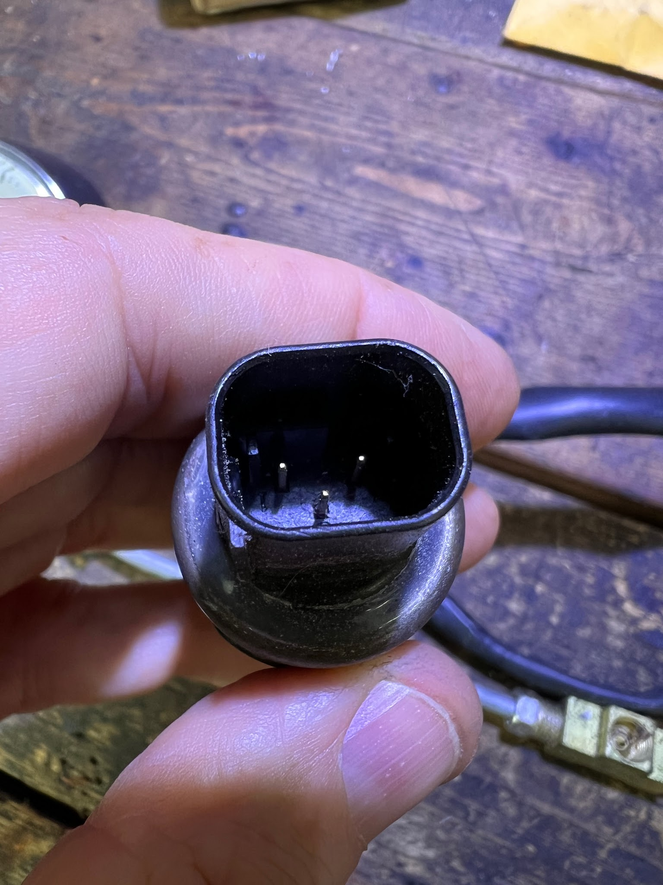

Master pressure sensor is installed on the GSA:

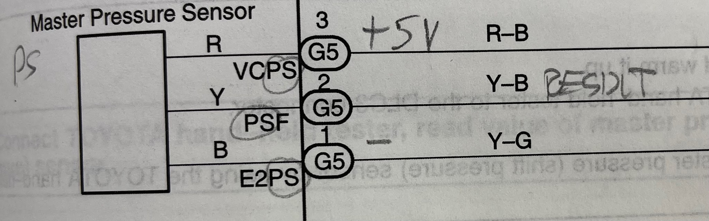

HPU pressure sensor (same as accumulator pressure) is installed on the HPU:

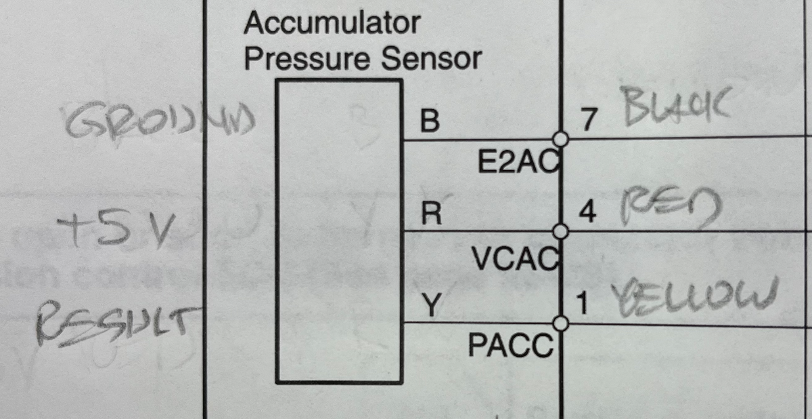

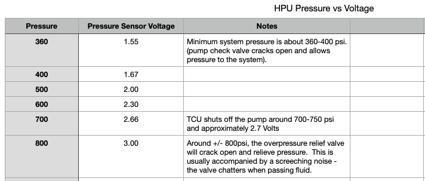

---

*Publication status: Initial conversion 0.1. Formatting and cursory editorial check only; detailed technical review is pending.*
