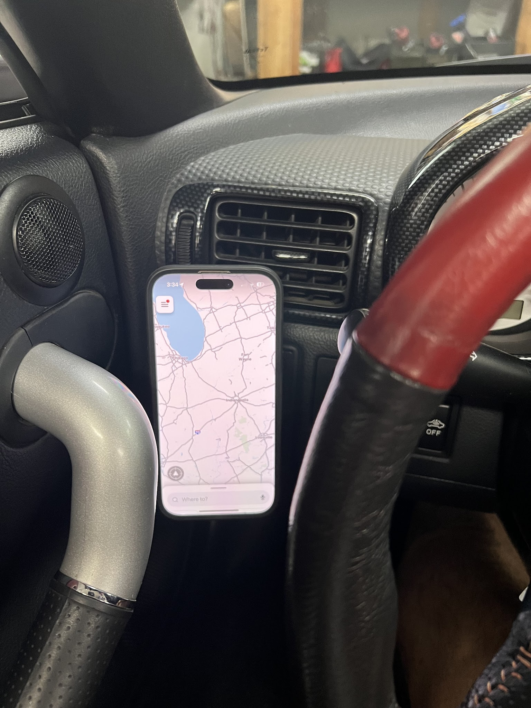
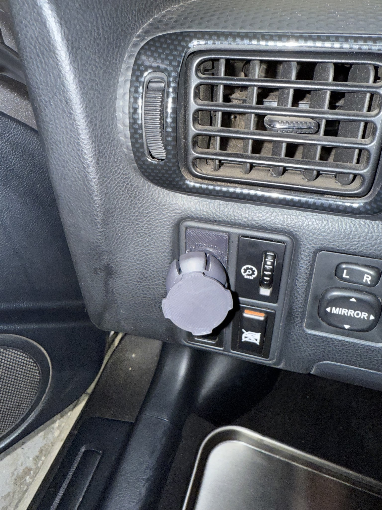
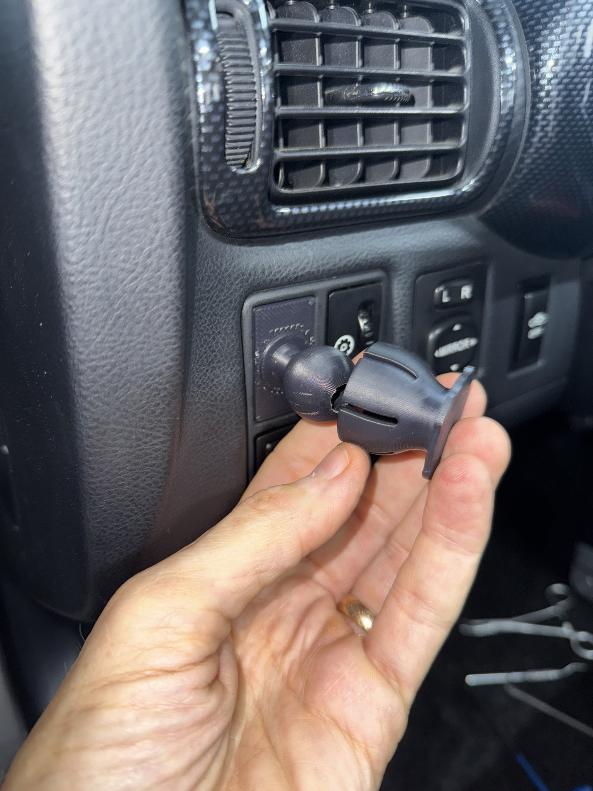
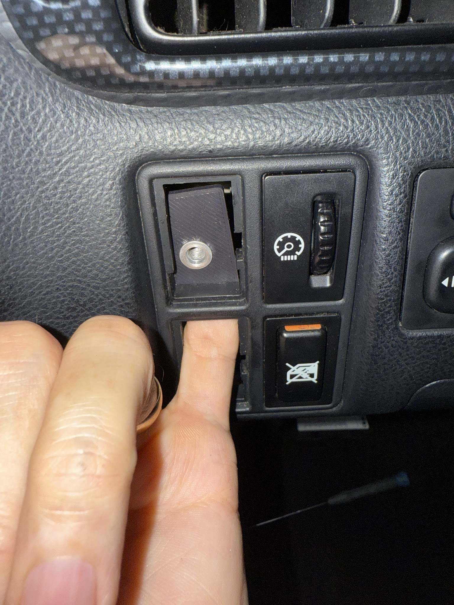

[← Chapter index](../README.md)

# Quadlock Compatible Phone Mount

Composed by Cyclehead21@gmail.com

I designed a quadlock compatible phone mount for my dashboard. It’s working well so I made a set for all of my spyders. It uses a square switch mount hole in the dashboard.

I didn’t have an open slot, so I sacrificed the “door lock” switch.

The spherical ball allows you to position the phone at whatever angle works best for you. You freeze the ball in position by brushing on some Acetone. Acetone melts the ASA material and fuses it together.

It mounts to a square insert cover that is also 3D printable, with an aluminum rivnut in the center of the cover. Print out two insert covers, and mount the rivnut into one of them. Place the nut inside the dashboard, and the other cover on the surface of the dashboard.

This can all be accomplished without crawling under the dashboard.

## Photos

---
