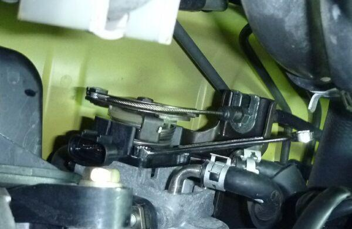
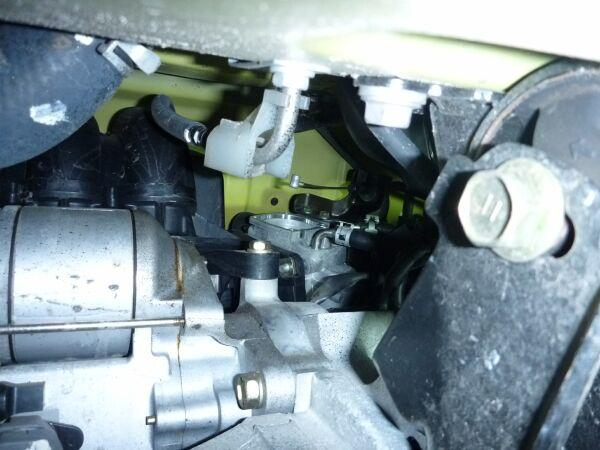
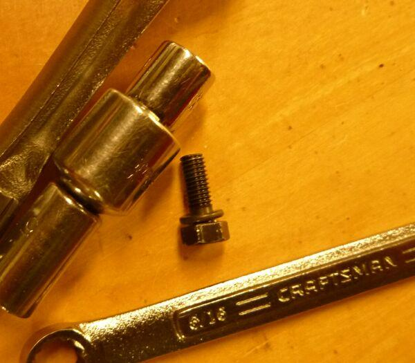
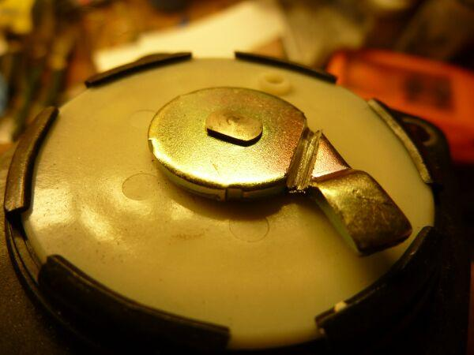
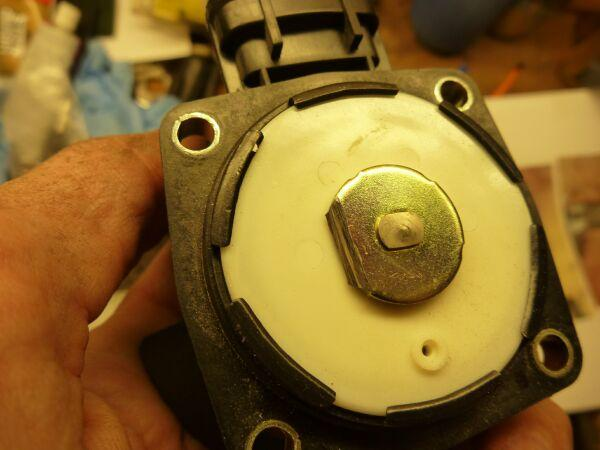
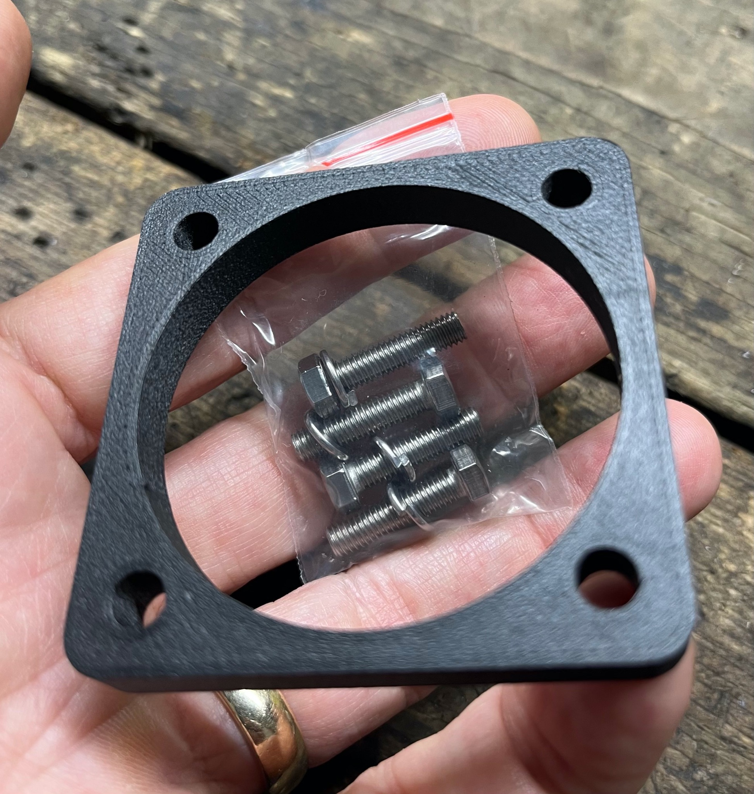
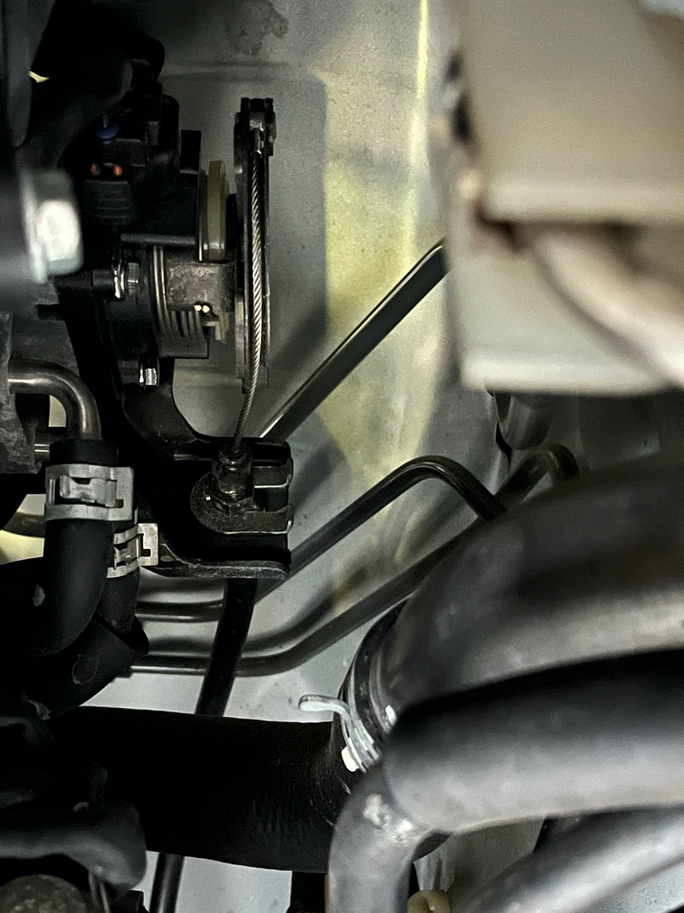
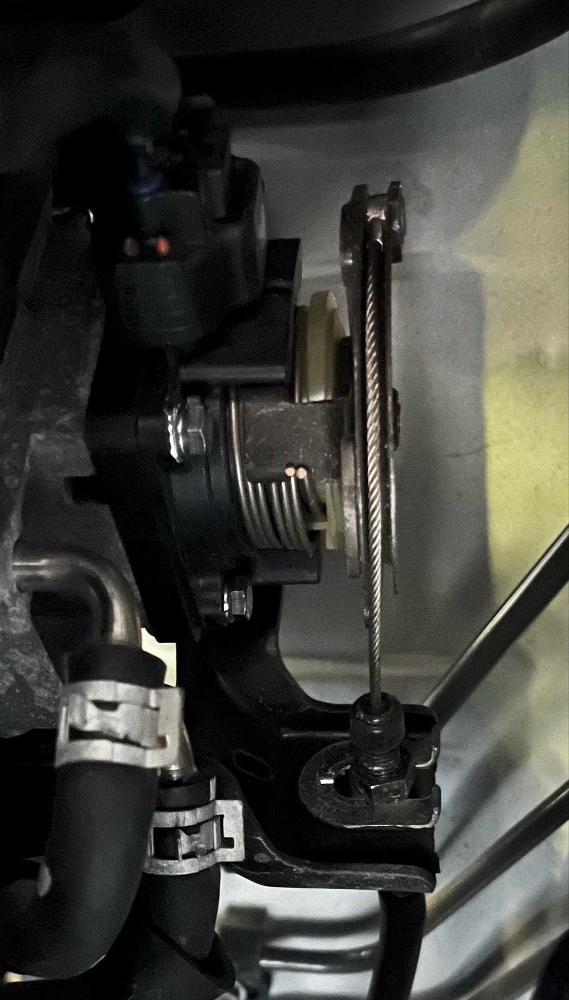

# SMT Quick Shift Mods

Compiled by Cyclehead21@gmail.com

Let me know if you see any errors.

This document outlines the changes you can make to your SMT Spyder to enable quicker shifts.

## Summary by David Lea

*(Edits by cyclehead)*

The SMT ECU measures crank speed vs. input shaft speed. Contributor experience reports that it shifts fairly quickly but won't engage the clutch until the two shafts get within approximately 500 RPM of each other.

> **Contributor figure:** The approximately 500 RPM threshold is retained from contributor experience.

**Edit:** To speed up SMT shifting, you want to reduce the time it takes to get the shaft speeds to match. Suggestions:

1. The throttle body mod (“quick shift mod”) removes the redundant cable backup, allowing the throttle body to close sooner. You no longer need to lift the gas to get that perfect shift. You can just leave your foot on the floor and hit the button.
2. The other thing you can do is reduce the rotating mass of the engine, allowing the revs to fall faster. So a lightweight flywheel and underdrive pulleys are your friend.
3. **Contributor experience:** The third thing you can do is put in a very heavy pressure plate. The SMT opens the clutch by duty cycling a solenoid. There is a limited-size fluid return that allows the clutch to re-engage. Contributor experience is that the stronger pressure plate returns the fluid faster and allows the clutch to re-engage faster.
4. **Contributor/forum experience:** SMT forums report that the newer ECUs (not the transmission computer) facilitate faster shifts with less clutch slipping. ECUs are labeled with a large black sequence number. They go from something like #62 to #79. Contributor experience is that the 6-speed SMTs came with 70-series ECUs (#71-#79), with #79 preferred for SMT shifting.

I did all this on a 2ZZ swap SMT, and the car would bark the tires in second gear if my foot was on the floor.

## Cyclehead comments

### Option 1 — Permanent “quick shift” mod to throttle body

**Edit:** I reached mine from below the car for the bottom bolts and from above for the top two bolts:

*Photo 1. Throttle-body linkage, upper access view.*

*Photo 2. Throttle-body linkage, lower access view.*

8 mm wrench (5/16 in. is approximately equivalent).

*Photo 3. Wrench, sockets, and fastener.*

Cut the tab halfway through. Then bend it back to break it the rest of the way.

*Photo 4. Throttle-body tab partially cut.*

After the tab is cut off:

*Photo 5. Throttle-body tab removed.*

### Option 2 — Reversible “quick shift” mod to throttle body

Buy, print, or fabricate a spacer to prevent the metal tab from engaging with the throttle cable.

Asela Fernando sells this one…

[MR2 SMT Quick Shift Spacer — Etsy listing](https://www.etsy.com/listing/1671325126/mr2-smt-quick-shift-spacer)

*Photo 6. Quick-shift spacer.*

**Edit:** The spacer pushes the pulley further forward, so I had to slide the throttle cable forward a little to align.

*Photo 7. Spacer installed before throttle-cable alignment.*

**Edit:** After loosening the jam nuts and sliding the cable and housing further forward:

*Photo 8. Throttle cable and housing moved forward.*

## Post-installation throttle/linkage verification

After either modification and any cable adjustment:

1. Verify that the throttle linkage moves freely through its normal travel.
2. Verify that the throttle returns freely to its rest position without sticking or binding.
3. Confirm that the throttle cable and housing are aligned and do not rub or bind.
4. With the ignition on, verify normal electronic throttle operation and listen for abnormal friction or binding noise.
5. After reassembly, perform a cautious road test. Confirm normal throttle response, normal shifting, and no warning lights or abnormal throttle behavior.
