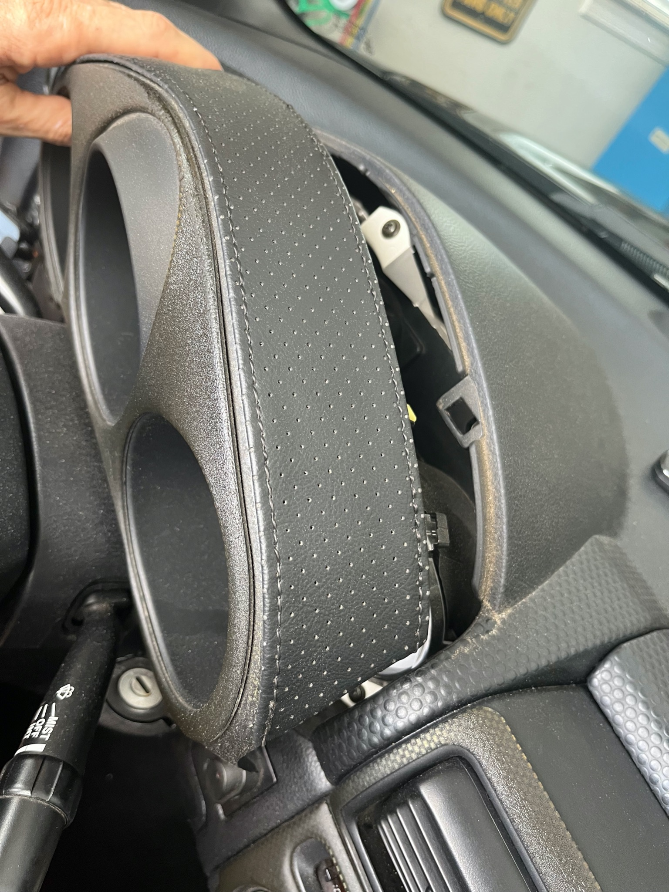
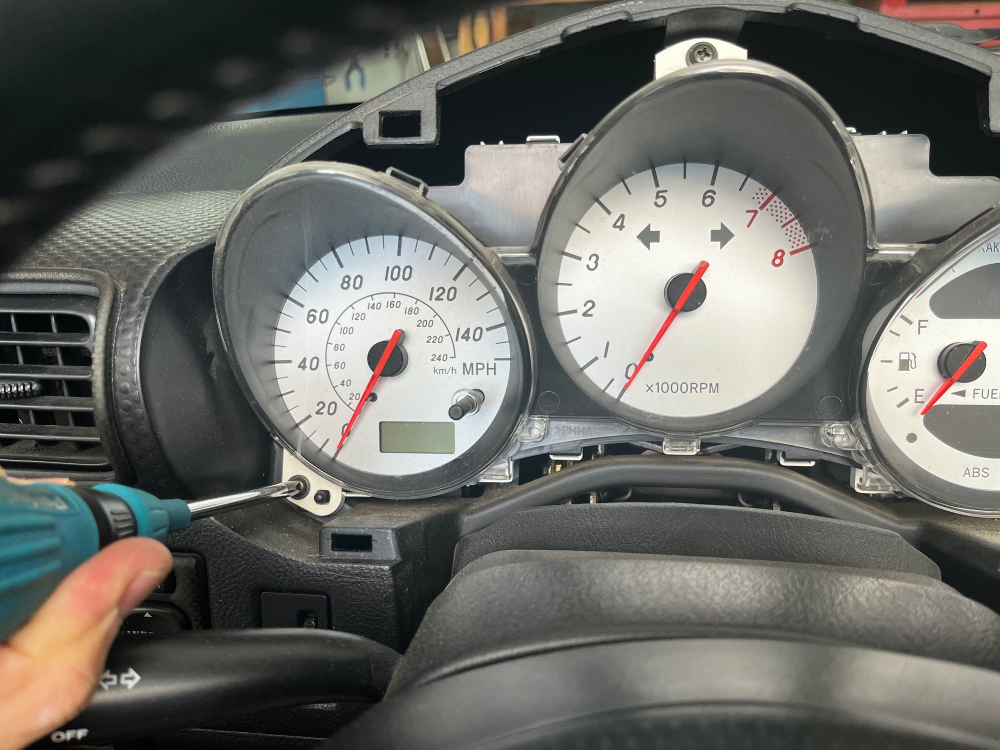
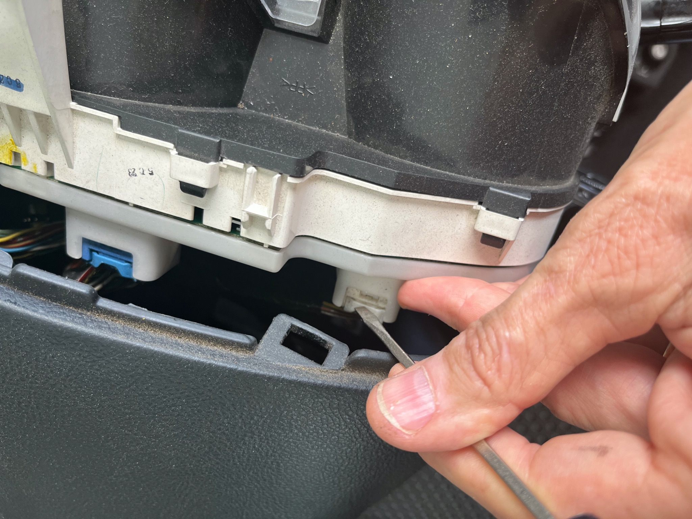
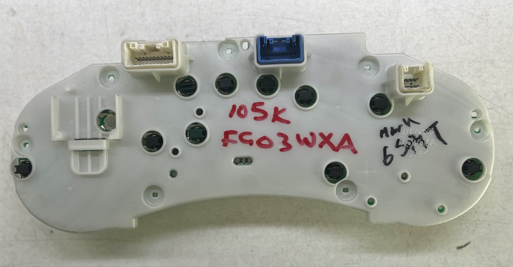
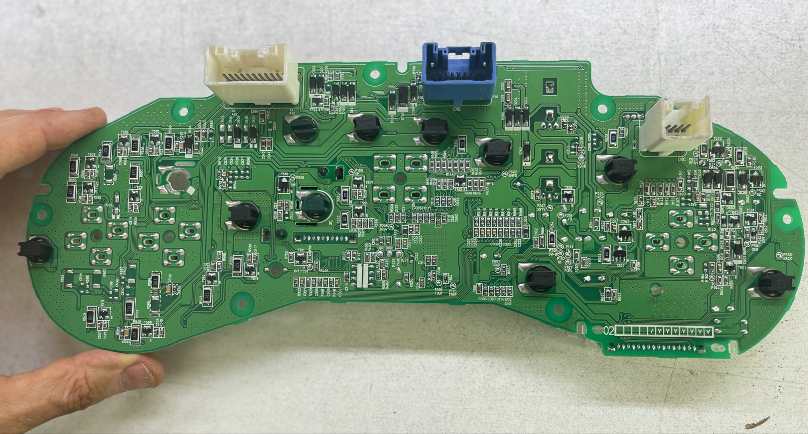
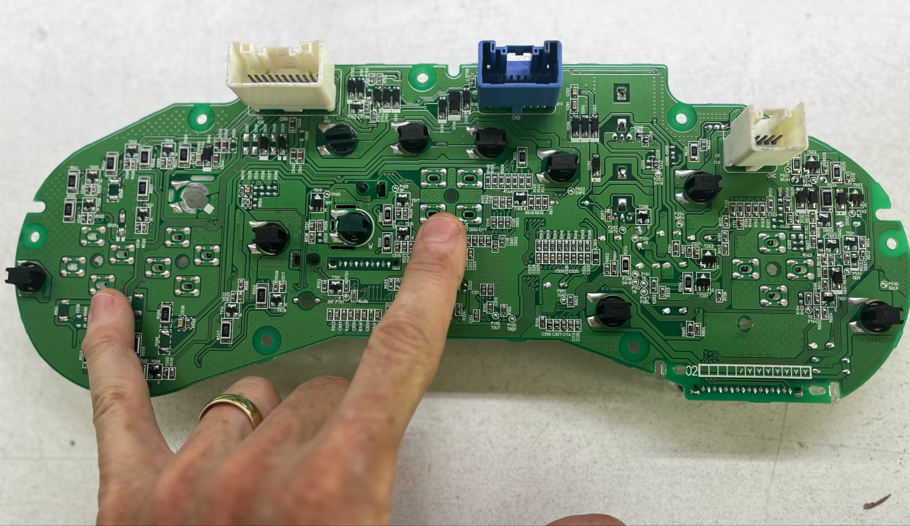
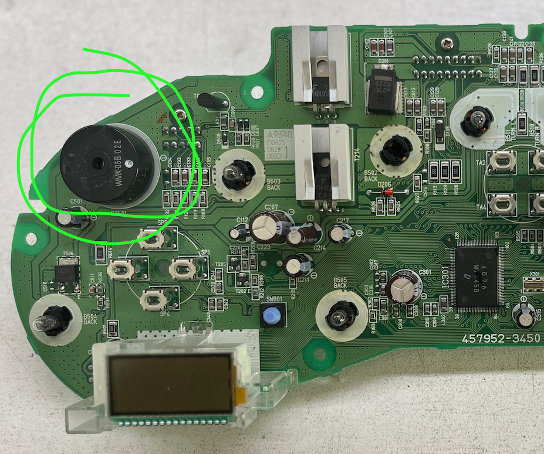

[← Chapter index](../README.md)

# SMT - Quiet Beeper

Written by Cyclehead

Feel free to copy and share, just give me a little credit.

## Contents

- [Background](#background)
- [Process Summary](#process-summary)
- [Procedure](#procedure)
- [Photos](#photos)

## Background

The warning beeper on the spyder is pretty loud. On SMT spyders it is particularly aggravating as the beeper sounds all the time that you’re in reverse gear. With the top down, it sounds like a cement truck backing up!

This procedure shows how to lower the volume of the beeper. However, you don’t want to completely silence the beeper as it conveys important warnings (seat belt, headlights, key in ignition, SMT shift errors etc)

## Process Summary

Remove the instrument cluster

Stick a piece of tape over the hole in the piezo beeper

Reassemble

## Procedure

Lower the steering wheel, and pull the wiper and turn signal levers down, to make a little room.

Using your fingers only, yank straight aft on the instrument cluster bezel.

Unscrew the instrument cluster - three philips head screws.

Tip the cluster outwards at the top.

Use a small flathead screwdriver to press the connector latch and pull gently on the wire bundles to unlatch three connectors.

Remove the instrument cluster.

Remove 7 gold color philips head screws from the white plastic cover plate.

Remove the white cover plate.

Pry the circuit board away from the gauges USING YOUR FINGERTIPS ONLY. The board is held in place by four sets of metal pins. The printed circuit board slides on the pins - with some resistance.

Walk the board away from the gauges by lifting each side alternately and rocking the board back and forth until it is free.

Find the piezoelectric beeper. It is a 1 inch diameter black plastic cylinder with a hole in the middle.

Stick a piece of duct tape or electrical tape over the hole. That will lower the volume a lot, but still be audible (even if you have moderate hearing loss like me). If you have super sensitive ears you could stuff the hole with cotton before taping, but would plug it in to test volume before you reassemble.

Press the circuit board back onto the pins, reinstall the white plastic cover and put everything back together.

Return your turn signals and wiper stalk to the correct position.

## Photos

Pull the bezel off:

Unscrew the gauge cluster:

Unlatch the connectors:

Remove this plastic cover (7 screws)

Pry the board off the gauges using your fingertips on the side, like in the picture:

The board slides (with difficulty) on four sets of four metal pins:

The beeper is on the top left of the circuit board:

---
